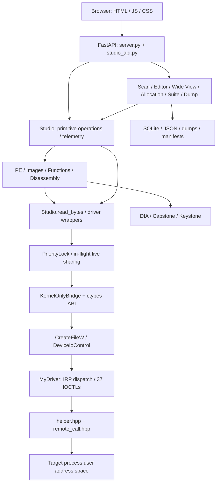
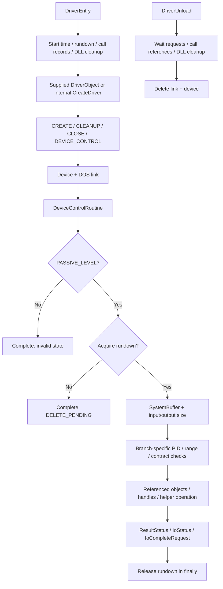
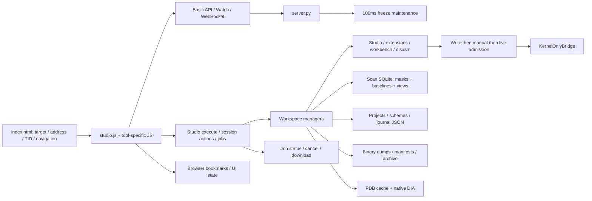
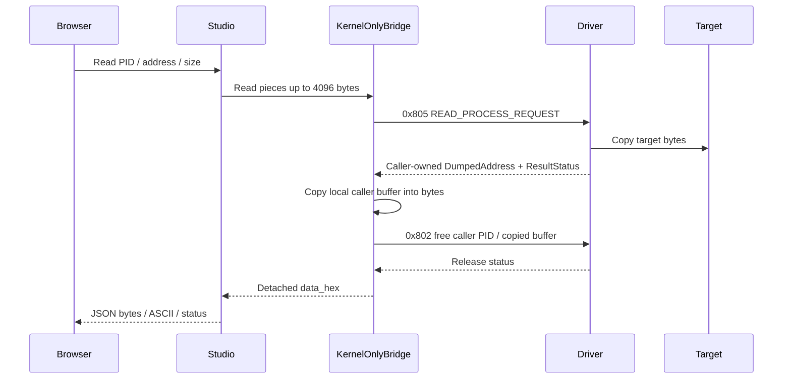
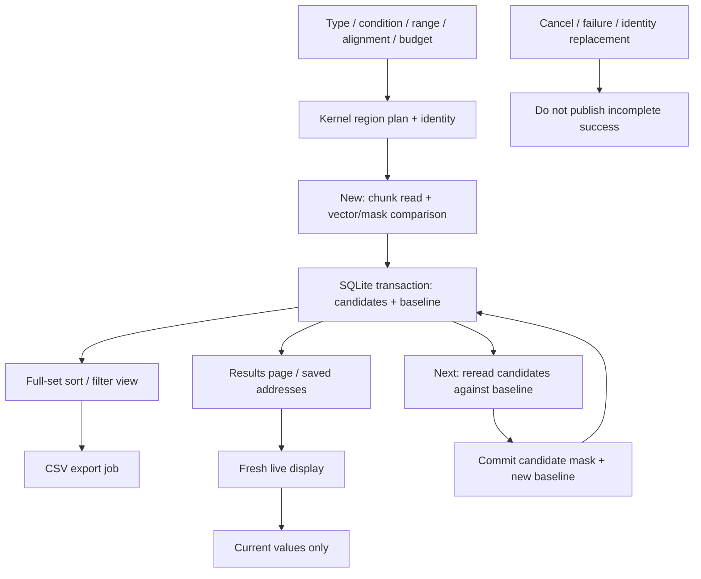
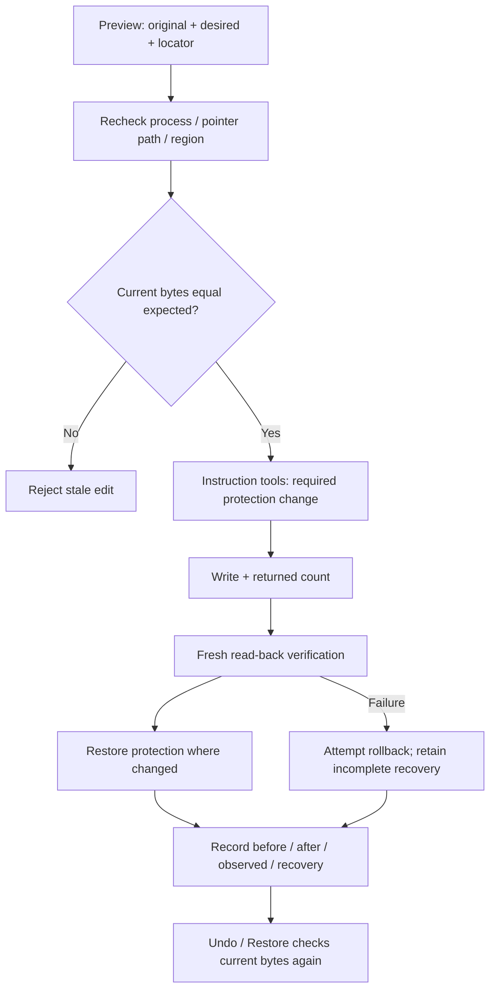
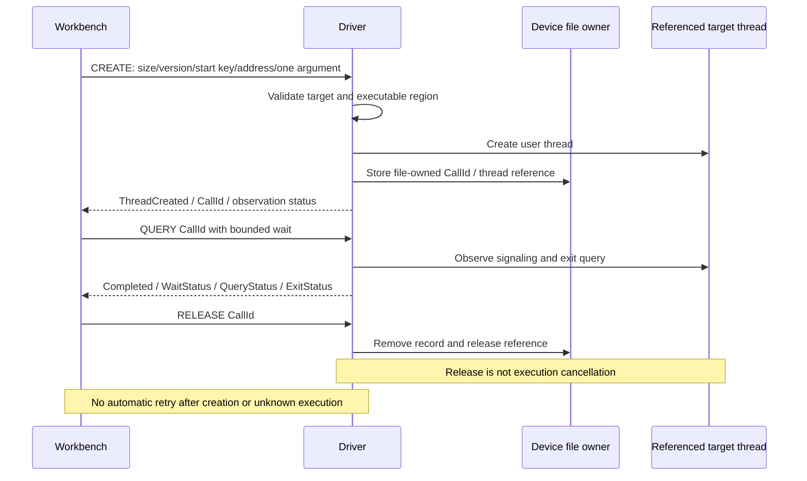

# Kernel Based Process Memory Editor

[한국어](README.md) · [English](README.en.md) · [简体中文](README.zh-CN.md) · [Español](README.es.md)

All-in-one technical README for Windows kernel process memory analysis/editing and Kernel Studio.


## Contents

- [Scope and project composition](#overview)
- [Implementation diagrams for this README](#diagrams)
- [Kernel construction and lifecycle](#kernel)
- [Kernel memory, scans and queries](#kernel-memory)
- [Web control panel design](#web)
- [Memory scanning: complete behavior](#scan)
- [Byte editor, pointers, Wide View and allocation](#edit)
- [Dumps, MEM_IMAGE and file verification](#dump)
- [PE, PDB, image functions, DLL loading and call tracking](#images)
- [Disassembly, CFG, pseudocode and instruction patching](#disasm)
- [Threads, registers and hardware breakpoints](#thread)
- [Structures, projects, journal, timeline and recovery](#productivity)
- [IOCTL transport and buffer ownership](#buffers)
- [Complete Studio operation catalog](#operations)
- [76 base UI tools and dedicated workspaces](#ui)
- [Complete session action catalog](#actions)
- [All 37 IOCTLs: code, packet, role and implementation](#ioctls)
- [Complete ABI layouts: sizes, alignment and field offsets](#layouts)
- [Native result and internal support declarations](#native)
- [All HTTP and WebSocket routes](#http)
- [Basic HTTP request models and fields](#models)
- [Implementation limits and state lifetimes](#limits)
- [Installation, build, execution and UI usage](#guide)
- [Every imported source file and role](#files)
- [Validation, limitations and repository guidance](#validation)

<a id="overview"></a>

## Scope and project composition

This README connects **kernel control device → IOCTL ABI → Python bridge → FastAPI → browser tools → persistence and recovery**. It includes the feature catalog, actual operation/action names, all 37 IOCTL roles, every Python ABI structure's size/alignment/field offsets, HTTP routes, and the complete imported source map. Implementation locations and failure conditions are part of the explanation.

SampleKernel1 queries and edits Windows processes' user address spaces in the kernel. Kernel Studio composes its existing ABI into a local web workspace. Target reads and writes go through the driver; SQLite, NumPy, Capstone, Keystone and DIA manage candidates, representation and static analysis.

Driver source: **v2.3 / build 20261004**. FastAPI app: **v3.0.0**. The driver loaded during verification was **v2.2**; successful source builds do not imply live validation of every v2.3 operation. Four-language support refers to repository documentation; the original UI remains Korean.

All 324 original files were inspected/copied without writes and matched their initial SHA-256 hashes. The 79 tracked imported source/config/test/UI files preserve their bytes. IDE caches, generated binaries, dumps, databases and runtime reports remain in the local copy but are excluded from public tracking. `samples/` is separately added support code reproducing the original tests' external DLL/PDB fixture dependency.

<a id="diagrams"></a>

## Implementation diagrams for this README

### Layer architecture



### Driver load, request and unload



### Web composition and storage



### Read response ownership



### SQLite scan, Live and Next



### Edit verification and recovery



### Function-call token lifecycle



<a id="kernel"></a>

## Kernel construction and lifecycle

### Translation units and entry

`SampleKernel1.vcxproj` compiles `main.cpp`, which includes inline implementations from `helper.hpp`, `remote_call.hpp` and `ioctl_helper.hpp`. `routine.cpp` is an excluded legacy example. `driver_client.hpp` and `test_client.cpp` provide a separate user-mode C++ client. `utils.hpp`, `vad.h`, `PEB.h`, `PE.h` describe NT routines, VAD, PEB/loader and PE structures. Although the project declares KMDF, its entry, control device and IRP dispatch are implemented directly in WDM style.

`DriverEntry` records start time, initializes request rundown, call tracking and deferred DLL cleanup. Normal loading uses the supplied `DriverObject`. An internal null-object path calls `helper::driver::CreateDriver`; this is not the ordinary installation procedure.

### Device and IRPs

Device: `\Device\MyDriver`; DOS link: `\DosDevices\MyDriver`; user path: `\\.\MyDriver`. CREATE/CLEANUP/CLOSE IRPs use `remote_call::FileRoutine`; DEVICE_CONTROL uses `ioctl_helper::DeviceControlRoutine`. The file object owns function-call tokens; a token is not a global ID freely transferable between device handles. Failed device registration cleans creation state.

### Admission, validation and completion

High-level helpers require `PASSIVE_LEVEL`. The wrapper enters a critical region and acquires rundown. Admission rejected during unload completes with `STATUS_DELETE_PENDING`. Deferred DLL work is reaped before dispatch; `__finally` releases rundown and the critical region.

`GetPacket<T>` requires IRP/stack/SystemBuffer and both input/output lengths at least `sizeof(T)`. Individual branches validate PID, addresses, sizes, overflow, result buffers and reserved fields according to their own contracts. The actual requestor is obtained from the IRP rather than trusting a supplied `RequestProcessId`. Target processes are looked up and referenced/opened with kernel handles, then released.

Results populate `ResultStatus`, returned fields, `IoStatus.Status` and `IoStatus.Information`; `IoCompleteRequest` completes the IRP. Check transport, returned byte count and internal NTSTATUS separately. HTTP 200 alone does not imply kernel success.

### Unload

Unload waits for request rundown, releases call-record thread references, waits for deferred DLL cleanup and deletes the link/device. Releasing a call record does not cancel an already-created target thread. Device file cleanup/close releases records owned by that file. These lifecycle measures do not constitute universal OS compatibility or integrity guarantees.

<a id="kernel-memory"></a>

## Kernel memory, scans and queries

**Allocate/free/protect:** Open a target kernel handle and use `ZwAllocateVirtualMemory`, `ZwFreeVirtualMemory`, `ZwProtectVirtualMemory`. Check returned base, actual size and previous protection. MEM_RELEASE follows allocation-base/size rules; it is not arbitrary interior-address freeing.

**Copy/read/write:** `MmCopyVirtualMemory` transfers between address spaces. Reads allocate a copied user buffer in the requestor and return its address. Writes copy caller-prepared bytes and return the actual count. Expected-byte checks, post-write verification and Undo are composed by the web layer, not automatically supplied by the copy primitive.

**Value scan:** Snapshot the comparison pattern into kernel memory, query regions, scan committed/readable chunks, reject Guard/NoAccess and overflow, and return matching addresses in requestor-owned linked nodes. This primitive differs from the new SQLite candidate scanner.

**Pattern scan:** Match bytes/mask over a range, reading overlap across chunk boundaries; return total matches and first address rather than a database of every hit. The new AOB scanner has its own comparison and supports nibble wildcards.

**Strings:** Read regions for ANSI/UTF-16 candidates and return original address, length and copied string address. String records own extra buffers and require a different release path. UI previews and result counts are bounded.

**Maps/images:** VAD-related routines return bases, sizes, state/type/protection, access flags, image/PE metadata and paths. `memory_images.py` groups MEM_IMAGE records and validates in-memory PE headers when needed. Matching a basename is not proof that the requested DLL is loaded.

**Process/token/handles/threads:** Combine PID lookup, `ZwQueryInformationProcess`, `ZwQuerySystemInformation`, token and thread queries. Path, command line, PEB, times, memory, counts, protection, integrity and privileges depend on successful subqueries. A declared field is not proof it is populated on every OS. There is no whole-system PID enumeration IOCTL; browser discovery uses bounded PID probes.

### Map internals and supporting helpers

BuildMemorySnapshot iterates user regions with ZwQueryVirtualMemory(MemoryBasicInformation); it is not a direct walk of every internal VAD structure declared in vad.h. BuildFallbackImageSpans groups MEM_IMAGE; BuildModuleSnapshot walks PEB→Ldr up to 4096 modules. PE-header/UNICODE_STRING/basename helpers enrich region metadata. Failed loader enumeration does not invalidate the basic map; fallback remains. Intermediate memory/module snapshots are freed after publication.

User linked-list helpers allocate/link/validate/release caller nodes/data; kernel lists use tagged pool. Kernel allocation distinguishes paged/nonpaged and handles failures. PIDtoHANDLE, CloseHandle and information cleanup support object/handle/string lifetime. Dynamic driver helpers/default create-close exist, but main uses remote_call file IRPs.

Deferred DLL cleanup retains path buffers/handles until execution permits release. HWBP splits slot masks/context capture/MDL locking/publication/rollback. Diagnostics records start and interlocked IOCTL counts, not active kernel event monitoring.

<a id="web"></a>

## Web control panel design

`server.py` creates FastAPI, Pydantic models, basic memory/process/Watch/thread APIs, WebSocket management and startup/shutdown tasks. `studio_api.install()` attaches Studio workspaces and `/api/studio/*` routes. `static/index.html` supplies the shell; `studio.js` and feature JS/CSS render tools locally without an external CDN. Tools share Ctrl K search, address/TID fields, PID selection, refresh, toasts and status.

**Transport:** ctypes structures and `CreateFileW`/`DeviceIoControl` in `driver_bridge.py` open the device. The active server uses `KernelOnlyBridge`; target memory reads do not fall back to Win32 `ReadProcessMemory`. ctypes reads the already-copied response in the server's own address space, and a free IOCTL releases it.

**Tools:** `Studio.operate()` handles primitives, delegating PE/address extensions, image/function analysis and instruction editing. Dedicated endpoints manage scan/editor/wide-view/allocation/productivity/dump sessions and jobs. Composition of multiple IOCTLs does not introduce new kernel ABI operations.

**Concurrency:** Reentrant priority admission orders manual writes, manual reads, live reads, with fairness after 16 admissions. Only identical in-flight live reads share `(pid,address,size,epoch)`. There is no persistent target-byte cache; manual/verification reads obtain fresh snapshots. Mutations change epochs before/after execution.

**Jobs:** Studio uses two executor workers; scans and dumps manage separate progress/cancellation/error/completion state. Frontends poll job IDs. Requesting cancellation does not mean work has already stopped. Run one Uvicorn worker because in-memory sessions are not shared across workers.

**Watch/telemetry:** A roughly 100ms background cycle maintains frozen values, with up to 256 Watch entries and process identity checks. `/ws/events` transports connection messages; Studio history records bounded IOCTL/status/timing data and Studio events expose tool events. Neither is the inactive kernel process/image notification monitor.

**Persistence:** Addresses/64-bit values are strings to avoid JavaScript rounding. Browser bookmarks, disk JSON/SQLite/binaries and in-memory sessions have separate lifetimes. Saving a project does not automatically resume every live session or kernel reference. Shutdown drains managers/references/bridge. The local API has no separate authentication layer.

### Target selection, bookmarks and shared results

Probe canonical PIDs in steps of four: default 65,536, maximum 1,048,576 plus explicit extras. Metadata cache is roughly three seconds; CPU percentage is not invented as a measurement. Transport errors are not empty successful lists. Manual PID, name/PID filters and range expansion are available.

Dashboard displays status/tool/IOCTL counters and up to 100 browser bookmarks. Version-one bookmark JSON import/export does not automatically write/freeze target memory. Addresses/TIDs feed global fields/other tools; target changes reset prior workspaces. Binary import prepares write payload. Data Inspector simultaneously interprets 16 bytes; automatic structure dissection proposes fields every eight bytes, not confirmed schema/PDB types.

<a id="scan"></a>

## Memory scanning: complete behavior

The new `scan_workspace.py` stores candidate masks and comparison snapshots in SQLite rather than a 50,000-element Python candidate array. Large Unknown scans retain candidates on disk. NumPy compares strided numeric vectors; text/AOB/structures use masks/fields. Scans process 64KiB chunks from the kernel map, with target reads split into 4KiB IOCTL pieces.

Types: signed/unsigned 8/16/32/64-bit integers, float32/64, UTF-8, UTF-16LE, AOB and numeric-field structures. Numeric conditions: Exact, NotEqual, Greater/Less, inclusive variants, Between, Unknown, Changed/Unchanged, Increased/Decreased, Rescan. Text/AOB allow Exact/NotEqual/Changed/Unchanged/Rescan. AOB supports byte/nibble wildcards (`??`, `A?`, `?F`) but rejects all-wildcard patterns. Structures allow 32 numeric fields within 1024 bytes with offsets/types/per-field comparisons/ignore.

**New:** Validate configuration, exclusive end range, access scope, alignment and budget; select regions, read/compare, commit the new database. Default budget 256MiB, allowed 4KiB–4GiB; alignment auto/1/2/4/8/16. **Next:** Reread only candidates, compare with the prior baseline, commit candidates/baseline. Type/width/layout cannot change during Next. **Rescan:** Observe retained candidates again. **Reset:** Clear results. Cancellation, read failures and replacement targets are distinct from completion; transactions protect result publication.

**Live/baseline:** Live display refresh never changes the Next baseline. Default UI polling is roughly 800ms, with pages 50/100/200/500. `view` sorts/filters all candidates, not just the visible page. `export` creates CSV for the full set/view with progress/cancel/download jobs. `save/read_saved/edit` manages up to 256 saved locations, fixed-length editing and freeze, checking identity/current bytes.

**Legacy distinction:** `/api/scan/*` uses `KernelMemoryScannerSession` but retains its old 50,000 candidate limit. The Win32 implementation in `memory_scanner.py` remains as legacy/type utilities, not active target access. Primitive kernel value/string/pattern/pointer tools are not the same SQLite session/storage system.


<a id="edit"></a>

## Byte editor, pointers, Wide View and allocation

### Editor

Sessions manage 16–65,536-byte windows, 4/8-byte rows, current/prior bytes, validity/changes/selections and pointer trees. They provide numeric/float/pointer interpretation, range edits, slide (±65,536 per action), rename, metadata, selected-node live refresh, string hints, expand/collapse. Limits: 64 nodes, 1MiB aggregate node buffers, depth 64.

Expand compares the clicked expected pointer with a fresh read and rejects ancestor cycles/unreadable regions. Editing checks parent pointer paths, process identity and `expected_hex`; writes verify actual count and reread bytes. Partial writes/verification failures preserve original and observed bytes for recovery. Restore requires the post-edit bytes to remain unchanged, writes originals and verifies; history limit 256.

### Wide View (Beta)

Read-only 16–4096-byte surroundings and complete region map. Page/region boundaries and readable/committed/Guard checks produce validity masks/holes; failure zeros are not proven target zeros. Sorted regions/binary search find boundaries. Schemas mark overlapping confirmed field locations, with nested depth 12 and 2048 expanded fields. Server actions are only `read` and `map`.

### Payload allocation

ANSI, UTF-16LE Wide strings or uploaded file bytes determine size automatically; strings include a terminating NULL. Allocate up to 1MiB PAGE_READWRITE, record ownership, write initial data and reread/verify. Display base, size, state, timestamps and reservation ID.

On initialization failure attempt free; failed cleanup retains `needs_free` and ownership. Free requires an active base/reservation owned by this window, preventing confusion after address reuse. Limits: 128 managed allocations, 256 records/window. Clearing history/closing the window does not free target memory. This differs from primitive alloc/free/protect/copy tools.


<a id="dump"></a>

## Dumps, MEM_IMAGE and file verification

Dump jobs support selected ranges, region groups and MEM_IMAGE images. Maximum total 16GiB; chunks 4KiB–1MiB in page multiples, with 4KiB kernel reads. Up to four active jobs and 128 records. Identity and plan accompany queued/running/packaging/completed/cancelled/failed state, bytes/progress/errors.

Read failures stop or record holes and zero-fill according to policy. The manifest distinguishes actual zeros from failure fill, recording SHA-256, ranges, names, sizes, failures and image metadata. Bundles are packaged/downloadable. Deletion checks active jobs/download references; references are released even for interrupted downloads or invalid Range.

MEM_IMAGE dumps retain mapped RVA layout, not a guaranteed reconstructed runnable on-disk PE. Resume requires the original session, identity and valid partial files/plan. Completed dumps can be listed/downloaded after restart; interrupted jobs do not automatically resume.

<a id="images"></a>

## PE, PDB, image functions, DLL loading and call tracking

**Images/PE:** MEM_IMAGE and validated headers provide base/size/path/main/source. Parse headers/sections, import DLL/function/IAT and exports name/ordinal/RVA/forwarder from target memory. `resolve` supports literal addresses, module+RVA, module!symbol and forwarded exports to depth eight. `address_info` connects region, module RVA and section. A valid PE in read-only MEM_PRIVATE can be analyzed.

**Functions:** Merge exports, x64 exception/unwind `.pdata` and optional PDB functions by RVA. Unnamed functions are `sub_...`; data exports are separate and not callable functions. Up to 20,000 entries with truncation. Detail reads target bytes within known extent/image; heuristic argument hints remain distinct from real PDB signatures.

**PDB:** Match CodeView GUID/Age. Native DIA helper returns private/public functions, parameters/returns and structures as JSON. Symbol management supports local path/upload/cache/list/remove/restart restore, corrupt-record isolation and rollback on save failure. Limits: PDB 256MiB, DLL upload 64MiB. Analyses bind to target identity/image.

**DLL loading:** The existing helper checks PEB/loader/exports for a loader routine, prepares a target path and requests a user thread to execute the loader. Upload alone does not load a target DLL. Verified/check operations inspect target/path/WOW64 and actual images; another directory's same basename is not success. Requests with started threads and failed observation/wait are not automatically repeated. Path buffers can be deferred until thread completion.

**Function calls:** Not a general C++ invoker: one raw 64-bit argument to a validated x64 routine and a 32-bit thread exit value. Arbitrary argument lists, float/SIMD returns or class/C++ ABI are unsupported guarantees. Known incompatible PDB signatures are rejected. Kernel checks System/WOW64/exited targets, start key, executable memory, size/version/reserved fields.

CREATE records file-owned CallId and ThreadId/ThreadCreated; QUERY observes the referenced original thread; RELEASE drops tracking references, not execution. Maximum wait 1000ms, 128 global records, 32/file, 30 active web records/128 history. Completion is based on thread signaling, not merely exit value 259. Never automatically retry after ThreadCreated, unknown execution or timeout.

<a id="disasm"></a>

## Disassembly, CFG, pseudocode and instruction patching

Capstone decodes x86/x64 bytes into address/size/mnemonic/operands/raw bytes. `function_views.py` identifies branch/call/return/terminal instructions and builds blocks, edges, unresolved branches and ranges, with conservative C-like pseudocode. It is static analysis, not execution tracing or reconstruction of exact original C. Limits: 16,384 bytes, 2048 instructions, 128 blocks.

Instruction workspace supports analysis, reference follow, validate/apply, Undo/Redo, recovery, history/release. Keystone assembles at current address/bitness. Reject oversized/overlapping edits, invalid boundaries, stale originals and replacement identities; shorter substitutions follow slot policy.

Apply validates plan, rereads original, changes necessary protection, writes, verifies and restores protection. Failures attempt byte/protection recovery; incomplete recovery is exposed through `disasm_recover`. Undo/Redo also checks current bytes. Limits 16 sessions, 128 edits/batch and 128 history entries. Live code patching is not atomic execution suspension.


<a id="thread"></a>

## Threads, registers and hardware breakpoints

Thread list/details expose ownership, start/times, priorities, affinity and suspension with returned/total limits. Suspend/resume returns previous count. Priority/affinity are separate requests; batch handles up to 64 sequentially. Hide exists in the original ABI; termination 0x820 remains in kernel/bridge but is excluded from web tools.

Register editing checks PID identity and TID creation/ownership/liveness, suspends, reads current registers, merges requested fields, writes/rereads and resumes only the same original thread. EFLAGS is bounded to 32 bits, general fields to 64. Recycled TIDs are rechecked before resume. This web procedure differs from the raw context ABI.

HWBP manages DR0–DR3/DR6/DR7 and enable/type/length bits. Validate execution/write/access, 1/2/4/8-byte lengths/alignment; snapshot threads/original contexts, modify selected slots while preserving unrelated ones, track multi-thread apply/recovery/partial failures. Returned records use dedicated ownership/MDL handling. Set/query/remove and freeing result memory are different operations. Configuration is not a full debugger event loop or hit trace.

<a id="productivity"></a>

## Structures, projects, journal, timeline and recovery

**Structures/classes:** Validate name/size/offset/type/count/stride/nested references/ranges/cycles. Represent numeric/pointer/UTF-8/UTF-16/bytes/nested structs/arrays with target pointer width. `view` reads fields; `pdb_types` imports DIA definitions and reports unsupported/duplicate/missing references. Schemas persist as JSON. Primitive structure reads/writes differ from schema edit plans.

**Preview/apply/journal:** Capture original/new bytes, module+RVA/address locator, PID identity and pointer path. Apply resolves again, revalidates original, writes and rereads; stale previews fail. Journal preserves bytes and restore state, supporting list, individual restore, reverse batch restore and archive. Batch is non-atomic and returns completed entries/failed ID.

**Timeline:** Sample schemas/addresses and compare field/byte changes between samples. Up to 512 samples can accompany saved projects. Sequential reads of active targets are not one atomic global snapshot. Create/sample/get/compare/close are distinct.

**Projects:** Version 2 JSON stores name/UI state/definitions/locators/symbol references/saved addresses/timeline, with list/load/export/import/archive/recover. Module locators re-resolve after ASLR; unresolved entries are reported. Import validates schema/format, creates new ID and limits 4MiB. Saved state does not replace target identity; full scan candidate databases are not automatically embedded.

**Other analysis:** Byte snapshots/list/compare/restore/delete, patches/list/undo/delete, map snapshots/list/compare/delete, range diff, expected-original patch preview, pointer chain/search, wildcard signatures, contains/prefix/exact case-sensitive string filters, fill and batch. Limits: 16 byte snapshots, eight maps, 64 primitive patches. Deleting records is not restoring memory. Full-map tools reject truncation; string filtering only covers returned bounded results.

### How the journal wraps writes

Journal.install wraps bridge write/copy/free. Before writing, it persists a prepared record with flush/fsync and atomic rename; observation becomes verified/failed/uncertain. Copy saves destination original and requested source bytes. Bounds: 2048 records and 128MiB hex-data accounting. Freeing managed memory marks affected records released, preventing restore into reused allocations. No-change writes may omit new records.

This is byte-write recovery evidence, not a transaction reversing process exit/free/thread execution/external changes. Restore is a new verified write requiring original identity/current observed bytes. Archive accepts restored or released records.

<a id="buffers"></a>

## IOCTL transport and buffer ownership

All codes use `CTL_CODE(FILE_DEVICE_UNKNOWN,function,METHOD_BUFFERED,FILE_READ_ACCESS|FILE_WRITE_ACCESS)`: DeviceType 0x22, method zero, access three; `code=(0x22<<16)|(3<<14)|(function<<2)`. Function 0x800 means full code 0x22E000. SystemBuffer copies the fixed packet, not automatically every pointee referenced by legacy integer address fields.

The bridge supplies the same ctypes packet as input/output. Windows ULONG/LONG/NTSTATUS are 32 bits, ULONGLONG 64, BOOLEAN one byte, WCHAR two; sizes include padding. All layouts below are extracted with actual Windows x64 ctypes sizeof/alignment/offset, not presumed portable layouts.

Read responses are copied locally then freed through caller-PID IOCTL. Value/region lists validate Node signature 0x4C4C535448454C50, reverse links, cycles/counts and DataSize, then release via matching commands in finally. Strings own extra DumpedAddress buffers; HWBP records carry recovery ownership and need dedicated releases. Retain HWBP Set restoration records until Remove; freeing a query result is not removing a breakpoint.

Calls 0x822–824 use version one, pack(8), static_assert sizes 88/96/24. Distinguish StructSize/Version/Reserved/Flags/start key/token and ThreadCreated/Completed/wait/exit/query statuses. Parameter is a raw machine word, not a buffer dereferenced by the driver.

HWBP Type: Execute=0, Write=1, ReadWrite=3; wire Length=1/2/4/8 bytes. Legacy Python bp_len converts DR7 encodings 0/1/3/2 into byte lengths. Embedded context/image/token/handle arrays and strings are included below.

<a id="operations"></a>

## Complete Studio operation catalog

These 79 names are checked against OP_GROUPS and extension OPERATIONS. Execute with POST /api/studio/execute and {"operation":"...","args":{...}}. Apply common pid/address/size, payload rules and feature-specific input contracts. Links point to actual operation branches.

### Process

| Operation | Behavior | Branch implementation |
|---|---|---|
| `process` | Combine basic, extended and token queries. | [studio_api.py:356](kernel_control_panel/studio_api.py#L356) |
| `handles` | Return up to 128 handles and separately queried total. | [studio_api.py:359](kernel_control_panel/studio_api.py#L359) |
| `token` | Query elevation, integrity, session and privileges. | [studio_api.py:367](kernel_control_panel/studio_api.py#L367) |
| `threads` | Distinguish up to 64 returned threads from total. | [studio_api.py:359](kernel_control_panel/studio_api.py#L359) |
| `thread_info` | Query owner, creation, state and TEB. | [studio_api.py:377](kernel_control_panel/studio_api.py#L377) |

### Memory

| Operation | Behavior | Branch implementation |
|---|---|---|
| `read` | Assemble 4KiB reads into Hex, ASCII and base64. | [studio_api.py:444](kernel_control_panel/studio_api.py#L444) |
| `write` | Encode payload, write, reread and compare. | [studio_api.py:449](kernel_control_panel/studio_api.py#L449) |
| `alloc` | Allocate and record owner identity. | [studio_api.py:454](kernel_control_panel/studio_api.py#L454) |
| `free` | Release allocation base and bookkeeping. | [studio_api.py:463](kernel_control_panel/studio_api.py#L463) |
| `protect` | Change range protection and return previous value. | [studio_api.py:472](kernel_control_panel/studio_api.py#L472) |
| `copy` | Copy bytes between source/destination PID/address. | [studio_api.py:473](kernel_control_panel/studio_api.py#L473) |
| `fill` | Repeat pattern and write through recoverable patch. | [studio_api.py:475](kernel_control_panel/studio_api.py#L475) |
| `dump` | Assemble 4KiB reads into Hex, ASCII and base64. | [studio_api.py:444](kernel_control_panel/studio_api.py#L444) |

### Search

| Operation | Behavior | Branch implementation |
|---|---|---|
| `kernel_value` | Consume/release kernel value-hit list. | [studio_api.py:486](kernel_control_panel/studio_api.py#L486) |
| `strings` | Read ANSI/UTF-16 records and release their buffers. | [studio_api.py:489](kernel_control_panel/studio_api.py#L489) |
| `pattern` | Return count and first match in a range. | [studio_api.py:496](kernel_control_panel/studio_api.py#L496) |
| `pattern_regions` | Scan selected regions from a complete map. | [studio_api.py:491](kernel_control_panel/studio_api.py#L491) |
| `pointer_search` | Search 64-bit pointer bytes for the given address. | [studio_api.py:486](kernel_control_panel/studio_api.py#L486) |

### Regions/modules

| Operation | Behavior | Branch implementation |
|---|---|---|
| `regions` | Return region attributes and image metadata. | [studio_api.py:484](kernel_control_panel/studio_api.py#L484) |
| `modules` | Validate regions/PE headers into an image catalog. | [studio_api.py:480](kernel_control_panel/studio_api.py#L480) |
| `pe` | Read/parse target PE headers and sections. | [studio_api.py:589](kernel_control_panel/studio_api.py#L589) |

### Threads

| Operation | Behavior | Branch implementation |
|---|---|---|
| `context` | Read selected TID registers. | [studio_api.py:379](kernel_control_panel/studio_api.py#L379) |
| `set_context` | Check identity, suspend, merge, verify and resume. | [studio_api.py:385](kernel_control_panel/studio_api.py#L385) |
| `suspend` | Validate owner/liveness, suspend, return previous count. | [studio_api.py:380](kernel_control_panel/studio_api.py#L380) |
| `resume` | Validate owner/liveness, resume, return previous count. | [studio_api.py:381](kernel_control_panel/studio_api.py#L381) |
| `priority` | Validate/set selected thread priority. | [studio_api.py:382](kernel_control_panel/studio_api.py#L382) |
| `affinity` | Set selected thread's 64-bit affinity mask. | [studio_api.py:383](kernel_control_panel/studio_api.py#L383) |
| `hide` | Forward the original thread-hide ABI request. | [studio_api.py:368](kernel_control_panel/studio_api.py#L368) |
| `thread_batch` | Sequentially run four supported actions for up to 64 TIDs. | [studio_api.py:434](kernel_control_panel/studio_api.py#L434) |

### Breakpoints

| Operation | Behavior | Branch implementation |
|---|---|---|
| `hwbp_set` | Preserve slots and retain application/recovery records. | [studio_api.py:596](kernel_control_panel/studio_api.py#L596) |
| `hwbp_query` | Copy current debug-register list then free results. | [studio_api.py:590](kernel_control_panel/studio_api.py#L590) |
| `hwbp_remove` | Restore recorded slot state; free results on success. | [studio_api.py:611](kernel_control_panel/studio_api.py#L611) |
| `hwbp_list` | List Studio-owned managed breakpoint IDs. | [studio_api.py:594](kernel_control_panel/studio_api.py#L594) |

### Basic analysis

| Operation | Behavior | Branch implementation |
|---|---|---|
| `snapshot` | Save current bytes and PID identity. | [studio_api.py:519](kernel_control_panel/studio_api.py#L519) |
| `snapshot_list` | List snapshot summaries and managed allocations. | [studio_api.py:514](kernel_control_panel/studio_api.py#L514) |
| `compare` | Compare saved snapshot to current bytes. | [studio_api.py:512](kernel_control_panel/studio_api.py#L512) |
| `restore` | Write snapshot via a new patch, preserving current bytes. | [studio_api.py:542](kernel_control_panel/studio_api.py#L542) |
| `patch` | Check original/optional expected, write and log verification. | [studio_api.py:526](kernel_control_panel/studio_api.py#L526) |
| `patch_list` | List before/after bytes, verification and recovery state. | [studio_api.py:518](kernel_control_panel/studio_api.py#L518) |
| `undo` | Restore original only if patched bytes still match. | [studio_api.py:527](kernel_control_panel/studio_api.py#L527) |
| `pointer_chain` | Dereference/add offsets and return the traversed path. | [studio_api.py:551](kernel_control_panel/studio_api.py#L551) |
| `structure` | Read user-defined offset/type fields. | [studio_api.py:562](kernel_control_panel/studio_api.py#L562) |
| `structure_write` | Patch only fields carrying a value. | [studio_api.py:572](kernel_control_panel/studio_api.py#L572) |
| `disassemble` | Decode target bytes with Capstone. | [studio_api.py:581](kernel_control_panel/studio_api.py#L581) |

### Other

| Operation | Behavior | Branch implementation |
|---|---|---|
| `dll` | Return the existing DLL-loader IOCTL result. | [studio_api.py:621](kernel_control_panel/studio_api.py#L621) |
| `status` | Query connection/version/start/IOCTL counters. | [studio_api.py:353](kernel_control_panel/studio_api.py#L353) |
| `batch` | Run up to 32 steps with $name.field substitutions. | [studio_api.py:625](kernel_control_panel/studio_api.py#L625) |

### Extended analysis

| Operation | Behavior | Branch implementation |
|---|---|---|
| `pe_imports` | Parse import DLL/name/ordinal/IAT slot/current pointer. | [studio_extensions.py:111](kernel_control_panel/studio_extensions.py#L111) |
| `pe_exports` | Parse/filter export name/ordinal/RVA/forwarder. | [studio_extensions.py:109](kernel_control_panel/studio_extensions.py#L109) |
| `resolve` | Resolve address/module+RVA/export and forwarders. | [studio_extensions.py:118](kernel_control_panel/studio_extensions.py#L118) |
| `address_info` | Associate address with region/protection/image/section. | [studio_extensions.py:152](kernel_control_panel/studio_extensions.py#L152) |
| `memory_diff` | Read two ranges and return differing bytes. | [studio_extensions.py:166](kernel_control_panel/studio_extensions.py#L166) |
| `patch_preview` | Compare desired payload to current bytes without writing. | [studio_extensions.py:179](kernel_control_panel/studio_extensions.py#L179) |
| `signature` | Build AOB from bytes and selected wildcard ranges. | [studio_extensions.py:185](kernel_control_panel/studio_extensions.py#L185) |
| `strings_filter` | Filter returned strings by mode/case. | [studio_extensions.py:200](kernel_control_panel/studio_extensions.py#L200) |
| `map_snapshot` | Store complete region map and identity. | [studio_extensions.py:219](kernel_control_panel/studio_extensions.py#L219) |
| `map_list` | List saved map IDs/times/region counts. | [studio_extensions.py:217](kernel_control_panel/studio_extensions.py#L217) |
| `map_compare` | Compare added/removed/allocated/released/changed regions. | [studio_extensions.py:215](kernel_control_panel/studio_extensions.py#L215) |
| `map_delete` | Delete comparison record, not target memory. | [studio_extensions.py:232](kernel_control_panel/studio_extensions.py#L232) |
| `snapshot_delete` | Delete stored snapshot data only. | [studio_extensions.py:247](kernel_control_panel/studio_extensions.py#L247) |
| `patch_delete` | Delete only already-restored patch records. | [studio_extensions.py:247](kernel_control_panel/studio_extensions.py#L247) |

### Images/functions

| Operation | Behavior | Branch implementation |
|---|---|---|
| `image_catalog` | Validate regions/PE headers into an image catalog. | [image_workbench.py:374](kernel_control_panel/image_workbench.py#L374) |
| `image_functions` | Merge export/unwind/PDB by RVA, separate functions/data. | [image_workbench.py:375](kernel_control_panel/image_workbench.py#L375) |
| `image_function_detail` | Build code/CFG/pseudocode within validated function range. | [image_workbench.py:376](kernel_control_panel/image_workbench.py#L376) |
| `dll_load_verified` | Check DLL loading against target/path/actual image. | [image_workbench.py:377](kernel_control_panel/image_workbench.py#L377) |
| `dll_load_check` | Recheck actual image for an existing load attempt. | [image_workbench.py:378](kernel_control_panel/image_workbench.py#L378) |
| `function_call` | Validate analyzed x64 function/one argument and create call. | [image_workbench.py:379](kernel_control_panel/image_workbench.py#L379) |
| `function_calls` | List web-owned active calls and bounded history. | [image_workbench.py:380](kernel_control_panel/image_workbench.py#L380) |
| `function_call_query` | Query original token's signaling/exit observation. | [image_workbench.py:382](kernel_control_panel/image_workbench.py#L382) |
| `function_call_release` | Release tracking, not target execution. | [image_workbench.py:383](kernel_control_panel/image_workbench.py#L383) |

### Instruction editing

| Operation | Behavior | Branch implementation |
|---|---|---|
| `disasm_analyze` | Decode range, save instructions/references/CFG/analysis ID. | [disassembly_workspace.py:356](kernel_control_panel/disassembly_workspace.py#L356) |
| `disasm_validate` | Validate assembly bytes fitting one instruction slot. | [disassembly_workspace.py:362](kernel_control_panel/disassembly_workspace.py#L362) |
| `disasm_apply` | Validate/write/restore protection/log the edit plan. | [disassembly_workspace.py:377](kernel_control_panel/disassembly_workspace.py#L377) |
| `disasm_undo` | Check current bytes then undo the preceding edit group. | [disassembly_workspace.py:398](kernel_control_panel/disassembly_workspace.py#L398) |
| `disasm_redo` | Check current bytes then redo the undone group. | [disassembly_workspace.py:398](kernel_control_panel/disassembly_workspace.py#L398) |
| `disasm_recover` | Retry pending byte/protection recovery. | [disassembly_workspace.py:363](kernel_control_panel/disassembly_workspace.py#L363) |
| `disasm_history` | Return history/cursor/recovery state. | [disassembly_workspace.py:361](kernel_control_panel/disassembly_workspace.py#L361) |
| `disasm_follow` | Follow validated reference of an analyzed instruction. | [disassembly_workspace.py:364](kernel_control_panel/disassembly_workspace.py#L364) |
| `disasm_release` | Release analysis session without automatically undoing code. | [disassembly_workspace.py:350](kernel_control_panel/disassembly_workspace.py#L350) |

<a id="ui"></a>

## 76 base UI tools and dedicated workspaces

These are the 76 actual base TOOLS definitions in static/studio.js. Original Korean labels match the UI; descriptions are localized. Some legacy scan definitions route to dedicated new scanning, so this is not the menu/operation count. Dedicated editor/new scan/Wide View/allocation/structures/projects/journal/timeline/DLL/functions/disassembly components are explained above.

| Tool ID | Original UI label | Behavior |
|---|---|---|
| `dump_large` | 대용량 범위 덤프 | Run range dump with progress/cancel/resume. |
| `dump_image` | 이미지 하나 덤프 | Select one image by name/main/base and dump mapped layout. |
| `dump_images` | 모든 MEM_IMAGE 덤프 | Save all MEM_IMAGE as files/manifest/ZIP. |
| `dump_list` | 덤프 작업 목록 | Manage dump IDs/progress/failure/cancel/download. |
| `pe_imports` | PE 가져오기 / IAT | Parse import DLL/name/ordinal/IAT slot/current pointer. |
| `pe_exports` | PE 내보내기 | Parse/filter export name/ordinal/RVA/forwarder. |
| `resolve` | 모듈 / 함수 주소 계산 | Resolve address/module+RVA/export and forwarders. |
| `address_info` | 주소 소속 분석 | Associate address with region/protection/image/section. |
| `memory_diff` | 두 메모리 범위 비교 | Read two ranges and return differing bytes. |
| `patch_preview` | 패치 미리보기 | Compare desired payload to current bytes without writing. |
| `signature` | AOB 시그니처 생성 | Build AOB from bytes and selected wildcard ranges. |
| `strings_filter` | 문자열 조건 검색 | Filter returned strings by mode/case. |
| `map_snapshot` | 메모리 맵 저장 | Store complete region map and identity. |
| `map_list` | 저장된 메모리 맵 | List saved map IDs/times/region counts. |
| `map_compare` | 메모리 맵 변화 비교 | Compare added/removed/allocated/released/changed regions. |
| `map_delete` | 메모리 맵 기록 삭제 | Delete comparison record, not target memory. |
| `snapshot_delete` | 스냅샷 기록 삭제 | Delete stored snapshot data only. |
| `patch_delete` | 복구된 패치 기록 삭제 | Delete only already-restored patch records. |
| `process` | 프로세스 상세 | Combine basic, extended and token queries. |
| `handles` | 핸들 목록 | Return up to 128 handles and separately queried total. |
| `token` | 권한 토큰 | Query elevation, integrity, session and privileges. |
| `threads` | 스레드 목록 | Distinguish up to 64 returned threads from total. |
| `thread_info` | 스레드 상세 | Query owner, creation, state and TEB. |
| `read` | 메모리 읽기 | Assemble 4KiB reads into Hex, ASCII and base64. |
| `write` | 형식별 쓰기 | Encode payload, write, reread and compare. |
| `inspect` | 데이터 해석 | Interpret 16 bytes as integers/floats/binary/text/pointer. |
| `dump` | 메모리 덤프 | Assemble 4KiB reads into Hex, ASCII and base64. |
| `alloc` | 메모리 할당 | Allocate and record owner identity. |
| `free` | 메모리 해제 | Release allocation base and bookkeeping. |
| `protect` | 보호 속성 변경 | Change range protection and return previous value. |
| `copy` | 프로세스 간 복사 | Copy bytes between source/destination PID/address. |
| `fill` | 패턴 채우기 | Repeat pattern and write through recoverable patch. |
| `kernel_value` | 커널 값 검색 | Consume/release kernel value-hit list. |
| `pattern` | 범위 AOB 검색 | Return count and first match in a range. |
| `pattern_regions` | 영역 AOB 검색 | Scan selected regions from a complete map. |
| `strings` | 문자열 검색 | Read ANSI/UTF-16 records and release their buffers. |
| `scan_first` | 첫 값 검색 | Legacy kernel scanner first scan; distinct from new session scanner. |
| `scan_next` | 다음 값 검색 | Compare legacy candidates with their baseline. |
| `scan_results` | 검색 후보 | Page legacy scanner results. |
| `scan_reset` | 검색 초기화 | Reset legacy scanner candidates. |
| `regions` | 커널 메모리 맵 | Return region attributes and image metadata. |
| `modules` | 모듈 / 메모리 PE 목록 | Validate regions/PE headers into an image catalog. |
| `pe` | PE 헤더와 섹션 | Read/parse target PE headers and sections. |
| `context` | 레지스터 조회 | Read selected TID registers. |
| `set_context` | 레지스터 편집 | Check identity, suspend, merge, verify and resume. |
| `suspend` | 스레드 일시 정지 | Validate owner/liveness, suspend, return previous count. |
| `resume` | 스레드 재개 | Validate owner/liveness, resume, return previous count. |
| `priority` | 스레드 우선순위 | Validate/set selected thread priority. |
| `affinity` | CPU 지정 | Set selected thread's 64-bit affinity mask. |
| `hide` | 디버거 숨김 설정 | Forward the original thread-hide ABI request. |
| `thread_batch` | 스레드 일괄 제어 | Sequentially run four supported actions for up to 64 TIDs. |
| `hwbp_set` | 중단점 설정 | Preserve slots and retain application/recovery records. |
| `hwbp_query` | 중단점 조회 | Copy current debug-register list then free results. |
| `hwbp_list` | 관리 중인 중단점 | List Studio-owned managed breakpoint IDs. |
| `hwbp_remove` | 중단점 제거 | Restore recorded slot state; free results on success. |
| `dll` | DLL 로드 | Return the existing DLL-loader IOCTL result. |
| `snapshot` | 스냅샷 저장 | Save current bytes and PID identity. |
| `snapshot_list` | 스냅샷 / 할당 목록 | List snapshot summaries and managed allocations. |
| `compare` | 스냅샷 비교 | Compare saved snapshot to current bytes. |
| `restore` | 스냅샷 복원 | Write snapshot via a new patch, preserving current bytes. |
| `patch` | 검증 패치 | Check original/optional expected, write and log verification. |
| `patch_list` | 패치 이력 | List before/after bytes, verification and recovery state. |
| `undo` | 패치 복구 | Restore original only if patched bytes still match. |
| `pointer_chain` | 포인터 체인 | Dereference/add offsets and return the traversed path. |
| `pointer_search` | 포인터 참조 검색 | Search 64-bit pointer bytes for the given address. |
| `structure` | 사용자 정의 구조체 | Read user-defined offset/type fields. |
| `structure_write` | 구조체 필드 쓰기 | Patch only fields carrying a value. |
| `dissect` | 구조 자동 해석 | Interpret structure-field candidates at 8-byte intervals. |
| `disassemble` | 명령어 분석 | Decode target bytes with Capstone. |
| `status` | 드라이버 상태 | Query connection/version/start/IOCTL counters. |
| `batch` | 작업 시나리오 | Run up to 32 steps with $name.field substitutions. |
| `watch_add` | 주소 등록 | Register address/type/description with identity. |
| `watch_update` | 값 / 설명 편집 | Change Watch type/description/optional value and verify. |
| `watch_freeze` | 값 고정 / 해제 | Enable/disable repeated writes of captured value. |
| `watch_remove` | Watch 삭제 | Remove Watch without automatically restoring original value. |
| `watch_list` | Watch 목록 | Read current values/errors of registered locations. |

<a id="actions"></a>

## Complete session action catalog

These are actual per-module action branches, distinct from Studio operation names. Use the creation endpoint ID in subsequent actions; create new sessions after target identity changes. Invalid actions/expired sessions/range errors are not success.

| Action | Endpoint | Implementation |
|---|---|---|
| `edit` | `/api/studio/scans/{key}/{action}` | [scan_workspace.py](kernel_control_panel/scan_workspace.py) |
| `export` | `/api/studio/scans/{key}/{action}` | [scan_workspace.py](kernel_control_panel/scan_workspace.py) |
| `new` | `/api/studio/scans/{key}/{action}` | [scan_workspace.py](kernel_control_panel/scan_workspace.py) |
| `next` | `/api/studio/scans/{key}/{action}` | [scan_workspace.py](kernel_control_panel/scan_workspace.py) |
| `read_saved` | `/api/studio/scans/{key}/{action}` | [scan_workspace.py](kernel_control_panel/scan_workspace.py) |
| `rescan` | `/api/studio/scans/{key}/{action}` | [scan_workspace.py](kernel_control_panel/scan_workspace.py) |
| `reset` | `/api/studio/scans/{key}/{action}` | [scan_workspace.py](kernel_control_panel/scan_workspace.py) |
| `results` | `/api/studio/scans/{key}/{action}` | [scan_workspace.py](kernel_control_panel/scan_workspace.py) |
| `save` | `/api/studio/scans/{key}/{action}` | [scan_workspace.py](kernel_control_panel/scan_workspace.py) |
| `view` | `/api/studio/scans/{key}/{action}` | [scan_workspace.py](kernel_control_panel/scan_workspace.py) |
| `collapse` | `/api/studio/editors/{key}/{action}` | [memory_editor.py](kernel_control_panel/memory_editor.py) |
| `edit` | `/api/studio/editors/{key}/{action}` | [memory_editor.py](kernel_control_panel/memory_editor.py) |
| `edit_range` | `/api/studio/editors/{key}/{action}` | [memory_editor.py](kernel_control_panel/memory_editor.py) |
| `expand` | `/api/studio/editors/{key}/{action}` | [memory_editor.py](kernel_control_panel/memory_editor.py) |
| `group` | `/api/studio/editors/{key}/{action}` | [memory_editor.py](kernel_control_panel/memory_editor.py) |
| `metadata` | `/api/studio/editors/{key}/{action}` | [memory_editor.py](kernel_control_panel/memory_editor.py) |
| `name` | `/api/studio/editors/{key}/{action}` | [memory_editor.py](kernel_control_panel/memory_editor.py) |
| `refresh` | `/api/studio/editors/{key}/{action}` | [memory_editor.py](kernel_control_panel/memory_editor.py) |
| `restore` | `/api/studio/editors/{key}/{action}` | [memory_editor.py](kernel_control_panel/memory_editor.py) |
| `slide` | `/api/studio/editors/{key}/{action}` | [memory_editor.py](kernel_control_panel/memory_editor.py) |
| `map` | `/api/studio/wide-views/{key}/{action}` | [memory_wide_view.py](kernel_control_panel/memory_wide_view.py) |
| `read` | `/api/studio/wide-views/{key}/{action}` | [memory_wide_view.py](kernel_control_panel/memory_wide_view.py) |
| `allocate` | `/api/studio/allocation-histories/{key}/{action}` | [memory_allocation.py](kernel_control_panel/memory_allocation.py) |
| `free` | `/api/studio/allocation-histories/{key}/{action}` | [memory_allocation.py](kernel_control_panel/memory_allocation.py) |
| `list` | `/api/studio/allocation-histories/{key}/{action}` | [memory_allocation.py](kernel_control_panel/memory_allocation.py) |
| `apply` | `/api/studio/suite/{action}` | [productivity_suite.py](kernel_control_panel/productivity_suite.py) |
| `archive` | `/api/studio/suite/{action}` | [productivity_suite.py](kernel_control_panel/productivity_suite.py) |
| `journal` | `/api/studio/suite/{action}` | [productivity_suite.py](kernel_control_panel/productivity_suite.py) |
| `pdb_types` | `/api/studio/suite/{action}` | [productivity_suite.py](kernel_control_panel/productivity_suite.py) |
| `preview` | `/api/studio/suite/{action}` | [productivity_suite.py](kernel_control_panel/productivity_suite.py) |
| `project_archive` | `/api/studio/suite/{action}` | [productivity_suite.py](kernel_control_panel/productivity_suite.py) |
| `project_archives` | `/api/studio/suite/{action}` | [productivity_suite.py](kernel_control_panel/productivity_suite.py) |
| `project_export` | `/api/studio/suite/{action}` | [productivity_suite.py](kernel_control_panel/productivity_suite.py) |
| `project_import` | `/api/studio/suite/{action}` | [productivity_suite.py](kernel_control_panel/productivity_suite.py) |
| `project_load` | `/api/studio/suite/{action}` | [productivity_suite.py](kernel_control_panel/productivity_suite.py) |
| `project_recover` | `/api/studio/suite/{action}` | [productivity_suite.py](kernel_control_panel/productivity_suite.py) |
| `project_save` | `/api/studio/suite/{action}` | [productivity_suite.py](kernel_control_panel/productivity_suite.py) |
| `projects` | `/api/studio/suite/{action}` | [productivity_suite.py](kernel_control_panel/productivity_suite.py) |
| `resolve` | `/api/studio/suite/{action}` | [productivity_suite.py](kernel_control_panel/productivity_suite.py) |
| `restore` | `/api/studio/suite/{action}` | [productivity_suite.py](kernel_control_panel/productivity_suite.py) |
| `restore_batch` | `/api/studio/suite/{action}` | [productivity_suite.py](kernel_control_panel/productivity_suite.py) |
| `sample` | `/api/studio/suite/{action}` | [productivity_suite.py](kernel_control_panel/productivity_suite.py) |
| `schemas` | `/api/studio/suite/{action}` | [productivity_suite.py](kernel_control_panel/productivity_suite.py) |
| `schemas_save` | `/api/studio/suite/{action}` | [productivity_suite.py](kernel_control_panel/productivity_suite.py) |
| `timeline` | `/api/studio/suite/{action}` | [productivity_suite.py](kernel_control_panel/productivity_suite.py) |
| `timeline_close` | `/api/studio/suite/{action}` | [productivity_suite.py](kernel_control_panel/productivity_suite.py) |
| `timeline_compare` | `/api/studio/suite/{action}` | [productivity_suite.py](kernel_control_panel/productivity_suite.py) |
| `timeline_create` | `/api/studio/suite/{action}` | [productivity_suite.py](kernel_control_panel/productivity_suite.py) |
| `view` | `/api/studio/suite/{action}` | [productivity_suite.py](kernel_control_panel/productivity_suite.py) |

<a id="ioctls"></a>

## All 37 IOCTLs: code, packet, role and implementation

Full identifiers include IOCTL_HELPER_. All packet fields appear in the next ABI chapter. Web scope connects 34 IDs, excluding two inactive event IDs and termination. Result-free operations usually run internally during cleanup rather than as user buttons.

| Function | CTL_CODE | Identifier | Packet | Behavior/output |
|---|---|---|---|---|
| `0x800` | `0x22E000` | `IOCTL_HELPER_PROCESS_INFORMATION` | [PROCESS_INFORMATION_REQUEST](#abi-PROCESS_INFORMATION_REQUEST) | Basic process/start identity |
| `0x801` | `0x22E004` | `IOCTL_HELPER_ALLOC_VIRTUAL_MEMORY` | [ALLOC_VIRTUAL_MEMORY_REQUEST](#abi-ALLOC_VIRTUAL_MEMORY_REQUEST) | Reserve/commit virtual memory |
| `0x802` | `0x22E008` | `IOCTL_HELPER_FREE_VIRTUAL_MEMORY` | [FREE_VIRTUAL_MEMORY_REQUEST](#abi-FREE_VIRTUAL_MEMORY_REQUEST) | Release allocation |
| `0x803` | `0x22E00C` | `IOCTL_HELPER_COPY_PROCESS_MEMORY` | [COPY_PROCESS_MEMORY_REQUEST](#abi-COPY_PROCESS_MEMORY_REQUEST) | Cross-process copy |
| `0x804` | `0x22E010` | `IOCTL_HELPER_SCAN_VALUE_PROCESS` | [SCAN_VALUE_PROCESS_REQUEST](#abi-SCAN_VALUE_PROCESS_REQUEST) | Value scan/address list |
| `0x805` | `0x22E014` | `IOCTL_HELPER_READ_PROCESS` | [READ_PROCESS_REQUEST](#abi-READ_PROCESS_REQUEST) | Read copy in requestor |
| `0x806` | `0x22E018` | `IOCTL_HELPER_READ_STRING_PROCESS` | [READ_STRING_PROCESS_REQUEST](#abi-READ_STRING_PROCESS_REQUEST) | ANSI/UTF-16 strings |
| `0x807` | `0x22E01C` | `IOCTL_HELPER_READ_PROCESS_INFORMATION` | [READ_PROCESS_INFORMATION_REQUEST](#abi-READ_PROCESS_INFORMATION_REQUEST) | Region/VAD/image records |
| `0x808` | `0x22E020` | `IOCTL_HELPER_FREE_LINKED_LIST` | [FREE_LINKED_LIST_REQUEST](#abi-FREE_LINKED_LIST_REQUEST) | Free ordinary linked list |
| `0x809` | `0x22E024` | `IOCTL_HELPER_FREE_STRING_LIST` | [FREE_STRING_LIST_REQUEST](#abi-FREE_STRING_LIST_REQUEST) | Free strings and list |
| `0x80A` | `0x22E028` | `IOCTL_HELPER_SET_HARDWARE_BREAKPOINT` | [IOCTL_HWBP_SET_REQUEST](#abi-IOCTL_HWBP_SET_REQUEST) | Set HWBP/recovery records |
| `0x80B` | `0x22E02C` | `IOCTL_HELPER_QUERY_HARDWARE_BREAKPOINT` | [IOCTL_HWBP_QUERY_REQUEST](#abi-IOCTL_HWBP_QUERY_REQUEST) | Query HWBP list |
| `0x80C` | `0x22E030` | `IOCTL_HELPER_REMOVE_HARDWARE_BREAKPOINT` | [IOCTL_HWBP_REMOVE_REQUEST](#abi-IOCTL_HWBP_REMOVE_REQUEST) | Remove HWBP using originals |
| `0x80D` | `0x22E034` | `IOCTL_HELPER_FREE_HARDWARE_BREAKPOINT_RESULT` | [IOCTL_HWBP_FREE_RESULT_REQUEST](#abi-IOCTL_HWBP_FREE_RESULT_REQUEST) | Free HWBP result memory |
| `0x80E` | `0x22E038` | `IOCTL_HELPER_REGISTER_DLL` | [REGISTER_DLL_REQUEST](#abi-REGISTER_DLL_REQUEST) | Request target DLL loader |
| `0x80F` | `0x22E03C` | `IOCTL_HELPER_WRITE_PROCESS` | [WRITE_PROCESS_REQUEST](#abi-WRITE_PROCESS_REQUEST) | Write/actual byte count |
| `0x810` | `0x22E040` | `IOCTL_HELPER_PROTECT_VIRTUAL_MEMORY` | [PROTECT_VIRTUAL_MEMORY_REQUEST](#abi-PROTECT_VIRTUAL_MEMORY_REQUEST) | Change/previous protection |
| `0x811` | `0x22E044` | `IOCTL_HELPER_PATTERN_SCAN` | [PATTERN_SCAN_REQUEST](#abi-PATTERN_SCAN_REQUEST) | Pattern count/first address |
| `0x812` | `0x22E048` | `IOCTL_HELPER_ENUMERATE_THREADS` | [ENUMERATE_THREADS_REQUEST](#abi-ENUMERATE_THREADS_REQUEST) | Enumerate thread array |
| `0x813` | `0x22E04C` | `IOCTL_HELPER_SUSPEND_THREAD` | [THREAD_CONTROL_REQUEST](#abi-THREAD_CONTROL_REQUEST) | Suspend/previous count |
| `0x814` | `0x22E050` | `IOCTL_HELPER_RESUME_THREAD` | [THREAD_CONTROL_REQUEST](#abi-THREAD_CONTROL_REQUEST) | Resume/previous count |
| `0x815` | `0x22E054` | `IOCTL_HELPER_GET_THREAD_CONTEXT` | [THREAD_REGISTERS_REQUEST](#abi-THREAD_REGISTERS_REQUEST) | Read thread registers |
| `0x816` | `0x22E058` | `IOCTL_HELPER_SET_THREAD_CONTEXT` | [THREAD_REGISTERS_REQUEST](#abi-THREAD_REGISTERS_REQUEST) | Write thread registers |
| `0x817` | `0x22E05C` | `IOCTL_HELPER_EVENT_MONITOR_CONTROL` | [EVENT_MONITOR_CONTROL_REQUEST](#abi-EVENT_MONITOR_CONTROL_REQUEST) | Event control/inactive |
| `0x818` | `0x22E060` | `IOCTL_HELPER_POLL_EVENTS` | [POLL_EVENTS_REQUEST](#abi-POLL_EVENTS_REQUEST) | Event poll/inactive |
| `0x819` | `0x22E064` | `IOCTL_HELPER_GET_DRIVER_STATUS` | [DRIVER_STATUS_REQUEST](#abi-DRIVER_STATUS_REQUEST) | Version/start/IOCTL statistics |
| `0x81A` | `0x22E068` | `IOCTL_HELPER_QUERY_PROCESS_EXTENDED` | [PROCESS_EXTENDED_INFO_REQUEST](#abi-PROCESS_EXTENDED_INFO_REQUEST) | Extended process information |
| `0x81B` | `0x22E06C` | `IOCTL_HELPER_QUERY_PROCESS_HANDLES` | [PROCESS_HANDLES_REQUEST](#abi-PROCESS_HANDLES_REQUEST) | Up to 128 handle entries |
| `0x81C` | `0x22E070` | `IOCTL_HELPER_QUERY_PROCESS_TOKEN` | [PROCESS_TOKEN_INFO_REQUEST](#abi-PROCESS_TOKEN_INFO_REQUEST) | Token/integrity/privileges |
| `0x81D` | `0x22E074` | `IOCTL_HELPER_QUERY_THREAD_INFO` | [THREAD_INFO_REQUEST](#abi-THREAD_INFO_REQUEST) | Extended thread information |
| `0x81E` | `0x22E078` | `IOCTL_HELPER_SET_THREAD_PRIORITY` | [THREAD_PRIORITY_REQUEST](#abi-THREAD_PRIORITY_REQUEST) | Set thread priority |
| `0x81F` | `0x22E07C` | `IOCTL_HELPER_SET_THREAD_AFFINITY` | [THREAD_AFFINITY_REQUEST](#abi-THREAD_AFFINITY_REQUEST) | Set thread CPU affinity |
| `0x820` | `0x22E080` | `IOCTL_HELPER_TERMINATE_THREAD` | [THREAD_TERMINATE_REQUEST](#abi-THREAD_TERMINATE_REQUEST) | Terminate: excluded from web |
| `0x821` | `0x22E084` | `IOCTL_HELPER_SET_THREAD_HIDE_FROM_DEBUGGER` | [THREAD_HIDE_REQUEST](#abi-THREAD_HIDE_REQUEST) | Original thread hide request |
| `0x822` | `0x22E088` | `IOCTL_HELPER_CREATE_FUNCTION_CALL` | [CREATE_FUNCTION_CALL_REQUEST](#abi-CREATE_FUNCTION_CALL_REQUEST) | Create call/return token |
| `0x823` | `0x22E08C` | `IOCTL_HELPER_QUERY_FUNCTION_CALL` | [QUERY_FUNCTION_CALL_REQUEST](#abi-QUERY_FUNCTION_CALL_REQUEST) | Observe original call thread |
| `0x824` | `0x22E090` | `IOCTL_HELPER_RELEASE_FUNCTION_CALL` | [RELEASE_FUNCTION_CALL_REQUEST](#abi-RELEASE_FUNCTION_CALL_REQUEST) | Release call-record reference |

### Original helper/symbol references in dispatch

| Function | Native references |
|---|---|
| `0x800` | `helper::process::ACTIVE_PROCESS_INFORMATION` · `helper::process::FreeActiveProcessInformation` · `helper::process::SearchActiveProcessInformation` |
| `0x801` | `helper::allocate::usermode::AllocVirtualMemory` |
| `0x802` | `helper::allocate::usermode::FreeVirtualMemory` |
| `0x803` | `helper::Copy::usermode::CopyProcessMemory` |
| `0x804` | `helper::scan::process::ScanValueProcess` |
| `0x805` | `helper::read::process::ReadProcess` |
| `0x806` | `helper::read::process::ReadStringProcess` |
| `0x807` | `helper::read::process::ReadProcessInformation` |
| `0x808` | `helper::linkedlist::usermode::FreeLinkedList` |
| `0x809` | `helper::ioctl_helper::FreeStringResultList` |
| `0x80A` | `helper::process::SetHardwareBreakpoint` · `helper::process::hwbp_internal::HARDWARE_BREAKPOINT_LENGTH` · `helper::process::hwbp_internal::HARDWARE_BREAKPOINT_TYPE` |
| `0x80B` | `helper::process::QueryHardwareBreakpoints` |
| `0x80C` | `helper::linkedlist::LINKED_LIST_NODE` · `helper::process::RemoveHardwareBreakpoint` |
| `0x80D` | `helper::linkedlist::LINKED_LIST_NODE` · `helper::process::FreeHardwareBreakpointResult` |
| `0x80E` | `helper::process::DLL_REGISTER_INFORMATION` · `helper::process::DllRegister` |
| `0x80F` | `helper::Copy::usermode::WriteProcessMemory` · `helper::allocate::kernelmode::AllocateKernelMemory` · `helper::allocate::kernelmode::FreeKernelMemory` |
| `0x810` | `helper::allocate::usermode::ProtectVirtualMemory` |
| `0x811` | `helper::scan::process::ScanPatternProcess` |
| `0x812` | `helper::process::EnumerateThreads` · `helper::process::THREAD_ENTRY_INFO` |
| `0x813` | `helper::process::SuspendThread` |
| `0x814` | `helper::process::ResumeThread` |
| `0x815` | `helper::process::GetThreadContext` |
| `0x816` | `helper::process::GetThreadContext` · `helper::process::SetThreadContext` |
| `0x817` | compatibility response / no active event registration |
| `0x818` | compatibility response / no active event registration |
| `0x819` | `helper::diagnostics::DriverStartTime` · `helper::diagnostics::TotalIoctlCount` |
| `0x81A` | `helper::process::QueryProcessExtended` |
| `0x81B` | `helper::process::QueryProcessHandles` |
| `0x81C` | `helper::process::QueryProcessToken` |
| `0x81D` | `helper::process::QueryThreadExtended` |
| `0x81E` | `helper::process::SetThreadPriority` |
| `0x81F` | `helper::process::SetThreadAffinity` |
| `0x820` | `helper::process::TerminateThread` |
| `0x821` | `helper::process::SetThreadHideFromDebugger` |
| `0x822` | `helper::remote_call::Create` |
| `0x823` | `helper::remote_call::Query` |
| `0x824` | `helper::remote_call::Release` |

<a id="layouts"></a>

## Complete ABI layouts: sizes, alignment and field offsets

All ctypes structures from driver_bridge.py plus returned-list structures from studio_api.py are included. Offsets/sizes are bytes; array sizes cover the whole array. Padding is visible between the previous field end and next offset. Interpret input/output direction with the IOCTL role and original packet contract.

<a id="abi-CREATE_FUNCTION_CALL_REQUEST"></a>

### `CREATE_FUNCTION_CALL_REQUEST`

`sizeof = 88` · `alignment = 8`

| Field | Offset | Size | ctypes |
|---|---|---|---|
| `StructSize` | 0 | 4 | `c_ulong` |
| `Version` | 4 | 4 | `c_ulong` |
| `ProcessId` | 8 | 4 | `c_ulong` |
| `Flags` | 12 | 4 | `c_ulong` |
| `ProcessStartKey` | 16 | 8 | `c_ulonglong` |
| `FunctionAddress` | 24 | 8 | `c_ulonglong` |
| `Parameter` | 32 | 8 | `c_ulonglong` |
| `WaitMilliseconds` | 40 | 4 | `c_ulong` |
| `ResultStatus` | 44 | 4 | `c_long` |
| `CallId` | 48 | 8 | `c_ulonglong` |
| `ThreadId` | 56 | 8 | `c_ulonglong` |
| `ThreadCreated` | 64 | 4 | `c_ulong` |
| `Completed` | 68 | 4 | `c_ulong` |
| `WaitStatus` | 72 | 4 | `c_long` |
| `ExitStatus` | 76 | 4 | `c_long` |
| `QueryStatus` | 80 | 4 | `c_long` |
| `Reserved` | 84 | 4 | `c_ulong` |

<a id="abi-QUERY_FUNCTION_CALL_REQUEST"></a>

### `QUERY_FUNCTION_CALL_REQUEST`

`sizeof = 96` · `alignment = 8`

| Field | Offset | Size | ctypes |
|---|---|---|---|
| `StructSize` | 0 | 4 | `c_ulong` |
| `Version` | 4 | 4 | `c_ulong` |
| `CallId` | 8 | 8 | `c_ulonglong` |
| `WaitMilliseconds` | 16 | 4 | `c_ulong` |
| `ResultStatus` | 20 | 4 | `c_long` |
| `ProcessId` | 24 | 8 | `c_ulonglong` |
| `ProcessStartKey` | 32 | 8 | `c_ulonglong` |
| `ThreadId` | 40 | 8 | `c_ulonglong` |
| `FunctionAddress` | 48 | 8 | `c_ulonglong` |
| `Parameter` | 56 | 8 | `c_ulonglong` |
| `CreatedAtTime` | 64 | 8 | `c_ulonglong` |
| `ThreadCreated` | 72 | 4 | `c_ulong` |
| `Completed` | 76 | 4 | `c_ulong` |
| `WaitStatus` | 80 | 4 | `c_long` |
| `ExitStatus` | 84 | 4 | `c_long` |
| `QueryStatus` | 88 | 4 | `c_long` |
| `Reserved` | 92 | 4 | `c_ulong` |

<a id="abi-RELEASE_FUNCTION_CALL_REQUEST"></a>

### `RELEASE_FUNCTION_CALL_REQUEST`

`sizeof = 24` · `alignment = 8`

| Field | Offset | Size | ctypes |
|---|---|---|---|
| `StructSize` | 0 | 4 | `c_ulong` |
| `Version` | 4 | 4 | `c_ulong` |
| `CallId` | 8 | 8 | `c_ulonglong` |
| `ResultStatus` | 16 | 4 | `c_long` |
| `Reserved` | 20 | 4 | `c_ulong` |

<a id="abi-PROCESS_INFORMATION_REQUEST"></a>

### `PROCESS_INFORMATION_REQUEST`

`sizeof = 1096` · `alignment = 8`

| Field | Offset | Size | ctypes |
|---|---|---|---|
| `ProcessId` | 0 | 4 | `c_ulong` |
| `ResultStatus` | 4 | 4 | `c_long` |
| `ProcessIdResult` | 8 | 8 | `c_ulonglong` |
| `ParentProcessId` | 16 | 8 | `c_ulonglong` |
| `PebBaseAddress` | 24 | 8 | `c_ulonglong` |
| `ExitStatus` | 32 | 4 | `c_long` |
| `AffinityMask` | 40 | 8 | `c_ulonglong` |
| `BasePriority` | 48 | 4 | `c_long` |
| `ProcessStartKey` | 56 | 8 | `c_ulonglong` |
| `IsProtectedProcess` | 64 | 1 | `c_ubyte` |
| `ImagePath` | 66 | 1024 | `c_wchar_Array_512` |

<a id="abi-ALLOC_VIRTUAL_MEMORY_REQUEST"></a>

### `ALLOC_VIRTUAL_MEMORY_REQUEST`

`sizeof = 32` · `alignment = 8`

| Field | Offset | Size | ctypes |
|---|---|---|---|
| `ProcessId` | 0 | 4 | `c_ulong` |
| `Size` | 8 | 8 | `c_ulonglong` |
| `Protect` | 16 | 4 | `c_ulong` |
| `ResultStatus` | 20 | 4 | `c_long` |
| `AllocatedAddress` | 24 | 8 | `c_ulonglong` |

<a id="abi-FREE_VIRTUAL_MEMORY_REQUEST"></a>

### `FREE_VIRTUAL_MEMORY_REQUEST`

`sizeof = 24` · `alignment = 8`

| Field | Offset | Size | ctypes |
|---|---|---|---|
| `ProcessId` | 0 | 4 | `c_ulong` |
| `Address` | 8 | 8 | `c_ulonglong` |
| `ResultStatus` | 16 | 4 | `c_long` |

<a id="abi-COPY_PROCESS_MEMORY_REQUEST"></a>

### `COPY_PROCESS_MEMORY_REQUEST`

`sizeof = 56` · `alignment = 8`

| Field | Offset | Size | ctypes |
|---|---|---|---|
| `SourceProcessId` | 0 | 4 | `c_ulong` |
| `SourceAddress` | 8 | 8 | `c_ulonglong` |
| `DestinationProcessId` | 16 | 4 | `c_ulong` |
| `DestinationAddress` | 24 | 8 | `c_ulonglong` |
| `Size` | 32 | 8 | `c_ulonglong` |
| `ResultStatus` | 40 | 4 | `c_long` |
| `CopiedSize` | 48 | 8 | `c_ulonglong` |

<a id="abi-SCAN_VALUE_PROCESS_REQUEST"></a>

### `SCAN_VALUE_PROCESS_REQUEST`

`sizeof = 40` · `alignment = 8`

| Field | Offset | Size | ctypes |
|---|---|---|---|
| `TargetProcessId` | 0 | 4 | `c_ulong` |
| `SourceValueAddress` | 8 | 8 | `c_ulonglong` |
| `SourceValueSize` | 16 | 8 | `c_ulonglong` |
| `PageProtect` | 24 | 4 | `c_ulong` |
| `ResultStatus` | 28 | 4 | `c_long` |
| `ResultListAddress` | 32 | 8 | `c_ulonglong` |

<a id="abi-READ_PROCESS_REQUEST"></a>

### `READ_PROCESS_REQUEST`

`sizeof = 40` · `alignment = 8`

| Field | Offset | Size | ctypes |
|---|---|---|---|
| `TargetProcessId` | 0 | 4 | `c_ulong` |
| `ReadAddress` | 8 | 8 | `c_ulonglong` |
| `Size` | 16 | 8 | `c_ulonglong` |
| `ResultStatus` | 24 | 4 | `c_long` |
| `DumpedAddress` | 32 | 8 | `c_ulonglong` |

<a id="abi-READ_STRING_PROCESS_REQUEST"></a>

### `READ_STRING_PROCESS_REQUEST`

`sizeof = 32` · `alignment = 8`

| Field | Offset | Size | ctypes |
|---|---|---|---|
| `TargetProcessId` | 0 | 4 | `c_ulong` |
| `MinimumCharacterCount` | 8 | 8 | `c_ulonglong` |
| `ResultStatus` | 16 | 4 | `c_long` |
| `ResultListAddress` | 24 | 8 | `c_ulonglong` |

<a id="abi-READ_PROCESS_INFORMATION_REQUEST"></a>

### `READ_PROCESS_INFORMATION_REQUEST`

`sizeof = 16` · `alignment = 8`

| Field | Offset | Size | ctypes |
|---|---|---|---|
| `TargetProcessId` | 0 | 4 | `c_ulong` |
| `ResultStatus` | 4 | 4 | `c_long` |
| `ResultListAddress` | 8 | 8 | `c_ulonglong` |

<a id="abi-FREE_LINKED_LIST_REQUEST"></a>

### `FREE_LINKED_LIST_REQUEST`

`sizeof = 16` · `alignment = 8`

| Field | Offset | Size | ctypes |
|---|---|---|---|
| `FirstNodeAddress` | 0 | 8 | `c_ulonglong` |
| `ResultStatus` | 8 | 4 | `c_long` |

<a id="abi-FREE_STRING_LIST_REQUEST"></a>

### `FREE_STRING_LIST_REQUEST`

`sizeof = 16` · `alignment = 8`

| Field | Offset | Size | ctypes |
|---|---|---|---|
| `FirstNodeAddress` | 0 | 8 | `c_ulonglong` |
| `ResultStatus` | 8 | 4 | `c_long` |

<a id="abi-IOCTL_HWBP_SET_REQUEST"></a>

### `IOCTL_HWBP_SET_REQUEST`

`sizeof = 48` · `alignment = 8`

| Field | Offset | Size | ctypes |
|---|---|---|---|
| `ProcessId` | 0 | 4 | `c_ulong` |
| `Reserved` | 4 | 4 | `c_ulong` |
| `Address` | 8 | 8 | `c_ulonglong` |
| `Type` | 16 | 4 | `c_ulong` |
| `Length` | 20 | 4 | `c_ulong` |
| `ResultStatus` | 24 | 4 | `c_long` |
| `Reserved2` | 28 | 4 | `c_ulong` |
| `FirstResultNode` | 32 | 8 | `c_ulonglong` |
| `AppliedThreadCount` | 40 | 4 | `c_ulong` |
| `FailedThreadCount` | 44 | 4 | `c_ulong` |

<a id="abi-IOCTL_HWBP_QUERY_REQUEST"></a>

### `IOCTL_HWBP_QUERY_REQUEST`

`sizeof = 32` · `alignment = 8`

| Field | Offset | Size | ctypes |
|---|---|---|---|
| `ProcessId` | 0 | 4 | `c_ulong` |
| `Reserved` | 4 | 4 | `c_ulong` |
| `ResultStatus` | 8 | 4 | `c_long` |
| `Reserved2` | 12 | 4 | `c_ulong` |
| `FirstResultNode` | 16 | 8 | `c_ulonglong` |
| `ThreadCount` | 24 | 4 | `c_ulong` |
| `BreakpointCount` | 28 | 4 | `c_ulong` |

<a id="abi-IOCTL_HWBP_REMOVE_REQUEST"></a>

### `IOCTL_HWBP_REMOVE_REQUEST`

`sizeof = 32` · `alignment = 8`

| Field | Offset | Size | ctypes |
|---|---|---|---|
| `ProcessId` | 0 | 4 | `c_ulong` |
| `Reserved` | 4 | 4 | `c_ulong` |
| `FirstResultNode` | 8 | 8 | `c_ulonglong` |
| `ResultStatus` | 16 | 4 | `c_long` |
| `RemovedThreadCount` | 20 | 4 | `c_ulong` |
| `FailedThreadCount` | 24 | 4 | `c_ulong` |
| `Reserved2` | 28 | 4 | `c_ulong` |

<a id="abi-IOCTL_HWBP_FREE_RESULT_REQUEST"></a>

### `IOCTL_HWBP_FREE_RESULT_REQUEST`

`sizeof = 16` · `alignment = 8`

| Field | Offset | Size | ctypes |
|---|---|---|---|
| `FirstResultNode` | 0 | 8 | `c_ulonglong` |
| `ResultStatus` | 8 | 4 | `c_long` |
| `Reserved` | 12 | 4 | `c_ulong` |

<a id="abi-REGISTER_DLL_REQUEST"></a>

### `REGISTER_DLL_REQUEST`

`sizeof = 560` · `alignment = 8`

| Field | Offset | Size | ctypes |
|---|---|---|---|
| `ProcessId` | 0 | 4 | `c_ulong` |
| `DllPath` | 4 | 520 | `c_char_Array_520` |
| `ResultStatus` | 524 | 4 | `c_long` |
| `TargetIsWow64` | 528 | 1 | `c_ubyte` |
| `Kernel32Found` | 529 | 1 | `c_ubyte` |
| `LoadLibraryFound` | 530 | 1 | `c_ubyte` |
| `Kernel32Base` | 536 | 8 | `c_ulonglong` |
| `Kernel32Size` | 544 | 8 | `c_ulonglong` |
| `LoadLibraryAddress` | 552 | 8 | `c_ulonglong` |

<a id="abi-WRITE_PROCESS_REQUEST"></a>

### `WRITE_PROCESS_REQUEST`

`sizeof = 4144` · `alignment = 8`

| Field | Offset | Size | ctypes |
|---|---|---|---|
| `ProcessId` | 0 | 4 | `c_ulong` |
| `TargetAddress` | 8 | 8 | `c_ulonglong` |
| `Size` | 16 | 8 | `c_ulonglong` |
| `Buffer` | 24 | 4096 | `c_ubyte_Array_4096` |
| `UserBufferAddress` | 4120 | 8 | `c_ulonglong` |
| `ResultStatus` | 4128 | 4 | `c_long` |
| `BytesWritten` | 4136 | 8 | `c_ulonglong` |

<a id="abi-PROTECT_VIRTUAL_MEMORY_REQUEST"></a>

### `PROTECT_VIRTUAL_MEMORY_REQUEST`

`sizeof = 56` · `alignment = 8`

| Field | Offset | Size | ctypes |
|---|---|---|---|
| `ProcessId` | 0 | 4 | `c_ulong` |
| `BaseAddress` | 8 | 8 | `c_ulonglong` |
| `RegionSize` | 16 | 8 | `c_ulonglong` |
| `NewProtect` | 24 | 4 | `c_ulong` |
| `ResultStatus` | 28 | 4 | `c_long` |
| `OldProtect` | 32 | 4 | `c_ulong` |
| `ResultBaseAddress` | 40 | 8 | `c_ulonglong` |
| `ResultRegionSize` | 48 | 8 | `c_ulonglong` |

<a id="abi-PATTERN_SCAN_REQUEST"></a>

### `PATTERN_SCAN_REQUEST`

`sizeof = 568` · `alignment = 8`

| Field | Offset | Size | ctypes |
|---|---|---|---|
| `ProcessId` | 0 | 4 | `c_ulong` |
| `StartAddress` | 8 | 8 | `c_ulonglong` |
| `ScanLength` | 16 | 8 | `c_ulonglong` |
| `PatternLength` | 24 | 4 | `c_ulong` |
| `Pattern` | 28 | 256 | `c_ubyte_Array_256` |
| `Mask` | 284 | 256 | `c_char_Array_256` |
| `PageProtect` | 540 | 4 | `c_ulong` |
| `ResultStatus` | 544 | 4 | `c_long` |
| `FoundAddress` | 552 | 8 | `c_ulonglong` |
| `MatchesCount` | 560 | 4 | `c_ulong` |

<a id="abi-THREAD_SNAPSHOT_INFO"></a>

### `THREAD_SNAPSHOT_INFO`

`sizeof = 40` · `alignment = 8`

| Field | Offset | Size | ctypes |
|---|---|---|---|
| `ThreadId` | 0 | 8 | `c_ulonglong` |
| `StartAddress` | 8 | 8 | `c_ulonglong` |
| `Priority` | 16 | 4 | `c_ulong` |
| `BasePriority` | 20 | 4 | `c_long` |
| `State` | 24 | 4 | `c_ulong` |
| `WaitReason` | 28 | 4 | `c_ulong` |
| `ContextSwitches` | 32 | 4 | `c_ulong` |

<a id="abi-ENUMERATE_THREADS_REQUEST"></a>

### `ENUMERATE_THREADS_REQUEST`

`sizeof = 2576` · `alignment = 8`

| Field | Offset | Size | ctypes |
|---|---|---|---|
| `ProcessId` | 0 | 4 | `c_ulong` |
| `MaxThreads` | 4 | 4 | `c_ulong` |
| `ResultStatus` | 8 | 4 | `c_long` |
| `ThreadCount` | 12 | 4 | `c_ulong` |
| `Threads` | 16 | 2560 | `THREAD_SNAPSHOT_INFO_Array_64` |

<a id="abi-THREAD_CONTROL_REQUEST"></a>

### `THREAD_CONTROL_REQUEST`

`sizeof = 12` · `alignment = 4`

| Field | Offset | Size | ctypes |
|---|---|---|---|
| `ThreadId` | 0 | 4 | `c_ulong` |
| `ResultStatus` | 4 | 4 | `c_long` |
| `PreviousSuspendCount` | 8 | 4 | `c_ulong` |

<a id="abi-THREAD_REGISTERS_REQUEST"></a>

### `THREAD_REGISTERS_REQUEST`

`sizeof = 152` · `alignment = 8`

| Field | Offset | Size | ctypes |
|---|---|---|---|
| `ThreadId` | 0 | 4 | `c_ulong` |
| `ResultStatus` | 4 | 4 | `c_long` |
| `Rip` | 8 | 8 | `c_ulonglong` |
| `Rsp` | 16 | 8 | `c_ulonglong` |
| `Rbp` | 24 | 8 | `c_ulonglong` |
| `Rax` | 32 | 8 | `c_ulonglong` |
| `Rbx` | 40 | 8 | `c_ulonglong` |
| `Rcx` | 48 | 8 | `c_ulonglong` |
| `Rdx` | 56 | 8 | `c_ulonglong` |
| `Rsi` | 64 | 8 | `c_ulonglong` |
| `Rdi` | 72 | 8 | `c_ulonglong` |
| `R8` | 80 | 8 | `c_ulonglong` |
| `R9` | 88 | 8 | `c_ulonglong` |
| `R10` | 96 | 8 | `c_ulonglong` |
| `R11` | 104 | 8 | `c_ulonglong` |
| `R12` | 112 | 8 | `c_ulonglong` |
| `R13` | 120 | 8 | `c_ulonglong` |
| `R14` | 128 | 8 | `c_ulonglong` |
| `R15` | 136 | 8 | `c_ulonglong` |
| `EFlags` | 144 | 4 | `c_ulong` |

<a id="abi-EVENT_MONITOR_CONTROL_REQUEST"></a>

### `EVENT_MONITOR_CONTROL_REQUEST`

`sizeof = 12` · `alignment = 4`

| Field | Offset | Size | ctypes |
|---|---|---|---|
| `EnableProcessMonitor` | 0 | 1 | `c_ubyte` |
| `EnableImageLoadMonitor` | 1 | 1 | `c_ubyte` |
| `ResultStatus` | 4 | 4 | `c_long` |
| `ProcessMonitorActive` | 8 | 1 | `c_ubyte` |
| `ImageMonitorActive` | 9 | 1 | `c_ubyte` |

<a id="abi-KERNEL_MONITOR_EVENT"></a>

### `KERNEL_MONITOR_EVENT`

`sizeof = 1088` · `alignment = 8`

| Field | Offset | Size | ctypes |
|---|---|---|---|
| `EventType` | 0 | 4 | `c_ulong` |
| `Timestamp` | 8 | 8 | `c_longlong` |
| `ProcessId` | 16 | 4 | `c_ulong` |
| `ParentProcessId` | 20 | 4 | `c_ulong` |
| `CreatingThreadId` | 24 | 4 | `c_ulong` |
| `ImageBase` | 32 | 8 | `c_ulonglong` |
| `ImageSize` | 40 | 8 | `c_ulonglong` |
| `ImageName` | 48 | 520 | `c_wchar_Array_260` |
| `CommandLine` | 568 | 520 | `c_wchar_Array_260` |

<a id="abi-POLL_EVENTS_REQUEST"></a>

### `POLL_EVENTS_REQUEST`

`sizeof = 17424` · `alignment = 8`

| Field | Offset | Size | ctypes |
|---|---|---|---|
| `MaxEventsToRead` | 0 | 4 | `c_ulong` |
| `ResultStatus` | 4 | 4 | `c_long` |
| `EventsReturned` | 8 | 4 | `c_ulong` |
| `EventsRemaining` | 12 | 4 | `c_ulong` |
| `Events` | 16 | 17408 | `KERNEL_MONITOR_EVENT_Array_16` |

<a id="abi-DRIVER_STATUS_REQUEST"></a>

### `DRIVER_STATUS_REQUEST`

`sizeof = 40` · `alignment = 8`

| Field | Offset | Size | ctypes |
|---|---|---|---|
| `ResultStatus` | 0 | 4 | `c_long` |
| `MajorVersion` | 4 | 4 | `c_ulong` |
| `MinorVersion` | 8 | 4 | `c_ulong` |
| `BuildNumber` | 12 | 4 | `c_ulong` |
| `DriverStartTime` | 16 | 8 | `c_longlong` |
| `TotalIoctlRequests` | 24 | 8 | `c_ulonglong` |
| `EventMonitorActive` | 32 | 1 | `c_ubyte` |
| `QueuedEventCount` | 36 | 4 | `c_ulong` |

<a id="abi-PROCESS_EXTENDED_INFO"></a>

### `PROCESS_EXTENDED_INFO`

`sizeof = 1720` · `alignment = 8`

| Field | Offset | Size | ctypes |
|---|---|---|---|
| `ProcessId` | 0 | 8 | `c_ulonglong` |
| `ParentProcessId` | 8 | 8 | `c_ulonglong` |
| `PebBaseAddress` | 16 | 8 | `c_ulonglong` |
| `AffinityMask` | 24 | 8 | `c_ulonglong` |
| `BasePriority` | 32 | 4 | `c_long` |
| `ExitStatus` | 36 | 4 | `c_long` |
| `SessionId` | 40 | 4 | `c_ulong` |
| `HandleCount` | 44 | 4 | `c_ulong` |
| `ThreadCount` | 48 | 4 | `c_ulong` |
| `IsWow64` | 52 | 4 | `c_ulong` |
| `IsProtectedProcess` | 56 | 4 | `c_ulong` |
| `CreateTime` | 64 | 8 | `c_longlong` |
| `ExitTime` | 72 | 8 | `c_longlong` |
| `KernelTime` | 80 | 8 | `c_longlong` |
| `UserTime` | 88 | 8 | `c_longlong` |
| `PeakVirtualSize` | 96 | 8 | `c_ulonglong` |
| `VirtualSize` | 104 | 8 | `c_ulonglong` |
| `PageFaultCount` | 112 | 4 | `c_ulong` |
| `PeakWorkingSetSize` | 120 | 8 | `c_ulonglong` |
| `WorkingSetSize` | 128 | 8 | `c_ulonglong` |
| `QuotaPagedPoolUsage` | 136 | 8 | `c_ulonglong` |
| `QuotaNonPagedPoolUsage` | 144 | 8 | `c_ulonglong` |
| `PagefileUsage` | 152 | 8 | `c_ulonglong` |
| `PeakPagefileUsage` | 160 | 8 | `c_ulonglong` |
| `PrivateUsage` | 168 | 8 | `c_ulonglong` |
| `ImageFileName` | 176 | 520 | `c_wchar_Array_260` |
| `CommandLine` | 696 | 1024 | `c_wchar_Array_512` |

<a id="abi-PROCESS_EXTENDED_INFO_REQUEST"></a>

### `PROCESS_EXTENDED_INFO_REQUEST`

`sizeof = 1736` · `alignment = 8`

| Field | Offset | Size | ctypes |
|---|---|---|---|
| `ProcessId` | 0 | 8 | `c_ulonglong` |
| `ResultStatus` | 8 | 4 | `c_long` |
| `Info` | 16 | 1720 | `PROCESS_EXTENDED_INFO` |

<a id="abi-PROCESS_HANDLE_ENTRY"></a>

### `PROCESS_HANDLE_ENTRY`

`sizeof = 24` · `alignment = 8`

| Field | Offset | Size | ctypes |
|---|---|---|---|
| `HandleValue` | 0 | 8 | `c_ulonglong` |
| `ObjectTypeIndex` | 8 | 4 | `c_ulong` |
| `GrantedAccess` | 12 | 4 | `c_ulong` |
| `ObjectPointer` | 16 | 8 | `c_ulonglong` |

<a id="abi-PROCESS_HANDLES_REQUEST"></a>

### `PROCESS_HANDLES_REQUEST`

`sizeof = 3096` · `alignment = 8`

| Field | Offset | Size | ctypes |
|---|---|---|---|
| `ProcessId` | 0 | 8 | `c_ulonglong` |
| `ResultStatus` | 8 | 4 | `c_long` |
| `MaxHandles` | 12 | 4 | `c_ulong` |
| `ReturnedHandleCount` | 16 | 4 | `c_ulong` |
| `Handles` | 24 | 3072 | `PROCESS_HANDLE_ENTRY_Array_128` |

<a id="abi-PROCESS_TOKEN_INFO"></a>

### `PROCESS_TOKEN_INFO`

`sizeof = 40` · `alignment = 8`

| Field | Offset | Size | ctypes |
|---|---|---|---|
| `ProcessId` | 0 | 8 | `c_ulonglong` |
| `TokenType` | 8 | 4 | `c_ulong` |
| `ElevationType` | 12 | 4 | `c_ulong` |
| `IsElevated` | 16 | 4 | `c_ulong` |
| `IntegrityLevel` | 20 | 4 | `c_ulong` |
| `SessionId` | 24 | 4 | `c_ulong` |
| `PrivilegeCount` | 28 | 4 | `c_ulong` |
| `EnabledPrivilegesMask` | 32 | 8 | `c_ulonglong` |

<a id="abi-PROCESS_TOKEN_INFO_REQUEST"></a>

### `PROCESS_TOKEN_INFO_REQUEST`

`sizeof = 56` · `alignment = 8`

| Field | Offset | Size | ctypes |
|---|---|---|---|
| `ProcessId` | 0 | 8 | `c_ulonglong` |
| `ResultStatus` | 8 | 4 | `c_long` |
| `TokenInfo` | 16 | 40 | `PROCESS_TOKEN_INFO` |

<a id="abi-THREAD_EXTENDED_INFO"></a>

### `THREAD_EXTENDED_INFO`

`sizeof = 112` · `alignment = 8`

| Field | Offset | Size | ctypes |
|---|---|---|---|
| `ProcessId` | 0 | 8 | `c_ulonglong` |
| `ThreadId` | 8 | 8 | `c_ulonglong` |
| `ExitStatus` | 16 | 4 | `c_long` |
| `TebBaseAddress` | 24 | 8 | `c_ulonglong` |
| `StartAddress` | 32 | 8 | `c_ulonglong` |
| `Win32StartAddress` | 40 | 8 | `c_ulonglong` |
| `Priority` | 48 | 4 | `c_long` |
| `BasePriority` | 52 | 4 | `c_long` |
| `AffinityMask` | 56 | 8 | `c_ulonglong` |
| `State` | 64 | 4 | `c_ulong` |
| `WaitReason` | 68 | 4 | `c_ulong` |
| `SuspendCount` | 72 | 4 | `c_ulong` |
| `ContextSwitches` | 76 | 4 | `c_ulong` |
| `CreateTime` | 80 | 8 | `c_longlong` |
| `ExitTime` | 88 | 8 | `c_longlong` |
| `KernelTime` | 96 | 8 | `c_longlong` |
| `UserTime` | 104 | 8 | `c_longlong` |

<a id="abi-THREAD_INFO_REQUEST"></a>

### `THREAD_INFO_REQUEST`

`sizeof = 128` · `alignment = 8`

| Field | Offset | Size | ctypes |
|---|---|---|---|
| `ThreadId` | 0 | 8 | `c_ulonglong` |
| `ResultStatus` | 8 | 4 | `c_long` |
| `ThreadInfo` | 16 | 112 | `THREAD_EXTENDED_INFO` |

<a id="abi-THREAD_PRIORITY_REQUEST"></a>

### `THREAD_PRIORITY_REQUEST`

`sizeof = 16` · `alignment = 8`

| Field | Offset | Size | ctypes |
|---|---|---|---|
| `ThreadId` | 0 | 8 | `c_ulonglong` |
| `Priority` | 8 | 4 | `c_long` |
| `ResultStatus` | 12 | 4 | `c_long` |

<a id="abi-THREAD_AFFINITY_REQUEST"></a>

### `THREAD_AFFINITY_REQUEST`

`sizeof = 24` · `alignment = 8`

| Field | Offset | Size | ctypes |
|---|---|---|---|
| `ThreadId` | 0 | 8 | `c_ulonglong` |
| `AffinityMask` | 8 | 8 | `c_ulonglong` |
| `ResultStatus` | 16 | 4 | `c_long` |

<a id="abi-THREAD_TERMINATE_REQUEST"></a>

### `THREAD_TERMINATE_REQUEST`

`sizeof = 16` · `alignment = 8`

| Field | Offset | Size | ctypes |
|---|---|---|---|
| `ThreadId` | 0 | 8 | `c_ulonglong` |
| `ExitStatus` | 8 | 4 | `c_long` |
| `ResultStatus` | 12 | 4 | `c_long` |

<a id="abi-THREAD_HIDE_REQUEST"></a>

### `THREAD_HIDE_REQUEST`

`sizeof = 16` · `alignment = 8`

| Field | Offset | Size | ctypes |
|---|---|---|---|
| `ThreadId` | 0 | 8 | `c_ulonglong` |
| `ResultStatus` | 8 | 4 | `c_long` |

<a id="abi-Node"></a>

### `Node`

`sizeof = 40` · `alignment = 8`

| Field | Offset | Size | ctypes |
|---|---|---|---|
| `Signature` | 0 | 8 | `c_ulonglong` |
| `Previous` | 8 | 8 | `c_ulonglong` |
| `Next` | 16 | 8 | `c_ulonglong` |
| `Data` | 24 | 8 | `c_ulonglong` |
| `DataSize` | 32 | 8 | `c_ulonglong` |

<a id="abi-StringInfo"></a>

### `StringInfo`

`sizeof = 32` · `alignment = 8`

| Field | Offset | Size | ctypes |
|---|---|---|---|
| `StringAddress` | 0 | 8 | `c_ulonglong` |
| `DumpedAddress` | 8 | 8 | `c_ulonglong` |
| `StringSize` | 16 | 8 | `c_ulonglong` |
| `Encoding` | 24 | 4 | `c_ulong` |

<a id="abi-RegionInfo"></a>

### `RegionInfo`

`sizeof = 1648` · `alignment = 8`

| Field | Offset | Size | ctypes |
|---|---|---|---|
| `BaseAddress` | 0 | 8 | `c_ulonglong` |
| `AllocationBase` | 8 | 8 | `c_ulonglong` |
| `RegionSize` | 16 | 8 | `c_ulonglong` |
| `AllocationProtect` | 24 | 4 | `c_ulong` |
| `Protect` | 28 | 4 | `c_ulong` |
| `State` | 32 | 4 | `c_ulong` |
| `Type` | 36 | 4 | `c_ulong` |
| `IsCommitted` | 40 | 1 | `c_ubyte` |
| `IsReadable` | 41 | 1 | `c_ubyte` |
| `IsWritable` | 42 | 1 | `c_ubyte` |
| `IsExecutable` | 43 | 1 | `c_ubyte` |
| `IsGuarded` | 44 | 1 | `c_ubyte` |
| `IsPrivate` | 45 | 1 | `c_ubyte` |
| `IsMapped` | 46 | 1 | `c_ubyte` |
| `IsImage` | 47 | 1 | `c_ubyte` |
| `HasImageInformation` | 48 | 1 | `c_ubyte` |
| `HasPeHeaderInformation` | 49 | 1 | `c_ubyte` |
| `IsImageBase` | 50 | 1 | `c_ubyte` |
| `IsMainImage` | 51 | 1 | `c_ubyte` |
| `ReservedFlags` | 52 | 4 | `c_ubyte_Array_4` |
| `ImageBaseAddress` | 56 | 8 | `c_ulonglong` |
| `ImageSize` | 64 | 8 | `c_ulonglong` |
| `ImageRegionOffset` | 72 | 8 | `c_ulonglong` |
| `ImageTimeDateStamp` | 80 | 4 | `c_ulong` |
| `ImageCheckSum` | 84 | 4 | `c_ulong` |
| `ImageName` | 88 | 520 | `c_wchar_Array_260` |
| `ImagePath` | 608 | 1040 | `c_wchar_Array_520` |

<a id="abi-BreakpointInfo"></a>

### `BreakpointInfo`

`sizeof = 72` · `alignment = 8`

| Field | Offset | Size | ctypes |
|---|---|---|---|
| `ProcessId` | 0 | 8 | `c_ulonglong` |
| `ThreadId` | 8 | 8 | `c_ulonglong` |
| `Dr0` | 16 | 8 | `c_ulonglong` |
| `Dr1` | 24 | 8 | `c_ulonglong` |
| `Dr2` | 32 | 8 | `c_ulonglong` |
| `Dr3` | 40 | 8 | `c_ulonglong` |
| `Dr6` | 48 | 8 | `c_ulonglong` |
| `Dr7` | 56 | 8 | `c_ulonglong` |
| `EnabledSlotMask` | 64 | 4 | `c_ulong` |
| `EnabledBreakpointCount` | 68 | 4 | `c_ulong` |

<a id="native"></a>

## Native result and internal support declarations

Original result/support declarations from helper.hpp and remote_call.hpp are included, including the 72-byte HWBP Set recovery payload not directly declared in Python. Distinguish returned ABI from kernel-only internal state. Internal TRANSACTION/STATE/RECORD kernel pointers are not user wire addresses. Declarations are extracted without comments; apply their source namespaces and ownership contracts.

### [LINKED_LIST_NODE](helper.hpp#L167)

```cpp
typedef struct _LINKED_LIST_NODE
{
ULONGLONG Signature;
PVOID Previous;
PVOID Next;
PVOID Data;
ULONGLONG DataSize;
} LINKED_LIST_NODE, * PLINKED_LIST_NODE;
```

### [CREATE_DRIVER_CONTEXT](helper.hpp#L1003)

```cpp
typedef struct _CREATE_DRIVER_CONTEXT
{
PDRIVER_OBJECT DriverObject;
NTSTATUS InitializationStatus;
} CREATE_DRIVER_CONTEXT,
* PCREATE_DRIVER_CONTEXT;
```

### [HARDWARE_BREAKPOINT_INFORMATION](helper.hpp#L1199)

```cpp
typedef struct _HARDWARE_BREAKPOINT_INFORMATION
{
HANDLE ProcessId;
HANDLE ThreadId;
ULONG Slot;
PVOID Address;
HARDWARE_BREAKPOINT_TYPE Type;
HARDWARE_BREAKPOINT_LENGTH Length;
BOOLEAN Enabled;
ULONGLONG Dr0, Dr1, Dr2, Dr3, Dr6, Dr7;
} HARDWARE_BREAKPOINT_INFORMATION, * PHARDWARE_BREAKPOINT_INFORMATION;
```

### [HARDWARE_BREAKPOINT_REQUEST](helper.hpp#L1211)

```cpp
typedef struct _HARDWARE_BREAKPOINT_REQUEST
{
HANDLE ProcessId;
PVOID Address;
HARDWARE_BREAKPOINT_TYPE Type;
HARDWARE_BREAKPOINT_LENGTH Length;
ULONG Slot;
} HARDWARE_BREAKPOINT_REQUEST, * PHARDWARE_BREAKPOINT_REQUEST;
```

### [THREAD_SNAPSHOT_ITEM](helper.hpp#L1391)

```cpp
typedef struct _THREAD_SNAPSHOT_ITEM
{
HANDLE ThreadId;
PETHREAD ThreadObject;
CONTEXT OriginalContext;
CONTEXT NewContext;
BOOLEAN ContextCaptured;
BOOLEAN WriteAttempted;
BOOLEAN Selected;
} THREAD_SNAPSHOT_ITEM, * PTHREAD_SNAPSHOT_ITEM;
```

### [LOCKED_USER_BUFFER](helper.hpp#L1486)

```cpp
struct LOCKED_USER_BUFFER
{
PVOID Address;
PMDL Mdl;
PVOID Mapping;
BOOLEAN Locked;
};
```

### [TRANSACTION](helper.hpp#L1533)

```cpp
struct TRANSACTION
{
PEPROCESS Target;
PEPROCESS Request;
HANDLE TargetHandle;
HANDLE RequestHandle;
PTHREAD_SNAPSHOT_ITEM Items;
ULONG Count;
LOCKED_USER_BUFFER UserContext;
KAPC_STATE ApcState;
BOOLEAN Attached;
BOOLEAN Suspended;
BOOLEAN Committed;
NTSTATUS RollbackStatus;
NTSTATUS ResumeStatus;
};
```

### [HARDWARE_BREAKPOINT_THREAD_INFORMATION](helper.hpp#L1691)

```cpp
typedef struct _HARDWARE_BREAKPOINT_THREAD_INFORMATION
{
ULONGLONG Signature;
HANDLE ProcessId;
HANDLE ThreadId;
ULONG Slot;
ULONG Reserved;
PVOID Address;
hwbp_internal::HARDWARE_BREAKPOINT_TYPE Type;
hwbp_internal::HARDWARE_BREAKPOINT_LENGTH Length;
ULONGLONG OriginalDrValue;
ULONGLONG OriginalDr7SlotBits;
ULONGLONG InstalledDr7;
} HARDWARE_BREAKPOINT_THREAD_INFORMATION, * PHARDWARE_BREAKPOINT_THREAD_INFORMATION;
```

### [HARDWARE_BREAKPOINT_QUERY_INFORMATION](helper.hpp#L1706)

```cpp
typedef struct _HARDWARE_BREAKPOINT_QUERY_INFORMATION
{
HANDLE ProcessId;
HANDLE ThreadId;
ULONGLONG Dr0, Dr1, Dr2, Dr3, Dr6, Dr7;
ULONG EnabledSlotMask;
ULONG EnabledBreakpointCount;
} HARDWARE_BREAKPOINT_QUERY_INFORMATION, * PHARDWARE_BREAKPOINT_QUERY_INFORMATION;
```

### [RESULT_SLOT](helper.hpp#L1721)

```cpp
struct RESULT_SLOT
{
LOCKED_USER_BUFFER Node;
LOCKED_USER_BUFFER Data;
BOOLEAN Keep;
};
```

### [INPUT_ENTRY](helper.hpp#L1792)

```cpp
struct INPUT_ENTRY
{
PVOID NodeAddress;
helper::linkedlist::LINKED_LIST_NODE Node;
HARDWARE_BREAKPOINT_THREAD_INFORMATION Information;
ULONG ItemIndex;
BOOLEAN AlreadyRestored;
};
```

### [ACTIVE_PROCESS_INFORMATION](helper.hpp#L2211)

```cpp
typedef struct _ACTIVE_PROCESS_INFORMATION
{
HANDLE ProcessId;
HANDLE ParentProcessId;
PEPROCESS ProcessObject;
PPEB PebBaseAddress;
NTSTATUS ExitStatus;
ULONG_PTR AffinityMask;
KPRIORITY BasePriority;
ULONGLONG ProcessStartKey;
BOOLEAN IsProtectedProcess;
PUNICODE_STRING ImageFileName;
} ACTIVE_PROCESS_INFORMATION, * PACTIVE_PROCESS_INFORMATION;
```

### [DLL_REGISTER_INFORMATION](helper.hpp#L2412)

```cpp
typedef struct _DLL_REGISTER_INFORMATION
{
HANDLE ProcessId;
BOOLEAN TargetIsWow64;
BOOLEAN Kernel32Found;
BOOLEAN LoadLibraryFound;
PVOID Kernel32Base;
SIZE_T Kernel32Size;
PVOID LoadLibraryAddress;
WCHAR DllPath[520];
} DLL_REGISTER_INFORMATION,
*PDLL_REGISTER_INFORMATION;
```

### [DLL_CLEANUP_TASK](helper.hpp#L2431)

```cpp
struct DLL_CLEANUP_TASK
{
LIST_ENTRY Entry;
HANDLE WorkerHandle;
HANDLE ProcessHandle;
PETHREAD RemoteThread;
PVOID Path;
KEVENT Ready;
};
```

### [DLL_CLEANUP_STATE](helper.hpp#L2440)

```cpp
struct DLL_CLEANUP_STATE
{
KMUTEX Mutex;
LIST_ENTRY Tasks;
};
```

### [THREAD_ENTRY_INFO](helper.hpp#L2838)

```cpp
typedef struct _THREAD_ENTRY_INFO
{
HANDLE ThreadId;
PVOID StartAddress;
KPRIORITY Priority;
LONG BasePriority;
ULONG State;
ULONG WaitReason;
ULONG ContextSwitches;
} THREAD_ENTRY_INFO, *PTHREAD_ENTRY_INFO;
```

### [PROCESS_EXTENDED_INFO](helper.hpp#L3069)

```cpp
typedef struct _PROCESS_EXTENDED_INFO
{
ULONGLONG ProcessId;
ULONGLONG ParentProcessId;
ULONGLONG PebBaseAddress;
ULONGLONG AffinityMask;
LONG BasePriority;
NTSTATUS ExitStatus;
ULONG SessionId;
ULONG HandleCount;
ULONG ThreadCount;
ULONG IsWow64;
ULONG IsProtectedProcess;
LARGE_INTEGER CreateTime;
LARGE_INTEGER ExitTime;
LARGE_INTEGER KernelTime;
LARGE_INTEGER UserTime;
ULONGLONG PeakVirtualSize;
ULONGLONG VirtualSize;
ULONG PageFaultCount;
ULONGLONG PeakWorkingSetSize;
ULONGLONG WorkingSetSize;
ULONGLONG QuotaPagedPoolUsage;
ULONGLONG QuotaNonPagedPoolUsage;
ULONGLONG PagefileUsage;
ULONGLONG PeakPagefileUsage;
ULONGLONG PrivateUsage;
WCHAR ImageFileName[260];
WCHAR CommandLine[512];
} PROCESS_EXTENDED_INFO, *PPROCESS_EXTENDED_INFO;
```

### [PROCESS_HANDLE_ENTRY](helper.hpp#L3103)

```cpp
typedef struct _PROCESS_HANDLE_ENTRY
{
ULONGLONG HandleValue;
ULONG ObjectTypeIndex;
ULONG GrantedAccess;
ULONGLONG ObjectPointer;
} PROCESS_HANDLE_ENTRY, *PPROCESS_HANDLE_ENTRY;
```

### [PROCESS_TOKEN_INFO](helper.hpp#L3111)

```cpp
typedef struct _PROCESS_TOKEN_INFO
{
ULONGLONG ProcessId;
ULONG TokenType;
ULONG ElevationType;
ULONG IsElevated;
ULONG IntegrityLevel;
ULONG SessionId;
ULONG PrivilegeCount;
ULONGLONG EnabledPrivilegesMask;
} PROCESS_TOKEN_INFO, *PPROCESS_TOKEN_INFO;
```

### [THREAD_EXTENDED_INFO](helper.hpp#L3123)

```cpp
typedef struct _THREAD_EXTENDED_INFO
{
ULONGLONG ProcessId;
ULONGLONG ThreadId;
NTSTATUS ExitStatus;
ULONGLONG TebBaseAddress;
ULONGLONG StartAddress;
ULONGLONG Win32StartAddress;
LONG Priority;
LONG BasePriority;
ULONGLONG AffinityMask;
ULONG State;
ULONG WaitReason;
ULONG SuspendCount;
ULONG ContextSwitches;
LARGE_INTEGER CreateTime;
LARGE_INTEGER ExitTime;
LARGE_INTEGER KernelTime;
LARGE_INTEGER UserTime;
} THREAD_EXTENDED_INFO, *PTHREAD_EXTENDED_INFO;
```

### [READ_STRING_INFORMATION](helper.hpp#L5046)

```cpp
typedef struct _READ_STRING_INFORMATION
{
PVOID StringAddress;
PVOID DumpedAddress;
SIZE_T StringSize;
READ_STRING_ENCODING Encoding;
} READ_STRING_INFORMATION,
*PREAD_STRING_INFORMATION;
```

### [READ_PROCESS_MEMORY_AREA_INFORMATION](helper.hpp#L6469)

```cpp
typedef struct _READ_PROCESS_MEMORY_AREA_INFORMATION
{
PVOID BaseAddress;
PVOID AllocationBase;
SIZE_T RegionSize;
ULONG AllocationProtect;
ULONG Protect;
ULONG State;
ULONG Type;
BOOLEAN IsCommitted;
BOOLEAN IsReadable;
BOOLEAN IsWritable;
BOOLEAN IsExecutable;
BOOLEAN IsGuarded;
BOOLEAN IsPrivate;
BOOLEAN IsMapped;
BOOLEAN IsImage;
BOOLEAN HasImageInformation;
BOOLEAN HasPeHeaderInformation;
BOOLEAN IsImageBase;
BOOLEAN IsMainImage;
UCHAR ReservedFlags[4];
PVOID ImageBaseAddress;
SIZE_T ImageSize;
SIZE_T ImageRegionOffset;
ULONG ImageTimeDateStamp;
ULONG ImageCheckSum;
WCHAR ImageName[
MEMORY_IMAGE_NAME_LENGTH
];
WCHAR ImagePath[
MEMORY_IMAGE_PATH_LENGTH
];
} READ_PROCESS_MEMORY_AREA_INFORMATION,
* PREAD_PROCESS_MEMORY_AREA_INFORMATION;
```

### [PROCESS_MEMORY_SNAPSHOT_ENTRY](helper.hpp#L6573)

```cpp
typedef struct _PROCESS_MEMORY_SNAPSHOT_ENTRY
{
LIST_ENTRY ListEntry;
READ_PROCESS_MEMORY_AREA_INFORMATION Information;
} PROCESS_MEMORY_SNAPSHOT_ENTRY,
* PPROCESS_MEMORY_SNAPSHOT_ENTRY;
```

### [PROCESS_MODULE_SNAPSHOT_ENTRY](helper.hpp#L6587)

```cpp
typedef struct _PROCESS_MODULE_SNAPSHOT_ENTRY
{
LIST_ENTRY ListEntry;
PVOID DllBase;
SIZE_T SizeOfImage;
ULONG TimeDateStamp;
ULONG CheckSum;
BOOLEAN IsMainImage;
BOOLEAN HasPeHeaderInformation;
UCHAR Reserved[6];
WCHAR BaseDllName[
MEMORY_IMAGE_NAME_LENGTH
];
WCHAR FullDllName[
MEMORY_IMAGE_PATH_LENGTH
];
} PROCESS_MODULE_SNAPSHOT_ENTRY,
* PPROCESS_MODULE_SNAPSHOT_ENTRY;
```

### [HELPER_PEB_LDR_DATA_VIEW64](helper.hpp#L6627)

```cpp
typedef struct _HELPER_PEB_LDR_DATA_VIEW64
{
UCHAR Reserved1[8];
PVOID Reserved2[3];
LIST_ENTRY InMemoryOrderModuleList;
} HELPER_PEB_LDR_DATA_VIEW64,
* PHELPER_PEB_LDR_DATA_VIEW64;
```

### [HELPER_PEB_VIEW64](helper.hpp#L6676)

```cpp
typedef struct _HELPER_PEB_VIEW64
{
UCHAR Reserved[0x18];
PHELPER_PEB_LDR_DATA_VIEW64 Ldr;
} HELPER_PEB_VIEW64,
* PHELPER_PEB_VIEW64;
```

### [RECORD](remote_call.hpp#L13)

```cpp
struct RECORD
{
PFILE_OBJECT Owner;
PETHREAD Thread;
ULONGLONG CallId;
ULONGLONG ProcessId;
ULONGLONG ProcessStartKey;
ULONGLONG ThreadId;
ULONGLONG FunctionAddress;
ULONGLONG Parameter;
ULONGLONG CreatedAtTime;
};
```

### [STATE](remote_call.hpp#L25)

```cpp
struct STATE
{
KMUTEX Mutex;
CREATE_USER_THREAD CreateThread;
ULONGLONG NextId;
RECORD Records[FUNCTION_CALL_MAX_RECORDS];
};
```

<a id="http"></a>

## All HTTP and WebSocket routes

There are **74 explicit HTTP/WebSocket route decorators**. Dynamic action names are separately cataloged above, including PUT asset upload here. FastAPI automatic /docs, /redoc, /openapi.json and /static mount are additional paths, not part of that decorator count.

| Method | Path | Implementation |
|---|---|---|
| GET | `/` | [server.py::read_root](kernel_control_panel/server.py#L705) |
| POST | `/api/dll/register` | [server.py::register_dll](kernel_control_panel/server.py#L670) |
| GET | `/api/hwbp/query/{pid}` | [server.py::query_hwbp](kernel_control_panel/server.py#L651) |
| POST | `/api/hwbp/remove` | [server.py::remove_hwbp](kernel_control_panel/server.py#L656) |
| POST | `/api/hwbp/set` | [server.py::set_hwbp](kernel_control_panel/server.py#L644) |
| POST | `/api/memory/alloc` | [server.py::alloc_virtual_memory](kernel_control_panel/server.py#L354) |
| POST | `/api/memory/copy` | [server.py::copy_virtual_memory](kernel_control_panel/server.py#L450) |
| POST | `/api/memory/free` | [server.py::free_virtual_memory](kernel_control_panel/server.py#L358) |
| POST | `/api/memory/inspect` | [server.py::inspect_memory_data](kernel_control_panel/server.py#L401) |
| GET | `/api/memory/map/{pid}` | [server.py::get_memory_map](kernel_control_panel/server.py#L455) |
| POST | `/api/memory/pattern_scan` | [server.py::pattern_scan](kernel_control_panel/server.py#L469) |
| POST | `/api/memory/protect` | [server.py::protect_virtual_memory](kernel_control_panel/server.py#L363) |
| POST | `/api/memory/read` | [server.py::read_virtual_memory](kernel_control_panel/server.py#L368) |
| POST | `/api/memory/write` | [server.py::write_virtual_memory](kernel_control_panel/server.py#L381) |
| POST | `/api/monitor/control` | [server.py::monitor_control](kernel_control_panel/server.py#L674) |
| GET | `/api/monitor/poll` | [server.py::monitor_poll](kernel_control_panel/server.py#L678) |
| GET | `/api/process/{pid}` | [server.py::get_process_details](kernel_control_panel/server.py#L296) |
| GET | `/api/process/{pid}/handles` | [server.py::get_process_handles](kernel_control_panel/server.py#L312) |
| GET | `/api/process/{pid}/threads` | [server.py::get_process_threads](kernel_control_panel/server.py#L320) |
| GET | `/api/processes` | [server.py::get_process_list](kernel_control_panel/server.py#L286) |
| POST | `/api/scan/first` | [server.py::scan_first](kernel_control_panel/server.py#L489) |
| POST | `/api/scan/next` | [server.py::scan_next](kernel_control_panel/server.py#L502) |
| POST | `/api/scan/reset` | [server.py::scan_reset](kernel_control_panel/server.py#L510) |
| GET | `/api/scan/results` | [server.py::scan_results](kernel_control_panel/server.py#L515) |
| GET | `/api/status` | [server.py::get_driver_status](kernel_control_panel/server.py#L278) |
| POST | `/api/struct/dissect` | [server.py::dissect_memory_structure](kernel_control_panel/server.py#L634) |
| POST | `/api/studio/allocation-histories` | [studio_api.py::create_allocation_history](kernel_control_panel/studio_api.py#L763) |
| DELETE | `/api/studio/allocation-histories/{key}` | [studio_api.py::remove_allocation_history](kernel_control_panel/studio_api.py#L768) |
| POST | `/api/studio/allocation-histories/{key}/{action}` | [studio_api.py::allocation_history_action](kernel_control_panel/studio_api.py#L771) |
| PUT | `/api/studio/assets/{kind}` | [studio_api.py::upload_asset](kernel_control_panel/studio_api.py#L858) |
| GET | `/api/studio/capabilities` | [studio_api.py::capabilities](kernel_control_panel/studio_api.py#L834) |
| GET | `/api/studio/dump` | [studio_api.py::dump](kernel_control_panel/studio_api.py#L887) |
| GET | `/api/studio/dumps` | [studio_api.py::list_dumps](kernel_control_panel/studio_api.py#L905) |
| POST | `/api/studio/dumps` | [studio_api.py::start_dump](kernel_control_panel/studio_api.py#L898) |
| DELETE | `/api/studio/dumps/{key}` | [studio_api.py::delete_dump](kernel_control_panel/studio_api.py#L930) |
| GET | `/api/studio/dumps/{key}` | [studio_api.py::get_dump](kernel_control_panel/studio_api.py#L909) |
| POST | `/api/studio/dumps/{key}/cancel` | [studio_api.py::cancel_dump](kernel_control_panel/studio_api.py#L916) |
| GET | `/api/studio/dumps/{key}/files/{name}` | [studio_api.py::download_dump](kernel_control_panel/studio_api.py#L937) |
| POST | `/api/studio/dumps/{key}/resume` | [studio_api.py::resume_dump](kernel_control_panel/studio_api.py#L923) |
| POST | `/api/studio/editors` | [studio_api.py::create_editor](kernel_control_panel/studio_api.py#L758) |
| DELETE | `/api/studio/editors/{key}` | [studio_api.py::remove_editor](kernel_control_panel/studio_api.py#L789) |
| POST | `/api/studio/editors/{key}/{action}` | [studio_api.py::editor_action](kernel_control_panel/studio_api.py#L792) |
| GET | `/api/studio/events` | [studio_api.py::events](kernel_control_panel/studio_api.py#L978) |
| POST | `/api/studio/execute` | [studio_api.py::execute](kernel_control_panel/studio_api.py#L843) |
| GET | `/api/studio/history` | [studio_api.py::history](kernel_control_panel/studio_api.py#L983) |
| GET | `/api/studio/jobs` | [studio_api.py::jobs](kernel_control_panel/studio_api.py#L961) |
| POST | `/api/studio/jobs` | [studio_api.py::submit](kernel_control_panel/studio_api.py#L956) |
| GET | `/api/studio/jobs/{key}` | [studio_api.py::job](kernel_control_panel/studio_api.py#L965) |
| POST | `/api/studio/jobs/{key}/cancel` | [studio_api.py::cancel](kernel_control_panel/studio_api.py#L971) |
| GET | `/api/studio/scan-jobs/{key}` | [studio_api.py::scan_job](kernel_control_panel/studio_api.py#L813) |
| POST | `/api/studio/scan-jobs/{key}/cancel` | [studio_api.py::cancel_scan_job](kernel_control_panel/studio_api.py#L829) |
| POST | `/api/studio/scans` | [studio_api.py::create_scan](kernel_control_panel/studio_api.py#L797) |
| DELETE | `/api/studio/scans/{key}` | [studio_api.py::remove_scan](kernel_control_panel/studio_api.py#L802) |
| GET | `/api/studio/scans/{key}/exports/{export_id}` | [studio_api.py::download_scan_export](kernel_control_panel/studio_api.py#L818) |
| POST | `/api/studio/scans/{key}/{action}` | [studio_api.py::scan_action](kernel_control_panel/studio_api.py#L806) |
| GET | `/api/studio/scheduler` | [studio_api.py::scheduler_stats](kernel_control_panel/studio_api.py#L754) |
| POST | `/api/studio/suite/{action}` | [studio_api.py::suite_action](kernel_control_panel/studio_api.py#L749) |
| GET | `/api/studio/symbols` | [studio_api.py::list_symbols](kernel_control_panel/studio_api.py#L847) |
| POST | `/api/studio/symbols` | [studio_api.py::add_symbol_path](kernel_control_panel/studio_api.py#L850) |
| DELETE | `/api/studio/symbols/{key}` | [studio_api.py::delete_symbols](kernel_control_panel/studio_api.py#L855) |
| POST | `/api/studio/wide-views` | [studio_api.py::create_wide_view](kernel_control_panel/studio_api.py#L776) |
| DELETE | `/api/studio/wide-views/{key}` | [studio_api.py::remove_wide_view](kernel_control_panel/studio_api.py#L781) |
| POST | `/api/studio/wide-views/{key}/{action}` | [studio_api.py::wide_view_action](kernel_control_panel/studio_api.py#L784) |
| GET | `/api/thread/{tid}/context` | [server.py::get_thread_context](kernel_control_panel/server.py#L328) |
| POST | `/api/thread/{tid}/context` | [server.py::set_thread_context](kernel_control_panel/server.py#L332) |
| POST | `/api/thread/{tid}/hide` | [server.py::set_thread_hide](kernel_control_panel/server.py#L346) |
| POST | `/api/thread/{tid}/resume` | [server.py::resume_thread](kernel_control_panel/server.py#L342) |
| POST | `/api/thread/{tid}/suspend` | [server.py::suspend_thread](kernel_control_panel/server.py#L338) |
| POST | `/api/watch/add` | [server.py::add_watch_item](kernel_control_panel/server.py#L554) |
| POST | `/api/watch/freeze` | [server.py::freeze_watch_item](kernel_control_panel/server.py#L613) |
| GET | `/api/watch/list` | [server.py::get_watch_list](kernel_control_panel/server.py#L524) |
| POST | `/api/watch/remove` | [server.py::remove_watch_item](kernel_control_panel/server.py#L573) |
| POST | `/api/watch/update` | [server.py::update_watch_item](kernel_control_panel/server.py#L581) |
| WEBSOCKET | `/ws/events` | [server.py::websocket_events_endpoint](kernel_control_panel/server.py#L682) |

<a id="models"></a>

## Basic HTTP request models and fields

Basic endpoints use these Pydantic input contracts. Dict-based Studio endpoints use operation/action and feature contracts above. required means no default; runtime OpenAPI also exposes constraints/responses.

### [MemoryAllocRequest](kernel_control_panel/server.py#L175)

| Field | Annotation | Default |
|---|---|---|
| `pid` | `int` | `required` |
| `size` | `int` | `required` |
| `protect` | `int` | `PAGE_EXECUTE_READWRITE` |

### [MemoryFreeRequest](kernel_control_panel/server.py#L180)

| Field | Annotation | Default |
|---|---|---|
| `pid` | `int` | `required` |
| `address` | `str` | `required` |

### [MemoryProtectRequest](kernel_control_panel/server.py#L184)

| Field | Annotation | Default |
|---|---|---|
| `pid` | `int` | `required` |
| `address` | `str` | `required` |
| `size` | `int` | `required` |
| `new_protect` | `int` | `required` |

### [MemoryReadRequest](kernel_control_panel/server.py#L190)

| Field | Annotation | Default |
|---|---|---|
| `pid` | `int` | `required` |
| `address` | `str` | `required` |
| `size` | `int` | `required` |

### [MemoryWriteRequest](kernel_control_panel/server.py#L195)

| Field | Annotation | Default |
|---|---|---|
| `pid` | `int` | `required` |
| `address` | `str` | `required` |
| `data_type` | `Optional[str]` | `"hex"` |
| `value` | `str` | `required` |

### [MemoryCopyRequest](kernel_control_panel/server.py#L201)

| Field | Annotation | Default |
|---|---|---|
| `src_pid` | `int` | `required` |
| `src_addr` | `str` | `required` |
| `dst_pid` | `int` | `required` |
| `dst_addr` | `str` | `required` |
| `size` | `int` | `required` |

### [PatternScanRequest](kernel_control_panel/server.py#L208)

| Field | Annotation | Default |
|---|---|---|
| `pid` | `int` | `required` |
| `start_address` | `str` | `required` |
| `scan_length` | `int` | `required` |
| `pattern_hex` | `str` | `required` |

### [FirstScanRequest](kernel_control_panel/server.py#L214)

| Field | Annotation | Default |
|---|---|---|
| `pid` | `int` | `required` |
| `data_type` | `str` | `required` |
| `scan_type` | `str` | `required` |
| `val1` | `Optional[str]` | `""` |
| `val2` | `Optional[str]` | `""` |
| `writable_only` | `bool` | `True` |
| `alignment` | `int` | `0` |
| `start_address` | `Optional[str]` | `None` |
| `end_address` | `Optional[str]` | `None` |
| `max_results` | `int` | `50000` |

### [NextScanRequest](kernel_control_panel/server.py#L226)

| Field | Annotation | Default |
|---|---|---|
| `scan_type` | `str` | `required` |
| `val1` | `Optional[str]` | `""` |
| `val2` | `Optional[str]` | `""` |

### [WatchAddRequest](kernel_control_panel/server.py#L231)

| Field | Annotation | Default |
|---|---|---|
| `pid` | `int` | `required` |
| `address` | `str` | `required` |
| `data_type` | `str` | `"int32"` |
| `description` | `str` | `""` |

### [WatchUpdateRequest](kernel_control_panel/server.py#L237)

| Field | Annotation | Default |
|---|---|---|
| `id` | `str` | `required` |
| `description` | `Optional[str]` | `None` |
| `value` | `Optional[str]` | `None` |
| `data_type` | `Optional[str]` | `None` |

### [WatchFreezeRequest](kernel_control_panel/server.py#L243)

| Field | Annotation | Default |
|---|---|---|
| `id` | `str` | `required` |
| `frozen` | `bool` | `required` |

### [StructDissectRequest](kernel_control_panel/server.py#L247)

| Field | Annotation | Default |
|---|---|---|
| `pid` | `int` | `required` |
| `base_address` | `str` | `required` |
| `size` | `int` | `256` |

### [ThreadContextRequest](kernel_control_panel/server.py#L252)

| Field | Annotation | Default |
|---|---|---|
| `registers` | `Dict[str, str]` | `required` |

### [HwbpSetRequest](kernel_control_panel/server.py#L255)

| Field | Annotation | Default |
|---|---|---|
| `pid` | `int` | `required` |
| `address` | `str` | `required` |
| `bp_type` | `int` | `0` |
| `bp_len` | `int` | `0` |

### [HwbpRemoveRequest](kernel_control_panel/server.py#L261)

| Field | Annotation | Default |
|---|---|---|
| `pid` | `int` | `required` |
| `first_node` | `str` | `required` |

### [DllRegisterRequest](kernel_control_panel/server.py#L265)

| Field | Annotation | Default |
|---|---|---|
| `pid` | `int` | `required` |
| `dll_path` | `str` | `required` |

### [MonitorControlRequest](kernel_control_panel/server.py#L269)

| Field | Annotation | Default |
|---|---|---|
| `enable_process` | `bool` | `required` |
| `enable_image` | `bool` | `required` |

<a id="limits"></a>

## Implementation limits and state lifetimes

| Item | Limit/policy | Definition |
|---|---|---|
| Studio transfer | 1MiB; read pieces 4KiB | studio_api.py |
| Studio ordinary results | 5,000; internal region maps up to 50,000 | studio_api.py |
| Kernel linked result nodes | 65,536 | helper.hpp |
| Studio list parser traversal | 100,000 cycle/count guard | studio_api.py |
| PID probes | default 65,536; selectable maximum 1,048,576; stride 4; metadata cache 3s | process_catalog.py |
| Handle / thread entries | 128 / 64 | driver_bridge.py |
| Legacy scan candidates | 50,000 | kernel_scanner.py |
| New scan budget | default 256MiB; allowed 4KiB–4GiB | scan_workspace.py |
| New scan chunks / saved addresses | 64KiB / 256 | scan_workspace.py |
| AOB / structure scan | 256 bytes AOB; 32 fields / 1024 bytes structure | scan_workspace.py |
| Watch | 256; background maintenance ~100ms | server.py |
| Snapshots / map snapshots / primitive patches | 16 / 8 / 64 | studio_api.py, studio_extensions.py |
| Editor | 16–65,536 bytes; 64 nodes / 1MiB buffers / depth 64; history 256 | memory_editor.py |
| Wide View | 16–4096 bytes; layout depth 12 / 2048 expanded fields | memory_wide_view.py |
| Allocations | 128 managed; payload <=1MiB; 256 records/window | memory_allocation.py |
| Dump | 16GiB total; 4KiB–1MiB chunks; 4 active / 128 records | memory_dump.py |
| PDB / uploaded DLL | 256MiB / 64MiB; uploaded DLL storage 32 | image_workbench.py, studio_api.py |
| Image functions | 20,000 | image_workbench.py |
| Static function views | 16,384 bytes / 2048 instructions / 128 blocks | function_views.py |
| Disasm workspace | 16 sessions / 128 edits per apply / 128 history | disassembly_workspace.py |
| Function call ABI | 1000ms wait; 128 global / 32 device file | remote_call_protocol.h |
| Function call web tracking | 30 active / 128 history | image_workbench.py |
| HWBP management | 64 web records; kernel transaction snapshot cap 16,384 | studio_api.py, helper.hpp |
| Timeline | 32 timelines; 32 locations; interval >=50ms; 512 samples / bounded 16MiB data accounting | productivity_suite.py |
| Project import / batch restore | 4MiB / 256 journal IDs | productivity_suite.py |
| Studio batch | 1–32 steps; no nested batch; non-atomic | studio_api.py |
| Telemetry | 1000 IOCTL logs / 2048 Studio events | studio_api.py |

In-memory snapshot/map/patch/editor/tracking IDs belong to the server session. Disk PDB/projects/schemas/journal/completed dumps and browser bookmarks have separate lifetimes. Inspect truncated/total/returned and errors whenever bounds affect results.

<a id="guide"></a>

## Installation, build, execution and UI usage

### Architecture and requirements

The active path is browser → FastAPI → `KernelOnlyBridge` → `DeviceIoControl` → `SampleKernel1.sys`. The device is `\\.\MyDriver`. Python uses `CreateFileW`, `DeviceIoControl` and `CloseHandle` for the device connection. Target reads, scans and maps use the kernel path. NumPy comparison, PE parsing and instruction analysis operate on returned bytes in user mode. `memory_scanner.py` also retains an older Win32 scanner which the current server does not use for target scans.

- Windows x64, 64-bit Python, C++ tools and a matching Windows SDK/WDK.
- Verified environment: Python 3.14.5, Visual Studio 2022 Professional, SDK 10.0.26100.0, WDK 10.0.26100.6584.
- Original dependencies: FastAPI, Uvicorn, psutil, Capstone 5, Keystone 0.9.2 and NumPy. Version ranges are preserved; there is no reproducible dependency lock.
- ARM64 configurations exist in the solution, but register/context and remote-call code depends on x64. ARM64 compatibility is unverified.
- The original UI remains Korean; the Korean menu labels below identify the controls to use.

### Build and driver loading

Prepare a compatible Visual Studio/SDK/WDK combination using [Microsoft's WDK instructions](https://learn.microsoft.com/en-us/windows-hardware/drivers/download-the-wdk). Run these commands in Developer PowerShell at the repository root. The environment above was tested; other toolchain combinations were not.

```powershell
msbuild SampleKernel1.sln /m /p:Configuration=Release /p:Platform=x64
msbuild SampleKernel1.sln /m /p:Configuration=Debug /p:Platform=x64
```

```powershell
sc.exe create SampleKernel1 type= kernel start= demand binPath= "C:\Kernel_Based_ProcessMemory_Editor\x64\Release\SampleKernel1.sys"
sc.exe start SampleKernel1
sc.exe query SampleKernel1
```


The `sc.exe` example registers a manual service for an **appropriately signed driver permitted to load on your test system**. Use an administrator terminal and replace the absolute path with your build output. If the service already exists, inspect `sc.exe qc SampleKernel1` before changing it. Follow [Microsoft's signing documentation](https://learn.microsoft.com/en-us/windows-hardware/drivers/install/driver-signing). Certificates and scripts to change security settings are not supplied.

The original INF contains manufacturer, hardware ID and DriverVer template entries. Public distribution requires preparing these in your own working copy and validating/signing the chosen package. This repository is not a completed INF installer package.

Before replacing the driver, stop the server and clients and restore managed patches, freezes and breakpoints as needed. Use `sc.exe stop SampleKernel1`, prepare the new build and start again. Use `sc.exe delete SampleKernel1` only when removing the service. Releasing call tracking or unloading the driver does not terminate a target function thread already created.

Optional PDB helper: run `build_pdb_symbols.cmd` inside `kernel_control_panel/native`. The original helper script and `Symbols.dia` in `image_workbench.py` use fixed VS 2022 Professional paths. For another installation, align both paths in your working copy. Applying symbols requires matching the image's CodeView GUID and Age.

### Run the server

Follow the [virtual environment commands](README.en.md#quick-start) and open the [8005 UI](http://127.0.0.1:8005/). Original `python server.py` and the batch launcher use 8000; use Uvicorn's `--port 8005` for this guide. Run a single worker: each worker has independent device and management state. Stop with Ctrl+C in the server terminal.

### 1. Connection and target selection


Check connection and version on the dashboard. Open **대상 프로세스 선택** (select target), search by name/PID, or enter a PID manually. Selection rechecks liveness and creation identity. Discovery queries PIDs in steps of four because no full PID enumeration IOCTL exists. Default range is 4–65,536; expand to 262,144 or 1,048,576 or enter an out-of-range PID manually. The list is not guaranteed complete.

Changing or reselecting the target can clear inputs and sessions. It does not automatically restore changes already applied. Restore required changes before switching.

### 2. Scan and narrow candidates


Open **메모리 스캔** (memory scan), choose type/condition/value and run **New**. For example, scan for a 32-bit integer 100 in your own test program, change it to 101 in that program and run **Next** with 101 or Increased. Unknown starts numeric/structure scans without a known value. **Rescan** refreshes the baseline while retaining readable candidates. Live refresh does not change Next's baseline.

Supported input includes signed/unsigned numbers, UTF-8/UTF-16LE, AOB such as `DE AD ?? A? ?F`, and structures with numeric fields. Addresses and 64-bit integers stay strings. Alignment 1 includes unaligned values; start is inclusive and end exclusive. Save candidates or route them to Hex, disassembly or structures.

The new workspace stores candidates in SQLite and does not stop at the legacy 50,000-candidate cap. Default scan budget is 256MiB, maximum 4GiB. Partial scans and read failures are reported. Pages hold 50/100/200/500 rows, with 256 saved addresses per session. Distinguish current-page from full-candidate filtering/sorting; full CSV is produced as an export job. Legacy compatibility scan APIs retain their separate 50,000 limit.

### 3. Edit, watch, structures and allocation


In **메모리 편집** (memory editor), open a hex address and double-click bytes/numbers or use typed editing. Ctrl+→ expands pointers; Ctrl+← collapses them; the wheel browses adjacent addresses. Restoring recent edits checks current bytes first. **Watch / 값 고정** (Watch/freeze) and saved-address Freeze perform repeated writes, stopping on failure, termination or PID reuse.

**구조체 / 클래스** defines fields, arrays, nested structures and pointers. Change sets use preview → original-byte verification → apply → readback. **프로젝트 작업 공간** stores views and address locators for reconnection; **변경 기록 / 묶음** manages recovery records; **변화 타임라인** compares sampled values. Timelines do not capture every intervening change.

**메모리 할당** accepts an ANSI/UTF-16LE string with a terminating NULL or raw file bytes, calculates the size and allocates read/write memory. It writes and checks readback through the kernel; the limit is 1MiB including NULL. Release uses the recorded BaseAddress. Clearing history does not free target memory. **메모리 관리** changes protection, copies and fills memory. Wide View is Beta. Write, free, freeze and restore controls alter actual target memory.

### 4. Dumps, modules and functions

**메모리 / 이미지 덤프** supports range/image/images. A range may be up to 16GiB. Output goes to `dumps/` or `KERNEL_STUDIO_DUMP_DIR`. Cancellation waits for the current request and retains `.part`; resume within the same server session checks process identity, length and hash. Completed download records survive restart; active jobs do not. Zero policy records unreadable, zero-filled spans in the manifest. These zeros are not original data.

Image dumps use mapped RVA layout: file offset = VA − image base. They are not reconstructed executable disk PE files. **모듈 / PE / 주소** shows modules, headers, sections, imports/IAT, exports and address membership. Beyond MEM_IMAGE it checks valid PE headers at committed region starts, not every byte in a region.

In **DLL / 이미지 함수**, select an image and analyze its functions. Verify actual DLL appearance in the module list even after a successful load request. PDB is optional; absent symbols can leave functions missing or types inferred. Function calls require driver 2.2+, an x64 target, one 64-bit integer/pointer argument and a 32-bit exit value. Poll the existing CallId after a timeout; do not automatically repeat creation. Releasing tracking neither terminates the thread nor unloads the DLL.

### 5. Code, threads and breakpoints


In **디스어셈블리**, set address, size and x86/x64. Double-click an ASM/Graph instruction, validate one Intel-syntax line and stage it. Longer encodings are rejected; shorter ones are NOP padded. Target bytes change only on **편집 적용** (apply). Address Undo/Redo navigates; patch Undo/Redo writes. Recovery requires expected current bytes. C pseudocode does not promise original source or compilable C.

Patches are not atomic with respect to executing threads and do not supply instruction-cache synchronization. Apply while the code is not executing in a controlled test. **스레드 / 레지스터** verifies PID/TID/creation time, temporarily suspends, changes requested fields, checks readback and restores suspend count. The ABI exposes 18 general register fields, not XMM/YMM. Hardware breakpoints support execution/write/read-write and lengths 1/2/4/8, retaining recovery data on removal failure.

### API and limits

`/docs` provides Swagger, `/redoc` ReDoc and `/openapi.json` the schema. Replace example PID/address values with your authorized test target.

```powershell
Invoke-RestMethod http://127.0.0.1:8005/api/status
Invoke-RestMethod http://127.0.0.1:8005/api/studio/capabilities
$requestBody = '{"operation":"read","args":{"pid":1234,"address":"0x140000000","size":64}}'
Invoke-RestMethod http://127.0.0.1:8005/api/studio/execute -Method Post -ContentType application/json -Body $requestBody
```

Check `success`, `result_status` and `driver_response`, not HTTP 200 alone. See the [complete API/ABI inventory](docs/reference/API_ABI.md). Poll job IDs for large dumps/scans and wait for cancellation completion.

Ordinary transfers are limited to 1MiB, kernel read pieces to 4KiB, ordinary tables to 5,000, internal maps to 50,000, kernel result nodes to 65,536, threads to 64 and handles to 128. Operations requiring a full map reject truncated maps. Snapshots (16), maps (8) and patch records (64) are server-session state. Projects, journals, PDBs, uploaded DLLs and dumps live on disk; bookmarks live in the browser. Sequential reads of an active process are not atomic snapshots.

### Troubleshooting and tests

| Symptom | Check |
|---|---|
| Device cannot open | Administrator access, service state, signing/load errors, `\\.\MyDriver` |
| Invalid address | Process identity, user address range, Guard/NoAccess, exit or PID reuse |
| Missing process | Expand range or enter PID; discovery is not complete enumeration |
| Cannot connect to 8005 | Uvicorn port/errors; original launchers use 8000 |
| Old UI | Refresh, browser cache and the running server's actual source directory |
| PDB failure | DIA SDK, helper build/path and matching GUID/Age |
| Partial scan/quota | Narrow range and run New; inspect budget, limits and read failures |

Full discovery needs the DIA helper plus `samples/PanelHello.dll` and its matching PDB. Build the [fixture source](samples/README.md) below to avoid the original tests' external-path dependency. CI maps the actual VS 2022 installation to the original Professional path and builds both helper and fixture without editing original source.

```powershell
cd kernel_control_panel
powershell -NoProfile -ExecutionPolicy Bypass -File ../samples/build_fixture.ps1
python -m unittest discover -p 'test*.py' -v
python test_driver_readonly.py
```

The `unittest` command runs existing mocked regressions. `test_driver_readonly.py` performs seven read-only queries against the diagnostic process itself using the loaded driver. `test_driver_all_ioctl.py` is the same diagnostic entry point, not a full live mutation suite. Consult [validation scope](docs/VALIDATION.md). Supply synthetic reproductions instead of private dumps, PDBs or real memory contents in public issues.

<a id="files"></a>

## Every imported source file and role

SHA-256 for all 79 imported files is retained in the [manifest](docs/reference/SOURCE_SHA256.tsv). Added documentation/CI/samples are separate. The role table provides all four languages.

| 파일 / File / 文件 / Archivo | 역할 / Role / 职责 / Función |
|---|---|
| [driver_client.hpp](driver_client.hpp) | C++ 클라이언트 / C++ client / C++ 客户端 / Cliente C++ |
| [helper.hpp](helper.hpp) | 커널 구현·수명 관리 / Kernel implementation and lifetime / 内核实现与生命周期 / Implementación y ciclo de vida del kernel |
| [ioctl_helper.hpp](ioctl_helper.hpp) | 요청 검증·디스패치 / Packet validation and dispatch / 请求验证与分派 / Validación y despacho |
| [kernel_control_panel/change_journal.py](kernel_control_panel/change_journal.py) | 변경 원본·복구 / Change originals and recovery / 修改原件与恢复 / Originales de cambios y recuperación |
| [kernel_control_panel/DISASSEMBLY_WORKSPACE.md](kernel_control_panel/DISASSEMBLY_WORKSPACE.md) | 기존 한국어 상세 안내 / Original Korean detailed guide / 原韩语详细指南 / Guía detallada coreana original |
| [kernel_control_panel/disassembly_workspace.py](kernel_control_panel/disassembly_workspace.py) | 명령 검증·패치·복구 / Instruction validation, patch and recovery / 指令验证、补丁与恢复 / Validación, parche y recuperación |
| [kernel_control_panel/DLL_WORKBENCH.md](kernel_control_panel/DLL_WORKBENCH.md) | 기존 한국어 상세 안내 / Original Korean detailed guide / 原韩语详细指南 / Guía detallada coreana original |
| [kernel_control_panel/driver_bridge.py](kernel_control_panel/driver_bridge.py) | ctypes·장치 ABI / ctypes and device ABI / ctypes 与设备 ABI / ctypes y ABI del dispositivo |
| [kernel_control_panel/function_views.py](kernel_control_panel/function_views.py) | 정적 CFG·의사코드 / Static CFG and pseudocode / 静态 CFG 与伪代码 / CFG estático y pseudocódigo |
| [kernel_control_panel/image_workbench.py](kernel_control_panel/image_workbench.py) | DLL·함수·PDB·호출 / DLL, functions, PDB and calls / DLL、函数、PDB 与调用 / DLL, funciones, PDB y llamadas |
| [kernel_control_panel/kernel_only_bridge.py](kernel_control_panel/kernel_only_bridge.py) | 커널 읽기 경로 / Kernel read path / 内核读取路径 / Ruta de lectura del kernel |
| [kernel_control_panel/kernel_scanner.py](kernel_control_panel/kernel_scanner.py) | 호환 다단계 검색 / Compatibility multi-pass scanner / 兼容多阶段扫描 / Escáner compatible de varias pasadas |
| [kernel_control_panel/memory_allocation.py](kernel_control_panel/memory_allocation.py) | 데이터 할당·검증·해제 / Payload allocation, verification and release / 数据分配、验证与释放 / Asignación, validación y liberación |
| [kernel_control_panel/memory_dump.py](kernel_control_panel/memory_dump.py) | 파일 덤프 작업 / File dump jobs / 文件转储任务 / Trabajos de volcado |
| [kernel_control_panel/memory_editor.py](kernel_control_panel/memory_editor.py) | 바이트·포인터 편집 / Byte and pointer editing / 字节与指针编辑 / Edición de bytes y punteros |
| [kernel_control_panel/memory_images.py](kernel_control_panel/memory_images.py) | 매핑 이미지·PE 발견 / Mapped images and PE discovery / 映射映像与 PE 发现 / Imágenes mapeadas y descubrimiento PE |
| [kernel_control_panel/MEMORY_SCAN_WORKSPACE.md](kernel_control_panel/MEMORY_SCAN_WORKSPACE.md) | 기존 한국어 상세 안내 / Original Korean detailed guide / 原韩语详细指南 / Guía detallada coreana original |
| [kernel_control_panel/memory_scanner.py](kernel_control_panel/memory_scanner.py) | 이전 Win32 검색·형식 / Legacy Win32 scanner and formats / 旧 Win32 扫描与类型 / Escáner Win32 antiguo y formatos |
| [kernel_control_panel/memory_wide_view.py](kernel_control_panel/memory_wide_view.py) | 넓은 메모리 뷰 Beta / Wide memory view Beta / 宽内存视图 Beta / Vista amplia Beta |
| [kernel_control_panel/native/build_pdb_symbols.cmd](kernel_control_panel/native/build_pdb_symbols.cmd) | DIA 도구 빌드 / DIA helper build / DIA 工具构建 / Compilación del auxiliar DIA |
| [kernel_control_panel/native/pdb_symbols.cpp](kernel_control_panel/native/pdb_symbols.cpp) | DIA PDB 파일 분석 / DIA PDB file analysis / DIA PDB 文件分析 / Análisis de archivos PDB con DIA |
| [kernel_control_panel/process_catalog.py](kernel_control_panel/process_catalog.py) | PID 탐색·조회 통합 / PID discovery and query sharing / PID 搜索与查询合并 / Descubrimiento PID y consultas compartidas |
| [kernel_control_panel/productivity_suite.py](kernel_control_panel/productivity_suite.py) | 구조체·프로젝트·변화 / Structures, projects and timelines / 结构体、项目与时间线 / Estructuras, proyectos y líneas temporales |
| [kernel_control_panel/README_ko.md](kernel_control_panel/README_ko.md) | 기존 한국어 상세 안내 / Original Korean detailed guide / 原韩语详细指南 / Guía detallada coreana original |
| [kernel_control_panel/request_scheduler.py](kernel_control_panel/request_scheduler.py) | 우선순위·동시 읽기 통합 / Priority and in-flight read sharing / 优先级与并发读取合并 / Prioridad y lectura compartida |
| [kernel_control_panel/requirements.txt](kernel_control_panel/requirements.txt) | Python 의존성 / Python dependencies / Python 依赖 / Dependencias Python |
| [kernel_control_panel/scan_workspace.py](kernel_control_panel/scan_workspace.py) | SQLite 검색·후보·내보내기 / SQLite scans, candidates and export / SQLite 扫描、候选与导出 / Búsquedas SQLite, candidatos y exportación |
| [kernel_control_panel/server.py](kernel_control_panel/server.py) | FastAPI·호환 경로·Watch / FastAPI, legacy routes and Watch / FastAPI、兼容路由、Watch / FastAPI, rutas heredadas y Watch |
| [kernel_control_panel/simulate_stability.py](kernel_control_panel/simulate_stability.py) | DOM 모의 시험 도구 / DOM simulation utility / DOM 模拟工具 / Utilidad de simulación DOM |
| [kernel_control_panel/start_panel.bat](kernel_control_panel/start_panel.bat) | 8000 서버 시작 / Server launcher on 8000 / 8000 服务器启动 / Lanzador en 8000 |
| [kernel_control_panel/static/disassembly_workspace.css](kernel_control_panel/static/disassembly_workspace.css) | 명령 검증·패치·복구 / Instruction validation, patch and recovery / 指令验证、补丁与恢复 / Validación, parche y recuperación |
| [kernel_control_panel/static/disassembly_workspace.js](kernel_control_panel/static/disassembly_workspace.js) | 명령 검증·패치·복구 / Instruction validation, patch and recovery / 指令验证、补丁与恢复 / Validación, parche y recuperación |
| [kernel_control_panel/static/dll_workspace.js](kernel_control_panel/static/dll_workspace.js) | DLL·이미지 함수 UI / DLL and image function UI / DLL 与映像函数界面 / Interfaz DLL y funciones |
| [kernel_control_panel/static/function_views.css](kernel_control_panel/static/function_views.css) | 정적 CFG·의사코드 / Static CFG and pseudocode / 静态 CFG 与伪代码 / CFG estático y pseudocódigo |
| [kernel_control_panel/static/function_views.js](kernel_control_panel/static/function_views.js) | 정적 CFG·의사코드 / Static CFG and pseudocode / 静态 CFG 与伪代码 / CFG estático y pseudocódigo |
| [kernel_control_panel/static/index.html](kernel_control_panel/static/index.html) | 정적 UI 진입 / Static UI entry / 静态界面入口 / Entrada de interfaz |
| [kernel_control_panel/static/memory_allocation.css](kernel_control_panel/static/memory_allocation.css) | 데이터 할당·검증·해제 / Payload allocation, verification and release / 数据分配、验证与释放 / Asignación, validación y liberación |
| [kernel_control_panel/static/memory_allocation.js](kernel_control_panel/static/memory_allocation.js) | 데이터 할당·검증·해제 / Payload allocation, verification and release / 数据分配、验证与释放 / Asignación, validación y liberación |
| [kernel_control_panel/static/memory_editor.css](kernel_control_panel/static/memory_editor.css) | 바이트·포인터 편집 / Byte and pointer editing / 字节与指针编辑 / Edición de bytes y punteros |
| [kernel_control_panel/static/memory_editor.js](kernel_control_panel/static/memory_editor.js) | 바이트·포인터 편집 / Byte and pointer editing / 字节与指针编辑 / Edición de bytes y punteros |
| [kernel_control_panel/static/memory_wide_view.css](kernel_control_panel/static/memory_wide_view.css) | 넓은 메모리 뷰 Beta / Wide memory view Beta / 宽内存视图 Beta / Vista amplia Beta |
| [kernel_control_panel/static/memory_wide_view.js](kernel_control_panel/static/memory_wide_view.js) | 넓은 메모리 뷰 Beta / Wide memory view Beta / 宽内存视图 Beta / Vista amplia Beta |
| [kernel_control_panel/static/productivity_suite.css](kernel_control_panel/static/productivity_suite.css) | 구조체·프로젝트·변화 / Structures, projects and timelines / 结构体、项目与时间线 / Estructuras, proyectos y líneas temporales |
| [kernel_control_panel/static/productivity_suite.js](kernel_control_panel/static/productivity_suite.js) | 구조체·프로젝트·변화 / Structures, projects and timelines / 结构体、项目与时间线 / Estructuras, proyectos y líneas temporales |
| [kernel_control_panel/static/scan_workspace.css](kernel_control_panel/static/scan_workspace.css) | SQLite 검색·후보·내보내기 / SQLite scans, candidates and export / SQLite 扫描、候选与导出 / Búsquedas SQLite, candidatos y exportación |
| [kernel_control_panel/static/scan_workspace.js](kernel_control_panel/static/scan_workspace.js) | SQLite 검색·후보·내보내기 / SQLite scans, candidates and export / SQLite 扫描、候选与导出 / Búsquedas SQLite, candidatos y exportación |
| [kernel_control_panel/static/studio.css](kernel_control_panel/static/studio.css) | 공용 UI·메뉴·도구 연결 / Shared UI, navigation and tools / 公共界面、导航与工具 / Interfaz, navegación y herramientas |
| [kernel_control_panel/static/studio.js](kernel_control_panel/static/studio.js) | 공용 UI·메뉴·도구 연결 / Shared UI, navigation and tools / 公共界面、导航与工具 / Interfaz, navegación y herramientas |
| [kernel_control_panel/studio_api.py](kernel_control_panel/studio_api.py) | 작업 조합·세션·API / Operation coordination, sessions and API / 操作编排、会话与 API / Coordinación, sesiones y API |
| [kernel_control_panel/studio_extensions.py](kernel_control_panel/studio_extensions.py) | PE·주소·맵·비교 / PE, address, map and comparison / PE、地址、映射与比较 / PE, dirección, mapa y comparación |
| [kernel_control_panel/test_asgi_client.py](kernel_control_panel/test_asgi_client.py) | 회귀·진단·시험 보조 / Regression, diagnostic or harness / 回归、诊断或测试辅助 / Regresión, diagnóstico o auxiliar |
| [kernel_control_panel/test_commercial_regressions.py](kernel_control_panel/test_commercial_regressions.py) | 회귀·진단·시험 보조 / Regression, diagnostic or harness / 回归、诊断或测试辅助 / Regresión, diagnóstico o auxiliar |
| [kernel_control_panel/test_disassembly_workspace.py](kernel_control_panel/test_disassembly_workspace.py) | 회귀·진단·시험 보조 / Regression, diagnostic or harness / 回归、诊断或测试辅助 / Regresión, diagnóstico o auxiliar |
| [kernel_control_panel/test_driver_all_ioctl.py](kernel_control_panel/test_driver_all_ioctl.py) | 회귀·진단·시험 보조 / Regression, diagnostic or harness / 回归、诊断或测试辅助 / Regresión, diagnóstico o auxiliar |
| [kernel_control_panel/test_driver_readonly.py](kernel_control_panel/test_driver_readonly.py) | 회귀·진단·시험 보조 / Regression, diagnostic or harness / 回归、诊断或测试辅助 / Regresión, diagnóstico o auxiliar |
| [kernel_control_panel/test_extensions_regressions.py](kernel_control_panel/test_extensions_regressions.py) | 회귀·진단·시험 보조 / Regression, diagnostic or harness / 回归、诊断或测试辅助 / Regresión, diagnóstico o auxiliar |
| [kernel_control_panel/test_function_views.py](kernel_control_panel/test_function_views.py) | 회귀·진단·시험 보조 / Regression, diagnostic or harness / 回归、诊断或测试辅助 / Regresión, diagnóstico o auxiliar |
| [kernel_control_panel/test_image_workbench.py](kernel_control_panel/test_image_workbench.py) | 회귀·진단·시험 보조 / Regression, diagnostic or harness / 回归、诊断或测试辅助 / Regresión, diagnóstico o auxiliar |
| [kernel_control_panel/test_kernel_scanner.py](kernel_control_panel/test_kernel_scanner.py) | 회귀·진단·시험 보조 / Regression, diagnostic or harness / 回归、诊断或测试辅助 / Regresión, diagnóstico o auxiliar |
| [kernel_control_panel/test_memory_allocation.py](kernel_control_panel/test_memory_allocation.py) | 회귀·진단·시험 보조 / Regression, diagnostic or harness / 回归、诊断或测试辅助 / Regresión, diagnóstico o auxiliar |
| [kernel_control_panel/test_memory_dump.py](kernel_control_panel/test_memory_dump.py) | 회귀·진단·시험 보조 / Regression, diagnostic or harness / 回归、诊断或测试辅助 / Regresión, diagnóstico o auxiliar |
| [kernel_control_panel/test_memory_editor.py](kernel_control_panel/test_memory_editor.py) | 회귀·진단·시험 보조 / Regression, diagnostic or harness / 回归、诊断或测试辅助 / Regresión, diagnóstico o auxiliar |
| [kernel_control_panel/test_memory_images.py](kernel_control_panel/test_memory_images.py) | 회귀·진단·시험 보조 / Regression, diagnostic or harness / 回归、诊断或测试辅助 / Regresión, diagnóstico o auxiliar |
| [kernel_control_panel/test_memory_wide_view.py](kernel_control_panel/test_memory_wide_view.py) | 회귀·진단·시험 보조 / Regression, diagnostic or harness / 回归、诊断或测试辅助 / Regresión, diagnóstico o auxiliar |
| [kernel_control_panel/test_process_catalog.py](kernel_control_panel/test_process_catalog.py) | 회귀·진단·시험 보조 / Regression, diagnostic or harness / 回归、诊断或测试辅助 / Regresión, diagnóstico o auxiliar |
| [kernel_control_panel/test_productivity_suite.py](kernel_control_panel/test_productivity_suite.py) | 회귀·진단·시험 보조 / Regression, diagnostic or harness / 回归、诊断或测试辅助 / Regresión, diagnóstico o auxiliar |
| [kernel_control_panel/test_scan_workspace.py](kernel_control_panel/test_scan_workspace.py) | 회귀·진단·시험 보조 / Regression, diagnostic or harness / 回归、诊断或测试辅助 / Regresión, diagnóstico o auxiliar |
| [kernel_control_panel/test_stability_regressions.py](kernel_control_panel/test_stability_regressions.py) | 회귀·진단·시험 보조 / Regression, diagnostic or harness / 回归、诊断或测试辅助 / Regresión, diagnóstico o auxiliar |
| [kernel_control_panel/test_thread_editor.py](kernel_control_panel/test_thread_editor.py) | 회귀·진단·시험 보조 / Regression, diagnostic or harness / 回归、诊断或测试辅助 / Regresión, diagnóstico o auxiliar |
| [main.cpp](main.cpp) | 진입·해제 / Entry and unload / 入口与卸载 / Entrada y descarga |
| [remote_call.hpp](remote_call.hpp) | 파일 소유 호출 추적 / File-owned call tracking / 设备文件所属调用跟踪 / Seguimiento de llamadas por archivo |
| [remote_call_protocol.h](remote_call_protocol.h) | 호출 ABI / Call ABI / 调用 ABI / ABI de llamadas |
| [routine.cpp](routine.cpp) | 미빌드 이전 예제 / Unbuilt legacy example / 未构建旧示例 / Ejemplo antiguo fuera de compilación |
| [SampleKernel1.inf](SampleKernel1.inf) | 드라이버 패키지 템플릿 / Driver package template / 驱动包模板 / Plantilla de paquete |
| [SampleKernel1.sln](SampleKernel1.sln) | 솔루션 / Solution / 解决方案 / Solución |
| [SampleKernel1.vcxproj](SampleKernel1.vcxproj) | 드라이버 빌드 / Driver build / 驱动构建 / Compilación del controlador |
| [SampleKernel1.vcxproj.filters](SampleKernel1.vcxproj.filters) | IDE 분류 / IDE groups / IDE 分组 / Grupos del IDE |
| [test_client.cpp](test_client.cpp) | C++ 진단 예제 / C++ diagnostic sample / C++ 诊断示例 / Ejemplo de diagnóstico C++ |
| [utils.hpp](utils.hpp) | NT 형식·PE 구조 / NT types and PE structures / NT 类型与 PE 结构 / Tipos NT y estructuras PE |

<a id="validation"></a>

## Validation, limitations and repository guidance

314 regressions, x64 Debug/Release builds, DIA build and seven read-only diagnostics with loaded v2.2 passed. Public sample source reproduces the external DLL/PDB dependency; GitHub CI passed all 314. Live diagnostics neither mutated targets nor reloaded the driver. ARM64/every Windows build/full live mutation are outside validation scope.

0x817 event control is inactive/unsupported; 0x818 is inactive compatibility polling. Process/image notification monitoring is not registered as an active feature. Termination 0x820 remains in ABI but not UI. Use authorized targets and loopback binding. No public signed installer or separate open-source license is currently designated.

[Validation](docs/VALIDATION.md) · [CI](https://github.com/lastime1650/Kernel_Based_ProcessMemory_Editor/actions/workflows/regression.yml) · [Contributing](CONTRIBUTING.md) · [Security](SECURITY.md) · [Support](SUPPORT.md) · [License status](LICENSE_STATUS.md) · [Changelog](CHANGELOG.md) · [Screenshots](docs/images/README.md)
