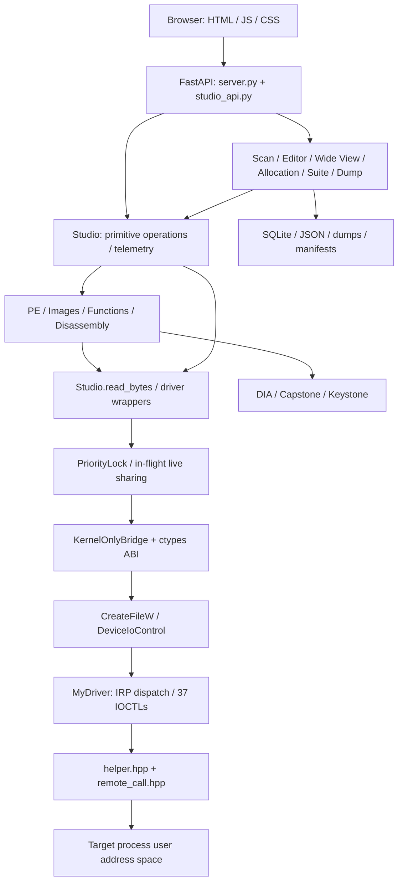
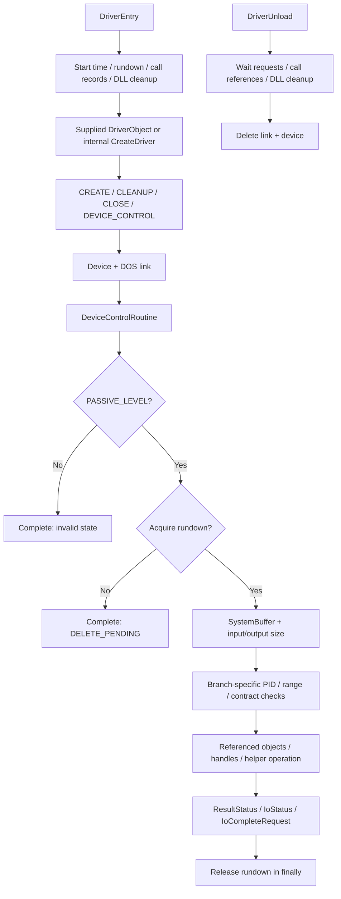
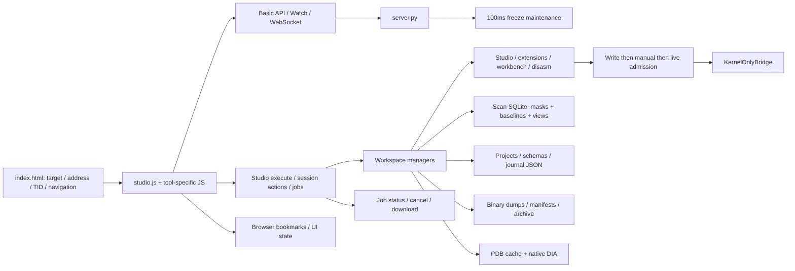
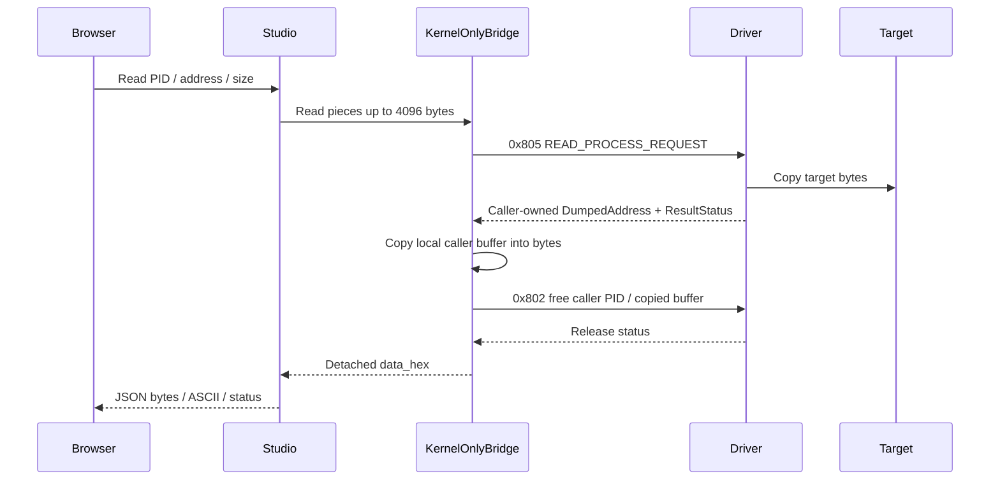
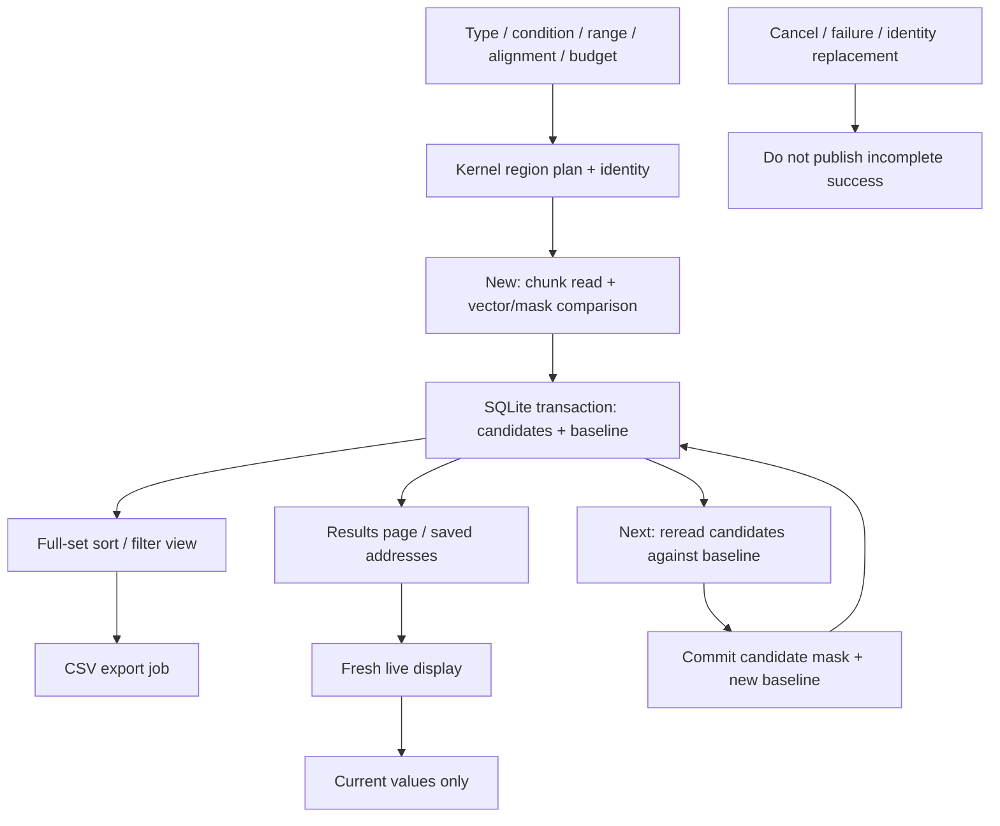
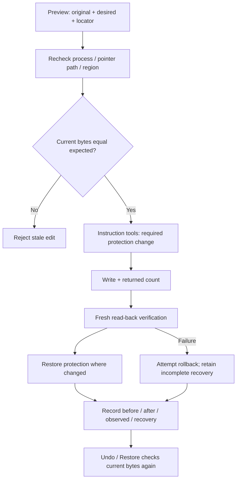
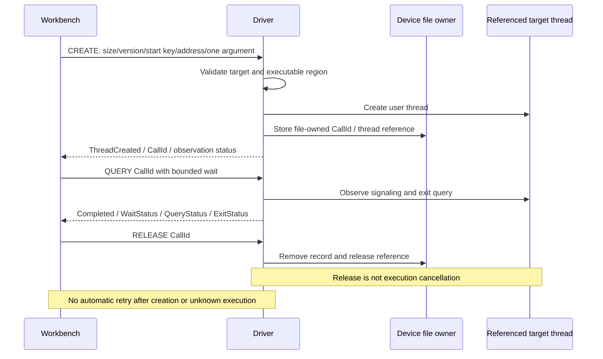

# Kernel Based Process Memory Editor

[한국어](README.md) · [English](README.en.md) · [简体中文](README.zh-CN.md) · [Español](README.es.md)

README técnico integral de análisis/edición de memoria de procesos Windows y Kernel Studio。


## Contenido

- [Alcance y composición](#overview)
- [Diagramas de implementación](#diagrams)
- [Construcción y ciclo de vida del kernel](#kernel)
- [Memoria, búsqueda y consultas del kernel](#kernel-memory)
- [Diseño del panel web](#web)
- [Comportamiento completo de búsqueda](#scan)
- [Editor de bytes, punteros, Wide View y asignación](#edit)
- [Volcados, MEM_IMAGE y verificación](#dump)
- [PE, PDB, funciones, carga DLL y seguimiento](#images)
- [Desensamblado, CFG, pseudocódigo y parches](#disasm)
- [Hilos, registros y breakpoints hardware](#thread)
- [Estructuras, proyectos, diario, timeline y recuperación](#productivity)
- [Transporte IOCTL y propiedad de buffers](#buffers)
- [Catálogo completo de operaciones Studio](#operations)
- [76 herramientas UI y espacios dedicados](#ui)
- [Catálogo completo de acciones](#actions)
- [Los 37 IOCTL: código, paquete, función e implementación](#ioctls)
- [Layouts ABI completos: tamaño, alineación y offsets](#layouts)
- [Declaraciones nativas e internas](#native)
- [Todas las rutas HTTP y WebSocket](#http)
- [Modelos y campos HTTP básicos](#models)
- [Límites y duración de estados](#limits)
- [Instalación, compilación, ejecución y uso](#guide)
- [Cada archivo importado y su función](#files)
- [Validación, límites y guía del repositorio](#validation)

<a id="overview"></a>

## Alcance y composición

Este README conecta **dispositivo del kernel → ABI IOCTL → puente Python → FastAPI → herramientas del navegador → persistencia y recuperación**. Incluye catálogo de funciones, nombres reales de operation/action, los 37 IOCTL, tamaño/alineación/desplazamientos de cada estructura ABI Python, rutas HTTP y mapa completo del código importado. Explica implementación y condiciones de fallo.

SampleKernel1 consulta y edita el espacio de usuario de procesos Windows desde el kernel. Kernel Studio combina su ABI existente en un espacio web local. Las lecturas/escrituras del destino pasan por el controlador; SQLite, NumPy, Capstone, Keystone y DIA gestionan candidatos, presentación y análisis estático.

Código del controlador: **v2.3 / build 20261004**. FastAPI: **v3.0.0**. Durante la verificación estaba cargada **v2.2**; compilar el código no equivale a validar todas las operaciones reales de v2.3. Los cuatro idiomas corresponden a documentación; la interfaz original sigue en coreano.

Los 324 archivos originales se inspeccionaron y copiaron sin escrituras y coincidieron con su SHA-256 inicial. Los 79 archivos importados de código/configuración/pruebas/UI conservan sus bytes. Cachés IDE, binarios generados, volcados, bases de datos e informes permanecen en la copia local, fuera del seguimiento público. `samples/` añade código auxiliar para reproducir la dependencia DLL/PDB externa de las pruebas originales.

<a id="diagrams"></a>

## Diagramas de implementación

### Arquitectura por capas



### Carga, solicitud y descarga



### Composición web y almacenamiento



### Propiedad de respuesta de lectura



### Búsqueda SQLite, Live y Next



### Verificación y recuperación de edición



### Ciclo de vida del token de llamada



<a id="kernel"></a>

## Construcción y ciclo de vida del kernel

### Unidades de compilación y entrada

`SampleKernel1.vcxproj` compila `main.cpp`, que incluye implementaciones inline de `helper.hpp`, `remote_call.hpp` e `ioctl_helper.hpp`. `routine.cpp` es un ejemplo antiguo excluido. `driver_client.hpp` y `test_client.cpp` son un cliente C++ de usuario separado. `utils.hpp`, `vad.h`, `PEB.h`, `PE.h` definen NT, VAD, PEB/cargador y PE. Aunque declara KMDF, entrada, dispositivo e IRP se implementan directamente al estilo WDM.

`DriverEntry` registra inicio e inicializa rundown de solicitudes, seguimiento de llamadas y limpieza DLL diferida. La carga normal usa el `DriverObject` recibido. La ruta interna con objeto nulo usa `helper::driver::CreateDriver`; no es la instalación habitual.

### Dispositivo e IRP

Dispositivo `\Device\MyDriver`, enlace DOS `\DosDevices\MyDriver`, ruta de usuario `\\.\MyDriver`. CREATE/CLEANUP/CLOSE usan `remote_call::FileRoutine`; DEVICE_CONTROL usa `ioctl_helper::DeviceControlRoutine`. El objeto de archivo posee los tokens de llamada; no son IDs globales transferibles entre handles. Un fallo de registro limpia el estado creado.

### Admisión, validación y finalización

Los helpers requieren `PASSIVE_LEVEL`. El envoltorio entra en región crítica y adquiere rundown. Durante descarga puede rechazar con `STATUS_DELETE_PENDING`. Recoge trabajo DLL terminado antes de despachar; `__finally` libera rundown y región crítica.

`GetPacket<T>` exige IRP/pila/SystemBuffer y longitudes de entrada y salida de al menos `sizeof(T)`. Cada rama valida PID, direcciones, tamaños, desbordamientos, buffers y campos reservados según su contrato. El solicitante real procede del IRP; no se confía en `RequestProcessId`. El destino se busca por PID, se referencia/abre con handle del kernel y se libera después.

Los resultados se escriben en `ResultStatus`, campos de salida, `IoStatus.Status` e `IoStatus.Information`, y se completan mediante `IoCompleteRequest`. Compruebe transporte, bytes devueltos y NTSTATUS por separado; HTTP 200 no garantiza éxito.

### Descarga

La descarga espera rundown, libera referencias de hilos de llamadas, espera limpieza DLL y elimina enlace/dispositivo. Liberar un registro no cancela el hilo ya creado. Cleanup/close libera los registros del archivo. Este ciclo de vida no garantiza compatibilidad con todo Windows ni integridad universal.

<a id="kernel-memory"></a>

## Memoria, búsqueda y consultas del kernel

**Asignar/liberar/proteger:** Abrir handle del kernel y llamar a `ZwAllocateVirtualMemory`, `ZwFreeVirtualMemory`, `ZwProtectVirtualMemory`. Comprobar base, tamaño real y protección previa. MEM_RELEASE respeta base/tamaño de reserva; no libera cualquier dirección interior.

**Copiar/leer/escribir:** `MmCopyVirtualMemory` transfiere entre espacios. La lectura crea un buffer de usuario en el solicitante y devuelve su dirección; la escritura copia bytes preparados y devuelve el conteo real. Comparación esperada, verificación posterior y Undo se componen en la capa web.

**Buscar valor:** Captura el patrón en buffer del kernel, consulta regiones y busca por bloques committed/legibles, comprobando Guard/NoAccess y desbordamiento. Devuelve direcciones en lista propiedad del solicitante. Difiere del escáner SQLite nuevo.

**Patrones:** Compara bytes/máscara con solapamiento entre bloques y devuelve conteo y primera dirección; no una base de todos los candidatos. El nuevo AOB implementa otra comparación con comodines de nibble.

**Cadenas:** Devuelve candidatos ANSI/UTF-16 con dirección original, longitud y copia. Sus registros poseen buffers adicionales y necesitan liberación específica. Vistas y resultados tienen límites.

**Mapas/imágenes:** Rutinas VAD devuelven bases, tamaños, estado/tipo/protección, flags y metadatos PE/imagen. `memory_images.py` agrupa MEM_IMAGE y valida encabezados cuando corresponde. Coincidir en nombre no demuestra carga del DLL solicitado.

**Proceso/token/handles/hilos:** Combina búsqueda PID, `ZwQueryInformationProcess`, `ZwQuerySystemInformation` y consultas de token/hilo. Campos de ruta, argumentos, PEB, tiempos, memoria, conteos, protección, integridad y privilegios dependen de subconsultas exitosas. No hay IOCTL de enumeración PID completa; la web usa sondas acotadas.

### Mapa interno y helpers

BuildMemorySnapshot recorre regiones con ZwQueryVirtualMemory(MemoryBasicInformation), no todas las estructuras VAD internas de vad.h directamente. BuildFallbackImageSpans agrupa MEM_IMAGE; BuildModuleSnapshot recorre PEB→Ldr hasta 4096 módulos. Helpers PE/UNICODE_STRING/basename enriquecen. Fallo del cargador no invalida mapa básico; fallback permanece. Snapshots intermedios se liberan tras publicar.

Listas de usuario asignan/enlazan/validan/liberan nodos/datos; listas kernel usan pool etiquetado paged/nonpaged. PIDtoHANDLE/CloseHandle/cleanup sostienen referencias. Helpers dinámicos/default create-close existen, pero main usa remote_call para archivos.

Limpieza DLL diferida conserva buffers/handles necesarios. HWBP separa máscaras/contextos/MDL/publicación/rollback. Diagnostics registra inicio/conteo interlocked, no monitor de eventos activo.

<a id="web"></a>

## Diseño del panel web

`server.py` crea FastAPI, modelos Pydantic, API de memoria/proceso/Watch/hilo, WebSocket y tareas de inicio/cierre. `studio_api.install()` conecta espacios y rutas `/api/studio/*`. `static/index.html` aporta shell; `studio.js` y JS/CSS de funciones se sirven localmente sin CDN. Comparten búsqueda Ctrl K, dirección/TID, selección PID, refresh, toast y estado.

**Transporte:** ctypes, `CreateFileW` y `DeviceIoControl` abren el dispositivo. El servidor usa `KernelOnlyBridge`; no recurre a `ReadProcessMemory` para el destino. ctypes lee la respuesta ya copiada al proceso servidor y free IOCTL la libera.

**Herramientas:** `Studio.operate()` realiza primitivas y delega PE/direcciones, imágenes/funciones e instrucciones. Endpoints propios gestionan sesiones de búsqueda/editor/Wide View/asignación/productividad/volcado. Combinar IOCTL no añade operaciones ABI del kernel.

**Concurrencia:** El lock reentrante prioriza escrituras manuales, lecturas manuales y live; añade equidad tras 16 admisiones. Solo comparte lecturas live idénticas en curso por `(pid,address,size,epoch)`. No mantiene caché permanente de bytes; comprobaciones/manuales son nuevas. Las mutaciones cambian epoch antes/después.

**Trabajos:** Studio tiene dos workers; búsqueda y volcado gestionan progreso/cancelación/error/finalización propios. El frontend consulta IDs. Solicitar cancelación no equivale a haber detenido el trabajo. Use un worker Uvicorn porque las sesiones no se comparten.

**Watch/observación:** Un ciclo aproximado de 100ms mantiene valores congelados, hasta 256 entradas, comprobando identidad. WebSocket transporta mensajes de conexión; history registra IOCTL/estado/tiempos y events sucesos de herramientas. No son el monitor inactivo de notificaciones de proceso/imagen del kernel.

**Persistencia:** Direcciones/valores de 64 bits se envían como cadenas. Bookmarks del navegador, JSON/SQLite/binarios de disco y sesiones en memoria tienen vidas distintas. Guardar proyecto no reanuda todas las sesiones o referencias. El cierre limpia gestores/referencias/puente; la API local carece de autenticación separada.

### Selección, bookmarks y resultados

Sondas PID en pasos de cuatro: predeterminado 65.536, máximo 1.048.576 y extras. Caché metadatos ~3s; no inventa medición CPU. Error de transporte no devuelve lista vacía exitosa. PID manual/filtro/rango ampliado disponibles.

Dashboard muestra contadores y hasta 100 bookmarks. JSON versión uno no escribe/congela automáticamente. Direcciones/TID alimentan campos/otras herramientas; cambiar destino reinicia espacios. Importar binario prepara payload. Inspector interpreta 16 bytes simultáneamente; dissect propone cada ocho bytes, no confirma tipos schema/PDB.

<a id="scan"></a>

## Comportamiento completo de búsqueda

El escáner nuevo guarda máscaras y snapshots de comparación en SQLite, sin limitar candidatos a un array Python de 50.000. Unknown grande conserva candidatos en disco. NumPy compara vectores con stride; texto/AOB/estructuras usan máscaras/campos. Procesa bloques de 64KiB del mapa, con lecturas IOCTL de 4KiB.

Tipos: enteros con/sin signo de 8/16/32/64 bits, float32/64, UTF-8, UTF-16LE, AOB y estructuras numéricas. Condiciones numéricas: Exact/NotEqual/Greater/Less/variantes inclusivas/Between/Unknown/Changed/Unchanged/Increased/Decreased/Rescan. Texto/AOB: Exact/NotEqual/Changed/Unchanged/Rescan. AOB admite `??`, `A?`, `?F`, rechazando patrón totalmente comodín. Estructuras: 32 campos numéricos dentro de 1024 bytes con offset/tipo/comparación/ignore.

**New:** valida configuración, fin exclusivo, propiedades, alineación y presupuesto; selecciona, lee/compara y confirma DB. Predeterminado 256MiB, rango 4KiB–4GiB, alineación auto/1/2/4/8/16. **Next:** relee solo candidatos y compara baseline, confirmando candidatos/nueva baseline. No cambia tipo/ancho/layout. Rescan observa candidatos y Reset limpia. Cancelación, errores y reemplazo se separan de finalización; transacciones protegen publicación.

**Live/baseline:** Live no cambia baseline de Next. Polling aproximado 800ms, páginas 50/100/200/500. view ordena/filtra todos los candidatos; export genera CSV completo/view mediante trabajos con progreso/cancelación/descarga. save/read_saved/edit gestiona hasta 256 direcciones, edición de longitud fija y freeze con comprobaciones de identidad/bytes.

**Versión anterior:** `/api/scan/*` usa `KernelMemoryScannerSession` conservando límite de 50.000. La implementación Win32 de `memory_scanner.py` queda como legado/utilidades, no acceso activo. Herramientas primitivas value/string/pattern/pointer difieren de la sesión SQLite.


<a id="edit"></a>

## Editor de bytes, punteros, Wide View y asignación

### Editor

Gestiona ventanas de 16–65.536 bytes, filas de 4/8, bytes actuales/anteriores, máscaras/cambios/selección y árbol de punteros. Interpreta números/flotantes/punteros, edita rangos, desliza ±65.536 por acción, renombra, actualiza metadatos/nodos live, hints de cadenas y expansión/colapso. Máximo 64 nodos, 1MiB conjunto, profundidad 64.

Expand compara expected con puntero recién leído y rechaza ciclos ancestrales/regiones ilegibles. Edit comprueba ruta de padres, identidad y expected_hex; verifica conteo y bytes posteriores. Fallos parciales conservan original/observado. Restore exige bytes posteriores sin cambios, escribe originales y verifica; historial 256.

### Wide View (Beta)

Vista de solo lectura 16–4096 bytes y mapa completo. Límites página/región y flags readable/committed/Guard generan máscara/huecos; ceros de fallo no prueban ceros reales. Regiones ordenadas/búsqueda binaria; schemas marcan campos confirmados solapados, profundidad 12 y 2048 campos. Solo acciones read/map.

### Asignación de datos

ANSI, Wide UTF-16LE o bytes de archivo determinan tamaño; cadenas incluyen NULL. Hasta 1MiB PAGE_READWRITE: asignar, registrar, escribir y verificar. Muestra base/tamaño/estado/tiempos/reservation ID.

Fallo inicial intenta liberar; si falla conserva needs_free/propiedad. Free exige base activa y reservation de la ventana para distinguir reutilización. Límites: 128 asignaciones, 256 registros/ventana. Borrar historial/cerrar no libera memoria. Se distingue de alloc/free/protect/copy primitivos.


<a id="dump"></a>

## Volcados, MEM_IMAGE y verificación

Trabajos de rangos, grupos de regiones y MEM_IMAGE: máximo 16GiB, bloques 4KiB–1MiB múltiplos de página, lecturas del kernel 4KiB. Hasta cuatro activos y 128 registros. Guardan identidad/plan, estado queued/running/packaging/completed/cancelled/failed y bytes/progreso/errores.

Según política detienen o registran huecos/relleno cero. Manifest distingue cero real/relleno e incluye SHA-256, rangos, nombres, tamaños, fallos e imagen. Empaqueta/descarga; borrar comprueba actividad/referencias. Descargas interrumpidas o Range inválido liberan referencias.

MEM_IMAGE conserva layout RVA mapeado; no garantiza un PE reconstruido ejecutable. Resume exige sesión/identidad/archivos parciales/plan válidos. Tras reiniciar pueden restaurarse listas/descargas completas, no se reanudan automáticamente trabajos interrumpidos.

<a id="images"></a>

## PE, PDB, funciones, carga DLL y seguimiento

**Imágenes/PE:** MEM_IMAGE y encabezados válidos muestran base/tamaño/ruta/main/source. Interpreta encabezados/sections, imports DLL/función/IAT y exports nombre/ordinal/RVA/forwarder desde memoria. resolve admite dirección, module+RVA, module!symbol y forwards hasta ocho niveles; address_info conecta región/RVA/section. PE válido en MEM_PRIVATE de solo lectura también es analizable.

**Funciones:** Fusiona exports, unwind `.pdata` x64 y PDB por RVA. Sin nombre: sub_...; exports de datos se separan de funciones. Límite 20.000 con truncamiento. Detail lee bytes dentro de extent/imagen; hints inferidos no son firma PDB.

**PDB:** GUID/Age CodeView deben coincidir. Auxiliar DIA devuelve JSON de funciones privadas/públicas, parámetros/retornos y estructuras. Gestiona ruta/upload/caché/lista/borrado/restauración, aisla corrupción y revierte guardado fallido. PDB 256MiB, DLL 64MiB; análisis ligado a identidad/imagen.

**DLL:** Helper existente comprueba PEB/cargador/exports, prepara ruta del destino y pide hilo de usuario para ejecutar el cargador. Subir archivo no lo carga. verified/check comprueban destino/ruta/WOW64/imágenes; mismo nombre en otro directorio no basta. Hilo iniciado con observación fallida no se repite automáticamente; buffer de ruta puede limpiarse tras terminar.

**Llamadas:** No es invocador C++ general: un argumento bruto de 64 bits y valor exit de hilo de 32 bits para función x64 validada. No garantiza listas arbitrarias, retornos float/SIMD ni ABI de clase/C++. Rechaza firmas PDB incompatibles; kernel comprueba System/WOW64/salida, start key, memoria ejecutable, tamaño/versión/reservados.

CREATE guarda CallId propiedad del archivo y ThreadId/ThreadCreated; QUERY observa hilo original referenciado; RELEASE libera seguimiento, no ejecución. Espera máxima 1000ms, registros globales 128, 32/archivo, web 30 activos/128 historial. Completed usa señalización, no solo exit=259. No reintentar automáticamente tras ThreadCreated/ejecución desconocida/timeout.

<a id="disasm"></a>

## Desensamblado, CFG, pseudocódigo y parches

Capstone decodifica x86/x64 a dirección/tamaño/mnemonic/operandos/bytes. function_views identifica branch/call/return/terminal y crea bloques/aristas/ramas sin resolver/rangos y pseudocódigo C conservador. Es análisis estático, no tracing ni reconstrucción exacta de C. Límites 16.384 bytes, 2048 instrucciones, 128 bloques.

Workspace ofrece analyze/follow/validate/apply/Undo/Redo/recover/history/release. Keystone ensambla según dirección/bits. Rechaza exceso de slot, solapamiento, límites inválidos, original obsoleto e identidad cambiada; sustitución corta sigue política de slot.

Apply valida, relee original, ajusta protección, escribe, verifica y restaura protección. Fallos intentan recuperación; incompleta queda visible con disasm_recover. Undo/Redo comprueba bytes actuales. 16 sesiones, 128 ediciones/lote, 128 historial. Modificar código vivo no suspende ejecución atómicamente.


<a id="thread"></a>

## Hilos, registros y breakpoints hardware

Lista/detalle de hilos muestra propietario, inicio/tiempos, prioridad, afinidad y suspensión con conteos retornados/totales. Suspend/resume devuelve conteo previo. Priority/affinity separados, batch secuencial hasta 64. Hide existe; terminate 0x820 queda en kernel/puente, excluido de web.

Editar registros comprueba identidad PID y creación/propiedad/vida TID, suspende, lee actuales, fusiona campos solicitados, escribe/verifica y reanuda solo el hilo original. EFLAGS 32 bits, generales 64. Recomprueba reutilización TID. Esta secuencia web difiere del ABI crudo.

HWBP gestiona DR0–DR3/DR6/DR7 y enable/type/length. Valida execute/write/access, 1/2/4/8 bytes/alineación, captura contextos originales, cambia slots seleccionados conservando otros y sigue aplicación/recuperación/fallos parciales. Resultados usan propiedad/MDL específicos. Set/query/remove difieren de liberar buffers; no equivale a debugger completo o tracing de hits.

<a id="productivity"></a>

## Estructuras, proyectos, diario, timeline y recuperación

**Estructuras/clases:** Valida nombre/tamaño/offset/tipo/count/stride/ref/rango/ciclos. Números/pointer/UTF-8/16/bytes/struct/arrays con ancho del destino. view lee campos; pdb_types importa DIA y reporta incompatibles/duplicados/ref ausentes. Schemas JSON; primitivas difieren de planes de edición.

**Preview/apply/diario:** Captura bytes previos/nuevos, locator module+RVA/dirección, identidad y ruta pointer. Apply resuelve/revalida/escribe/relee; preview obsoleto falla. Diario conserva bytes/estado con list/restore individual/batch inverso/archive. Batch no atómico devuelve completados/ID fallido.

**Timeline:** Muestrea schemas/direcciones y compara campos/bytes, hasta 512 muestras guardadas con proyecto. Lecturas secuenciales no son snapshot global atómico. create/sample/get/compare/close separados.

**Proyectos:** JSON versión 2 guarda nombre/UI/definiciones/locators/símbolos/direcciones/timeline y ofrece list/load/export/import/archive/recover. Reinterpreta módulo tras ASLR y reporta unresolved. Import valida, crea ID nuevo y limita 4MiB. Estado no sustituye identidad ni incluye automáticamente DB completa de candidatos.

**Otros:** snapshot/list/compare/restore/delete, patch/list/undo/delete, mapa snapshot/list/compare/delete, diff, preview expected, pointer chain/search, signature comodín, filtros contains/prefix/exact/case, fill/batch. 16 snapshots, ocho mapas, 64 patches. Borrar no restaura memoria. Mapas completos rechazan truncamiento; filtros de cadenas cubren resultados retornados limitados.

### Diario alrededor de escrituras

Journal.install envuelve write/copy/free. Guarda prepared con flush/fsync y rename atómico antes de escribir; observación marca verified/failed/uncertain. Copy conserva original destino y bytes solicitados. Máximo 2048 registros/128MiB contabilidad hex. Free gestionado marca released y evita restore en dirección reutilizada; valores idénticos pueden no generar registro.

No revierte salida de proceso/liberación/ejecución de hilo/cambios externos. Restore es escritura verificada nueva con identidad/observed coincidentes; archive acepta restaurados/liberados.

<a id="buffers"></a>

## Transporte IOCTL y propiedad de buffers

Todos usan CTL_CODE: DeviceType=0x22, Method=0, Access=3; `code=(0x22<<16)|(3<<14)|(function<<2)`. Función 0x800 transmite 0x22E000. SystemBuffer copia paquete fijo, no todos los datos apuntados por direcciones enteras heredadas.

Puente pasa mismo paquete ctypes de entrada/salida. Windows ULONG/LONG/NTSTATUS:32 bits; ULONGLONG:64; BOOLEAN:1 byte; WCHAR:2. Tamaño incluye padding. Layouts extraídos con sizeof/alignment/offset Windows x64 reales, no asumidos portables.

Lee respuesta local y libera por IOCTL con PID del solicitante. Listas validan signature Node 0x4C4C535448454C50, enlaces inversos, ciclos/cantidad/DataSize y liberan en finally. Cadenas poseen DumpedAddress extra; HWBP contiene propiedad de recuperación. Conservar Set hasta Remove; liberar resultados query no elimina breakpoint.

Llamadas 0x822–824 usan versión 1, pack(8), static_assert 88/96/24. Separar tamaño/versión/reservados/Flags/start key/token y ThreadCreated/Completed/wait/exit/query. Parameter es palabra bruta, no buffer arbitrario dereferenciado.

HWBP Type Execute=0/Write=1/ReadWrite=3 y Length wire=1/2/4/8 bytes. bp_len Python antiguo convierte DR7 0/1/3/2 a longitud. Abajo figuran arrays/cadenas embebidos de context/imagen/token/handles.

<a id="operations"></a>

## Catálogo completo de operaciones Studio

Estos 79 nombres se cotejan con OP_GROUPS/OPERATIONS. POST /api/studio/execute, body {"operation":"...","args":{...}}. Aplique pid/address/size, payload y contratos específicos. Enlaces apuntan a ramas reales.

### Proceso

| Operation | Comportamiento | Implementación |
|---|---|---|
| `process` | Combina consultas básica/extendida/token. | [studio_api.py:356](kernel_control_panel/studio_api.py#L356) |
| `handles` | Devuelve hasta 128 handles y total aparte. | [studio_api.py:359](kernel_control_panel/studio_api.py#L359) |
| `token` | Consulta elevación/integridad/sesión/privilegios. | [studio_api.py:367](kernel_control_panel/studio_api.py#L367) |
| `threads` | Distingue 64 hilos retornados del total. | [studio_api.py:359](kernel_control_panel/studio_api.py#L359) |
| `thread_info` | Consulta propietario/creación/estado/TEB. | [studio_api.py:377](kernel_control_panel/studio_api.py#L377) |

### Memoria

| Operation | Comportamiento | Implementación |
|---|---|---|
| `read` | Combina lecturas 4KiB a Hex/ASCII/base64. | [studio_api.py:444](kernel_control_panel/studio_api.py#L444) |
| `write` | Codifica/escribe/relee/compara payload. | [studio_api.py:449](kernel_control_panel/studio_api.py#L449) |
| `alloc` | Asigna y registra identidad propietaria. | [studio_api.py:454](kernel_control_panel/studio_api.py#L454) |
| `free` | Libera base y registro de gestión. | [studio_api.py:463](kernel_control_panel/studio_api.py#L463) |
| `protect` | Cambia protección y devuelve valor previo. | [studio_api.py:472](kernel_control_panel/studio_api.py#L472) |
| `copy` | Copia entre PID/direcciones origen/destino. | [studio_api.py:473](kernel_control_panel/studio_api.py#L473) |
| `fill` | Repite patrón mediante patch recuperable. | [studio_api.py:475](kernel_control_panel/studio_api.py#L475) |
| `dump` | Combina lecturas 4KiB a Hex/ASCII/base64. | [studio_api.py:444](kernel_control_panel/studio_api.py#L444) |

### Búsqueda

| Operation | Comportamiento | Implementación |
|---|---|---|
| `kernel_value` | Consume/libera lista de coincidencias. | [studio_api.py:486](kernel_control_panel/studio_api.py#L486) |
| `strings` | Lee cadenas y libera buffers específicos. | [studio_api.py:489](kernel_control_panel/studio_api.py#L489) |
| `pattern` | Devuelve conteo y primera coincidencia. | [studio_api.py:496](kernel_control_panel/studio_api.py#L496) |
| `pattern_regions` | Busca en regiones de mapa completo. | [studio_api.py:491](kernel_control_panel/studio_api.py#L491) |
| `pointer_search` | Busca bytes de puntero de 64 bits. | [studio_api.py:486](kernel_control_panel/studio_api.py#L486) |

### Regiones/módulos

| Operation | Comportamiento | Implementación |
|---|---|---|
| `regions` | Devuelve atributos de regiones/imágenes. | [studio_api.py:484](kernel_control_panel/studio_api.py#L484) |
| `modules` | Valida regiones/PE para catálogo. | [studio_api.py:480](kernel_control_panel/studio_api.py#L480) |
| `pe` | Lee/interpreta encabezados y sections. | [studio_api.py:589](kernel_control_panel/studio_api.py#L589) |

### Hilos

| Operation | Comportamiento | Implementación |
|---|---|---|
| `context` | Lee registros del TID seleccionado. | [studio_api.py:379](kernel_control_panel/studio_api.py#L379) |
| `set_context` | Comprueba/suspende/fusiona/verifica/reanuda. | [studio_api.py:385](kernel_control_panel/studio_api.py#L385) |
| `suspend` | Valida/suspende/devuelve conteo previo. | [studio_api.py:380](kernel_control_panel/studio_api.py#L380) |
| `resume` | Valida/reanuda/devuelve conteo previo. | [studio_api.py:381](kernel_control_panel/studio_api.py#L381) |
| `priority` | Valida/fija prioridad de hilo. | [studio_api.py:382](kernel_control_panel/studio_api.py#L382) |
| `affinity` | Fija máscara afinidad de 64 bits. | [studio_api.py:383](kernel_control_panel/studio_api.py#L383) |
| `hide` | Transmite solicitud thread-hide original. | [studio_api.py:368](kernel_control_panel/studio_api.py#L368) |
| `thread_batch` | Ejecuta cuatro acciones hasta 64 TID. | [studio_api.py:434](kernel_control_panel/studio_api.py#L434) |

### Breakpoints

| Operation | Comportamiento | Implementación |
|---|---|---|
| `hwbp_set` | Conserva slots y registros de recuperación. | [studio_api.py:596](kernel_control_panel/studio_api.py#L596) |
| `hwbp_query` | Copia lista debug y libera resultados. | [studio_api.py:590](kernel_control_panel/studio_api.py#L590) |
| `hwbp_remove` | Restaura slots y libera al tener éxito. | [studio_api.py:611](kernel_control_panel/studio_api.py#L611) |
| `hwbp_list` | Lista IDs de breakpoints gestionados. | [studio_api.py:594](kernel_control_panel/studio_api.py#L594) |

### Análisis básico

| Operation | Comportamiento | Implementación |
|---|---|---|
| `snapshot` | Guarda bytes e identidad PID. | [studio_api.py:519](kernel_control_panel/studio_api.py#L519) |
| `snapshot_list` | Lista snapshots y asignaciones. | [studio_api.py:514](kernel_control_panel/studio_api.py#L514) |
| `compare` | Compara snapshot y bytes actuales. | [studio_api.py:512](kernel_control_panel/studio_api.py#L512) |
| `restore` | Restaura snapshot mediante patch nuevo. | [studio_api.py:542](kernel_control_panel/studio_api.py#L542) |
| `patch` | Comprueba original/expected, escribe y registra. | [studio_api.py:526](kernel_control_panel/studio_api.py#L526) |
| `patch_list` | Lista bytes antes/después y recuperación. | [studio_api.py:518](kernel_control_panel/studio_api.py#L518) |
| `undo` | Restaura solo si bytes modificados coinciden. | [studio_api.py:527](kernel_control_panel/studio_api.py#L527) |
| `pointer_chain` | Desreferencia/suma offsets/devuelve ruta. | [studio_api.py:551](kernel_control_panel/studio_api.py#L551) |
| `structure` | Lee campos offset/tipo definidos. | [studio_api.py:562](kernel_control_panel/studio_api.py#L562) |
| `structure_write` | Modifica solo campos con value. | [studio_api.py:572](kernel_control_panel/studio_api.py#L572) |
| `disassemble` | Decodifica con Capstone. | [studio_api.py:581](kernel_control_panel/studio_api.py#L581) |

### Otros

| Operation | Comportamiento | Implementación |
|---|---|---|
| `dll` | Devuelve resultado IOCTL DLL existente. | [studio_api.py:621](kernel_control_panel/studio_api.py#L621) |
| `status` | Consulta conexión/versión/inicio/conteos. | [studio_api.py:353](kernel_control_panel/studio_api.py#L353) |
| `batch` | Hasta 32 pasos con referencias $name.field. | [studio_api.py:625](kernel_control_panel/studio_api.py#L625) |

### Análisis extendido

| Operation | Comportamiento | Implementación |
|---|---|---|
| `pe_imports` | Interpreta DLL/nombre/ordinal/IAT/puntero. | [studio_extensions.py:111](kernel_control_panel/studio_extensions.py#L111) |
| `pe_exports` | Interpreta/filtra exports. | [studio_extensions.py:109](kernel_control_panel/studio_extensions.py#L109) |
| `resolve` | Resuelve dirección/módulo/RVA/export. | [studio_extensions.py:118](kernel_control_panel/studio_extensions.py#L118) |
| `address_info` | Asocia dirección/región/protección/imagen. | [studio_extensions.py:152](kernel_control_panel/studio_extensions.py#L152) |
| `memory_diff` | Lee dos rangos y devuelve diferencias. | [studio_extensions.py:166](kernel_control_panel/studio_extensions.py#L166) |
| `patch_preview` | Compara payload sin escribir. | [studio_extensions.py:179](kernel_control_panel/studio_extensions.py#L179) |
| `signature` | Genera AOB con rangos wildcard. | [studio_extensions.py:185](kernel_control_panel/studio_extensions.py#L185) |
| `strings_filter` | Filtra cadenas retornadas por modo/case. | [studio_extensions.py:200](kernel_control_panel/studio_extensions.py#L200) |
| `map_snapshot` | Guarda mapa completo e identidad. | [studio_extensions.py:219](kernel_control_panel/studio_extensions.py#L219) |
| `map_list` | Lista IDs/tiempos/conteos de mapas. | [studio_extensions.py:217](kernel_control_panel/studio_extensions.py#L217) |
| `map_compare` | Compara cambios de regiones. | [studio_extensions.py:215](kernel_control_panel/studio_extensions.py#L215) |
| `map_delete` | Borra registro, no memoria destino. | [studio_extensions.py:232](kernel_control_panel/studio_extensions.py#L232) |
| `snapshot_delete` | Borra solo snapshot guardado. | [studio_extensions.py:247](kernel_control_panel/studio_extensions.py#L247) |
| `patch_delete` | Borra solo patches restaurados. | [studio_extensions.py:247](kernel_control_panel/studio_extensions.py#L247) |

### Imágenes/funciones

| Operation | Comportamiento | Implementación |
|---|---|---|
| `image_catalog` | Valida regiones/PE para catálogo. | [image_workbench.py:374](kernel_control_panel/image_workbench.py#L374) |
| `image_functions` | Fusiona export/unwind/PDB y separa datos. | [image_workbench.py:375](kernel_control_panel/image_workbench.py#L375) |
| `image_function_detail` | Genera código/CFG/pseudocódigo validado. | [image_workbench.py:376](kernel_control_panel/image_workbench.py#L376) |
| `dll_load_verified` | Comprueba carga con destino/ruta/imagen. | [image_workbench.py:377](kernel_control_panel/image_workbench.py#L377) |
| `dll_load_check` | Reconsulta imagen de intento existente. | [image_workbench.py:378](kernel_control_panel/image_workbench.py#L378) |
| `function_call` | Valida función x64/un argumento y crea llamada. | [image_workbench.py:379](kernel_control_panel/image_workbench.py#L379) |
| `function_calls` | Lista llamadas activas e historial acotado. | [image_workbench.py:380](kernel_control_panel/image_workbench.py#L380) |
| `function_call_query` | Consulta señalización/exit del token original. | [image_workbench.py:382](kernel_control_panel/image_workbench.py#L382) |
| `function_call_release` | Libera seguimiento, no ejecución. | [image_workbench.py:383](kernel_control_panel/image_workbench.py#L383) |

### Edición de instrucciones

| Operation | Comportamiento | Implementación |
|---|---|---|
| `disasm_analyze` | Decodifica y guarda instrucciones/CFG/ID. | [disassembly_workspace.py:356](kernel_control_panel/disassembly_workspace.py#L356) |
| `disasm_validate` | Valida bytes para slot de instrucción. | [disassembly_workspace.py:362](kernel_control_panel/disassembly_workspace.py#L362) |
| `disasm_apply` | Valida/escribe/restaura protección/registra. | [disassembly_workspace.py:377](kernel_control_panel/disassembly_workspace.py#L377) |
| `disasm_undo` | Comprueba bytes y deshace grupo previo. | [disassembly_workspace.py:398](kernel_control_panel/disassembly_workspace.py#L398) |
| `disasm_redo` | Comprueba bytes y rehace grupo. | [disassembly_workspace.py:398](kernel_control_panel/disassembly_workspace.py#L398) |
| `disasm_recover` | Reintenta recuperación pendiente. | [disassembly_workspace.py:363](kernel_control_panel/disassembly_workspace.py#L363) |
| `disasm_history` | Devuelve historial/cursor/recuperación. | [disassembly_workspace.py:361](kernel_control_panel/disassembly_workspace.py#L361) |
| `disasm_follow` | Sigue referencia validada de instrucción. | [disassembly_workspace.py:364](kernel_control_panel/disassembly_workspace.py#L364) |
| `disasm_release` | Libera sesión sin deshacer código automático. | [disassembly_workspace.py:350](kernel_control_panel/disassembly_workspace.py#L350) |

<a id="ui"></a>

## 76 herramientas UI y espacios dedicados

Son 76 definiciones TOOLS reales de static/studio.js. Labels coreanos corresponden a UI; descripciones localizadas. Algunas antiguas van a escáner dedicado, no equivalen al conteo menú/operation. Componentes editor/escáner/Wide View/asignación/estructuras/proyectos/diario/timeline/DLL/funciones/desensamblado se explican antes.

| Tool ID | Label original | Comportamiento |
|---|---|---|
| `dump_large` | 대용량 범위 덤프 | Volcado de rango con progreso/cancelar/reanudar. |
| `dump_image` | 이미지 하나 덤프 | Selecciona imagen y vuelca layout mapeado. |
| `dump_images` | 모든 MEM_IMAGE 덤프 | Guarda todas MEM_IMAGE en archivos/manifest/ZIP. |
| `dump_list` | 덤프 작업 목록 | Gestiona IDs/progreso/fallos/cancelar/descargar. |
| `pe_imports` | PE 가져오기 / IAT | Interpreta DLL/nombre/ordinal/IAT/puntero. |
| `pe_exports` | PE 내보내기 | Interpreta/filtra exports. |
| `resolve` | 모듈 / 함수 주소 계산 | Resuelve dirección/módulo/RVA/export. |
| `address_info` | 주소 소속 분석 | Asocia dirección/región/protección/imagen. |
| `memory_diff` | 두 메모리 범위 비교 | Lee dos rangos y devuelve diferencias. |
| `patch_preview` | 패치 미리보기 | Compara payload sin escribir. |
| `signature` | AOB 시그니처 생성 | Genera AOB con rangos wildcard. |
| `strings_filter` | 문자열 조건 검색 | Filtra cadenas retornadas por modo/case. |
| `map_snapshot` | 메모리 맵 저장 | Guarda mapa completo e identidad. |
| `map_list` | 저장된 메모리 맵 | Lista IDs/tiempos/conteos de mapas. |
| `map_compare` | 메모리 맵 변화 비교 | Compara cambios de regiones. |
| `map_delete` | 메모리 맵 기록 삭제 | Borra registro, no memoria destino. |
| `snapshot_delete` | 스냅샷 기록 삭제 | Borra solo snapshot guardado. |
| `patch_delete` | 복구된 패치 기록 삭제 | Borra solo patches restaurados. |
| `process` | 프로세스 상세 | Combina consultas básica/extendida/token. |
| `handles` | 핸들 목록 | Devuelve hasta 128 handles y total aparte. |
| `token` | 권한 토큰 | Consulta elevación/integridad/sesión/privilegios. |
| `threads` | 스레드 목록 | Distingue 64 hilos retornados del total. |
| `thread_info` | 스레드 상세 | Consulta propietario/creación/estado/TEB. |
| `read` | 메모리 읽기 | Combina lecturas 4KiB a Hex/ASCII/base64. |
| `write` | 형식별 쓰기 | Codifica/escribe/relee/compara payload. |
| `inspect` | 데이터 해석 | Interpreta 16 bytes como números/texto/puntero. |
| `dump` | 메모리 덤프 | Combina lecturas 4KiB a Hex/ASCII/base64. |
| `alloc` | 메모리 할당 | Asigna y registra identidad propietaria. |
| `free` | 메모리 해제 | Libera base y registro de gestión. |
| `protect` | 보호 속성 변경 | Cambia protección y devuelve valor previo. |
| `copy` | 프로세스 간 복사 | Copia entre PID/direcciones origen/destino. |
| `fill` | 패턴 채우기 | Repite patrón mediante patch recuperable. |
| `kernel_value` | 커널 값 검색 | Consume/libera lista de coincidencias. |
| `pattern` | 범위 AOB 검색 | Devuelve conteo y primera coincidencia. |
| `pattern_regions` | 영역 AOB 검색 | Busca en regiones de mapa completo. |
| `strings` | 문자열 검색 | Lee cadenas y libera buffers específicos. |
| `scan_first` | 첫 값 검색 | Primer escaneo kernel antiguo, distinto del nuevo. |
| `scan_next` | 다음 값 검색 | Compara candidatos/baseline antiguos. |
| `scan_results` | 검색 후보 | Pagina resultados antiguos. |
| `scan_reset` | 검색 초기화 | Restablece candidatos antiguos. |
| `regions` | 커널 메모리 맵 | Devuelve atributos de regiones/imágenes. |
| `modules` | 모듈 / 메모리 PE 목록 | Valida regiones/PE para catálogo. |
| `pe` | PE 헤더와 섹션 | Lee/interpreta encabezados y sections. |
| `context` | 레지스터 조회 | Lee registros del TID seleccionado. |
| `set_context` | 레지스터 편집 | Comprueba/suspende/fusiona/verifica/reanuda. |
| `suspend` | 스레드 일시 정지 | Valida/suspende/devuelve conteo previo. |
| `resume` | 스레드 재개 | Valida/reanuda/devuelve conteo previo. |
| `priority` | 스레드 우선순위 | Valida/fija prioridad de hilo. |
| `affinity` | CPU 지정 | Fija máscara afinidad de 64 bits. |
| `hide` | 디버거 숨김 설정 | Transmite solicitud thread-hide original. |
| `thread_batch` | 스레드 일괄 제어 | Ejecuta cuatro acciones hasta 64 TID. |
| `hwbp_set` | 중단점 설정 | Conserva slots y registros de recuperación. |
| `hwbp_query` | 중단점 조회 | Copia lista debug y libera resultados. |
| `hwbp_list` | 관리 중인 중단점 | Lista IDs de breakpoints gestionados. |
| `hwbp_remove` | 중단점 제거 | Restaura slots y libera al tener éxito. |
| `dll` | DLL 로드 | Devuelve resultado IOCTL DLL existente. |
| `snapshot` | 스냅샷 저장 | Guarda bytes e identidad PID. |
| `snapshot_list` | 스냅샷 / 할당 목록 | Lista snapshots y asignaciones. |
| `compare` | 스냅샷 비교 | Compara snapshot y bytes actuales. |
| `restore` | 스냅샷 복원 | Restaura snapshot mediante patch nuevo. |
| `patch` | 검증 패치 | Comprueba original/expected, escribe y registra. |
| `patch_list` | 패치 이력 | Lista bytes antes/después y recuperación. |
| `undo` | 패치 복구 | Restaura solo si bytes modificados coinciden. |
| `pointer_chain` | 포인터 체인 | Desreferencia/suma offsets/devuelve ruta. |
| `pointer_search` | 포인터 참조 검색 | Busca bytes de puntero de 64 bits. |
| `structure` | 사용자 정의 구조체 | Lee campos offset/tipo definidos. |
| `structure_write` | 구조체 필드 쓰기 | Modifica solo campos con value. |
| `dissect` | 구조 자동 해석 | Interpreta candidatos de campo cada 8 bytes. |
| `disassemble` | 명령어 분석 | Decodifica con Capstone. |
| `status` | 드라이버 상태 | Consulta conexión/versión/inicio/conteos. |
| `batch` | 작업 시나리오 | Hasta 32 pasos con referencias $name.field. |
| `watch_add` | 주소 등록 | Registra dirección/tipo/nota e identidad. |
| `watch_update` | 값 / 설명 편집 | Cambia tipo/nota/valor opcional y verifica. |
| `watch_freeze` | 값 고정 / 해제 | Activa/desactiva escrituras repetidas. |
| `watch_remove` | Watch 삭제 | Quita Watch sin restaurar valor original automático. |
| `watch_list` | Watch 목록 | Lee valores/errores registrados. |

<a id="actions"></a>

## Catálogo completo de acciones

Acciones reales por módulo, distintas de operation. Use ID de creación en acciones posteriores y nueva sesión al cambiar identidad; acciones inválidas/sesiones caducadas/errores no son éxito.

| Action | Endpoint | Implementación |
|---|---|---|
| `edit` | `/api/studio/scans/{key}/{action}` | [scan_workspace.py](kernel_control_panel/scan_workspace.py) |
| `export` | `/api/studio/scans/{key}/{action}` | [scan_workspace.py](kernel_control_panel/scan_workspace.py) |
| `new` | `/api/studio/scans/{key}/{action}` | [scan_workspace.py](kernel_control_panel/scan_workspace.py) |
| `next` | `/api/studio/scans/{key}/{action}` | [scan_workspace.py](kernel_control_panel/scan_workspace.py) |
| `read_saved` | `/api/studio/scans/{key}/{action}` | [scan_workspace.py](kernel_control_panel/scan_workspace.py) |
| `rescan` | `/api/studio/scans/{key}/{action}` | [scan_workspace.py](kernel_control_panel/scan_workspace.py) |
| `reset` | `/api/studio/scans/{key}/{action}` | [scan_workspace.py](kernel_control_panel/scan_workspace.py) |
| `results` | `/api/studio/scans/{key}/{action}` | [scan_workspace.py](kernel_control_panel/scan_workspace.py) |
| `save` | `/api/studio/scans/{key}/{action}` | [scan_workspace.py](kernel_control_panel/scan_workspace.py) |
| `view` | `/api/studio/scans/{key}/{action}` | [scan_workspace.py](kernel_control_panel/scan_workspace.py) |
| `collapse` | `/api/studio/editors/{key}/{action}` | [memory_editor.py](kernel_control_panel/memory_editor.py) |
| `edit` | `/api/studio/editors/{key}/{action}` | [memory_editor.py](kernel_control_panel/memory_editor.py) |
| `edit_range` | `/api/studio/editors/{key}/{action}` | [memory_editor.py](kernel_control_panel/memory_editor.py) |
| `expand` | `/api/studio/editors/{key}/{action}` | [memory_editor.py](kernel_control_panel/memory_editor.py) |
| `group` | `/api/studio/editors/{key}/{action}` | [memory_editor.py](kernel_control_panel/memory_editor.py) |
| `metadata` | `/api/studio/editors/{key}/{action}` | [memory_editor.py](kernel_control_panel/memory_editor.py) |
| `name` | `/api/studio/editors/{key}/{action}` | [memory_editor.py](kernel_control_panel/memory_editor.py) |
| `refresh` | `/api/studio/editors/{key}/{action}` | [memory_editor.py](kernel_control_panel/memory_editor.py) |
| `restore` | `/api/studio/editors/{key}/{action}` | [memory_editor.py](kernel_control_panel/memory_editor.py) |
| `slide` | `/api/studio/editors/{key}/{action}` | [memory_editor.py](kernel_control_panel/memory_editor.py) |
| `map` | `/api/studio/wide-views/{key}/{action}` | [memory_wide_view.py](kernel_control_panel/memory_wide_view.py) |
| `read` | `/api/studio/wide-views/{key}/{action}` | [memory_wide_view.py](kernel_control_panel/memory_wide_view.py) |
| `allocate` | `/api/studio/allocation-histories/{key}/{action}` | [memory_allocation.py](kernel_control_panel/memory_allocation.py) |
| `free` | `/api/studio/allocation-histories/{key}/{action}` | [memory_allocation.py](kernel_control_panel/memory_allocation.py) |
| `list` | `/api/studio/allocation-histories/{key}/{action}` | [memory_allocation.py](kernel_control_panel/memory_allocation.py) |
| `apply` | `/api/studio/suite/{action}` | [productivity_suite.py](kernel_control_panel/productivity_suite.py) |
| `archive` | `/api/studio/suite/{action}` | [productivity_suite.py](kernel_control_panel/productivity_suite.py) |
| `journal` | `/api/studio/suite/{action}` | [productivity_suite.py](kernel_control_panel/productivity_suite.py) |
| `pdb_types` | `/api/studio/suite/{action}` | [productivity_suite.py](kernel_control_panel/productivity_suite.py) |
| `preview` | `/api/studio/suite/{action}` | [productivity_suite.py](kernel_control_panel/productivity_suite.py) |
| `project_archive` | `/api/studio/suite/{action}` | [productivity_suite.py](kernel_control_panel/productivity_suite.py) |
| `project_archives` | `/api/studio/suite/{action}` | [productivity_suite.py](kernel_control_panel/productivity_suite.py) |
| `project_export` | `/api/studio/suite/{action}` | [productivity_suite.py](kernel_control_panel/productivity_suite.py) |
| `project_import` | `/api/studio/suite/{action}` | [productivity_suite.py](kernel_control_panel/productivity_suite.py) |
| `project_load` | `/api/studio/suite/{action}` | [productivity_suite.py](kernel_control_panel/productivity_suite.py) |
| `project_recover` | `/api/studio/suite/{action}` | [productivity_suite.py](kernel_control_panel/productivity_suite.py) |
| `project_save` | `/api/studio/suite/{action}` | [productivity_suite.py](kernel_control_panel/productivity_suite.py) |
| `projects` | `/api/studio/suite/{action}` | [productivity_suite.py](kernel_control_panel/productivity_suite.py) |
| `resolve` | `/api/studio/suite/{action}` | [productivity_suite.py](kernel_control_panel/productivity_suite.py) |
| `restore` | `/api/studio/suite/{action}` | [productivity_suite.py](kernel_control_panel/productivity_suite.py) |
| `restore_batch` | `/api/studio/suite/{action}` | [productivity_suite.py](kernel_control_panel/productivity_suite.py) |
| `sample` | `/api/studio/suite/{action}` | [productivity_suite.py](kernel_control_panel/productivity_suite.py) |
| `schemas` | `/api/studio/suite/{action}` | [productivity_suite.py](kernel_control_panel/productivity_suite.py) |
| `schemas_save` | `/api/studio/suite/{action}` | [productivity_suite.py](kernel_control_panel/productivity_suite.py) |
| `timeline` | `/api/studio/suite/{action}` | [productivity_suite.py](kernel_control_panel/productivity_suite.py) |
| `timeline_close` | `/api/studio/suite/{action}` | [productivity_suite.py](kernel_control_panel/productivity_suite.py) |
| `timeline_compare` | `/api/studio/suite/{action}` | [productivity_suite.py](kernel_control_panel/productivity_suite.py) |
| `timeline_create` | `/api/studio/suite/{action}` | [productivity_suite.py](kernel_control_panel/productivity_suite.py) |
| `view` | `/api/studio/suite/{action}` | [productivity_suite.py](kernel_control_panel/productivity_suite.py) |

<a id="ioctls"></a>

## Los 37 IOCTL: código, paquete, función e implementación

Identificadores completos IOCTL_HELPER_; campos en capítulo ABI siguiente. Web conecta 34, excluyendo dos eventos inactivos y terminate. Liberación de resultados suele ser cleanup interno。

| Function | CTL_CODE | Identifier | Packet | Comportamiento/salida |
|---|---|---|---|---|
| `0x800` | `0x22E000` | `IOCTL_HELPER_PROCESS_INFORMATION` | [PROCESS_INFORMATION_REQUEST](#abi-PROCESS_INFORMATION_REQUEST) | Proceso básico/identidad |
| `0x801` | `0x22E004` | `IOCTL_HELPER_ALLOC_VIRTUAL_MEMORY` | [ALLOC_VIRTUAL_MEMORY_REQUEST](#abi-ALLOC_VIRTUAL_MEMORY_REQUEST) | Reservar/commit memoria |
| `0x802` | `0x22E008` | `IOCTL_HELPER_FREE_VIRTUAL_MEMORY` | [FREE_VIRTUAL_MEMORY_REQUEST](#abi-FREE_VIRTUAL_MEMORY_REQUEST) | Liberar asignación |
| `0x803` | `0x22E00C` | `IOCTL_HELPER_COPY_PROCESS_MEMORY` | [COPY_PROCESS_MEMORY_REQUEST](#abi-COPY_PROCESS_MEMORY_REQUEST) | Copia entre procesos |
| `0x804` | `0x22E010` | `IOCTL_HELPER_SCAN_VALUE_PROCESS` | [SCAN_VALUE_PROCESS_REQUEST](#abi-SCAN_VALUE_PROCESS_REQUEST) | Buscar valor/lista |
| `0x805` | `0x22E014` | `IOCTL_HELPER_READ_PROCESS` | [READ_PROCESS_REQUEST](#abi-READ_PROCESS_REQUEST) | Copia de lectura en solicitante |
| `0x806` | `0x22E018` | `IOCTL_HELPER_READ_STRING_PROCESS` | [READ_STRING_PROCESS_REQUEST](#abi-READ_STRING_PROCESS_REQUEST) | Cadenas ANSI/UTF-16 |
| `0x807` | `0x22E01C` | `IOCTL_HELPER_READ_PROCESS_INFORMATION` | [READ_PROCESS_INFORMATION_REQUEST](#abi-READ_PROCESS_INFORMATION_REQUEST) | Regiones/VAD/imágenes |
| `0x808` | `0x22E020` | `IOCTL_HELPER_FREE_LINKED_LIST` | [FREE_LINKED_LIST_REQUEST](#abi-FREE_LINKED_LIST_REQUEST) | Liberar lista ordinaria |
| `0x809` | `0x22E024` | `IOCTL_HELPER_FREE_STRING_LIST` | [FREE_STRING_LIST_REQUEST](#abi-FREE_STRING_LIST_REQUEST) | Liberar cadenas/lista |
| `0x80A` | `0x22E028` | `IOCTL_HELPER_SET_HARDWARE_BREAKPOINT` | [IOCTL_HWBP_SET_REQUEST](#abi-IOCTL_HWBP_SET_REQUEST) | Aplicar HWBP/registros |
| `0x80B` | `0x22E02C` | `IOCTL_HELPER_QUERY_HARDWARE_BREAKPOINT` | [IOCTL_HWBP_QUERY_REQUEST](#abi-IOCTL_HWBP_QUERY_REQUEST) | Consultar HWBP |
| `0x80C` | `0x22E030` | `IOCTL_HELPER_REMOVE_HARDWARE_BREAKPOINT` | [IOCTL_HWBP_REMOVE_REQUEST](#abi-IOCTL_HWBP_REMOVE_REQUEST) | Quitar HWBP con originales |
| `0x80D` | `0x22E034` | `IOCTL_HELPER_FREE_HARDWARE_BREAKPOINT_RESULT` | [IOCTL_HWBP_FREE_RESULT_REQUEST](#abi-IOCTL_HWBP_FREE_RESULT_REQUEST) | Liberar resultados HWBP |
| `0x80E` | `0x22E038` | `IOCTL_HELPER_REGISTER_DLL` | [REGISTER_DLL_REQUEST](#abi-REGISTER_DLL_REQUEST) | Solicitar carga DLL |
| `0x80F` | `0x22E03C` | `IOCTL_HELPER_WRITE_PROCESS` | [WRITE_PROCESS_REQUEST](#abi-WRITE_PROCESS_REQUEST) | Escribir/conteo real |
| `0x810` | `0x22E040` | `IOCTL_HELPER_PROTECT_VIRTUAL_MEMORY` | [PROTECT_VIRTUAL_MEMORY_REQUEST](#abi-PROTECT_VIRTUAL_MEMORY_REQUEST) | Cambiar/protección anterior |
| `0x811` | `0x22E044` | `IOCTL_HELPER_PATTERN_SCAN` | [PATTERN_SCAN_REQUEST](#abi-PATTERN_SCAN_REQUEST) | Conteo/primer patrón |
| `0x812` | `0x22E048` | `IOCTL_HELPER_ENUMERATE_THREADS` | [ENUMERATE_THREADS_REQUEST](#abi-ENUMERATE_THREADS_REQUEST) | Enumerar array de hilos |
| `0x813` | `0x22E04C` | `IOCTL_HELPER_SUSPEND_THREAD` | [THREAD_CONTROL_REQUEST](#abi-THREAD_CONTROL_REQUEST) | Suspender/conteo previo |
| `0x814` | `0x22E050` | `IOCTL_HELPER_RESUME_THREAD` | [THREAD_CONTROL_REQUEST](#abi-THREAD_CONTROL_REQUEST) | Reanudar/conteo previo |
| `0x815` | `0x22E054` | `IOCTL_HELPER_GET_THREAD_CONTEXT` | [THREAD_REGISTERS_REQUEST](#abi-THREAD_REGISTERS_REQUEST) | Leer registros |
| `0x816` | `0x22E058` | `IOCTL_HELPER_SET_THREAD_CONTEXT` | [THREAD_REGISTERS_REQUEST](#abi-THREAD_REGISTERS_REQUEST) | Escribir registros |
| `0x817` | `0x22E05C` | `IOCTL_HELPER_EVENT_MONITOR_CONTROL` | [EVENT_MONITOR_CONTROL_REQUEST](#abi-EVENT_MONITOR_CONTROL_REQUEST) | Control eventos/inactivo |
| `0x818` | `0x22E060` | `IOCTL_HELPER_POLL_EVENTS` | [POLL_EVENTS_REQUEST](#abi-POLL_EVENTS_REQUEST) | Poll eventos/inactivo |
| `0x819` | `0x22E064` | `IOCTL_HELPER_GET_DRIVER_STATUS` | [DRIVER_STATUS_REQUEST](#abi-DRIVER_STATUS_REQUEST) | Versión/inicio/estadísticas |
| `0x81A` | `0x22E068` | `IOCTL_HELPER_QUERY_PROCESS_EXTENDED` | [PROCESS_EXTENDED_INFO_REQUEST](#abi-PROCESS_EXTENDED_INFO_REQUEST) | Información extendida proceso |
| `0x81B` | `0x22E06C` | `IOCTL_HELPER_QUERY_PROCESS_HANDLES` | [PROCESS_HANDLES_REQUEST](#abi-PROCESS_HANDLES_REQUEST) | Hasta 128 handles |
| `0x81C` | `0x22E070` | `IOCTL_HELPER_QUERY_PROCESS_TOKEN` | [PROCESS_TOKEN_INFO_REQUEST](#abi-PROCESS_TOKEN_INFO_REQUEST) | Token/integridad/privilegios |
| `0x81D` | `0x22E074` | `IOCTL_HELPER_QUERY_THREAD_INFO` | [THREAD_INFO_REQUEST](#abi-THREAD_INFO_REQUEST) | Información extendida hilo |
| `0x81E` | `0x22E078` | `IOCTL_HELPER_SET_THREAD_PRIORITY` | [THREAD_PRIORITY_REQUEST](#abi-THREAD_PRIORITY_REQUEST) | Prioridad de hilo |
| `0x81F` | `0x22E07C` | `IOCTL_HELPER_SET_THREAD_AFFINITY` | [THREAD_AFFINITY_REQUEST](#abi-THREAD_AFFINITY_REQUEST) | Afinidad CPU de hilo |
| `0x820` | `0x22E080` | `IOCTL_HELPER_TERMINATE_THREAD` | [THREAD_TERMINATE_REQUEST](#abi-THREAD_TERMINATE_REQUEST) | Terminar: excluido web |
| `0x821` | `0x22E084` | `IOCTL_HELPER_SET_THREAD_HIDE_FROM_DEBUGGER` | [THREAD_HIDE_REQUEST](#abi-THREAD_HIDE_REQUEST) | Solicitud thread hide original |
| `0x822` | `0x22E088` | `IOCTL_HELPER_CREATE_FUNCTION_CALL` | [CREATE_FUNCTION_CALL_REQUEST](#abi-CREATE_FUNCTION_CALL_REQUEST) | Crear llamada/token |
| `0x823` | `0x22E08C` | `IOCTL_HELPER_QUERY_FUNCTION_CALL` | [QUERY_FUNCTION_CALL_REQUEST](#abi-QUERY_FUNCTION_CALL_REQUEST) | Observar hilo original |
| `0x824` | `0x22E090` | `IOCTL_HELPER_RELEASE_FUNCTION_CALL` | [RELEASE_FUNCTION_CALL_REQUEST](#abi-RELEASE_FUNCTION_CALL_REQUEST) | Liberar referencia llamada |

### Helpers/símbolos asociados

| Function | Native references |
|---|---|
| `0x800` | `helper::process::ACTIVE_PROCESS_INFORMATION` · `helper::process::FreeActiveProcessInformation` · `helper::process::SearchActiveProcessInformation` |
| `0x801` | `helper::allocate::usermode::AllocVirtualMemory` |
| `0x802` | `helper::allocate::usermode::FreeVirtualMemory` |
| `0x803` | `helper::Copy::usermode::CopyProcessMemory` |
| `0x804` | `helper::scan::process::ScanValueProcess` |
| `0x805` | `helper::read::process::ReadProcess` |
| `0x806` | `helper::read::process::ReadStringProcess` |
| `0x807` | `helper::read::process::ReadProcessInformation` |
| `0x808` | `helper::linkedlist::usermode::FreeLinkedList` |
| `0x809` | `helper::ioctl_helper::FreeStringResultList` |
| `0x80A` | `helper::process::SetHardwareBreakpoint` · `helper::process::hwbp_internal::HARDWARE_BREAKPOINT_LENGTH` · `helper::process::hwbp_internal::HARDWARE_BREAKPOINT_TYPE` |
| `0x80B` | `helper::process::QueryHardwareBreakpoints` |
| `0x80C` | `helper::linkedlist::LINKED_LIST_NODE` · `helper::process::RemoveHardwareBreakpoint` |
| `0x80D` | `helper::linkedlist::LINKED_LIST_NODE` · `helper::process::FreeHardwareBreakpointResult` |
| `0x80E` | `helper::process::DLL_REGISTER_INFORMATION` · `helper::process::DllRegister` |
| `0x80F` | `helper::Copy::usermode::WriteProcessMemory` · `helper::allocate::kernelmode::AllocateKernelMemory` · `helper::allocate::kernelmode::FreeKernelMemory` |
| `0x810` | `helper::allocate::usermode::ProtectVirtualMemory` |
| `0x811` | `helper::scan::process::ScanPatternProcess` |
| `0x812` | `helper::process::EnumerateThreads` · `helper::process::THREAD_ENTRY_INFO` |
| `0x813` | `helper::process::SuspendThread` |
| `0x814` | `helper::process::ResumeThread` |
| `0x815` | `helper::process::GetThreadContext` |
| `0x816` | `helper::process::GetThreadContext` · `helper::process::SetThreadContext` |
| `0x817` | compatibility response / no active event registration |
| `0x818` | compatibility response / no active event registration |
| `0x819` | `helper::diagnostics::DriverStartTime` · `helper::diagnostics::TotalIoctlCount` |
| `0x81A` | `helper::process::QueryProcessExtended` |
| `0x81B` | `helper::process::QueryProcessHandles` |
| `0x81C` | `helper::process::QueryProcessToken` |
| `0x81D` | `helper::process::QueryThreadExtended` |
| `0x81E` | `helper::process::SetThreadPriority` |
| `0x81F` | `helper::process::SetThreadAffinity` |
| `0x820` | `helper::process::TerminateThread` |
| `0x821` | `helper::process::SetThreadHideFromDebugger` |
| `0x822` | `helper::remote_call::Create` |
| `0x823` | `helper::remote_call::Query` |
| `0x824` | `helper::remote_call::Release` |

<a id="layouts"></a>

## Layouts ABI completos: tamaño, alineación y offsets

Incluye todas las estructuras ctypes de driver_bridge.py y las de listas de studio_api.py. Offsets/tamaños en bytes, arrays completos. Padding se deduce entre fin previo y siguiente offset. Consulte rol IOCTL y contrato para dirección entrada/salida。

<a id="abi-CREATE_FUNCTION_CALL_REQUEST"></a>

### `CREATE_FUNCTION_CALL_REQUEST`

`sizeof = 88` · `alignment = 8`

| Campo | Offset | Size | ctypes |
|---|---|---|---|
| `StructSize` | 0 | 4 | `c_ulong` |
| `Version` | 4 | 4 | `c_ulong` |
| `ProcessId` | 8 | 4 | `c_ulong` |
| `Flags` | 12 | 4 | `c_ulong` |
| `ProcessStartKey` | 16 | 8 | `c_ulonglong` |
| `FunctionAddress` | 24 | 8 | `c_ulonglong` |
| `Parameter` | 32 | 8 | `c_ulonglong` |
| `WaitMilliseconds` | 40 | 4 | `c_ulong` |
| `ResultStatus` | 44 | 4 | `c_long` |
| `CallId` | 48 | 8 | `c_ulonglong` |
| `ThreadId` | 56 | 8 | `c_ulonglong` |
| `ThreadCreated` | 64 | 4 | `c_ulong` |
| `Completed` | 68 | 4 | `c_ulong` |
| `WaitStatus` | 72 | 4 | `c_long` |
| `ExitStatus` | 76 | 4 | `c_long` |
| `QueryStatus` | 80 | 4 | `c_long` |
| `Reserved` | 84 | 4 | `c_ulong` |

<a id="abi-QUERY_FUNCTION_CALL_REQUEST"></a>

### `QUERY_FUNCTION_CALL_REQUEST`

`sizeof = 96` · `alignment = 8`

| Campo | Offset | Size | ctypes |
|---|---|---|---|
| `StructSize` | 0 | 4 | `c_ulong` |
| `Version` | 4 | 4 | `c_ulong` |
| `CallId` | 8 | 8 | `c_ulonglong` |
| `WaitMilliseconds` | 16 | 4 | `c_ulong` |
| `ResultStatus` | 20 | 4 | `c_long` |
| `ProcessId` | 24 | 8 | `c_ulonglong` |
| `ProcessStartKey` | 32 | 8 | `c_ulonglong` |
| `ThreadId` | 40 | 8 | `c_ulonglong` |
| `FunctionAddress` | 48 | 8 | `c_ulonglong` |
| `Parameter` | 56 | 8 | `c_ulonglong` |
| `CreatedAtTime` | 64 | 8 | `c_ulonglong` |
| `ThreadCreated` | 72 | 4 | `c_ulong` |
| `Completed` | 76 | 4 | `c_ulong` |
| `WaitStatus` | 80 | 4 | `c_long` |
| `ExitStatus` | 84 | 4 | `c_long` |
| `QueryStatus` | 88 | 4 | `c_long` |
| `Reserved` | 92 | 4 | `c_ulong` |

<a id="abi-RELEASE_FUNCTION_CALL_REQUEST"></a>

### `RELEASE_FUNCTION_CALL_REQUEST`

`sizeof = 24` · `alignment = 8`

| Campo | Offset | Size | ctypes |
|---|---|---|---|
| `StructSize` | 0 | 4 | `c_ulong` |
| `Version` | 4 | 4 | `c_ulong` |
| `CallId` | 8 | 8 | `c_ulonglong` |
| `ResultStatus` | 16 | 4 | `c_long` |
| `Reserved` | 20 | 4 | `c_ulong` |

<a id="abi-PROCESS_INFORMATION_REQUEST"></a>

### `PROCESS_INFORMATION_REQUEST`

`sizeof = 1096` · `alignment = 8`

| Campo | Offset | Size | ctypes |
|---|---|---|---|
| `ProcessId` | 0 | 4 | `c_ulong` |
| `ResultStatus` | 4 | 4 | `c_long` |
| `ProcessIdResult` | 8 | 8 | `c_ulonglong` |
| `ParentProcessId` | 16 | 8 | `c_ulonglong` |
| `PebBaseAddress` | 24 | 8 | `c_ulonglong` |
| `ExitStatus` | 32 | 4 | `c_long` |
| `AffinityMask` | 40 | 8 | `c_ulonglong` |
| `BasePriority` | 48 | 4 | `c_long` |
| `ProcessStartKey` | 56 | 8 | `c_ulonglong` |
| `IsProtectedProcess` | 64 | 1 | `c_ubyte` |
| `ImagePath` | 66 | 1024 | `c_wchar_Array_512` |

<a id="abi-ALLOC_VIRTUAL_MEMORY_REQUEST"></a>

### `ALLOC_VIRTUAL_MEMORY_REQUEST`

`sizeof = 32` · `alignment = 8`

| Campo | Offset | Size | ctypes |
|---|---|---|---|
| `ProcessId` | 0 | 4 | `c_ulong` |
| `Size` | 8 | 8 | `c_ulonglong` |
| `Protect` | 16 | 4 | `c_ulong` |
| `ResultStatus` | 20 | 4 | `c_long` |
| `AllocatedAddress` | 24 | 8 | `c_ulonglong` |

<a id="abi-FREE_VIRTUAL_MEMORY_REQUEST"></a>

### `FREE_VIRTUAL_MEMORY_REQUEST`

`sizeof = 24` · `alignment = 8`

| Campo | Offset | Size | ctypes |
|---|---|---|---|
| `ProcessId` | 0 | 4 | `c_ulong` |
| `Address` | 8 | 8 | `c_ulonglong` |
| `ResultStatus` | 16 | 4 | `c_long` |

<a id="abi-COPY_PROCESS_MEMORY_REQUEST"></a>

### `COPY_PROCESS_MEMORY_REQUEST`

`sizeof = 56` · `alignment = 8`

| Campo | Offset | Size | ctypes |
|---|---|---|---|
| `SourceProcessId` | 0 | 4 | `c_ulong` |
| `SourceAddress` | 8 | 8 | `c_ulonglong` |
| `DestinationProcessId` | 16 | 4 | `c_ulong` |
| `DestinationAddress` | 24 | 8 | `c_ulonglong` |
| `Size` | 32 | 8 | `c_ulonglong` |
| `ResultStatus` | 40 | 4 | `c_long` |
| `CopiedSize` | 48 | 8 | `c_ulonglong` |

<a id="abi-SCAN_VALUE_PROCESS_REQUEST"></a>

### `SCAN_VALUE_PROCESS_REQUEST`

`sizeof = 40` · `alignment = 8`

| Campo | Offset | Size | ctypes |
|---|---|---|---|
| `TargetProcessId` | 0 | 4 | `c_ulong` |
| `SourceValueAddress` | 8 | 8 | `c_ulonglong` |
| `SourceValueSize` | 16 | 8 | `c_ulonglong` |
| `PageProtect` | 24 | 4 | `c_ulong` |
| `ResultStatus` | 28 | 4 | `c_long` |
| `ResultListAddress` | 32 | 8 | `c_ulonglong` |

<a id="abi-READ_PROCESS_REQUEST"></a>

### `READ_PROCESS_REQUEST`

`sizeof = 40` · `alignment = 8`

| Campo | Offset | Size | ctypes |
|---|---|---|---|
| `TargetProcessId` | 0 | 4 | `c_ulong` |
| `ReadAddress` | 8 | 8 | `c_ulonglong` |
| `Size` | 16 | 8 | `c_ulonglong` |
| `ResultStatus` | 24 | 4 | `c_long` |
| `DumpedAddress` | 32 | 8 | `c_ulonglong` |

<a id="abi-READ_STRING_PROCESS_REQUEST"></a>

### `READ_STRING_PROCESS_REQUEST`

`sizeof = 32` · `alignment = 8`

| Campo | Offset | Size | ctypes |
|---|---|---|---|
| `TargetProcessId` | 0 | 4 | `c_ulong` |
| `MinimumCharacterCount` | 8 | 8 | `c_ulonglong` |
| `ResultStatus` | 16 | 4 | `c_long` |
| `ResultListAddress` | 24 | 8 | `c_ulonglong` |

<a id="abi-READ_PROCESS_INFORMATION_REQUEST"></a>

### `READ_PROCESS_INFORMATION_REQUEST`

`sizeof = 16` · `alignment = 8`

| Campo | Offset | Size | ctypes |
|---|---|---|---|
| `TargetProcessId` | 0 | 4 | `c_ulong` |
| `ResultStatus` | 4 | 4 | `c_long` |
| `ResultListAddress` | 8 | 8 | `c_ulonglong` |

<a id="abi-FREE_LINKED_LIST_REQUEST"></a>

### `FREE_LINKED_LIST_REQUEST`

`sizeof = 16` · `alignment = 8`

| Campo | Offset | Size | ctypes |
|---|---|---|---|
| `FirstNodeAddress` | 0 | 8 | `c_ulonglong` |
| `ResultStatus` | 8 | 4 | `c_long` |

<a id="abi-FREE_STRING_LIST_REQUEST"></a>

### `FREE_STRING_LIST_REQUEST`

`sizeof = 16` · `alignment = 8`

| Campo | Offset | Size | ctypes |
|---|---|---|---|
| `FirstNodeAddress` | 0 | 8 | `c_ulonglong` |
| `ResultStatus` | 8 | 4 | `c_long` |

<a id="abi-IOCTL_HWBP_SET_REQUEST"></a>

### `IOCTL_HWBP_SET_REQUEST`

`sizeof = 48` · `alignment = 8`

| Campo | Offset | Size | ctypes |
|---|---|---|---|
| `ProcessId` | 0 | 4 | `c_ulong` |
| `Reserved` | 4 | 4 | `c_ulong` |
| `Address` | 8 | 8 | `c_ulonglong` |
| `Type` | 16 | 4 | `c_ulong` |
| `Length` | 20 | 4 | `c_ulong` |
| `ResultStatus` | 24 | 4 | `c_long` |
| `Reserved2` | 28 | 4 | `c_ulong` |
| `FirstResultNode` | 32 | 8 | `c_ulonglong` |
| `AppliedThreadCount` | 40 | 4 | `c_ulong` |
| `FailedThreadCount` | 44 | 4 | `c_ulong` |

<a id="abi-IOCTL_HWBP_QUERY_REQUEST"></a>

### `IOCTL_HWBP_QUERY_REQUEST`

`sizeof = 32` · `alignment = 8`

| Campo | Offset | Size | ctypes |
|---|---|---|---|
| `ProcessId` | 0 | 4 | `c_ulong` |
| `Reserved` | 4 | 4 | `c_ulong` |
| `ResultStatus` | 8 | 4 | `c_long` |
| `Reserved2` | 12 | 4 | `c_ulong` |
| `FirstResultNode` | 16 | 8 | `c_ulonglong` |
| `ThreadCount` | 24 | 4 | `c_ulong` |
| `BreakpointCount` | 28 | 4 | `c_ulong` |

<a id="abi-IOCTL_HWBP_REMOVE_REQUEST"></a>

### `IOCTL_HWBP_REMOVE_REQUEST`

`sizeof = 32` · `alignment = 8`

| Campo | Offset | Size | ctypes |
|---|---|---|---|
| `ProcessId` | 0 | 4 | `c_ulong` |
| `Reserved` | 4 | 4 | `c_ulong` |
| `FirstResultNode` | 8 | 8 | `c_ulonglong` |
| `ResultStatus` | 16 | 4 | `c_long` |
| `RemovedThreadCount` | 20 | 4 | `c_ulong` |
| `FailedThreadCount` | 24 | 4 | `c_ulong` |
| `Reserved2` | 28 | 4 | `c_ulong` |

<a id="abi-IOCTL_HWBP_FREE_RESULT_REQUEST"></a>

### `IOCTL_HWBP_FREE_RESULT_REQUEST`

`sizeof = 16` · `alignment = 8`

| Campo | Offset | Size | ctypes |
|---|---|---|---|
| `FirstResultNode` | 0 | 8 | `c_ulonglong` |
| `ResultStatus` | 8 | 4 | `c_long` |
| `Reserved` | 12 | 4 | `c_ulong` |

<a id="abi-REGISTER_DLL_REQUEST"></a>

### `REGISTER_DLL_REQUEST`

`sizeof = 560` · `alignment = 8`

| Campo | Offset | Size | ctypes |
|---|---|---|---|
| `ProcessId` | 0 | 4 | `c_ulong` |
| `DllPath` | 4 | 520 | `c_char_Array_520` |
| `ResultStatus` | 524 | 4 | `c_long` |
| `TargetIsWow64` | 528 | 1 | `c_ubyte` |
| `Kernel32Found` | 529 | 1 | `c_ubyte` |
| `LoadLibraryFound` | 530 | 1 | `c_ubyte` |
| `Kernel32Base` | 536 | 8 | `c_ulonglong` |
| `Kernel32Size` | 544 | 8 | `c_ulonglong` |
| `LoadLibraryAddress` | 552 | 8 | `c_ulonglong` |

<a id="abi-WRITE_PROCESS_REQUEST"></a>

### `WRITE_PROCESS_REQUEST`

`sizeof = 4144` · `alignment = 8`

| Campo | Offset | Size | ctypes |
|---|---|---|---|
| `ProcessId` | 0 | 4 | `c_ulong` |
| `TargetAddress` | 8 | 8 | `c_ulonglong` |
| `Size` | 16 | 8 | `c_ulonglong` |
| `Buffer` | 24 | 4096 | `c_ubyte_Array_4096` |
| `UserBufferAddress` | 4120 | 8 | `c_ulonglong` |
| `ResultStatus` | 4128 | 4 | `c_long` |
| `BytesWritten` | 4136 | 8 | `c_ulonglong` |

<a id="abi-PROTECT_VIRTUAL_MEMORY_REQUEST"></a>

### `PROTECT_VIRTUAL_MEMORY_REQUEST`

`sizeof = 56` · `alignment = 8`

| Campo | Offset | Size | ctypes |
|---|---|---|---|
| `ProcessId` | 0 | 4 | `c_ulong` |
| `BaseAddress` | 8 | 8 | `c_ulonglong` |
| `RegionSize` | 16 | 8 | `c_ulonglong` |
| `NewProtect` | 24 | 4 | `c_ulong` |
| `ResultStatus` | 28 | 4 | `c_long` |
| `OldProtect` | 32 | 4 | `c_ulong` |
| `ResultBaseAddress` | 40 | 8 | `c_ulonglong` |
| `ResultRegionSize` | 48 | 8 | `c_ulonglong` |

<a id="abi-PATTERN_SCAN_REQUEST"></a>

### `PATTERN_SCAN_REQUEST`

`sizeof = 568` · `alignment = 8`

| Campo | Offset | Size | ctypes |
|---|---|---|---|
| `ProcessId` | 0 | 4 | `c_ulong` |
| `StartAddress` | 8 | 8 | `c_ulonglong` |
| `ScanLength` | 16 | 8 | `c_ulonglong` |
| `PatternLength` | 24 | 4 | `c_ulong` |
| `Pattern` | 28 | 256 | `c_ubyte_Array_256` |
| `Mask` | 284 | 256 | `c_char_Array_256` |
| `PageProtect` | 540 | 4 | `c_ulong` |
| `ResultStatus` | 544 | 4 | `c_long` |
| `FoundAddress` | 552 | 8 | `c_ulonglong` |
| `MatchesCount` | 560 | 4 | `c_ulong` |

<a id="abi-THREAD_SNAPSHOT_INFO"></a>

### `THREAD_SNAPSHOT_INFO`

`sizeof = 40` · `alignment = 8`

| Campo | Offset | Size | ctypes |
|---|---|---|---|
| `ThreadId` | 0 | 8 | `c_ulonglong` |
| `StartAddress` | 8 | 8 | `c_ulonglong` |
| `Priority` | 16 | 4 | `c_ulong` |
| `BasePriority` | 20 | 4 | `c_long` |
| `State` | 24 | 4 | `c_ulong` |
| `WaitReason` | 28 | 4 | `c_ulong` |
| `ContextSwitches` | 32 | 4 | `c_ulong` |

<a id="abi-ENUMERATE_THREADS_REQUEST"></a>

### `ENUMERATE_THREADS_REQUEST`

`sizeof = 2576` · `alignment = 8`

| Campo | Offset | Size | ctypes |
|---|---|---|---|
| `ProcessId` | 0 | 4 | `c_ulong` |
| `MaxThreads` | 4 | 4 | `c_ulong` |
| `ResultStatus` | 8 | 4 | `c_long` |
| `ThreadCount` | 12 | 4 | `c_ulong` |
| `Threads` | 16 | 2560 | `THREAD_SNAPSHOT_INFO_Array_64` |

<a id="abi-THREAD_CONTROL_REQUEST"></a>

### `THREAD_CONTROL_REQUEST`

`sizeof = 12` · `alignment = 4`

| Campo | Offset | Size | ctypes |
|---|---|---|---|
| `ThreadId` | 0 | 4 | `c_ulong` |
| `ResultStatus` | 4 | 4 | `c_long` |
| `PreviousSuspendCount` | 8 | 4 | `c_ulong` |

<a id="abi-THREAD_REGISTERS_REQUEST"></a>

### `THREAD_REGISTERS_REQUEST`

`sizeof = 152` · `alignment = 8`

| Campo | Offset | Size | ctypes |
|---|---|---|---|
| `ThreadId` | 0 | 4 | `c_ulong` |
| `ResultStatus` | 4 | 4 | `c_long` |
| `Rip` | 8 | 8 | `c_ulonglong` |
| `Rsp` | 16 | 8 | `c_ulonglong` |
| `Rbp` | 24 | 8 | `c_ulonglong` |
| `Rax` | 32 | 8 | `c_ulonglong` |
| `Rbx` | 40 | 8 | `c_ulonglong` |
| `Rcx` | 48 | 8 | `c_ulonglong` |
| `Rdx` | 56 | 8 | `c_ulonglong` |
| `Rsi` | 64 | 8 | `c_ulonglong` |
| `Rdi` | 72 | 8 | `c_ulonglong` |
| `R8` | 80 | 8 | `c_ulonglong` |
| `R9` | 88 | 8 | `c_ulonglong` |
| `R10` | 96 | 8 | `c_ulonglong` |
| `R11` | 104 | 8 | `c_ulonglong` |
| `R12` | 112 | 8 | `c_ulonglong` |
| `R13` | 120 | 8 | `c_ulonglong` |
| `R14` | 128 | 8 | `c_ulonglong` |
| `R15` | 136 | 8 | `c_ulonglong` |
| `EFlags` | 144 | 4 | `c_ulong` |

<a id="abi-EVENT_MONITOR_CONTROL_REQUEST"></a>

### `EVENT_MONITOR_CONTROL_REQUEST`

`sizeof = 12` · `alignment = 4`

| Campo | Offset | Size | ctypes |
|---|---|---|---|
| `EnableProcessMonitor` | 0 | 1 | `c_ubyte` |
| `EnableImageLoadMonitor` | 1 | 1 | `c_ubyte` |
| `ResultStatus` | 4 | 4 | `c_long` |
| `ProcessMonitorActive` | 8 | 1 | `c_ubyte` |
| `ImageMonitorActive` | 9 | 1 | `c_ubyte` |

<a id="abi-KERNEL_MONITOR_EVENT"></a>

### `KERNEL_MONITOR_EVENT`

`sizeof = 1088` · `alignment = 8`

| Campo | Offset | Size | ctypes |
|---|---|---|---|
| `EventType` | 0 | 4 | `c_ulong` |
| `Timestamp` | 8 | 8 | `c_longlong` |
| `ProcessId` | 16 | 4 | `c_ulong` |
| `ParentProcessId` | 20 | 4 | `c_ulong` |
| `CreatingThreadId` | 24 | 4 | `c_ulong` |
| `ImageBase` | 32 | 8 | `c_ulonglong` |
| `ImageSize` | 40 | 8 | `c_ulonglong` |
| `ImageName` | 48 | 520 | `c_wchar_Array_260` |
| `CommandLine` | 568 | 520 | `c_wchar_Array_260` |

<a id="abi-POLL_EVENTS_REQUEST"></a>

### `POLL_EVENTS_REQUEST`

`sizeof = 17424` · `alignment = 8`

| Campo | Offset | Size | ctypes |
|---|---|---|---|
| `MaxEventsToRead` | 0 | 4 | `c_ulong` |
| `ResultStatus` | 4 | 4 | `c_long` |
| `EventsReturned` | 8 | 4 | `c_ulong` |
| `EventsRemaining` | 12 | 4 | `c_ulong` |
| `Events` | 16 | 17408 | `KERNEL_MONITOR_EVENT_Array_16` |

<a id="abi-DRIVER_STATUS_REQUEST"></a>

### `DRIVER_STATUS_REQUEST`

`sizeof = 40` · `alignment = 8`

| Campo | Offset | Size | ctypes |
|---|---|---|---|
| `ResultStatus` | 0 | 4 | `c_long` |
| `MajorVersion` | 4 | 4 | `c_ulong` |
| `MinorVersion` | 8 | 4 | `c_ulong` |
| `BuildNumber` | 12 | 4 | `c_ulong` |
| `DriverStartTime` | 16 | 8 | `c_longlong` |
| `TotalIoctlRequests` | 24 | 8 | `c_ulonglong` |
| `EventMonitorActive` | 32 | 1 | `c_ubyte` |
| `QueuedEventCount` | 36 | 4 | `c_ulong` |

<a id="abi-PROCESS_EXTENDED_INFO"></a>

### `PROCESS_EXTENDED_INFO`

`sizeof = 1720` · `alignment = 8`

| Campo | Offset | Size | ctypes |
|---|---|---|---|
| `ProcessId` | 0 | 8 | `c_ulonglong` |
| `ParentProcessId` | 8 | 8 | `c_ulonglong` |
| `PebBaseAddress` | 16 | 8 | `c_ulonglong` |
| `AffinityMask` | 24 | 8 | `c_ulonglong` |
| `BasePriority` | 32 | 4 | `c_long` |
| `ExitStatus` | 36 | 4 | `c_long` |
| `SessionId` | 40 | 4 | `c_ulong` |
| `HandleCount` | 44 | 4 | `c_ulong` |
| `ThreadCount` | 48 | 4 | `c_ulong` |
| `IsWow64` | 52 | 4 | `c_ulong` |
| `IsProtectedProcess` | 56 | 4 | `c_ulong` |
| `CreateTime` | 64 | 8 | `c_longlong` |
| `ExitTime` | 72 | 8 | `c_longlong` |
| `KernelTime` | 80 | 8 | `c_longlong` |
| `UserTime` | 88 | 8 | `c_longlong` |
| `PeakVirtualSize` | 96 | 8 | `c_ulonglong` |
| `VirtualSize` | 104 | 8 | `c_ulonglong` |
| `PageFaultCount` | 112 | 4 | `c_ulong` |
| `PeakWorkingSetSize` | 120 | 8 | `c_ulonglong` |
| `WorkingSetSize` | 128 | 8 | `c_ulonglong` |
| `QuotaPagedPoolUsage` | 136 | 8 | `c_ulonglong` |
| `QuotaNonPagedPoolUsage` | 144 | 8 | `c_ulonglong` |
| `PagefileUsage` | 152 | 8 | `c_ulonglong` |
| `PeakPagefileUsage` | 160 | 8 | `c_ulonglong` |
| `PrivateUsage` | 168 | 8 | `c_ulonglong` |
| `ImageFileName` | 176 | 520 | `c_wchar_Array_260` |
| `CommandLine` | 696 | 1024 | `c_wchar_Array_512` |

<a id="abi-PROCESS_EXTENDED_INFO_REQUEST"></a>

### `PROCESS_EXTENDED_INFO_REQUEST`

`sizeof = 1736` · `alignment = 8`

| Campo | Offset | Size | ctypes |
|---|---|---|---|
| `ProcessId` | 0 | 8 | `c_ulonglong` |
| `ResultStatus` | 8 | 4 | `c_long` |
| `Info` | 16 | 1720 | `PROCESS_EXTENDED_INFO` |

<a id="abi-PROCESS_HANDLE_ENTRY"></a>

### `PROCESS_HANDLE_ENTRY`

`sizeof = 24` · `alignment = 8`

| Campo | Offset | Size | ctypes |
|---|---|---|---|
| `HandleValue` | 0 | 8 | `c_ulonglong` |
| `ObjectTypeIndex` | 8 | 4 | `c_ulong` |
| `GrantedAccess` | 12 | 4 | `c_ulong` |
| `ObjectPointer` | 16 | 8 | `c_ulonglong` |

<a id="abi-PROCESS_HANDLES_REQUEST"></a>

### `PROCESS_HANDLES_REQUEST`

`sizeof = 3096` · `alignment = 8`

| Campo | Offset | Size | ctypes |
|---|---|---|---|
| `ProcessId` | 0 | 8 | `c_ulonglong` |
| `ResultStatus` | 8 | 4 | `c_long` |
| `MaxHandles` | 12 | 4 | `c_ulong` |
| `ReturnedHandleCount` | 16 | 4 | `c_ulong` |
| `Handles` | 24 | 3072 | `PROCESS_HANDLE_ENTRY_Array_128` |

<a id="abi-PROCESS_TOKEN_INFO"></a>

### `PROCESS_TOKEN_INFO`

`sizeof = 40` · `alignment = 8`

| Campo | Offset | Size | ctypes |
|---|---|---|---|
| `ProcessId` | 0 | 8 | `c_ulonglong` |
| `TokenType` | 8 | 4 | `c_ulong` |
| `ElevationType` | 12 | 4 | `c_ulong` |
| `IsElevated` | 16 | 4 | `c_ulong` |
| `IntegrityLevel` | 20 | 4 | `c_ulong` |
| `SessionId` | 24 | 4 | `c_ulong` |
| `PrivilegeCount` | 28 | 4 | `c_ulong` |
| `EnabledPrivilegesMask` | 32 | 8 | `c_ulonglong` |

<a id="abi-PROCESS_TOKEN_INFO_REQUEST"></a>

### `PROCESS_TOKEN_INFO_REQUEST`

`sizeof = 56` · `alignment = 8`

| Campo | Offset | Size | ctypes |
|---|---|---|---|
| `ProcessId` | 0 | 8 | `c_ulonglong` |
| `ResultStatus` | 8 | 4 | `c_long` |
| `TokenInfo` | 16 | 40 | `PROCESS_TOKEN_INFO` |

<a id="abi-THREAD_EXTENDED_INFO"></a>

### `THREAD_EXTENDED_INFO`

`sizeof = 112` · `alignment = 8`

| Campo | Offset | Size | ctypes |
|---|---|---|---|
| `ProcessId` | 0 | 8 | `c_ulonglong` |
| `ThreadId` | 8 | 8 | `c_ulonglong` |
| `ExitStatus` | 16 | 4 | `c_long` |
| `TebBaseAddress` | 24 | 8 | `c_ulonglong` |
| `StartAddress` | 32 | 8 | `c_ulonglong` |
| `Win32StartAddress` | 40 | 8 | `c_ulonglong` |
| `Priority` | 48 | 4 | `c_long` |
| `BasePriority` | 52 | 4 | `c_long` |
| `AffinityMask` | 56 | 8 | `c_ulonglong` |
| `State` | 64 | 4 | `c_ulong` |
| `WaitReason` | 68 | 4 | `c_ulong` |
| `SuspendCount` | 72 | 4 | `c_ulong` |
| `ContextSwitches` | 76 | 4 | `c_ulong` |
| `CreateTime` | 80 | 8 | `c_longlong` |
| `ExitTime` | 88 | 8 | `c_longlong` |
| `KernelTime` | 96 | 8 | `c_longlong` |
| `UserTime` | 104 | 8 | `c_longlong` |

<a id="abi-THREAD_INFO_REQUEST"></a>

### `THREAD_INFO_REQUEST`

`sizeof = 128` · `alignment = 8`

| Campo | Offset | Size | ctypes |
|---|---|---|---|
| `ThreadId` | 0 | 8 | `c_ulonglong` |
| `ResultStatus` | 8 | 4 | `c_long` |
| `ThreadInfo` | 16 | 112 | `THREAD_EXTENDED_INFO` |

<a id="abi-THREAD_PRIORITY_REQUEST"></a>

### `THREAD_PRIORITY_REQUEST`

`sizeof = 16` · `alignment = 8`

| Campo | Offset | Size | ctypes |
|---|---|---|---|
| `ThreadId` | 0 | 8 | `c_ulonglong` |
| `Priority` | 8 | 4 | `c_long` |
| `ResultStatus` | 12 | 4 | `c_long` |

<a id="abi-THREAD_AFFINITY_REQUEST"></a>

### `THREAD_AFFINITY_REQUEST`

`sizeof = 24` · `alignment = 8`

| Campo | Offset | Size | ctypes |
|---|---|---|---|
| `ThreadId` | 0 | 8 | `c_ulonglong` |
| `AffinityMask` | 8 | 8 | `c_ulonglong` |
| `ResultStatus` | 16 | 4 | `c_long` |

<a id="abi-THREAD_TERMINATE_REQUEST"></a>

### `THREAD_TERMINATE_REQUEST`

`sizeof = 16` · `alignment = 8`

| Campo | Offset | Size | ctypes |
|---|---|---|---|
| `ThreadId` | 0 | 8 | `c_ulonglong` |
| `ExitStatus` | 8 | 4 | `c_long` |
| `ResultStatus` | 12 | 4 | `c_long` |

<a id="abi-THREAD_HIDE_REQUEST"></a>

### `THREAD_HIDE_REQUEST`

`sizeof = 16` · `alignment = 8`

| Campo | Offset | Size | ctypes |
|---|---|---|---|
| `ThreadId` | 0 | 8 | `c_ulonglong` |
| `ResultStatus` | 8 | 4 | `c_long` |

<a id="abi-Node"></a>

### `Node`

`sizeof = 40` · `alignment = 8`

| Campo | Offset | Size | ctypes |
|---|---|---|---|
| `Signature` | 0 | 8 | `c_ulonglong` |
| `Previous` | 8 | 8 | `c_ulonglong` |
| `Next` | 16 | 8 | `c_ulonglong` |
| `Data` | 24 | 8 | `c_ulonglong` |
| `DataSize` | 32 | 8 | `c_ulonglong` |

<a id="abi-StringInfo"></a>

### `StringInfo`

`sizeof = 32` · `alignment = 8`

| Campo | Offset | Size | ctypes |
|---|---|---|---|
| `StringAddress` | 0 | 8 | `c_ulonglong` |
| `DumpedAddress` | 8 | 8 | `c_ulonglong` |
| `StringSize` | 16 | 8 | `c_ulonglong` |
| `Encoding` | 24 | 4 | `c_ulong` |

<a id="abi-RegionInfo"></a>

### `RegionInfo`

`sizeof = 1648` · `alignment = 8`

| Campo | Offset | Size | ctypes |
|---|---|---|---|
| `BaseAddress` | 0 | 8 | `c_ulonglong` |
| `AllocationBase` | 8 | 8 | `c_ulonglong` |
| `RegionSize` | 16 | 8 | `c_ulonglong` |
| `AllocationProtect` | 24 | 4 | `c_ulong` |
| `Protect` | 28 | 4 | `c_ulong` |
| `State` | 32 | 4 | `c_ulong` |
| `Type` | 36 | 4 | `c_ulong` |
| `IsCommitted` | 40 | 1 | `c_ubyte` |
| `IsReadable` | 41 | 1 | `c_ubyte` |
| `IsWritable` | 42 | 1 | `c_ubyte` |
| `IsExecutable` | 43 | 1 | `c_ubyte` |
| `IsGuarded` | 44 | 1 | `c_ubyte` |
| `IsPrivate` | 45 | 1 | `c_ubyte` |
| `IsMapped` | 46 | 1 | `c_ubyte` |
| `IsImage` | 47 | 1 | `c_ubyte` |
| `HasImageInformation` | 48 | 1 | `c_ubyte` |
| `HasPeHeaderInformation` | 49 | 1 | `c_ubyte` |
| `IsImageBase` | 50 | 1 | `c_ubyte` |
| `IsMainImage` | 51 | 1 | `c_ubyte` |
| `ReservedFlags` | 52 | 4 | `c_ubyte_Array_4` |
| `ImageBaseAddress` | 56 | 8 | `c_ulonglong` |
| `ImageSize` | 64 | 8 | `c_ulonglong` |
| `ImageRegionOffset` | 72 | 8 | `c_ulonglong` |
| `ImageTimeDateStamp` | 80 | 4 | `c_ulong` |
| `ImageCheckSum` | 84 | 4 | `c_ulong` |
| `ImageName` | 88 | 520 | `c_wchar_Array_260` |
| `ImagePath` | 608 | 1040 | `c_wchar_Array_520` |

<a id="abi-BreakpointInfo"></a>

### `BreakpointInfo`

`sizeof = 72` · `alignment = 8`

| Campo | Offset | Size | ctypes |
|---|---|---|---|
| `ProcessId` | 0 | 8 | `c_ulonglong` |
| `ThreadId` | 8 | 8 | `c_ulonglong` |
| `Dr0` | 16 | 8 | `c_ulonglong` |
| `Dr1` | 24 | 8 | `c_ulonglong` |
| `Dr2` | 32 | 8 | `c_ulonglong` |
| `Dr3` | 40 | 8 | `c_ulonglong` |
| `Dr6` | 48 | 8 | `c_ulonglong` |
| `Dr7` | 56 | 8 | `c_ulonglong` |
| `EnabledSlotMask` | 64 | 4 | `c_ulong` |
| `EnabledBreakpointCount` | 68 | 4 | `c_ulong` |

<a id="native"></a>

## Declaraciones nativas e internas

Incluye declaraciones originales de helper.hpp/remote_call.hpp y payload HWBP Set de recuperación de 72 bytes no declarado directamente en Python. Distinga ABI devuelto de estado interno; punteros TRANSACTION/STATE/RECORD no son direcciones wire usuario. Extraídas sin comentarios, con contratos namespace/propiedad originales.

### [LINKED_LIST_NODE](helper.hpp#L167)

```cpp
typedef struct _LINKED_LIST_NODE
{
ULONGLONG Signature;
PVOID Previous;
PVOID Next;
PVOID Data;
ULONGLONG DataSize;
} LINKED_LIST_NODE, * PLINKED_LIST_NODE;
```

### [CREATE_DRIVER_CONTEXT](helper.hpp#L1003)

```cpp
typedef struct _CREATE_DRIVER_CONTEXT
{
PDRIVER_OBJECT DriverObject;
NTSTATUS InitializationStatus;
} CREATE_DRIVER_CONTEXT,
* PCREATE_DRIVER_CONTEXT;
```

### [HARDWARE_BREAKPOINT_INFORMATION](helper.hpp#L1199)

```cpp
typedef struct _HARDWARE_BREAKPOINT_INFORMATION
{
HANDLE ProcessId;
HANDLE ThreadId;
ULONG Slot;
PVOID Address;
HARDWARE_BREAKPOINT_TYPE Type;
HARDWARE_BREAKPOINT_LENGTH Length;
BOOLEAN Enabled;
ULONGLONG Dr0, Dr1, Dr2, Dr3, Dr6, Dr7;
} HARDWARE_BREAKPOINT_INFORMATION, * PHARDWARE_BREAKPOINT_INFORMATION;
```

### [HARDWARE_BREAKPOINT_REQUEST](helper.hpp#L1211)

```cpp
typedef struct _HARDWARE_BREAKPOINT_REQUEST
{
HANDLE ProcessId;
PVOID Address;
HARDWARE_BREAKPOINT_TYPE Type;
HARDWARE_BREAKPOINT_LENGTH Length;
ULONG Slot;
} HARDWARE_BREAKPOINT_REQUEST, * PHARDWARE_BREAKPOINT_REQUEST;
```

### [THREAD_SNAPSHOT_ITEM](helper.hpp#L1391)

```cpp
typedef struct _THREAD_SNAPSHOT_ITEM
{
HANDLE ThreadId;
PETHREAD ThreadObject;
CONTEXT OriginalContext;
CONTEXT NewContext;
BOOLEAN ContextCaptured;
BOOLEAN WriteAttempted;
BOOLEAN Selected;
} THREAD_SNAPSHOT_ITEM, * PTHREAD_SNAPSHOT_ITEM;
```

### [LOCKED_USER_BUFFER](helper.hpp#L1486)

```cpp
struct LOCKED_USER_BUFFER
{
PVOID Address;
PMDL Mdl;
PVOID Mapping;
BOOLEAN Locked;
};
```

### [TRANSACTION](helper.hpp#L1533)

```cpp
struct TRANSACTION
{
PEPROCESS Target;
PEPROCESS Request;
HANDLE TargetHandle;
HANDLE RequestHandle;
PTHREAD_SNAPSHOT_ITEM Items;
ULONG Count;
LOCKED_USER_BUFFER UserContext;
KAPC_STATE ApcState;
BOOLEAN Attached;
BOOLEAN Suspended;
BOOLEAN Committed;
NTSTATUS RollbackStatus;
NTSTATUS ResumeStatus;
};
```

### [HARDWARE_BREAKPOINT_THREAD_INFORMATION](helper.hpp#L1691)

```cpp
typedef struct _HARDWARE_BREAKPOINT_THREAD_INFORMATION
{
ULONGLONG Signature;
HANDLE ProcessId;
HANDLE ThreadId;
ULONG Slot;
ULONG Reserved;
PVOID Address;
hwbp_internal::HARDWARE_BREAKPOINT_TYPE Type;
hwbp_internal::HARDWARE_BREAKPOINT_LENGTH Length;
ULONGLONG OriginalDrValue;
ULONGLONG OriginalDr7SlotBits;
ULONGLONG InstalledDr7;
} HARDWARE_BREAKPOINT_THREAD_INFORMATION, * PHARDWARE_BREAKPOINT_THREAD_INFORMATION;
```

### [HARDWARE_BREAKPOINT_QUERY_INFORMATION](helper.hpp#L1706)

```cpp
typedef struct _HARDWARE_BREAKPOINT_QUERY_INFORMATION
{
HANDLE ProcessId;
HANDLE ThreadId;
ULONGLONG Dr0, Dr1, Dr2, Dr3, Dr6, Dr7;
ULONG EnabledSlotMask;
ULONG EnabledBreakpointCount;
} HARDWARE_BREAKPOINT_QUERY_INFORMATION, * PHARDWARE_BREAKPOINT_QUERY_INFORMATION;
```

### [RESULT_SLOT](helper.hpp#L1721)

```cpp
struct RESULT_SLOT
{
LOCKED_USER_BUFFER Node;
LOCKED_USER_BUFFER Data;
BOOLEAN Keep;
};
```

### [INPUT_ENTRY](helper.hpp#L1792)

```cpp
struct INPUT_ENTRY
{
PVOID NodeAddress;
helper::linkedlist::LINKED_LIST_NODE Node;
HARDWARE_BREAKPOINT_THREAD_INFORMATION Information;
ULONG ItemIndex;
BOOLEAN AlreadyRestored;
};
```

### [ACTIVE_PROCESS_INFORMATION](helper.hpp#L2211)

```cpp
typedef struct _ACTIVE_PROCESS_INFORMATION
{
HANDLE ProcessId;
HANDLE ParentProcessId;
PEPROCESS ProcessObject;
PPEB PebBaseAddress;
NTSTATUS ExitStatus;
ULONG_PTR AffinityMask;
KPRIORITY BasePriority;
ULONGLONG ProcessStartKey;
BOOLEAN IsProtectedProcess;
PUNICODE_STRING ImageFileName;
} ACTIVE_PROCESS_INFORMATION, * PACTIVE_PROCESS_INFORMATION;
```

### [DLL_REGISTER_INFORMATION](helper.hpp#L2412)

```cpp
typedef struct _DLL_REGISTER_INFORMATION
{
HANDLE ProcessId;
BOOLEAN TargetIsWow64;
BOOLEAN Kernel32Found;
BOOLEAN LoadLibraryFound;
PVOID Kernel32Base;
SIZE_T Kernel32Size;
PVOID LoadLibraryAddress;
WCHAR DllPath[520];
} DLL_REGISTER_INFORMATION,
*PDLL_REGISTER_INFORMATION;
```

### [DLL_CLEANUP_TASK](helper.hpp#L2431)

```cpp
struct DLL_CLEANUP_TASK
{
LIST_ENTRY Entry;
HANDLE WorkerHandle;
HANDLE ProcessHandle;
PETHREAD RemoteThread;
PVOID Path;
KEVENT Ready;
};
```

### [DLL_CLEANUP_STATE](helper.hpp#L2440)

```cpp
struct DLL_CLEANUP_STATE
{
KMUTEX Mutex;
LIST_ENTRY Tasks;
};
```

### [THREAD_ENTRY_INFO](helper.hpp#L2838)

```cpp
typedef struct _THREAD_ENTRY_INFO
{
HANDLE ThreadId;
PVOID StartAddress;
KPRIORITY Priority;
LONG BasePriority;
ULONG State;
ULONG WaitReason;
ULONG ContextSwitches;
} THREAD_ENTRY_INFO, *PTHREAD_ENTRY_INFO;
```

### [PROCESS_EXTENDED_INFO](helper.hpp#L3069)

```cpp
typedef struct _PROCESS_EXTENDED_INFO
{
ULONGLONG ProcessId;
ULONGLONG ParentProcessId;
ULONGLONG PebBaseAddress;
ULONGLONG AffinityMask;
LONG BasePriority;
NTSTATUS ExitStatus;
ULONG SessionId;
ULONG HandleCount;
ULONG ThreadCount;
ULONG IsWow64;
ULONG IsProtectedProcess;
LARGE_INTEGER CreateTime;
LARGE_INTEGER ExitTime;
LARGE_INTEGER KernelTime;
LARGE_INTEGER UserTime;
ULONGLONG PeakVirtualSize;
ULONGLONG VirtualSize;
ULONG PageFaultCount;
ULONGLONG PeakWorkingSetSize;
ULONGLONG WorkingSetSize;
ULONGLONG QuotaPagedPoolUsage;
ULONGLONG QuotaNonPagedPoolUsage;
ULONGLONG PagefileUsage;
ULONGLONG PeakPagefileUsage;
ULONGLONG PrivateUsage;
WCHAR ImageFileName[260];
WCHAR CommandLine[512];
} PROCESS_EXTENDED_INFO, *PPROCESS_EXTENDED_INFO;
```

### [PROCESS_HANDLE_ENTRY](helper.hpp#L3103)

```cpp
typedef struct _PROCESS_HANDLE_ENTRY
{
ULONGLONG HandleValue;
ULONG ObjectTypeIndex;
ULONG GrantedAccess;
ULONGLONG ObjectPointer;
} PROCESS_HANDLE_ENTRY, *PPROCESS_HANDLE_ENTRY;
```

### [PROCESS_TOKEN_INFO](helper.hpp#L3111)

```cpp
typedef struct _PROCESS_TOKEN_INFO
{
ULONGLONG ProcessId;
ULONG TokenType;
ULONG ElevationType;
ULONG IsElevated;
ULONG IntegrityLevel;
ULONG SessionId;
ULONG PrivilegeCount;
ULONGLONG EnabledPrivilegesMask;
} PROCESS_TOKEN_INFO, *PPROCESS_TOKEN_INFO;
```

### [THREAD_EXTENDED_INFO](helper.hpp#L3123)

```cpp
typedef struct _THREAD_EXTENDED_INFO
{
ULONGLONG ProcessId;
ULONGLONG ThreadId;
NTSTATUS ExitStatus;
ULONGLONG TebBaseAddress;
ULONGLONG StartAddress;
ULONGLONG Win32StartAddress;
LONG Priority;
LONG BasePriority;
ULONGLONG AffinityMask;
ULONG State;
ULONG WaitReason;
ULONG SuspendCount;
ULONG ContextSwitches;
LARGE_INTEGER CreateTime;
LARGE_INTEGER ExitTime;
LARGE_INTEGER KernelTime;
LARGE_INTEGER UserTime;
} THREAD_EXTENDED_INFO, *PTHREAD_EXTENDED_INFO;
```

### [READ_STRING_INFORMATION](helper.hpp#L5046)

```cpp
typedef struct _READ_STRING_INFORMATION
{
PVOID StringAddress;
PVOID DumpedAddress;
SIZE_T StringSize;
READ_STRING_ENCODING Encoding;
} READ_STRING_INFORMATION,
*PREAD_STRING_INFORMATION;
```

### [READ_PROCESS_MEMORY_AREA_INFORMATION](helper.hpp#L6469)

```cpp
typedef struct _READ_PROCESS_MEMORY_AREA_INFORMATION
{
PVOID BaseAddress;
PVOID AllocationBase;
SIZE_T RegionSize;
ULONG AllocationProtect;
ULONG Protect;
ULONG State;
ULONG Type;
BOOLEAN IsCommitted;
BOOLEAN IsReadable;
BOOLEAN IsWritable;
BOOLEAN IsExecutable;
BOOLEAN IsGuarded;
BOOLEAN IsPrivate;
BOOLEAN IsMapped;
BOOLEAN IsImage;
BOOLEAN HasImageInformation;
BOOLEAN HasPeHeaderInformation;
BOOLEAN IsImageBase;
BOOLEAN IsMainImage;
UCHAR ReservedFlags[4];
PVOID ImageBaseAddress;
SIZE_T ImageSize;
SIZE_T ImageRegionOffset;
ULONG ImageTimeDateStamp;
ULONG ImageCheckSum;
WCHAR ImageName[
MEMORY_IMAGE_NAME_LENGTH
];
WCHAR ImagePath[
MEMORY_IMAGE_PATH_LENGTH
];
} READ_PROCESS_MEMORY_AREA_INFORMATION,
* PREAD_PROCESS_MEMORY_AREA_INFORMATION;
```

### [PROCESS_MEMORY_SNAPSHOT_ENTRY](helper.hpp#L6573)

```cpp
typedef struct _PROCESS_MEMORY_SNAPSHOT_ENTRY
{
LIST_ENTRY ListEntry;
READ_PROCESS_MEMORY_AREA_INFORMATION Information;
} PROCESS_MEMORY_SNAPSHOT_ENTRY,
* PPROCESS_MEMORY_SNAPSHOT_ENTRY;
```

### [PROCESS_MODULE_SNAPSHOT_ENTRY](helper.hpp#L6587)

```cpp
typedef struct _PROCESS_MODULE_SNAPSHOT_ENTRY
{
LIST_ENTRY ListEntry;
PVOID DllBase;
SIZE_T SizeOfImage;
ULONG TimeDateStamp;
ULONG CheckSum;
BOOLEAN IsMainImage;
BOOLEAN HasPeHeaderInformation;
UCHAR Reserved[6];
WCHAR BaseDllName[
MEMORY_IMAGE_NAME_LENGTH
];
WCHAR FullDllName[
MEMORY_IMAGE_PATH_LENGTH
];
} PROCESS_MODULE_SNAPSHOT_ENTRY,
* PPROCESS_MODULE_SNAPSHOT_ENTRY;
```

### [HELPER_PEB_LDR_DATA_VIEW64](helper.hpp#L6627)

```cpp
typedef struct _HELPER_PEB_LDR_DATA_VIEW64
{
UCHAR Reserved1[8];
PVOID Reserved2[3];
LIST_ENTRY InMemoryOrderModuleList;
} HELPER_PEB_LDR_DATA_VIEW64,
* PHELPER_PEB_LDR_DATA_VIEW64;
```

### [HELPER_PEB_VIEW64](helper.hpp#L6676)

```cpp
typedef struct _HELPER_PEB_VIEW64
{
UCHAR Reserved[0x18];
PHELPER_PEB_LDR_DATA_VIEW64 Ldr;
} HELPER_PEB_VIEW64,
* PHELPER_PEB_VIEW64;
```

### [RECORD](remote_call.hpp#L13)

```cpp
struct RECORD
{
PFILE_OBJECT Owner;
PETHREAD Thread;
ULONGLONG CallId;
ULONGLONG ProcessId;
ULONGLONG ProcessStartKey;
ULONGLONG ThreadId;
ULONGLONG FunctionAddress;
ULONGLONG Parameter;
ULONGLONG CreatedAtTime;
};
```

### [STATE](remote_call.hpp#L25)

```cpp
struct STATE
{
KMUTEX Mutex;
CREATE_USER_THREAD CreateThread;
ULONGLONG NextId;
RECORD Records[FUNCTION_CALL_MAX_RECORDS];
};
```

<a id="http"></a>

## Todas las rutas HTTP y WebSocket

**74 decoradores** explícitos HTTP/WebSocket, con acciones dinámicas catalogadas aparte. Incluye PUT assets. /docs, /redoc, /openapi.json y /static son rutas adicionales。

| Method | Path | Implementación |
|---|---|---|
| GET | `/` | [server.py::read_root](kernel_control_panel/server.py#L705) |
| POST | `/api/dll/register` | [server.py::register_dll](kernel_control_panel/server.py#L670) |
| GET | `/api/hwbp/query/{pid}` | [server.py::query_hwbp](kernel_control_panel/server.py#L651) |
| POST | `/api/hwbp/remove` | [server.py::remove_hwbp](kernel_control_panel/server.py#L656) |
| POST | `/api/hwbp/set` | [server.py::set_hwbp](kernel_control_panel/server.py#L644) |
| POST | `/api/memory/alloc` | [server.py::alloc_virtual_memory](kernel_control_panel/server.py#L354) |
| POST | `/api/memory/copy` | [server.py::copy_virtual_memory](kernel_control_panel/server.py#L450) |
| POST | `/api/memory/free` | [server.py::free_virtual_memory](kernel_control_panel/server.py#L358) |
| POST | `/api/memory/inspect` | [server.py::inspect_memory_data](kernel_control_panel/server.py#L401) |
| GET | `/api/memory/map/{pid}` | [server.py::get_memory_map](kernel_control_panel/server.py#L455) |
| POST | `/api/memory/pattern_scan` | [server.py::pattern_scan](kernel_control_panel/server.py#L469) |
| POST | `/api/memory/protect` | [server.py::protect_virtual_memory](kernel_control_panel/server.py#L363) |
| POST | `/api/memory/read` | [server.py::read_virtual_memory](kernel_control_panel/server.py#L368) |
| POST | `/api/memory/write` | [server.py::write_virtual_memory](kernel_control_panel/server.py#L381) |
| POST | `/api/monitor/control` | [server.py::monitor_control](kernel_control_panel/server.py#L674) |
| GET | `/api/monitor/poll` | [server.py::monitor_poll](kernel_control_panel/server.py#L678) |
| GET | `/api/process/{pid}` | [server.py::get_process_details](kernel_control_panel/server.py#L296) |
| GET | `/api/process/{pid}/handles` | [server.py::get_process_handles](kernel_control_panel/server.py#L312) |
| GET | `/api/process/{pid}/threads` | [server.py::get_process_threads](kernel_control_panel/server.py#L320) |
| GET | `/api/processes` | [server.py::get_process_list](kernel_control_panel/server.py#L286) |
| POST | `/api/scan/first` | [server.py::scan_first](kernel_control_panel/server.py#L489) |
| POST | `/api/scan/next` | [server.py::scan_next](kernel_control_panel/server.py#L502) |
| POST | `/api/scan/reset` | [server.py::scan_reset](kernel_control_panel/server.py#L510) |
| GET | `/api/scan/results` | [server.py::scan_results](kernel_control_panel/server.py#L515) |
| GET | `/api/status` | [server.py::get_driver_status](kernel_control_panel/server.py#L278) |
| POST | `/api/struct/dissect` | [server.py::dissect_memory_structure](kernel_control_panel/server.py#L634) |
| POST | `/api/studio/allocation-histories` | [studio_api.py::create_allocation_history](kernel_control_panel/studio_api.py#L763) |
| DELETE | `/api/studio/allocation-histories/{key}` | [studio_api.py::remove_allocation_history](kernel_control_panel/studio_api.py#L768) |
| POST | `/api/studio/allocation-histories/{key}/{action}` | [studio_api.py::allocation_history_action](kernel_control_panel/studio_api.py#L771) |
| PUT | `/api/studio/assets/{kind}` | [studio_api.py::upload_asset](kernel_control_panel/studio_api.py#L858) |
| GET | `/api/studio/capabilities` | [studio_api.py::capabilities](kernel_control_panel/studio_api.py#L834) |
| GET | `/api/studio/dump` | [studio_api.py::dump](kernel_control_panel/studio_api.py#L887) |
| GET | `/api/studio/dumps` | [studio_api.py::list_dumps](kernel_control_panel/studio_api.py#L905) |
| POST | `/api/studio/dumps` | [studio_api.py::start_dump](kernel_control_panel/studio_api.py#L898) |
| DELETE | `/api/studio/dumps/{key}` | [studio_api.py::delete_dump](kernel_control_panel/studio_api.py#L930) |
| GET | `/api/studio/dumps/{key}` | [studio_api.py::get_dump](kernel_control_panel/studio_api.py#L909) |
| POST | `/api/studio/dumps/{key}/cancel` | [studio_api.py::cancel_dump](kernel_control_panel/studio_api.py#L916) |
| GET | `/api/studio/dumps/{key}/files/{name}` | [studio_api.py::download_dump](kernel_control_panel/studio_api.py#L937) |
| POST | `/api/studio/dumps/{key}/resume` | [studio_api.py::resume_dump](kernel_control_panel/studio_api.py#L923) |
| POST | `/api/studio/editors` | [studio_api.py::create_editor](kernel_control_panel/studio_api.py#L758) |
| DELETE | `/api/studio/editors/{key}` | [studio_api.py::remove_editor](kernel_control_panel/studio_api.py#L789) |
| POST | `/api/studio/editors/{key}/{action}` | [studio_api.py::editor_action](kernel_control_panel/studio_api.py#L792) |
| GET | `/api/studio/events` | [studio_api.py::events](kernel_control_panel/studio_api.py#L978) |
| POST | `/api/studio/execute` | [studio_api.py::execute](kernel_control_panel/studio_api.py#L843) |
| GET | `/api/studio/history` | [studio_api.py::history](kernel_control_panel/studio_api.py#L983) |
| GET | `/api/studio/jobs` | [studio_api.py::jobs](kernel_control_panel/studio_api.py#L961) |
| POST | `/api/studio/jobs` | [studio_api.py::submit](kernel_control_panel/studio_api.py#L956) |
| GET | `/api/studio/jobs/{key}` | [studio_api.py::job](kernel_control_panel/studio_api.py#L965) |
| POST | `/api/studio/jobs/{key}/cancel` | [studio_api.py::cancel](kernel_control_panel/studio_api.py#L971) |
| GET | `/api/studio/scan-jobs/{key}` | [studio_api.py::scan_job](kernel_control_panel/studio_api.py#L813) |
| POST | `/api/studio/scan-jobs/{key}/cancel` | [studio_api.py::cancel_scan_job](kernel_control_panel/studio_api.py#L829) |
| POST | `/api/studio/scans` | [studio_api.py::create_scan](kernel_control_panel/studio_api.py#L797) |
| DELETE | `/api/studio/scans/{key}` | [studio_api.py::remove_scan](kernel_control_panel/studio_api.py#L802) |
| GET | `/api/studio/scans/{key}/exports/{export_id}` | [studio_api.py::download_scan_export](kernel_control_panel/studio_api.py#L818) |
| POST | `/api/studio/scans/{key}/{action}` | [studio_api.py::scan_action](kernel_control_panel/studio_api.py#L806) |
| GET | `/api/studio/scheduler` | [studio_api.py::scheduler_stats](kernel_control_panel/studio_api.py#L754) |
| POST | `/api/studio/suite/{action}` | [studio_api.py::suite_action](kernel_control_panel/studio_api.py#L749) |
| GET | `/api/studio/symbols` | [studio_api.py::list_symbols](kernel_control_panel/studio_api.py#L847) |
| POST | `/api/studio/symbols` | [studio_api.py::add_symbol_path](kernel_control_panel/studio_api.py#L850) |
| DELETE | `/api/studio/symbols/{key}` | [studio_api.py::delete_symbols](kernel_control_panel/studio_api.py#L855) |
| POST | `/api/studio/wide-views` | [studio_api.py::create_wide_view](kernel_control_panel/studio_api.py#L776) |
| DELETE | `/api/studio/wide-views/{key}` | [studio_api.py::remove_wide_view](kernel_control_panel/studio_api.py#L781) |
| POST | `/api/studio/wide-views/{key}/{action}` | [studio_api.py::wide_view_action](kernel_control_panel/studio_api.py#L784) |
| GET | `/api/thread/{tid}/context` | [server.py::get_thread_context](kernel_control_panel/server.py#L328) |
| POST | `/api/thread/{tid}/context` | [server.py::set_thread_context](kernel_control_panel/server.py#L332) |
| POST | `/api/thread/{tid}/hide` | [server.py::set_thread_hide](kernel_control_panel/server.py#L346) |
| POST | `/api/thread/{tid}/resume` | [server.py::resume_thread](kernel_control_panel/server.py#L342) |
| POST | `/api/thread/{tid}/suspend` | [server.py::suspend_thread](kernel_control_panel/server.py#L338) |
| POST | `/api/watch/add` | [server.py::add_watch_item](kernel_control_panel/server.py#L554) |
| POST | `/api/watch/freeze` | [server.py::freeze_watch_item](kernel_control_panel/server.py#L613) |
| GET | `/api/watch/list` | [server.py::get_watch_list](kernel_control_panel/server.py#L524) |
| POST | `/api/watch/remove` | [server.py::remove_watch_item](kernel_control_panel/server.py#L573) |
| POST | `/api/watch/update` | [server.py::update_watch_item](kernel_control_panel/server.py#L581) |
| WEBSOCKET | `/ws/events` | [server.py::websocket_events_endpoint](kernel_control_panel/server.py#L682) |

<a id="models"></a>

## Modelos y campos HTTP básicos

Endpoints básicos usan contratos Pydantic; dict Studio usa contratos de operaciones/acciones anteriores. required sin default; OpenAPI ofrece restricciones/respuestas。

### [MemoryAllocRequest](kernel_control_panel/server.py#L175)

| Field | Annotation | Default |
|---|---|---|
| `pid` | `int` | `required` |
| `size` | `int` | `required` |
| `protect` | `int` | `PAGE_EXECUTE_READWRITE` |

### [MemoryFreeRequest](kernel_control_panel/server.py#L180)

| Field | Annotation | Default |
|---|---|---|
| `pid` | `int` | `required` |
| `address` | `str` | `required` |

### [MemoryProtectRequest](kernel_control_panel/server.py#L184)

| Field | Annotation | Default |
|---|---|---|
| `pid` | `int` | `required` |
| `address` | `str` | `required` |
| `size` | `int` | `required` |
| `new_protect` | `int` | `required` |

### [MemoryReadRequest](kernel_control_panel/server.py#L190)

| Field | Annotation | Default |
|---|---|---|
| `pid` | `int` | `required` |
| `address` | `str` | `required` |
| `size` | `int` | `required` |

### [MemoryWriteRequest](kernel_control_panel/server.py#L195)

| Field | Annotation | Default |
|---|---|---|
| `pid` | `int` | `required` |
| `address` | `str` | `required` |
| `data_type` | `Optional[str]` | `"hex"` |
| `value` | `str` | `required` |

### [MemoryCopyRequest](kernel_control_panel/server.py#L201)

| Field | Annotation | Default |
|---|---|---|
| `src_pid` | `int` | `required` |
| `src_addr` | `str` | `required` |
| `dst_pid` | `int` | `required` |
| `dst_addr` | `str` | `required` |
| `size` | `int` | `required` |

### [PatternScanRequest](kernel_control_panel/server.py#L208)

| Field | Annotation | Default |
|---|---|---|
| `pid` | `int` | `required` |
| `start_address` | `str` | `required` |
| `scan_length` | `int` | `required` |
| `pattern_hex` | `str` | `required` |

### [FirstScanRequest](kernel_control_panel/server.py#L214)

| Field | Annotation | Default |
|---|---|---|
| `pid` | `int` | `required` |
| `data_type` | `str` | `required` |
| `scan_type` | `str` | `required` |
| `val1` | `Optional[str]` | `""` |
| `val2` | `Optional[str]` | `""` |
| `writable_only` | `bool` | `True` |
| `alignment` | `int` | `0` |
| `start_address` | `Optional[str]` | `None` |
| `end_address` | `Optional[str]` | `None` |
| `max_results` | `int` | `50000` |

### [NextScanRequest](kernel_control_panel/server.py#L226)

| Field | Annotation | Default |
|---|---|---|
| `scan_type` | `str` | `required` |
| `val1` | `Optional[str]` | `""` |
| `val2` | `Optional[str]` | `""` |

### [WatchAddRequest](kernel_control_panel/server.py#L231)

| Field | Annotation | Default |
|---|---|---|
| `pid` | `int` | `required` |
| `address` | `str` | `required` |
| `data_type` | `str` | `"int32"` |
| `description` | `str` | `""` |

### [WatchUpdateRequest](kernel_control_panel/server.py#L237)

| Field | Annotation | Default |
|---|---|---|
| `id` | `str` | `required` |
| `description` | `Optional[str]` | `None` |
| `value` | `Optional[str]` | `None` |
| `data_type` | `Optional[str]` | `None` |

### [WatchFreezeRequest](kernel_control_panel/server.py#L243)

| Field | Annotation | Default |
|---|---|---|
| `id` | `str` | `required` |
| `frozen` | `bool` | `required` |

### [StructDissectRequest](kernel_control_panel/server.py#L247)

| Field | Annotation | Default |
|---|---|---|
| `pid` | `int` | `required` |
| `base_address` | `str` | `required` |
| `size` | `int` | `256` |

### [ThreadContextRequest](kernel_control_panel/server.py#L252)

| Field | Annotation | Default |
|---|---|---|
| `registers` | `Dict[str, str]` | `required` |

### [HwbpSetRequest](kernel_control_panel/server.py#L255)

| Field | Annotation | Default |
|---|---|---|
| `pid` | `int` | `required` |
| `address` | `str` | `required` |
| `bp_type` | `int` | `0` |
| `bp_len` | `int` | `0` |

### [HwbpRemoveRequest](kernel_control_panel/server.py#L261)

| Field | Annotation | Default |
|---|---|---|
| `pid` | `int` | `required` |
| `first_node` | `str` | `required` |

### [DllRegisterRequest](kernel_control_panel/server.py#L265)

| Field | Annotation | Default |
|---|---|---|
| `pid` | `int` | `required` |
| `dll_path` | `str` | `required` |

### [MonitorControlRequest](kernel_control_panel/server.py#L269)

| Field | Annotation | Default |
|---|---|---|
| `enable_process` | `bool` | `required` |
| `enable_image` | `bool` | `required` |

<a id="limits"></a>

## Límites y duración de estados

| Elemento | Límite/política | Definición |
|---|---|---|
| Studio transfer | 1MiB; read pieces 4KiB | studio_api.py |
| Studio ordinary results | 5,000; internal region maps up to 50,000 | studio_api.py |
| Kernel linked result nodes | 65,536 | helper.hpp |
| Studio list parser traversal | 100,000 cycle/count guard | studio_api.py |
| PID probes | default 65,536; selectable maximum 1,048,576; stride 4; metadata cache 3s | process_catalog.py |
| Handle / thread entries | 128 / 64 | driver_bridge.py |
| Legacy scan candidates | 50,000 | kernel_scanner.py |
| New scan budget | default 256MiB; allowed 4KiB–4GiB | scan_workspace.py |
| New scan chunks / saved addresses | 64KiB / 256 | scan_workspace.py |
| AOB / structure scan | 256 bytes AOB; 32 fields / 1024 bytes structure | scan_workspace.py |
| Watch | 256; background maintenance ~100ms | server.py |
| Snapshots / map snapshots / primitive patches | 16 / 8 / 64 | studio_api.py, studio_extensions.py |
| Editor | 16–65,536 bytes; 64 nodes / 1MiB buffers / depth 64; history 256 | memory_editor.py |
| Wide View | 16–4096 bytes; layout depth 12 / 2048 expanded fields | memory_wide_view.py |
| Allocations | 128 managed; payload <=1MiB; 256 records/window | memory_allocation.py |
| Dump | 16GiB total; 4KiB–1MiB chunks; 4 active / 128 records | memory_dump.py |
| PDB / uploaded DLL | 256MiB / 64MiB; uploaded DLL storage 32 | image_workbench.py, studio_api.py |
| Image functions | 20,000 | image_workbench.py |
| Static function views | 16,384 bytes / 2048 instructions / 128 blocks | function_views.py |
| Disasm workspace | 16 sessions / 128 edits per apply / 128 history | disassembly_workspace.py |
| Function call ABI | 1000ms wait; 128 global / 32 device file | remote_call_protocol.h |
| Function call web tracking | 30 active / 128 history | image_workbench.py |
| HWBP management | 64 web records; kernel transaction snapshot cap 16,384 | studio_api.py, helper.hpp |
| Timeline | 32 timelines; 32 locations; interval >=50ms; 512 samples / bounded 16MiB data accounting | productivity_suite.py |
| Project import / batch restore | 4MiB / 256 journal IDs | productivity_suite.py |
| Studio batch | 1–32 steps; no nested batch; non-atomic | studio_api.py |
| Telemetry | 1000 IOCTL logs / 2048 Studio events | studio_api.py |

IDs en memoria pertenecen a sesión servidor; PDB/proyectos/schemas/diario/volcados/bookmarks tienen otra duración. Revise truncated/total/returned y errores。

<a id="guide"></a>

## Instalación, compilación, ejecución y uso

### Arquitectura y requisitos

La ruta activa es navegador → FastAPI → `KernelOnlyBridge` → `DeviceIoControl` → `SampleKernel1.sys`. El dispositivo es `\\.\MyDriver`. Python conecta mediante `CreateFileW`, `DeviceIoControl` y `CloseHandle`. Las lecturas, búsquedas y mapas del destino pasan por el kernel; NumPy, PE e instrucciones se analizan en modo usuario sobre los bytes recibidos. `memory_scanner.py` conserva un escáner Win32 antiguo que el servidor actual no utiliza para acceder al destino.

- Windows x64, Python de 64 bits, herramientas C++ y Windows SDK/WDK compatibles.
- Entorno verificado: Python 3.14.5, Visual Studio 2022 Professional, SDK 10.0.26100.0 y WDK 10.0.26100.6584.
- Dependencias originales: FastAPI, Uvicorn, psutil, Capstone 5, Keystone 0.9.2 y NumPy. Se conservan los rangos; no hay archivo de bloqueo reproducible.
- La solución declara ARM64, pero los contextos y llamadas remotas dependen de x64. ARM64 no está verificado.
- La interfaz sigue en coreano; los nombres coreanos siguientes permiten identificar los controles.

### Compilación y carga del controlador

Prepare Visual Studio/SDK/WDK siguiendo las [instrucciones de Microsoft](https://learn.microsoft.com/en-us/windows-hardware/drivers/download-the-wdk). Ejecute los comandos en Developer PowerShell desde la raíz. Se verificó el entorno indicado, no todas las combinaciones de herramientas.

```powershell
msbuild SampleKernel1.sln /m /p:Configuration=Release /p:Platform=x64
msbuild SampleKernel1.sln /m /p:Configuration=Debug /p:Platform=x64
```

```powershell
sc.exe create SampleKernel1 type= kernel start= demand binPath= "C:\Kernel_Based_ProcessMemory_Editor\x64\Release\SampleKernel1.sys"
sc.exe start SampleKernel1
sc.exe query SampleKernel1
```


El ejemplo `sc.exe` registra un servicio manual para un **controlador correctamente firmado que el sistema de prueba permite cargar**. Use un terminal de administrador y sustituya la ruta. Si el servicio existe, revise `sc.exe qc SampleKernel1` antes de modificarlo. Siga la [documentación de firma](https://learn.microsoft.com/en-us/windows-hardware/drivers/install/driver-signing). No se incluyen certificados ni scripts para cambiar protecciones del sistema.

El INF original contiene valores de plantilla para fabricante, ID de hardware y DriverVer. Una distribución pública requiere configurarlos en su copia, validar y firmar el paquete. No es un instalador INF terminado. Antes de reemplazar el controlador, cierre servidor/clientes y restaure parches, congelaciones y puntos de interrupción según corresponda. Ejecute `sc.exe stop SampleKernel1`, prepare el nuevo archivo y vuelva a iniciar. Use `sc.exe delete SampleKernel1` solo para eliminar el servicio. Liberar seguimiento o descargar el controlador no termina un hilo de función ya creado.

Auxiliar PDB opcional: ejecute `build_pdb_symbols.cmd` en `kernel_control_panel/native`. El script y `Symbols.dia` de `image_workbench.py` fijan rutas de VS 2022 Professional. Ajuste ambas en su copia si la instalación difiere. Los símbolos requieren que GUID y Age de CodeView coincidan con la imagen.

### Ejecutar el servidor

Siga los [comandos del entorno virtual](README.es.md#inicio-rápido) y abra la [interfaz en 8005](http://127.0.0.1:8005/). Los originales `python server.py` y el archivo por lotes usan 8000; esta guía usa Uvicorn `--port 8005`. Ejecute un solo worker, ya que cada uno tiene conexiones y estado independientes. Detenga el servidor con Ctrl+C.

### 1. Conexión y selección del destino


Compruebe conexión y versión. Abra **대상 프로세스 선택** (seleccionar destino), busque nombre/PID o introdúzcalo. Se verifica actividad e identidad de creación. Al no existir un IOCTL de enumeración completa, se consultan PID de cuatro en cuatro. El rango predeterminado es 4–65,536; amplíelo a 262,144 o 1,048,576 o introduzca otro PID manualmente. La lista no garantiza cobertura completa.

Cambiar o volver a seleccionar el destino puede limpiar entradas y sesiones, pero no restaura cambios aplicados. Restaure los cambios necesarios antes de cambiar.

### 2. Buscar y reducir candidatos


En **메모리 스캔** elija tipo, condición y valor y ejecute **New**. Por ejemplo, busque el entero de 32 bits 100 en su propio programa de prueba, cámbielo a 101 desde ese programa y ejecute **Next** con 101 o Increased. Unknown inicia búsquedas numéricas/de estructuras sin valor conocido. **Rescan** actualiza la referencia sin reducir candidatos legibles. La actualización Live no cambia la referencia de Next.

Se admiten números con/sin signo, UTF-8/UTF-16LE, AOB como `DE AD ?? A? ?F` y estructuras con campos numéricos. Direcciones y enteros de 64 bits permanecen como cadenas. Alineación 1 incluye valores no alineados; inicio inclusivo y fin exclusivo. Guarde candidatos o envíelos a Hex, desensamblado o estructuras.

El espacio nuevo guarda candidatos en SQLite y no se detiene en el límite antiguo de 50,000. Presupuesto inicial 256MiB, máximo 4GiB; informa búsquedas parciales y errores. Las páginas admiten 50/100/200/500 filas y se guardan hasta 256 direcciones por sesión. Distinga filtro/orden de página actual frente a todos los candidatos; CSV completo se genera como trabajo de exportación. Las API antiguas mantienen su límite separado de 50,000.

### 3. Edición, Watch, estructuras y asignación


En **메모리 편집**, abra una dirección hexadecimal y edite bytes/números con doble clic o por tipo. Ctrl+→ despliega punteros; Ctrl+← los contrae; la rueda recorre direcciones adyacentes. Restaurar ediciones verifica los bytes actuales. **Watch / 값 고정** y Freeze escriben repetidamente y se detienen ante fallo, salida o reutilización de PID.

**구조체 / 클래스** define campos, matrices, estructuras anidadas y punteros. Los conjuntos de cambios siguen vista previa → comprobar original → aplicar → verificar lectura. **프로젝트 작업 공간** guarda vistas y localizadores para reconectar; **변경 기록 / 묶음** gestiona registros de recuperación; **변화 타임라인** compara muestras, sin registrar todos los cambios intermedios.

**메모리 할당** recibe cadenas ANSI/UTF-16LE con NULL final o bytes de archivo, calcula el tamaño y asigna memoria de lectura/escritura. Escribe y verifica mediante el kernel; máximo 1MiB incluido NULL. Libera usando BaseAddress registrado. Limpiar historial no libera la memoria. **메모리 관리** cambia protección, copia y rellena. Wide View es Beta. Escribir, liberar, congelar y restaurar cambian realmente la memoria del destino.

### 4. Volcados, módulos y funciones

**메모리 / 이미지 덤프** admite range/image/images. El rango máximo es 16GiB; salida en `dumps/` o `KERNEL_STUDIO_DUMP_DIR`. Cancelar espera la petición actual y conserva `.part`; continuar en la misma sesión comprueba identidad, longitud y hash. Los registros de descargas terminadas sobreviven al reinicio, los trabajos activos no. La política Zero documenta los tramos ilegibles rellenados con cero: esos ceros no son datos originales.

Los volcados de imagen usan disposición RVA: desplazamiento de archivo = VA − base. No reconstruyen un PE ejecutable de disco. **모듈 / PE / 주소** muestra módulos, encabezados, secciones, importaciones/IAT, exportaciones y pertenencia de direcciones. Fuera de MEM_IMAGE comprueba encabezados válidos al inicio de regiones comprometidas, no todos sus bytes.

En **DLL / 이미지 함수**, seleccione una imagen y analice funciones. Confirme la DLL en la lista de módulos aunque la solicitud de carga indique éxito. PDB es opcional; sin símbolos pueden faltar funciones o inferirse tipos. Las llamadas requieren controlador 2.2+, destino x64, un argumento entero/puntero de 64 bits y salida de 32 bits. Consulte el CallId existente tras un tiempo de espera; no repita automáticamente la creación. Liberar seguimiento no termina el hilo ni descarga la DLL.

### 5. Código, hilos y puntos de interrupción


En **디스어셈블리**, indique dirección, tamaño y x86/x64. Haga doble clic en ASM/Graph, valide una línea Intel y déjela pendiente. Se rechazan codificaciones más largas; las cortas se rellenan con NOP. Solo **편집 적용** aplica los bytes. Undo/Redo de dirección navega; Undo/Redo de parche escribe. La recuperación exige bytes actuales esperados. El pseudocódigo no garantiza código original ni C compilable.

Los parches no son atómicos frente a hilos ejecutándose y no sincronizan la caché de instrucciones. Aplíquelos en una prueba controlada mientras ese código no se ejecuta. **스레드 / 레지스터** comprueba PID/TID/creación, suspende temporalmente, edita los campos pedidos, verifica y restaura el contador de suspensión. La ABI incluye 18 campos generales, sin XMM/YMM. Los puntos de interrupción admiten ejecución/escritura/lectura-escritura y longitudes 1/2/4/8; conservan recuperación si falla la eliminación.

### API y límites

`/docs` ofrece Swagger, `/redoc` ReDoc y `/openapi.json` el esquema. Sustituya PID/direcciones del ejemplo por datos reales de su destino autorizado.

```powershell
Invoke-RestMethod http://127.0.0.1:8005/api/status
Invoke-RestMethod http://127.0.0.1:8005/api/studio/capabilities
$requestBody = '{"operation":"read","args":{"pid":1234,"address":"0x140000000","size":64}}'
Invoke-RestMethod http://127.0.0.1:8005/api/studio/execute -Method Post -ContentType application/json -Body $requestBody
```

Verifique `success`, `result_status` y `driver_response`; HTTP 200 no basta. Consulte el [inventario API/ABI](docs/reference/API_ABI.md). Use job ID para consultar volcados/búsquedas y espere que termine la cancelación.

Límites: transferencia normal 1MiB, lectura del kernel por partes de 4KiB, tablas normales 5,000, mapas internos 50,000, nodos del kernel 65,536, hilos 64 y handles 128. Se rechazan mapas truncados cuando la operación exige cobertura completa. Instantáneas (16), mapas (8) y parches (64) pertenecen a la sesión. Proyectos, diarios, PDB, DLL y volcados se guardan en disco; marcadores en el navegador. Las lecturas secuenciales de procesos activos no son instantáneas atómicas.

### Diagnóstico y pruebas

| Síntoma | Comprobar |
|---|---|
| No abre el dispositivo | Administrador, servicio, firma/carga y `\\.\MyDriver` |
| Dirección inválida | Identidad, rango de usuario, Guard/NoAccess, salida o reutilización PID |
| Falta un proceso | Ampliar rango o introducir PID; la enumeración es incompleta |
| No conecta a 8005 | Puerto/errores Uvicorn; los lanzadores originales usan 8000 |
| Interfaz antigua | Actualizar, caché y directorio real del servidor activo |
| PDB falla | DIA SDK, compilación/ruta y GUID/Age |
| Búsqueda parcial/cuota | Reducir rango, New; revisar presupuesto, límites y errores |

La ejecución completa necesita el auxiliar DIA, `samples/PanelHello.dll` y su PDB. Compile el [ejemplo](samples/README.md) para evitar la dependencia de una ruta externa de las pruebas originales. CI enlaza VS 2022 a la ruta Professional original y compila auxiliar y ejemplo sin editar el código original.

```powershell
cd kernel_control_panel
powershell -NoProfile -ExecutionPolicy Bypass -File ../samples/build_fixture.ps1
python -m unittest discover -p 'test*.py' -v
python test_driver_readonly.py
```

El comando `unittest` ejecuta regresiones simuladas. `test_driver_readonly.py` realiza siete consultas de solo lectura sobre el propio proceso de diagnóstico mediante el controlador cargado. `test_driver_all_ioctl.py` usa el mismo diagnóstico, no prueba todas las modificaciones reales. Consulte el [alcance de validación](docs/VALIDATION.md). Use datos sintéticos en incidencias públicas, sin volcados, PDB privados ni contenido real de memoria.

<a id="files"></a>

## Cada archivo importado y su función

SHA-256 de los 79 originales en [manifest](docs/reference/SOURCE_SHA256.tsv). Documentos/CI/samples añadidos se separan; tabla de funciones en cuatro idiomas。

| 파일 / File / 文件 / Archivo | 역할 / Role / 职责 / Función |
|---|---|
| [driver_client.hpp](driver_client.hpp) | C++ 클라이언트 / C++ client / C++ 客户端 / Cliente C++ |
| [helper.hpp](helper.hpp) | 커널 구현·수명 관리 / Kernel implementation and lifetime / 内核实现与生命周期 / Implementación y ciclo de vida del kernel |
| [ioctl_helper.hpp](ioctl_helper.hpp) | 요청 검증·디스패치 / Packet validation and dispatch / 请求验证与分派 / Validación y despacho |
| [kernel_control_panel/change_journal.py](kernel_control_panel/change_journal.py) | 변경 원본·복구 / Change originals and recovery / 修改原件与恢复 / Originales de cambios y recuperación |
| [kernel_control_panel/DISASSEMBLY_WORKSPACE.md](kernel_control_panel/DISASSEMBLY_WORKSPACE.md) | 기존 한국어 상세 안내 / Original Korean detailed guide / 原韩语详细指南 / Guía detallada coreana original |
| [kernel_control_panel/disassembly_workspace.py](kernel_control_panel/disassembly_workspace.py) | 명령 검증·패치·복구 / Instruction validation, patch and recovery / 指令验证、补丁与恢复 / Validación, parche y recuperación |
| [kernel_control_panel/DLL_WORKBENCH.md](kernel_control_panel/DLL_WORKBENCH.md) | 기존 한국어 상세 안내 / Original Korean detailed guide / 原韩语详细指南 / Guía detallada coreana original |
| [kernel_control_panel/driver_bridge.py](kernel_control_panel/driver_bridge.py) | ctypes·장치 ABI / ctypes and device ABI / ctypes 与设备 ABI / ctypes y ABI del dispositivo |
| [kernel_control_panel/function_views.py](kernel_control_panel/function_views.py) | 정적 CFG·의사코드 / Static CFG and pseudocode / 静态 CFG 与伪代码 / CFG estático y pseudocódigo |
| [kernel_control_panel/image_workbench.py](kernel_control_panel/image_workbench.py) | DLL·함수·PDB·호출 / DLL, functions, PDB and calls / DLL、函数、PDB 与调用 / DLL, funciones, PDB y llamadas |
| [kernel_control_panel/kernel_only_bridge.py](kernel_control_panel/kernel_only_bridge.py) | 커널 읽기 경로 / Kernel read path / 内核读取路径 / Ruta de lectura del kernel |
| [kernel_control_panel/kernel_scanner.py](kernel_control_panel/kernel_scanner.py) | 호환 다단계 검색 / Compatibility multi-pass scanner / 兼容多阶段扫描 / Escáner compatible de varias pasadas |
| [kernel_control_panel/memory_allocation.py](kernel_control_panel/memory_allocation.py) | 데이터 할당·검증·해제 / Payload allocation, verification and release / 数据分配、验证与释放 / Asignación, validación y liberación |
| [kernel_control_panel/memory_dump.py](kernel_control_panel/memory_dump.py) | 파일 덤프 작업 / File dump jobs / 文件转储任务 / Trabajos de volcado |
| [kernel_control_panel/memory_editor.py](kernel_control_panel/memory_editor.py) | 바이트·포인터 편집 / Byte and pointer editing / 字节与指针编辑 / Edición de bytes y punteros |
| [kernel_control_panel/memory_images.py](kernel_control_panel/memory_images.py) | 매핑 이미지·PE 발견 / Mapped images and PE discovery / 映射映像与 PE 发现 / Imágenes mapeadas y descubrimiento PE |
| [kernel_control_panel/MEMORY_SCAN_WORKSPACE.md](kernel_control_panel/MEMORY_SCAN_WORKSPACE.md) | 기존 한국어 상세 안내 / Original Korean detailed guide / 原韩语详细指南 / Guía detallada coreana original |
| [kernel_control_panel/memory_scanner.py](kernel_control_panel/memory_scanner.py) | 이전 Win32 검색·형식 / Legacy Win32 scanner and formats / 旧 Win32 扫描与类型 / Escáner Win32 antiguo y formatos |
| [kernel_control_panel/memory_wide_view.py](kernel_control_panel/memory_wide_view.py) | 넓은 메모리 뷰 Beta / Wide memory view Beta / 宽内存视图 Beta / Vista amplia Beta |
| [kernel_control_panel/native/build_pdb_symbols.cmd](kernel_control_panel/native/build_pdb_symbols.cmd) | DIA 도구 빌드 / DIA helper build / DIA 工具构建 / Compilación del auxiliar DIA |
| [kernel_control_panel/native/pdb_symbols.cpp](kernel_control_panel/native/pdb_symbols.cpp) | DIA PDB 파일 분석 / DIA PDB file analysis / DIA PDB 文件分析 / Análisis de archivos PDB con DIA |
| [kernel_control_panel/process_catalog.py](kernel_control_panel/process_catalog.py) | PID 탐색·조회 통합 / PID discovery and query sharing / PID 搜索与查询合并 / Descubrimiento PID y consultas compartidas |
| [kernel_control_panel/productivity_suite.py](kernel_control_panel/productivity_suite.py) | 구조체·프로젝트·변화 / Structures, projects and timelines / 结构体、项目与时间线 / Estructuras, proyectos y líneas temporales |
| [kernel_control_panel/README_ko.md](kernel_control_panel/README_ko.md) | 기존 한국어 상세 안내 / Original Korean detailed guide / 原韩语详细指南 / Guía detallada coreana original |
| [kernel_control_panel/request_scheduler.py](kernel_control_panel/request_scheduler.py) | 우선순위·동시 읽기 통합 / Priority and in-flight read sharing / 优先级与并发读取合并 / Prioridad y lectura compartida |
| [kernel_control_panel/requirements.txt](kernel_control_panel/requirements.txt) | Python 의존성 / Python dependencies / Python 依赖 / Dependencias Python |
| [kernel_control_panel/scan_workspace.py](kernel_control_panel/scan_workspace.py) | SQLite 검색·후보·내보내기 / SQLite scans, candidates and export / SQLite 扫描、候选与导出 / Búsquedas SQLite, candidatos y exportación |
| [kernel_control_panel/server.py](kernel_control_panel/server.py) | FastAPI·호환 경로·Watch / FastAPI, legacy routes and Watch / FastAPI、兼容路由、Watch / FastAPI, rutas heredadas y Watch |
| [kernel_control_panel/simulate_stability.py](kernel_control_panel/simulate_stability.py) | DOM 모의 시험 도구 / DOM simulation utility / DOM 模拟工具 / Utilidad de simulación DOM |
| [kernel_control_panel/start_panel.bat](kernel_control_panel/start_panel.bat) | 8000 서버 시작 / Server launcher on 8000 / 8000 服务器启动 / Lanzador en 8000 |
| [kernel_control_panel/static/disassembly_workspace.css](kernel_control_panel/static/disassembly_workspace.css) | 명령 검증·패치·복구 / Instruction validation, patch and recovery / 指令验证、补丁与恢复 / Validación, parche y recuperación |
| [kernel_control_panel/static/disassembly_workspace.js](kernel_control_panel/static/disassembly_workspace.js) | 명령 검증·패치·복구 / Instruction validation, patch and recovery / 指令验证、补丁与恢复 / Validación, parche y recuperación |
| [kernel_control_panel/static/dll_workspace.js](kernel_control_panel/static/dll_workspace.js) | DLL·이미지 함수 UI / DLL and image function UI / DLL 与映像函数界面 / Interfaz DLL y funciones |
| [kernel_control_panel/static/function_views.css](kernel_control_panel/static/function_views.css) | 정적 CFG·의사코드 / Static CFG and pseudocode / 静态 CFG 与伪代码 / CFG estático y pseudocódigo |
| [kernel_control_panel/static/function_views.js](kernel_control_panel/static/function_views.js) | 정적 CFG·의사코드 / Static CFG and pseudocode / 静态 CFG 与伪代码 / CFG estático y pseudocódigo |
| [kernel_control_panel/static/index.html](kernel_control_panel/static/index.html) | 정적 UI 진입 / Static UI entry / 静态界面入口 / Entrada de interfaz |
| [kernel_control_panel/static/memory_allocation.css](kernel_control_panel/static/memory_allocation.css) | 데이터 할당·검증·해제 / Payload allocation, verification and release / 数据分配、验证与释放 / Asignación, validación y liberación |
| [kernel_control_panel/static/memory_allocation.js](kernel_control_panel/static/memory_allocation.js) | 데이터 할당·검증·해제 / Payload allocation, verification and release / 数据分配、验证与释放 / Asignación, validación y liberación |
| [kernel_control_panel/static/memory_editor.css](kernel_control_panel/static/memory_editor.css) | 바이트·포인터 편집 / Byte and pointer editing / 字节与指针编辑 / Edición de bytes y punteros |
| [kernel_control_panel/static/memory_editor.js](kernel_control_panel/static/memory_editor.js) | 바이트·포인터 편집 / Byte and pointer editing / 字节与指针编辑 / Edición de bytes y punteros |
| [kernel_control_panel/static/memory_wide_view.css](kernel_control_panel/static/memory_wide_view.css) | 넓은 메모리 뷰 Beta / Wide memory view Beta / 宽内存视图 Beta / Vista amplia Beta |
| [kernel_control_panel/static/memory_wide_view.js](kernel_control_panel/static/memory_wide_view.js) | 넓은 메모리 뷰 Beta / Wide memory view Beta / 宽内存视图 Beta / Vista amplia Beta |
| [kernel_control_panel/static/productivity_suite.css](kernel_control_panel/static/productivity_suite.css) | 구조체·프로젝트·변화 / Structures, projects and timelines / 结构体、项目与时间线 / Estructuras, proyectos y líneas temporales |
| [kernel_control_panel/static/productivity_suite.js](kernel_control_panel/static/productivity_suite.js) | 구조체·프로젝트·변화 / Structures, projects and timelines / 结构体、项目与时间线 / Estructuras, proyectos y líneas temporales |
| [kernel_control_panel/static/scan_workspace.css](kernel_control_panel/static/scan_workspace.css) | SQLite 검색·후보·내보내기 / SQLite scans, candidates and export / SQLite 扫描、候选与导出 / Búsquedas SQLite, candidatos y exportación |
| [kernel_control_panel/static/scan_workspace.js](kernel_control_panel/static/scan_workspace.js) | SQLite 검색·후보·내보내기 / SQLite scans, candidates and export / SQLite 扫描、候选与导出 / Búsquedas SQLite, candidatos y exportación |
| [kernel_control_panel/static/studio.css](kernel_control_panel/static/studio.css) | 공용 UI·메뉴·도구 연결 / Shared UI, navigation and tools / 公共界面、导航与工具 / Interfaz, navegación y herramientas |
| [kernel_control_panel/static/studio.js](kernel_control_panel/static/studio.js) | 공용 UI·메뉴·도구 연결 / Shared UI, navigation and tools / 公共界面、导航与工具 / Interfaz, navegación y herramientas |
| [kernel_control_panel/studio_api.py](kernel_control_panel/studio_api.py) | 작업 조합·세션·API / Operation coordination, sessions and API / 操作编排、会话与 API / Coordinación, sesiones y API |
| [kernel_control_panel/studio_extensions.py](kernel_control_panel/studio_extensions.py) | PE·주소·맵·비교 / PE, address, map and comparison / PE、地址、映射与比较 / PE, dirección, mapa y comparación |
| [kernel_control_panel/test_asgi_client.py](kernel_control_panel/test_asgi_client.py) | 회귀·진단·시험 보조 / Regression, diagnostic or harness / 回归、诊断或测试辅助 / Regresión, diagnóstico o auxiliar |
| [kernel_control_panel/test_commercial_regressions.py](kernel_control_panel/test_commercial_regressions.py) | 회귀·진단·시험 보조 / Regression, diagnostic or harness / 回归、诊断或测试辅助 / Regresión, diagnóstico o auxiliar |
| [kernel_control_panel/test_disassembly_workspace.py](kernel_control_panel/test_disassembly_workspace.py) | 회귀·진단·시험 보조 / Regression, diagnostic or harness / 回归、诊断或测试辅助 / Regresión, diagnóstico o auxiliar |
| [kernel_control_panel/test_driver_all_ioctl.py](kernel_control_panel/test_driver_all_ioctl.py) | 회귀·진단·시험 보조 / Regression, diagnostic or harness / 回归、诊断或测试辅助 / Regresión, diagnóstico o auxiliar |
| [kernel_control_panel/test_driver_readonly.py](kernel_control_panel/test_driver_readonly.py) | 회귀·진단·시험 보조 / Regression, diagnostic or harness / 回归、诊断或测试辅助 / Regresión, diagnóstico o auxiliar |
| [kernel_control_panel/test_extensions_regressions.py](kernel_control_panel/test_extensions_regressions.py) | 회귀·진단·시험 보조 / Regression, diagnostic or harness / 回归、诊断或测试辅助 / Regresión, diagnóstico o auxiliar |
| [kernel_control_panel/test_function_views.py](kernel_control_panel/test_function_views.py) | 회귀·진단·시험 보조 / Regression, diagnostic or harness / 回归、诊断或测试辅助 / Regresión, diagnóstico o auxiliar |
| [kernel_control_panel/test_image_workbench.py](kernel_control_panel/test_image_workbench.py) | 회귀·진단·시험 보조 / Regression, diagnostic or harness / 回归、诊断或测试辅助 / Regresión, diagnóstico o auxiliar |
| [kernel_control_panel/test_kernel_scanner.py](kernel_control_panel/test_kernel_scanner.py) | 회귀·진단·시험 보조 / Regression, diagnostic or harness / 回归、诊断或测试辅助 / Regresión, diagnóstico o auxiliar |
| [kernel_control_panel/test_memory_allocation.py](kernel_control_panel/test_memory_allocation.py) | 회귀·진단·시험 보조 / Regression, diagnostic or harness / 回归、诊断或测试辅助 / Regresión, diagnóstico o auxiliar |
| [kernel_control_panel/test_memory_dump.py](kernel_control_panel/test_memory_dump.py) | 회귀·진단·시험 보조 / Regression, diagnostic or harness / 回归、诊断或测试辅助 / Regresión, diagnóstico o auxiliar |
| [kernel_control_panel/test_memory_editor.py](kernel_control_panel/test_memory_editor.py) | 회귀·진단·시험 보조 / Regression, diagnostic or harness / 回归、诊断或测试辅助 / Regresión, diagnóstico o auxiliar |
| [kernel_control_panel/test_memory_images.py](kernel_control_panel/test_memory_images.py) | 회귀·진단·시험 보조 / Regression, diagnostic or harness / 回归、诊断或测试辅助 / Regresión, diagnóstico o auxiliar |
| [kernel_control_panel/test_memory_wide_view.py](kernel_control_panel/test_memory_wide_view.py) | 회귀·진단·시험 보조 / Regression, diagnostic or harness / 回归、诊断或测试辅助 / Regresión, diagnóstico o auxiliar |
| [kernel_control_panel/test_process_catalog.py](kernel_control_panel/test_process_catalog.py) | 회귀·진단·시험 보조 / Regression, diagnostic or harness / 回归、诊断或测试辅助 / Regresión, diagnóstico o auxiliar |
| [kernel_control_panel/test_productivity_suite.py](kernel_control_panel/test_productivity_suite.py) | 회귀·진단·시험 보조 / Regression, diagnostic or harness / 回归、诊断或测试辅助 / Regresión, diagnóstico o auxiliar |
| [kernel_control_panel/test_scan_workspace.py](kernel_control_panel/test_scan_workspace.py) | 회귀·진단·시험 보조 / Regression, diagnostic or harness / 回归、诊断或测试辅助 / Regresión, diagnóstico o auxiliar |
| [kernel_control_panel/test_stability_regressions.py](kernel_control_panel/test_stability_regressions.py) | 회귀·진단·시험 보조 / Regression, diagnostic or harness / 回归、诊断或测试辅助 / Regresión, diagnóstico o auxiliar |
| [kernel_control_panel/test_thread_editor.py](kernel_control_panel/test_thread_editor.py) | 회귀·진단·시험 보조 / Regression, diagnostic or harness / 回归、诊断或测试辅助 / Regresión, diagnóstico o auxiliar |
| [main.cpp](main.cpp) | 진입·해제 / Entry and unload / 入口与卸载 / Entrada y descarga |
| [remote_call.hpp](remote_call.hpp) | 파일 소유 호출 추적 / File-owned call tracking / 设备文件所属调用跟踪 / Seguimiento de llamadas por archivo |
| [remote_call_protocol.h](remote_call_protocol.h) | 호출 ABI / Call ABI / 调用 ABI / ABI de llamadas |
| [routine.cpp](routine.cpp) | 미빌드 이전 예제 / Unbuilt legacy example / 未构建旧示例 / Ejemplo antiguo fuera de compilación |
| [SampleKernel1.inf](SampleKernel1.inf) | 드라이버 패키지 템플릿 / Driver package template / 驱动包模板 / Plantilla de paquete |
| [SampleKernel1.sln](SampleKernel1.sln) | 솔루션 / Solution / 解决方案 / Solución |
| [SampleKernel1.vcxproj](SampleKernel1.vcxproj) | 드라이버 빌드 / Driver build / 驱动构建 / Compilación del controlador |
| [SampleKernel1.vcxproj.filters](SampleKernel1.vcxproj.filters) | IDE 분류 / IDE groups / IDE 分组 / Grupos del IDE |
| [test_client.cpp](test_client.cpp) | C++ 진단 예제 / C++ diagnostic sample / C++ 诊断示例 / Ejemplo de diagnóstico C++ |
| [utils.hpp](utils.hpp) | NT 형식·PE 구조 / NT types and PE structures / NT 类型与 PE 结构 / Tipos NT y estructuras PE |

<a id="validation"></a>

## Validación, límites y guía del repositorio

Pasaron 314 regresiones, x64 Debug/Release, DIA y siete diagnósticos de lectura con v2.2. Sample público reproduce DLL/PDB externo y CI pasó 314. No se mutó destino ni recargó driver; ARM64/todo Windows/mutación real completa quedan fuera。

0x817 inactivo/no soportado, 0x818 polling compatible inactivo; no hay notificaciones proceso/imagen activas. 0x820 existe ABI, no UI. Use destinos autorizados y loopback. No hay instalador firmado público ni licencia open-source designada。

[Validation](docs/VALIDATION.md) · [CI](https://github.com/lastime1650/Kernel_Based_ProcessMemory_Editor/actions/workflows/regression.yml) · [Contributing](CONTRIBUTING.md) · [Security](SECURITY.md) · [Support](SUPPORT.md) · [License status](LICENSE_STATUS.md) · [Changelog](CHANGELOG.md) · [Screenshots](docs/images/README.md)
