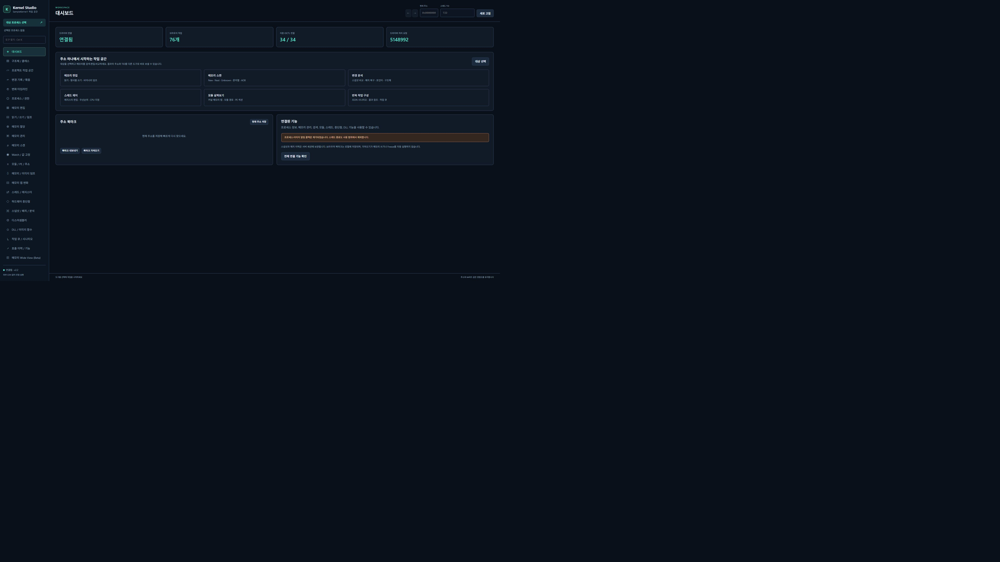

# Kernel Based Process Memory Editor

[한국어](README.md) · [English](README.en.md) · [简体中文](README.zh-CN.md) · [Español](README.es.md)

Proyecto de análisis y edición de memoria de procesos de Windows que combina el controlador de kernel **SampleKernel1** con el espacio web local **Kernel Studio**. Permite buscar memoria, editar bytes y estructuras, volcar imágenes, analizar PE, gestionar hilos y registros, y revisar o restaurar cambios desde el navegador.



> Los cuatro idiomas corresponden a la **documentación del repositorio**. La interfaz original sigue en coreano. El código importado y la documentación coreana original permanecen intactos. Controlador en el código: v2.3; API: v3.0.0. El controlador cargado al capturar las imágenes era v2.2.

## Funciones

- Consultas de procesos y mapas de memoria mediante IOCTL; lectura, escritura, asignación, liberación, protección y copia.
- Búsquedas New/Next/Unknown de números, cadenas, AOB y estructuras; candidatos en SQLite, navegación por página o por todos los candidatos y exportación CSV.
- Edición de bytes estilo ReClass, punteros anidados, Watch/congelación y Wide View (Beta).
- Volcados de hasta 16GiB, conjuntos MEM_IMAGE, progreso, cancelación, continuación y hashes.
- Importaciones/exportaciones PE, símbolos PDB opcionales, ensamblador, grafos de flujo y pseudocódigo C conservador.
- Parches de instrucciones validados, Undo/Redo, estructuras/clases, proyectos guardados, registros de cambios y líneas temporales por muestreo.
- Contextos de hilos, prioridades y máscaras de CPU, puntos de interrupción de hardware, carga de DLL y llamadas con un argumento.

## Inicio rápido

Se necesita Windows x64 y Python de 64 bits. Se verificó Python 3.14.5. Prepare primero un controlador firmado compatible siguiendo la [guía de compilación y carga](docs/es/GUIDE.md#compilación-y-carga-del-controlador). El servidor web no instala ni carga el controlador.

```powershell
git clone https://github.com/lastime1650/Kernel_Based_ProcessMemory_Editor.git
cd Kernel_Based_ProcessMemory_Editor
python -m venv .venv
.\.venv\Scripts\python.exe -m pip install -r kernel_control_panel\requirements.txt
cd kernel_control_panel
..\.venv\Scripts\python.exe -m uvicorn server:app --host 127.0.0.1 --port 8005
```

Abra la [interfaz local](http://127.0.0.1:8005/) y siga **seleccionar destino → escanear memoria → New → Next → guardar direcciones → Hex/Watch/análisis**. Si el puerto 8005 ya tiene un servidor, utilícelo o elija otro puerto. Los archivos originales `python server.py` y `start_panel.bat` usan **8000** por defecto.

## Documentación

| Tema | Enlace |
|---|---|
| Instalación, compilación, flujos, API y diagnóstico | [Guía en español](docs/es/GUIDE.md) |
| Todos los archivos de código y sus funciones | [Mapa del código](docs/SOURCE_MAP.md) |
| Rutas HTTP completas e identificadores IOCTL | [Referencia API / ABI](docs/reference/API_ABI.md) |
| Pruebas verificadas y límites | [Registro de validación](docs/VALIDATION.md) |
| Contribuciones, soporte, seguridad y licencia | [Contribuir](CONTRIBUTING.md) · [Soporte](SUPPORT.md) · [Seguridad](SECURITY.md) · [Estado de licencia](LICENSE_STATUS.md) |
| Cambios | [CHANGELOG](CHANGELOG.md) |

## Validación y distribución

El 2026-10-05–06 la copia superó **314 pruebas de regresión**, compilaciones x64 **Release/Debug**, la **compilación del auxiliar DIA** y **7 diagnósticos de solo lectura** del controlador cargado. Esto no equivale a probar todas las operaciones de modificación con v2.3 recargado. CI ejecuta las pruebas simuladas existentes en Windows.

El espacio web conecta 34 de los 37 identificadores ABI. Dos operaciones de eventos y la terminación de hilos quedan fuera de la interfaz. La búsqueda de PID y las listas devueltas tienen límites; las lecturas y los parches en memoria activa no son atómicos. Consulte la guía.

Se incluyen todos los archivos de código, pruebas, interfaz estática y configuración. Las cachés del IDE, los binarios, DLL/PDB del usuario, bases de datos de escaneo, volcados, registros y reportes generados permanecen en la copia local y se excluyen de Git público. El [mapa del código](docs/SOURCE_MAP.md) contiene hashes y cobertura de archivos.

**Uso:** trabaje con procesos de prueba propios o autorizados. La API carece de autenticación; mantenga la vinculación loopback. No se proporciona un instalador ni un paquete firmado para distribución pública. Todavía no se ha elegido una licencia de código abierto.
