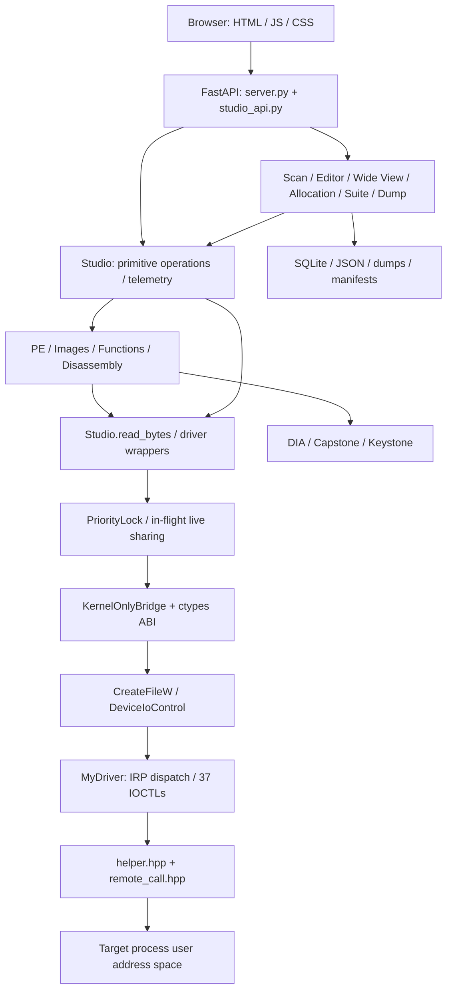
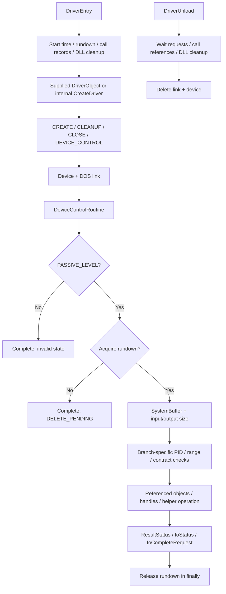
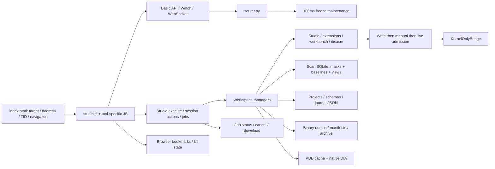
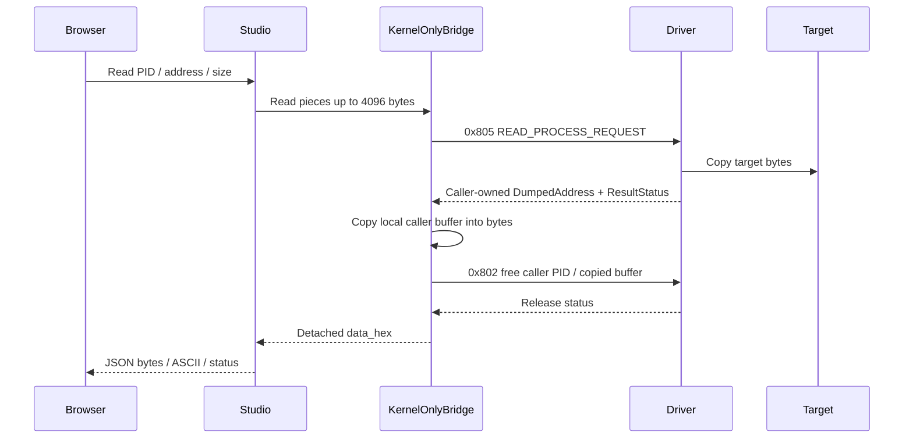
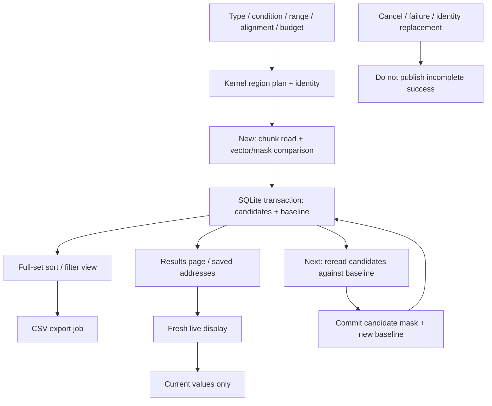
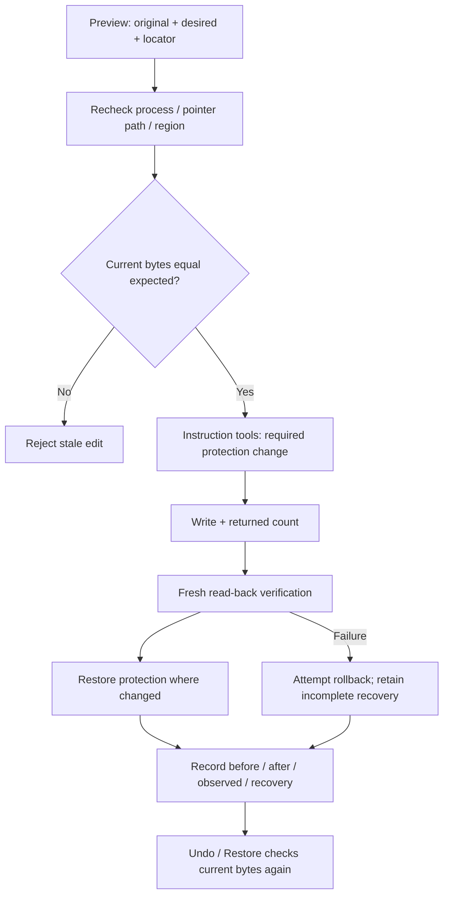
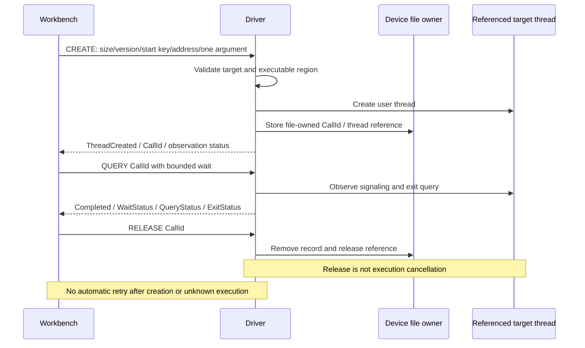

# Kernel Based Process Memory Editor

[한국어](README.md) · [English](README.en.md) · [简体中文](README.zh-CN.md) · [Español](README.es.md)

Windows 커널 프로세스 메모리 분석·편집과 Kernel Studio의 올인원 기술 README입니다.


## 목차

- [문서 범위와 프로젝트 구성](#overview)
- [README 전용 구현 다이어그램](#diagrams)
- [커널 드라이버 구축과 수명 주기](#kernel)
- [커널 메모리·검색·조회 구현](#kernel-memory)
- [웹 컨트롤 패널 구축 설계](#web)
- [메모리 스캔: 전체 동작과 데이터 흐름](#scan)
- [바이트 편집·포인터·Wide View·할당](#edit)
- [덤프·MEM_IMAGE·파일 검증](#dump)
- [PE·PDB·이미지 함수·DLL 로드·호출 추적](#images)
- [디스어셈블리·CFG·의사코드·명령 패치](#disasm)
- [스레드·레지스터·하드웨어 중단점](#thread)
- [구조체·프로젝트·저널·타임라인·복구](#productivity)
- [IOCTL 전송 계약과 버퍼 소유권](#buffers)
- [전체 Studio operation 카탈로그](#operations)
- [기본 UI 도구 76개와 전용 작업 공간](#ui)
- [전체 세션 action 카탈로그](#actions)
- [37개 IOCTL: 코드·패킷·역할·구현 연결](#ioctls)
- [전체 ABI 구조: 바이트 크기·정렬·필드 오프셋](#layouts)
- [네이티브 결과·내부 보조 구조 선언](#native)
- [전체 HTTP·WebSocket 경로](#http)
- [기본 HTTP 요청 모델과 필드](#models)
- [구현 상한과 저장 수명](#limits)
- [설치·빌드·실행·화면별 사용법](#guide)
- [전체 소스 파일과 역할](#files)
- [검증·제약·저장소 운영 안내](#validation)

<a id="overview"></a>

## 문서 범위와 프로젝트 구성

이 README는 실행 안내뿐 아니라 **커널 제어 장치 → IOCTL ABI → Python 브리지 → FastAPI → 브라우저 도구 → 저장·복구**를 연결한 구현 설명서입니다. 기능 카탈로그, 실제 명령 목록, 37개 IOCTL의 역할, 모든 Python ABI 구조의 크기·정렬·필드 오프셋, HTTP 경로와 전체 소스 지도를 본문에 포함합니다. 기능이 어디서 구현되고 어떤 조건에서 실패하는지도 구분합니다.

SampleKernel1은 Windows 프로세스의 사용자 주소 공간을 커널에서 조회·편집하는 드라이버이고, Kernel Studio는 그 기존 ABI를 조합한 로컬 웹 작업 공간입니다. 브라우저 자체가 커널 메모리를 읽는 구조가 아닙니다. 대상 읽기·쓰기는 드라이버를 통하며, SQLite·NumPy·Capstone·Keystone·DIA는 후보 관리·표현·정적 분석을 담당합니다.

드라이버 소스는 **v2.3 / build 20261004**, FastAPI 앱은 **v3.0.0**입니다. 검증 때 실제 로드된 드라이버는 **v2.2**였으므로 소스 빌드 성공과 v2.3 실기 실행 검증을 같은 의미로 해석하지 마세요. 네 언어 지원은 저장소 문서이며 원본 UI는 한국어입니다.

원본 324개 파일은 읽기 전용으로 조사·복사했고 최초 SHA-256 비교에서 모두 일치했습니다. 원본에서 가져온 추적 소스·설정·테스트·UI 79개도 바이트를 보존했습니다. IDE 캐시와 생성 바이너리·덤프·DB·실행 보고서는 로컬 복사본에 보존하되 공개 추적에서 제외했습니다. `samples/`는 원본 테스트의 외부 DLL/PDB 의존성을 재현하기 위해 별도로 추가한 보조 예제입니다.

<a id="diagrams"></a>

## README 전용 구현 다이어그램

### 전체 계층 설계도



### 드라이버 로드·요청·언로드



### 웹 패널 구성과 데이터 저장



### 읽기 응답과 메모리 해제



### SQLite 스캔·Live·Next 흐름



### 편집 검증과 회복 상태



### 함수 호출 토큰 수명 주기



<a id="kernel"></a>

## 커널 드라이버 구축과 수명 주기

### 컴파일 단위와 진입점

`SampleKernel1.vcxproj`가 실제로 컴파일하는 드라이버 C++ 파일은 `main.cpp`입니다. 이 파일이 `helper.hpp`, `remote_call.hpp`, `ioctl_helper.hpp`의 인라인 구현을 포함합니다. `routine.cpp`는 이전 예제이며 이 빌드에 포함되지 않습니다. `driver_client.hpp`와 `test_client.cpp`는 별도 사용자 모드 C++ 클라이언트 경로입니다. `utils.hpp`, `vad.h`, `PEB.h`, `PE.h`는 NT 선언·VAD·PEB/로더·PE 구조를 제공합니다. 프로젝트 설정은 KMDF를 선언하지만 실제 진입·제어 장치·IRP는 직접 WDM 방식으로 구현되어 있습니다.

`DriverEntry`는 시작 시간 기록 → 요청 rundown 초기화 → 함수 호출 레코드 초기화 → DLL 지연 정리 상태 초기화 순서로 진행합니다. 정상 로드는 전달받은 `DriverObject`를 사용합니다. 포인터가 없는 내부 호출을 위한 `helper::driver::CreateDriver` 경로도 소스에 있지만, 일반 설치 과정이 아닙니다.

### 장치와 IRP 등록

제어 장치는 `\Device\MyDriver`, DOS 링크는 `\DosDevices\MyDriver`, 사용자 모드의 열린 경로는 `\\.\MyDriver`입니다. `IRP_MJ_CREATE`, `IRP_MJ_CLEANUP`, `IRP_MJ_CLOSE`는 `remote_call::FileRoutine`, `IRP_MJ_DEVICE_CONTROL`은 `ioctl_helper::DeviceControlRoutine`으로 연결됩니다. 파일 객체는 함수 호출 토큰의 소유자이므로 다른 장치 핸들로 토큰을 조회·해제할 수 있는 공유 전역 ID로 취급하지 않습니다. 장치 등록 실패 시 생성 상태를 정리합니다.

### 요청 진입·검증·완료

고수준 helper는 `PASSIVE_LEVEL`을 요구합니다. 디스패치 래퍼는 critical region에 진입하고 rundown을 획득합니다. 언로드가 시작되어 획득이 실패하면 `STATUS_DELETE_PENDING`으로 완료합니다. 실제 디스패치 전에 종료된 DLL 작업을 정리하고, `__finally`에서 rundown과 critical region을 해제합니다.

`GetPacket<T>`는 IRP/스택/SystemBuffer 존재와 **입력 길이 및 출력 길이 모두 `sizeof(T)` 이상**임을 검사합니다. 요청별 분기는 PID, 주소, 크기, 범위의 overflow, 결과 버퍼와 예약 필드를 검증합니다. 모든 패킷이 동일한 입력 검사를 갖는다고 가정하지 말고 각 분기의 계약을 확인하세요. 실제 요청자 프로세스는 IRP에서 얻으며 사용자가 적은 `RequestProcessId`를 그대로 신뢰하지 않습니다. 대상 프로세스는 PID lookup 후 참조·커널 핸들로 접근하고 작업 후 해제합니다.

처리 결과는 `ResultStatus`, 반환 필드, `IoStatus.Status`, `IoStatus.Information`에 반영하고 `IoCompleteRequest`로 완료합니다. Win32 `DeviceIoControl`의 통신 결과, 반환 바이트 수, 내부 NTSTATUS는 각각 확인해야 합니다. 웹의 HTTP 200도 커널 작업 성공을 보장하지 않습니다.

### 종료

`DriverUnloadRoutine`은 진행 중 요청의 rundown 종료를 기다리고 → 함수 호출 추적의 스레드 참조를 해제하고 → DLL 지연 정리를 기다리고 → DOS 링크·제어 장치를 삭제합니다. 함수 호출 레코드 해제는 이미 생성된 대상 스레드를 취소하는 뜻이 아닙니다. 장치 파일 cleanup/close도 해당 파일이 소유한 레코드를 정리합니다. 이런 수명 주기가 언로드 도중 실행 중 helper와 반환 리소스가 사라지는 위험을 줄이지만, 모든 OS 호환성과 무결성을 보증하는 것은 아닙니다.

<a id="kernel-memory"></a>

## 커널 메모리·검색·조회 구현

**할당·해제·보호:** 대상 커널 핸들을 열어 `ZwAllocateVirtualMemory`, `ZwFreeVirtualMemory`, `ZwProtectVirtualMemory`를 호출합니다. 반환 BaseAddress, 실제 영역 크기, 이전 보호값을 확인합니다. MEM_RELEASE는 원래 allocation base와 올바른 크기 계약을 필요로 하므로 중간 주소를 임의로 해제하는 기능과 구분합니다.

**복사·읽기·쓰기:** `MmCopyVirtualMemory` 기반의 주소 공간 간 복사가 중심입니다. 읽기는 요청자 프로세스에 반환용 사용자 버퍼를 할당해 스냅샷을 만들고 그 주소를 응답합니다. 쓰기는 호출자가 준비한 데이터 버퍼를 대상으로 복사하고 실제 복사 바이트 수를 반환합니다. 커널의 복사 성공만으로 상위 편집의 기대값 검사·쓰기 후 검증·Undo가 자동 제공되는 것은 아닙니다. 그 기능은 웹 작업 계층에서 조합합니다.

**값 검색:** 입력 비교 패턴을 먼저 커널 버퍼에 고정하고, 메모리 영역을 조회하면서 committed·읽기 가능 영역을 청크 단위로 검색합니다. Guard/NoAccess와 주소 overflow를 검사합니다. 결과는 매치 주소를 담은 요청자 소유 연결 목록입니다. 원시 검색과 새 SQLite 후보 스캔은 서로 다른 구현입니다.

**패턴 검색:** 고정 바이트와 마스크를 이용해 지정 범위에서 매치 수 및 첫 매치 주소를 반환합니다. 청크 경계에서 패턴을 놓치지 않도록 overlap을 읽습니다. 이 IOCTL은 모든 매치 주소의 후보 DB를 반환하지 않습니다. 새 스캔의 AOB는 별도 마스크 비교이며 nibble wildcard도 지원합니다.

**문자열 검색:** 영역을 읽어 ANSI/UTF-16 후보와 길이·원래 주소·덤프 주소를 목록으로 반환합니다. 문자열 목록의 데이터는 추가 버퍼를 소유하므로 일반 주소 결과 목록과 해제 경로가 다릅니다. UI 텍스트 미리보기는 제한되어 있으며 긴 문자열 전체나 무한 결과를 보장하지 않습니다.

**메모리 맵·이미지:** VAD 관련 정의와 조회 루틴을 이용해 BaseAddress, AllocationBase, RegionSize, State/Type/Protect, committed/readable/writable/executable/guarded, MEM_PRIVATE/MAPPED/IMAGE, PE 헤더 및 이미지 경로·크기 등을 결과에 담습니다. 상위 `memory_images.py`는 MEM_IMAGE 정보를 묶고 필요한 경우 메모리 PE 헤더를 검증해 이미지 후보를 만듭니다. 단순 영역 이름만으로 요청한 DLL이 실제 로드되었다고 단정하지 않습니다.

**프로세스·토큰·핸들·스레드:** PID lookup과 `ZwQueryInformationProcess`, `ZwQuerySystemInformation`, 토큰 조회, 스레드 조회를 조합합니다. 경로·명령줄·PEB·생성시간·메모리·스레드 수·보호 여부·핸들 수·무결성 수준·권한 등은 구조와 성공한 세부 조회에 따라 반환됩니다. 구조에 필드가 존재한다는 이유로 모든 OS에서 그 값이 항상 수집된다고 주장하지 않습니다. 전체 PID 열거 IOCTL이 없으므로 웹 프로세스 목록은 범위 제한 PID probe입니다.

### 메모리 맵 내부 구성과 보조 구현

`BuildMemorySnapshot`은 `ZwQueryVirtualMemory(MemoryBasicInformation)`로 전체 사용자 영역을 순회합니다. 이 경로를 `vad.h`에 존재하는 모든 내부 VAD 구조를 직접 순회하는 구현이라고 오해하면 안 됩니다. `BuildFallbackImageSpans`는 MEM_IMAGE 영역을 묶고, `BuildModuleSnapshot`은 PEB→Ldr 모듈 목록을 최대 4096개 범위에서 가져옵니다. `QueryImagePeHeader`, 대상 UNICODE_STRING 복사, basename 추출을 거쳐 `EnrichMemorySnapshotWithModules`가 영역에 이미지 정보를 보강합니다. 로더 조회 실패는 기본 메모리 맵 전체를 무효화하지 않으며 fallback 정보를 사용할 수 있습니다. 중간 메모리·모듈 snapshot은 결과 목록 생성 후 해제됩니다.

일반 연결 목록의 사용자 모드 구현은 요청자에 node/data를 할당·연결·검증·해제하며, 커널 모드 구현은 tagged pool로 중간 목록을 관리합니다. kernel allocation은 paged/nonpaged pool을 구분하고 크기·실패를 처리합니다. `PIDtoHANDLE`, `CloseHandle`, 프로세스 정보 해제는 핸들·객체·문자열 소유 수명을 보조합니다. 동적 드라이버 생성 helper와 기본 Create/Close routine도 존재하지만 정상 main 경로의 파일 IRP는 remote_call routine으로 대체됩니다.

DLL 지연 정리는 실행 스레드가 종료하기 전까지 대상 경로 버퍼·핸들이 필요한 경우 worker task로 유지합니다. HWBP 내부는 debug 슬롯 마스크 계산·기존 상태 캡처·MDL lock/unlock·목록 publication·rollback 단계를 분리합니다. diagnostics는 시작 시간과 IOCTL count를 interlocked 방식으로 관측하며 커널 이벤트 큐가 활성화됐다는 뜻이 아닙니다.

<a id="web"></a>

## 웹 컨트롤 패널 구축 설계

`server.py`는 FastAPI 앱, Pydantic 요청 모델, 기본 메모리·프로세스·Watch·스레드 API, WebSocket 연결 관리자와 시작·종료 작업을 구성합니다. `studio_api.install()`은 Studio와 각 작업 공간을 만들고 `/api/studio/*` 경로를 연결합니다. 브라우저는 `static/index.html`의 공통 shell 안에서 `studio.js`와 기능별 JS/CSS를 사용합니다. 외부 CDN 없이 정적 자산을 로컬 제공하며, 전체 도구 검색(Ctrl K), 전역 주소/TID, 대상 PID 선택, 새로 고침, toast와 상태 표시를 공유합니다.

**전송 계층:** `driver_bridge.py`의 ctypes 구조와 `CreateFileW`/`DeviceIoControl`이 제어 장치에 연결됩니다. 활성 서버는 `KernelOnlyBridge`를 사용합니다. 대상에 `ReadProcessMemory`를 우회 경로로 호출하는 서버가 아닙니다. 다만 드라이버가 **서버 자신의 주소 공간에 이미 복사한 반환 버퍼**를 읽을 때는 로컬 ctypes 접근을 사용합니다. 복사본 해제도 기존 free IOCTL을 통해 수행합니다.

**작업 계층:** `Studio.operate()`가 기본 동작을 수행하고, 확장 PE/주소 작업은 `studio_extensions`, 이미지·함수는 `image_workbench`, 명령 편집은 `disassembly_workspace`에 위임합니다. 별도 endpoint는 `scan_workspace`, `memory_editor`, `memory_wide_view`, `memory_allocation`, `productivity_suite`, `memory_dump`의 세션과 job을 관리합니다. 상위 도구가 여러 IOCTL을 조합한다고 새 커널 ABI가 추가되는 것은 아닙니다.

**동시성:** `request_scheduler.py`는 재진입 우선순위 잠금으로 수동 쓰기 → 수동 읽기 → live 읽기 순서를 적용하고 16회 admission 뒤 공정성을 보완합니다. 동일 `(pid,address,size,epoch)`의 진행 중 live 읽기만 공유합니다. 장기 byte cache가 아니며 수동 읽기·검증은 새 스냅샷을 얻습니다. 쓰기·복사·해제·보호·할당 앞뒤로 epoch를 변경하여 변경 전후 읽기를 혼합하지 않게 합니다.

**장시간 작업:** 일반 Studio executor는 2 worker를 사용하며 스캔·덤프는 별도 작업 관리자가 진행률, 취소 신호, 오류와 완료 상태를 보관합니다. 프런트엔드는 job ID를 poll합니다. 취소 요청을 전송했다는 것과 실제 작업이 중지되어 결과가 확정됐다는 것은 다릅니다. 다중 Uvicorn worker는 세션 상태를 공유하지 않으므로 한 worker로 실행합니다.

**Watch 및 관측:** 서버 background worker는 약 100ms 주기로 frozen 값을 유지합니다. Watch는 최대 256개이며 프로세스 시작 identity를 검증합니다. `/ws/events`는 연결 상태 전달 경로이고, `/api/studio/history`는 IOCTL 코드·성공·NTSTATUS·소요시간의 bounded 이력, `/api/studio/events`는 Studio 사건을 조회합니다. 이들은 비활성인 커널 프로세스/이미지 생성 알림 기능과 다릅니다.

**상태 보존:** 대상 주소/64비트 값은 JavaScript 부동소수 반올림을 막기 위해 문자열로 전달합니다. 브라우저 bookmark와 저장소 JSON/SQLite/바이너리, 서버 메모리 세션은 다른 저장 수명입니다. 프로젝트를 저장했다고 모든 실시간 세션·커널 참조가 자동 재개되지 않습니다. 종료 시 job/스캔/덤프/함수 참조와 bridge를 정리하며, 로컬 API에는 별도 인증 계층이 없습니다.

### 프로세스 선택·북마크·공통 결과 전달

프로세스 목록은 4씩 증가하는 canonical PID를 probe하고 기본 65,536, 최대 1,048,576 범위 및 추가 PID를 확인합니다. 메타데이터 cache는 약 3초이며 CPU 사용률을 실제 측정한 값처럼 채우지 않습니다. 통신 실패는 빈 정상 목록으로 숨기지 않습니다. 직접 PID 입력·이름/PID 필터와 범위 확장이 가능합니다.

대시보드는 상태·작업·IOCTL 통계와 최대 100개 브라우저 북마크를 표시합니다. bookmark export/import는 version 1 JSON이고 실제 메모리 쓰기·Freeze를 자동 실행하지 않습니다. 결과의 주소/TID를 전역 필드와 다른 도구로 보내며, PID 변경 시 이전 기능별 세션을 reset합니다. 바이너리 가져오기는 일반 write payload를 준비하는 동작입니다. Data Inspector는 16바이트를 정수·실수·문자열·pointer로 동시에 해석하며 구조 자동 해석은 8바이트 간격 후보입니다. 이러한 해석은 확정된 구조체/PDB 타입 정보와 구분합니다.

<a id="scan"></a>

## 메모리 스캔: 전체 동작과 데이터 흐름

`scan_workspace.py`의 새 스캔은 후보 주소를 Python 배열 50,000개에 가두지 않고 **SQLite에 후보 마스크와 비교 스냅샷**을 보관합니다. 큰 Unknown 검색에서도 후보를 디스크에 유지합니다. NumPy는 정렬·stride가 있는 숫자 벡터 비교를 수행하고, 문자열/AOB/구조체는 각각 마스크·필드 비교를 수행합니다. 검색은 커널 메모리 맵을 읽고 64KiB 청크를 처리하며 실제 target read는 4KiB IOCTL 조각으로 나뉩니다.

지원 데이터: `int8/uint8/int16/uint16/int32/uint32/int64/uint64/float32/float64`, UTF-8, UTF-16LE, AOB, 숫자 필드 구조체. 숫자는 Exact/NotEqual/Greater/Less/GreaterEqual/LessEqual/Between/Unknown/Changed/Unchanged/Increased/Decreased/Rescan을 구분합니다. 문자열/AOB는 Exact/NotEqual/Changed/Unchanged/Rescan이며 숫자 대소 비교는 적용하지 않습니다. AOB는 `??`, `A?`, `?F` 같은 byte/nibble wildcard를 지원하고 모두 wildcard인 패턴은 거부합니다. 구조체는 최대 32개 숫자 필드·1024바이트 배치로 offset/type/개별 조건/ignore를 정의합니다.

**New:** 형식·조건·값·주소 범위(끝 제외)·readable/writable/executable·alignment·예산을 검증 → 영역 선택 → 읽기·비교 → 새 DB 결과 확정. 기본 예산은 256MiB, 허용 범위는 4KiB~4GiB입니다. alignment는 자동/1/2/4/8/16입니다. **Next:** 기존 후보만 다시 읽고 이전 비교 스냅샷과 비교 → 새 후보와 baseline을 확정합니다. Next에서 형식·길이·구조체 배치를 바꿀 수 없습니다. **Rescan:** 후보를 재관측합니다. **Reset:** 세션 결과를 초기화합니다. 취소·읽기 실패·대상 교체를 정상 완료와 구분하며, transaction으로 불완전 결과가 확정되지 않도록 관리합니다.

**Live와 baseline:** 표의 live 재조회는 화면 값을 업데이트하지만 Next 기준값을 바꾸지 않습니다. 따라서 live 표시를 오래 켜두어도 Changed의 의미가 마지막 Next/New 기준에서 바뀌지 않습니다. 기본 화면 갱신은 약 800ms이며 페이지 크기는 50/100/200/500입니다.

**전체 후보 보기:** `view` 작업은 페이지 안에서만 정렬하지 않고 전체 후보에 대한 sort/filter view를 구성합니다. `export`도 전체/선택한 view를 CSV로 내보내며 job ID로 진행률·취소·다운로드를 관리합니다. `save/read_saved/edit`는 최대 256개 보관 주소의 조회·같은 길이 편집·freeze를 관리합니다. 편집은 대상 identity와 현재값을 확인하며 실패·범위 초과를 별도로 반환합니다.

**이전 검색과 구분:** `/api/scan/*`는 `KernelMemoryScannerSession`으로 교체되어 커널 읽기를 사용하지만 이전 50,000 후보 상한을 갖습니다. `memory_scanner.py`의 Win32 구현은 형식 정의/해석 및 이전 코드로 남아 있고 활성 서버 대상 접근 경로는 아닙니다. `kernel_value`, `strings`, `pattern`, `pointer_search` 원시 도구도 새 SQLite 세션과 동일한 결과 저장 방식이 아닙니다.


<a id="edit"></a>

## 바이트 편집·포인터·Wide View·할당

### 메모리 편집기

`memory_editor.Session`은 16~65,536바이트 창, 4/8바이트 행, 현재/이전 데이터·valid mask·변경 표시·선택 영역·포인터 트리를 관리합니다. 숫자/부동소수/포인터/바이트 범위를 해석하고 슬라이드(1회 ±65,536 이하), 이름 변경, 메타데이터 갱신, 필요한 창만 live refresh, 문자열 hint와 포인터 펼치기/접기를 지원합니다. 창 노드는 최대 64개, 전체 node 버퍼는 1MiB, 포인터 깊이는 64입니다.

포인터 확장은 클릭 당시 `expected`와 다시 읽은 포인터를 비교하고 조상 창으로 돌아가는 순환과 접근 불가능 영역을 거부합니다. 편집 전에는 부모 포인터 경로, PID 시작 identity, 현재 바이트와 `expected_hex`를 검사합니다. 쓰기 뒤 실제 바이트 수와 재읽기 결과를 검증합니다. 부분 쓰기·검증 실패도 원본과 실제 관측 바이트를 복원 이력에 보존하며, Restore는 편집 이후 값이 그대로인 경우에만 원본을 기록하고 재검증합니다. 이력은 최대 256개입니다.

### Wide View (Beta)

읽기 전용 주변 메모리 16~4096바이트와 완전한 영역 맵을 표시합니다. readable/committed/Guard를 검사하고 페이지·영역 경계에서 읽기를 나누며 읽을 수 없는 바이트는 valid mask/hole로 표현합니다. 결과의 0만 보고 실제 0바이트와 실패 영역을 혼동하지 마세요. 정렬된 영역과 이진 탐색을 사용하고 맵을 갱신합니다. 선택한 schema는 확정된 필드 위치와 겹치는 범위를 표시하며 중첩 깊이 12, 펼친 필드 2048 제한을 갖습니다. 서버 action은 `read`, `map`뿐입니다.

### 데이터 할당 창

`memory_allocation.py`는 ANSI 문자열, Wide(UTF-16LE) 문자열 또는 업로드한 파일 바이트를 payload로 만들고 크기를 자동 계산합니다. 문자열에는 종료 NULL을 포함합니다. 1MiB 이하 payload를 PAGE_READWRITE로 할당 → 기록 → 초기 데이터 쓰기 → 재읽기 검증합니다. 결과 BaseAddress, payload 크기, 상태, 생성/해제 시각과 reservation ID를 표시합니다.

초기 쓰기 실패 시 할당 해제를 시도하고, 해제도 실패하면 `needs_free` 상태와 소유 기록을 유지합니다. free는 이 화면이 소유한 활성 BaseAddress와 reservation ID가 일치할 때만 실행합니다. 주소가 나중에 재사용되어도 과거 기록과 새 할당을 혼동하지 않습니다. 전체 관리 할당 128개·창 기록 256개이며, 화면 이력 삭제/창 닫기는 실제 대상 메모리 해제를 뜻하지 않습니다. 일반 alloc/free/protect/copy 도구와 이 payload 관리 화면은 구분됩니다.


<a id="dump"></a>

## 덤프·MEM_IMAGE·파일 검증

`memory_dump.DumpManager`는 선택 범위, 메모리 영역 묶음, MEM_IMAGE 이미지의 덤프를 job으로 실행합니다. 최대 총량은 16GiB, 청크는 4KiB~1MiB의 페이지 배수이며 실제 커널 읽기는 4KiB 조각입니다. 활성 작업은 최대 4개, 기록은 128개입니다. 대상 identity와 영역 계획을 기록하고 queued/running/packaging/completed/cancelled/failed 등 상태 및 bytes/progress/error를 반환합니다.

읽기 실패 정책에 따라 멈추거나 hole을 기록하고 0으로 채웁니다. 성공한 메모리 0과 failure-fill을 manifest에서 구분합니다. SHA-256, 범위·파일명·크기·실패 구간·이미지 정보가 기록되고 묶음은 압축과 다운로드로 제공됩니다. 파일 삭제 시 활성 작업·다운로드 참조를 검사하며, 다운로드 완료/중단/잘못된 Range에서도 참조를 해제합니다.

MEM_IMAGE 덤프는 메모리의 RVA 배치입니다. 원래 디스크 PE의 section raw offset/import/relocation 상태를 복원한 실행 가능한 DLL로 보장하지 않습니다. 취소된 부분 작업의 resume는 원래 세션·프로세스 identity와 부분 파일/계획이 유효할 때만 진행합니다. 서버 재시작 후 완료된 덤프의 목록·다운로드는 복구할 수 있지만 중단된 작업이 자동 재개되는 것은 아닙니다.

<a id="images"></a>

## PE·PDB·이미지 함수·DLL 로드·호출 추적

**이미지 목록과 PE:** MEM_IMAGE와 헤더 검증을 통해 이미지 base/size/path/main-image/source를 표시합니다. PE 헤더, section, import DLL/함수/IAT, export 이름/ordinal/RVA/forwarder를 대상 메모리에서 해석합니다. `resolve`는 주소·`module+RVA`·`module!symbol` 및 전달 export(최대 8단계)를 해석합니다. `address_info`는 영역 속성, 모듈 RVA와 section 소속을 연결합니다. read-only MEM_PRIVATE의 유효 PE도 분석 후보가 될 수 있습니다.

**함수 목록:** `image_workbench.Workbench`는 export와 x64 exception/unwind `.pdata`, 선택 PDB 함수를 RVA로 합칩니다. 미명명 함수는 `sub_...`로 표현하고 데이터 export는 함수 호출 목록에서 분리합니다. 함수 목록은 최대 20,000개이며 truncation을 표시합니다. 함수 detail은 알려진 extent와 이미지 범위 안에서 실제 대상 코드를 읽습니다. 추정 인자 hint는 실제 PDB signature와 구분합니다.

**PDB:** DLL의 CodeView GUID/Age와 PDB가 맞아야 합니다. 네이티브 `pdb_symbols.cpp`는 DIA SDK로 private/public 함수, 인자·반환 형식, 구조체 정보를 JSON으로 전달합니다. Symbol 관리자는 로컬 PDB 선택/업로드·캐시·목록·삭제·재시작 복구를 지원합니다. 하나의 손상 캐시가 다른 정상 레코드를 숨기지 않도록 처리하고 저장 실패를 되돌립니다. PDB 최대 256MiB, DLL 업로드 최대 64MiB입니다. 분석 ID는 현재 대상/identity/이미지에 묶입니다.

**DLL 로드:** 기존 커널 helper는 대상 PEB/로더와 export를 확인해 로더 루틴을 찾고, 대상에 경로를 준비해 사용자 스레드의 로더 실행을 요청합니다. 즉 단순 HTTP 파일 업로드가 곧 대상 로드가 아닙니다. 상위 `dll_load_verified`/`dll_load_check`는 경로·target·WOW64 여부와 실제 이미지 관측을 확인합니다. 같은 basename의 다른 경로 DLL은 로드 성공으로 인정하지 않습니다. 스레드가 시작됐으나 관측/대기가 실패한 요청을 자동 반복하지 않습니다. 경로 버퍼는 스레드 종료 후 지연 정리할 수 있습니다.

**함수 호출:** 범용 C++ 함수 호출기가 아닙니다. x64 대상의 검증된 함수 시작 주소에 **원시 64비트 인자 1개**를 넘기고 **32비트 스레드 exit 값**을 관측합니다. float/SIMD 반환, 임의 개수 인자, 클래스 this/일반 C++ ABI 호출을 보장하지 않습니다. 알려진 PDB 서명이 호환되지 않으면 호출을 거부합니다. kernel은 System/WOW64/종료 대상, start-key 불일치, 실행 불가 영역, 예약 필드/버전/크기를 검사합니다.

`CREATE`는 호출자 장치 파일 소유의 CallId와 ThreadId/ThreadCreated를 기록하고, `QUERY`는 같은 레코드의 참조된 스레드를 관측하며, `RELEASE`는 추적 참조를 해제합니다. 최대 대기 1000ms, 전역 레코드 128개, 파일당 32개, 웹 활성 추적 30개/이력 128개입니다. Completed는 **스레드 signaling**으로 판단합니다. ExitStatus=259를 종료 미완료의 유일한 기준으로 쓰지 않습니다. ThreadCreated/실행 불확실/timeout 뒤에는 재시도로 중복 실행하지 않습니다. Release는 함수 실행 취소가 아닙니다.

<a id="disasm"></a>

## 디스어셈블리·CFG·의사코드·명령 패치

Capstone은 x86/x64 메모리 바이트를 주소·길이·mnemonic·operand·raw bytes로 디코딩합니다. `function_views.py`는 branch/call/return과 종료 명령을 구분해 basic block, edge, 미해결 branch, 주소 범위를 만들고 정적 흐름 및 보수적 C 형태 의사코드를 표현합니다. 이는 실행 추적·완전한 decompiler·확정된 원본 C 복원 기능이 아닙니다. 최대 16,384바이트/2048명령/128블록입니다.

`disassembly_workspace.py`는 분석 세션, 명령 참조 follow, 편집 validate, apply, Undo/Redo, 복구 필요 상태, history/release를 관리합니다. Keystone은 행 assembly를 현재 주소·bitness에서 바이트로 조립합니다. 슬롯보다 긴 편집, 겹친 편집, 잘못된 명령 경계·원본 불일치·identity 교체를 거부하고 짧은 대체는 슬롯 정책에 맞춰 처리합니다.

Apply는 변경 계획 검증 → 실제 원본 재읽기 → 필요한 페이지 보호 전환 → 쓰기 → 재읽기 → 보호 복구를 수행하며 실패 시 기록한 bytes/protection의 회복을 시도합니다. 회복 실패는 성공으로 숨기지 않고 `disasm_recover` 경로를 남깁니다. Undo/Redo도 현재 바이트를 확인하므로 다른 주체가 수정했으면 중단합니다. 세션 16개, 편집 묶음 128개, 이력 128개 제한입니다. 실행 중 코드 패치는 원자적 정지가 아니며 대상의 동시 실행을 자동 제어하지 않습니다.


<a id="thread"></a>

## 스레드·레지스터·하드웨어 중단점

스레드 목록·상세 정보는 TID/PID, 시작 주소, 생성/사용 시간, 우선순위, affinity, suspend 상태 등을 제공하며 반환 상한과 실제 개수를 구분합니다. suspend/resume은 이전 suspend count를 응답합니다. 우선순위·CPU affinity는 별도 요청이고 `thread_batch`는 최대 64개를 순차 처리합니다. hide 요청도 원본 ABI에 존재합니다. `0x820` thread termination은 커널·브리지에 남아 있지만 웹 도구에서 제외되어 있습니다.

레지스터 수정은 전체 컨텍스트를 무작정 0으로 덮지 않습니다. PID 시작 identity와 TID 생성시간·소속·생존을 검사 → suspend → 현재 레지스터 읽기 → 요청된 필드만 merge → 쓰기 → 재읽기 검증 → 같은 원래 스레드일 때 resume 순서입니다. EFLAGS는 32비트, 일반 주소/레지스터는 64비트 범위를 검사합니다. TID가 재사용됐을 때 다른 스레드를 resume하지 않도록 다시 검사합니다. 원시 get/set context ABI와 이 웹상의 안전 절차는 구분됩니다.

HWBP helper는 DR0~DR3/DR6/DR7, 슬롯 enable/type/length를 관리합니다. 실행/쓰기/접근 조건과 1/2/4/8바이트 길이·주소 정렬을 검증하고, 대상 스레드 snapshot과 원래 debug context를 준비합니다. 선택 슬롯만 변경하며 기존의 관련 없는 슬롯을 유지하고, 다중 스레드 적용·복구·부분 실패 상태를 관리합니다. 요청자 반환 결과는 MDL 잠금과 소유 정보 검사 등의 전용 경로를 사용합니다. Set/Query/Remove와 결과 메모리 Free는 서로 다른 동작입니다. HWBP 설정이 완전한 디버거 이벤트 루프나 hit trace를 제공한다는 뜻은 아닙니다.

<a id="productivity"></a>

## 구조체·프로젝트·저널·타임라인·복구

**구조체/클래스:** `productivity_suite.definitions()`는 이름·size·field offset·type·count·stride·중첩 ref·범위·순환을 검증합니다. 숫자, pointer, UTF-8/UTF-16, bytes, struct 및 배열을 표현하고 target bitness에 맞는 pointer width를 적용합니다. `view`는 필드 값을 읽고 `pdb_types`는 DIA 구조 정의를 가져오되 지원 불가/중복/누락 ref를 보고합니다. schema 저장은 디스크 JSON입니다. 원시 `structure/structure_write`와 schema view 편집 계획은 별개입니다.

**Preview/Apply:** 필드 변경을 계획할 때 현재값, 새 바이트, module+RVA 또는 주소 locator, PID identity, pointer 경로를 기록합니다. Apply에서 locator를 다시 해석하고 원본을 다시 검증한 후 쓰고 재읽습니다. preview 생성 후 대상 값이 바뀌었으면 실패합니다. 변경은 `change_journal.py`에 원본/새 값·복원 상태와 함께 보존됩니다. 저널은 조회, 단일 Restore, 역순 batch Restore, archive를 지원하며 batch는 **비원자적**입니다. 실패할 때 이미 완료된 항목과 실패 ID를 반환합니다.

**타임라인:** schema/주소의 반복 sample을 수집하고 두 sample의 필드·바이트 변화를 비교합니다. 최대 512개 sample의 bounded 기록을 프로젝트와 함께 보존할 수 있습니다. 동시에 계속 변하는 대상의 각 읽기는 별도 시점이며 하나의 원자적 전역 snapshot이 아닙니다. timeline 생성/조회/sample/compare/close의 동작을 구분합니다.

**프로젝트:** 이름·UI state·정의·locator·symbol 참조·보관 주소·타임라인 등을 version 2 JSON으로 저장하고 목록/load/export/import/archive/recover를 제공합니다. module locator로 ASLR 변화 후 주소를 다시 해석하며 찾을 수 없는 항목은 unresolved로 남깁니다. import는 형식과 정의를 검증하고 새로운 ID를 부여하며 최대 4MiB입니다. 저장 상태가 다른 PID의 실제 target identity를 대신하지 않습니다. 스캔 후보 DB 전체가 프로젝트 JSON에 자동 포함되는 것도 아닙니다.

**기본 분석 도구:** byte snapshot 생성/list/compare/restore/delete, patch 생성/list/undo/delete, map snapshot/list/compare/delete, 두 메모리 범위 diff, 기대 원본을 적용한 patch preview, pointer chain·pointer 검색, signature wildcard 생성, 문자열 contains/prefix/exact·대소문자 필터, 반복 fill과 batch가 있습니다. snapshot 16개, map 8개, 일반 patch 64개이며 결과 삭제와 실제 메모리 복원은 다릅니다. 전체 맵을 요구하는 작업은 맵이 truncation되면 거부하고, 일반 문자열 필터는 반환 상한 내에서만 적용됩니다.

### 저널이 실제 쓰기를 가로싸는 방법

`Journal.install()`은 bridge의 write/copy/free wrapper를 감쌉니다. 쓰기 전에 `prepared` 기록을 임시 파일에 flush/fsync한 뒤 원자적 rename으로 저장하고, 원본 요청 뒤 관측값에 따라 verified/failed/uncertain을 기록합니다. 복사는 목적지 원본과 요청 원본 값을 남깁니다. 전체 기록은 2048개와 hex 데이터 회계 128MiB 제한입니다. 관리 할당을 free하면 그 범위의 기록을 released로 표시해 재사용된 주소에 Restore하지 않습니다. 원본과 같은 값을 쓰는 요청은 별도 변경 기록을 만들지 않을 수 있습니다.

따라서 저널은 데이터 쓰기의 복원 근거이지 프로세스 종료·할당 해제·스레드 실행·외부 변화까지 되돌리는 만능 transaction이 아닙니다. Restore도 새로운 검증 쓰기이며 original identity와 현재 observed 값이 맞아야 합니다. archive는 복원 완료 또는 released 기록에 한해 정리합니다.

<a id="buffers"></a>

## IOCTL 전송 계약과 버퍼 소유권

모든 코드의 기본 계산은 `CTL_CODE(FILE_DEVICE_UNKNOWN, function, METHOD_BUFFERED, FILE_READ_ACCESS | FILE_WRITE_ACCESS)`입니다. DeviceType=0x22, Method=0, Access=3이고 `code=(0x22<<16)|(3<<14)|(function<<2)`입니다. 0x800은 함수 ID이고 전체 전송 코드는 0x22E000입니다. 고정 패킷 자체는 `SystemBuffer`로 복사하지만, 일부 기존 패킷의 정수형 주소 필드는 추가 caller 버퍼나 결과 목록을 가리킵니다. METHOD_BUFFERED라는 이유로 그 포인터 대상까지 자동 검증·복사되는 것은 아닙니다.

브리지는 같은 ctypes 패킷을 입력·출력 버퍼로 넘깁니다. `ULONG/LONG/NTSTATUS`는 Windows 32비트, `ULONGLONG`은 64비트, `BOOLEAN`은 1바이트, `WCHAR`는 2바이트입니다. 패킷 크기에는 정렬 padding이 포함됩니다. 아래 표는 **Windows x64에서 실제 ctypes sizeof/alignment/offset으로 추출한 전체 wire layout**이며 다른 플랫폼의 Python ctypes와 무조건 같다고 가정하지 않습니다.

읽기 반환은 caller 자신의 할당에 있으므로 bridge가 로컬 bytes로 복사한 후 `KernelOnlyBridge`가 caller PID에 free IOCTL을 보냅니다. 값/영역 결과는 Node(Signature/Previous/Next/Data/DataSize)를 순회하고 signature `0x4C4C535448454C50`, 역방향 연결, 순환·개수·DataSize를 검사합니다. 상위 파서는 화면 상한 뒤에도 정리를 위해 목록을 처리하고 finally에서 맞는 free 명령을 실행합니다. 문자열은 DumpedAddress의 추가 버퍼, HWBP는 원래 상태·회복 소유 정보가 있어 각각 전용 해제를 사용합니다.

HWBP Set의 복원 정보는 Remove까지 유지해야 합니다. 조회 결과를 복사한 뒤 Free하는 것과 실제 breakpoint Remove를 혼동하지 마세요. 원시 포인터를 JSON 사용자에게 장기 리소스 ID처럼 맡기는 설계가 아니라 Studio가 필요 리소스를 소유·관리하는 구조입니다.

함수 호출 0x822~0x824는 별도 version 1 프로토콜이며 `#pragma pack(8)`과 static_assert 크기(88/96/24)를 갖습니다. StructSize/Version/Reserved/Flags/ProcessStartKey/CallId 계약과 ThreadCreated/Completed/WaitStatus/ExitStatus/QueryStatus를 구분해야 합니다. 이 세 패킷의 Parameter는 대상의 원시 machine word이며 driver가 임의 사용자 인자 버퍼로 해석하지 않습니다.

HWBP Type은 Execute=0/Write=1/ReadWrite=3이고 wire Length는 1/2/4/8바이트입니다. 기존 Python wrapper의 bp_len 인자는 DR7 encoding(0/1/3/2)에서 wire 길이로 바꾸는 호환 계층이므로 UI의 바이트 길이와 구분합니다. Context·이미지·토큰·핸들의 embedded 배열 및 문자열도 아래 전체 구조에 포함합니다.

<a id="operations"></a>

## 전체 Studio operation 카탈로그

다음 79개는 OP_GROUPS와 확장 OPERATIONS 목록에서 대조한 실제 실행 이름입니다. 기본 endpoint는 `POST /api/studio/execute`이며 body는 `{"operation":"...","args":{...}}`입니다. 공통 pid/address/size, payload 형식과 각 기능의 추가 입력 계약을 함께 적용합니다. 링크는 해당 동작의 실제 분기를 가리킵니다.

### 프로세스

| Operation | 동작 로직 | 분기 구현 |
|---|---|---|
| `process` | 기본·확장·토큰 조회를 합칩니다. | [studio_api.py:356](kernel_control_panel/studio_api.py#L356) |
| `handles` | 핸들 128개와 별도 전체 개수를 반환합니다. | [studio_api.py:359](kernel_control_panel/studio_api.py#L359) |
| `token` | 상승·무결성·세션·특권을 조회합니다. | [studio_api.py:367](kernel_control_panel/studio_api.py#L367) |
| `threads` | 스레드 64개와 전체 개수를 구분합니다. | [studio_api.py:359](kernel_control_panel/studio_api.py#L359) |
| `thread_info` | 소속·생성시간·상태·TEB를 조회합니다. | [studio_api.py:377](kernel_control_panel/studio_api.py#L377) |

### 메모리

| Operation | 동작 로직 | 분기 구현 |
|---|---|---|
| `read` | 4KiB 조각을 합쳐 Hex·ASCII·base64를 반환합니다. | [studio_api.py:444](kernel_control_panel/studio_api.py#L444) |
| `write` | 형식별 payload를 쓰고 재읽어 일치를 검사합니다. | [studio_api.py:449](kernel_control_panel/studio_api.py#L449) |
| `alloc` | 영역을 할당하고 소유 identity를 기록합니다. | [studio_api.py:454](kernel_control_panel/studio_api.py#L454) |
| `free` | allocation base를 해제하고 관리 기록을 정리합니다. | [studio_api.py:463](kernel_control_panel/studio_api.py#L463) |
| `protect` | 범위 보호를 바꾸고 이전 보호를 반환합니다. | [studio_api.py:472](kernel_control_panel/studio_api.py#L472) |
| `copy` | 원본·목표 PID/주소 사이 바이트를 복사합니다. | [studio_api.py:473](kernel_control_panel/studio_api.py#L473) |
| `fill` | 반복 패턴을 만들고 복원 가능한 patch로 씁니다. | [studio_api.py:475](kernel_control_panel/studio_api.py#L475) |
| `dump` | 4KiB 조각을 합쳐 Hex·ASCII·base64를 반환합니다. | [studio_api.py:444](kernel_control_panel/studio_api.py#L444) |

### 검색

| Operation | 동작 로직 | 분기 구현 |
|---|---|---|
| `kernel_value` | 커널 값 검색 주소 목록을 소비·해제합니다. | [studio_api.py:486](kernel_control_panel/studio_api.py#L486) |
| `strings` | ANSI/UTF-16 목록을 읽고 전용 경로로 해제합니다. | [studio_api.py:489](kernel_control_panel/studio_api.py#L489) |
| `pattern` | 지정 범위의 매치 수와 첫 주소를 반환합니다. | [studio_api.py:496](kernel_control_panel/studio_api.py#L496) |
| `pattern_regions` | 완전한 맵의 선택 영역마다 패턴 검색을 실행합니다. | [studio_api.py:491](kernel_control_panel/studio_api.py#L491) |
| `pointer_search` | 지정 주소의 64비트 포인터 바이트를 검색합니다. | [studio_api.py:486](kernel_control_panel/studio_api.py#L486) |

### 영역·모듈

| Operation | 동작 로직 | 분기 구현 |
|---|---|---|
| `regions` | 영역 속성과 이미지 메타데이터를 목록으로 반환합니다. | [studio_api.py:484](kernel_control_panel/studio_api.py#L484) |
| `modules` | 영역·PE 헤더를 검증해 이미지 목록을 만듭니다. | [studio_api.py:480](kernel_control_panel/studio_api.py#L480) |
| `pe` | 대상 PE 헤더와 section을 읽어 해석합니다. | [studio_api.py:589](kernel_control_panel/studio_api.py#L589) |

### 스레드

| Operation | 동작 로직 | 분기 구현 |
|---|---|---|
| `context` | 선택 TID의 현재 레지스터를 읽습니다. | [studio_api.py:379](kernel_control_panel/studio_api.py#L379) |
| `set_context` | 소속·생성시간 검사, suspend, merge, verify, resume를 수행합니다. | [studio_api.py:385](kernel_control_panel/studio_api.py#L385) |
| `suspend` | 소속·생존 확인 후 suspend하고 이전 count를 반환합니다. | [studio_api.py:380](kernel_control_panel/studio_api.py#L380) |
| `resume` | 소속·생존 확인 후 resume하고 이전 count를 반환합니다. | [studio_api.py:381](kernel_control_panel/studio_api.py#L381) |
| `priority` | 선택 스레드 우선순위를 검증해 설정합니다. | [studio_api.py:382](kernel_control_panel/studio_api.py#L382) |
| `affinity` | 선택 스레드의 64비트 CPU 마스크를 설정합니다. | [studio_api.py:383](kernel_control_panel/studio_api.py#L383) |
| `hide` | 원본 thread hide ABI 요청을 전달합니다. | [studio_api.py:368](kernel_control_panel/studio_api.py#L368) |
| `thread_batch` | 최대 64 TID의 suspend/resume/priority/affinity를 순차 실행합니다. | [studio_api.py:434](kernel_control_panel/studio_api.py#L434) |

### 중단점

| Operation | 동작 로직 | 분기 구현 |
|---|---|---|
| `hwbp_set` | 기존 슬롯 보존·적용 결과·복원 목록을 관리합니다. | [studio_api.py:596](kernel_control_panel/studio_api.py#L596) |
| `hwbp_query` | 현재 debug 레지스터 목록을 복사한 후 결과를 해제합니다. | [studio_api.py:590](kernel_control_panel/studio_api.py#L590) |
| `hwbp_remove` | 기록한 원본 슬롯 상태를 복원하고 성공 시 결과를 해제합니다. | [studio_api.py:611](kernel_control_panel/studio_api.py#L611) |
| `hwbp_list` | Studio가 소유한 중단점 관리 ID를 조회합니다. | [studio_api.py:594](kernel_control_panel/studio_api.py#L594) |

### 기본 분석

| Operation | 동작 로직 | 분기 구현 |
|---|---|---|
| `snapshot` | 현재 바이트와 PID identity를 저장합니다. | [studio_api.py:519](kernel_control_panel/studio_api.py#L519) |
| `snapshot_list` | snapshot 요약과 관리 할당을 조회합니다. | [studio_api.py:514](kernel_control_panel/studio_api.py#L514) |
| `compare` | 저장 snapshot과 현재 바이트의 차이를 계산합니다. | [studio_api.py:512](kernel_control_panel/studio_api.py#L512) |
| `restore` | snapshot 원본을 새 patch로 쓰고 복원 전 값도 보존합니다. | [studio_api.py:542](kernel_control_panel/studio_api.py#L542) |
| `patch` | 원본·선택 expected를 검사하고 쓰기·재읽기를 기록합니다. | [studio_api.py:526](kernel_control_panel/studio_api.py#L526) |
| `patch_list` | 변경 전·후 바이트와 검증·복구 상태를 조회합니다. | [studio_api.py:518](kernel_control_panel/studio_api.py#L518) |
| `undo` | 변경 후 바이트가 그대로일 때 원본 patch를 복원합니다. | [studio_api.py:527](kernel_control_panel/studio_api.py#L527) |
| `pointer_chain` | 각 포인터를 읽고 단계별 offset을 더해 경로를 반환합니다. | [studio_api.py:551](kernel_control_panel/studio_api.py#L551) |
| `structure` | 사용자 offset/type 필드를 읽어 여러 형식으로 해석합니다. | [studio_api.py:562](kernel_control_panel/studio_api.py#L562) |
| `structure_write` | value가 있는 필드만 patch로 기록합니다. | [studio_api.py:572](kernel_control_panel/studio_api.py#L572) |
| `disassemble` | Capstone으로 메모리 바이트를 명령 목록으로 해석합니다. | [studio_api.py:581](kernel_control_panel/studio_api.py#L581) |

### 기타

| Operation | 동작 로직 | 분기 구현 |
|---|---|---|
| `dll` | 기존 DLL 로더 IOCTL 결과를 반환합니다. | [studio_api.py:621](kernel_control_panel/studio_api.py#L621) |
| `status` | 연결·버전·시작시간·IOCTL 통계를 조회합니다. | [studio_api.py:353](kernel_control_panel/studio_api.py#L353) |
| `batch` | 최대 32단계를 실행하고 $이름.필드 결과를 참조합니다. | [studio_api.py:625](kernel_control_panel/studio_api.py#L625) |

### 확장 분석

| Operation | 동작 로직 | 분기 구현 |
|---|---|---|
| `pe_imports` | import DLL·이름·ordinal·IAT 슬롯 및 현재 포인터를 해석합니다. | [studio_extensions.py:111](kernel_control_panel/studio_extensions.py#L111) |
| `pe_exports` | export 이름·ordinal·RVA·forwarder를 해석·필터합니다. | [studio_extensions.py:109](kernel_control_panel/studio_extensions.py#L109) |
| `resolve` | 주소·모듈+RVA·export 및 forwarder를 추적합니다. | [studio_extensions.py:118](kernel_control_panel/studio_extensions.py#L118) |
| `address_info` | 주소의 영역·보호·이미지·section을 연결합니다. | [studio_extensions.py:152](kernel_control_panel/studio_extensions.py#L152) |
| `memory_diff` | 두 범위를 읽어 변경된 바이트만 반환합니다. | [studio_extensions.py:166](kernel_control_panel/studio_extensions.py#L166) |
| `patch_preview` | 새 payload와 현재 바이트를 비교하며 쓰지 않습니다. | [studio_extensions.py:179](kernel_control_panel/studio_extensions.py#L179) |
| `signature` | 지정 범위의 바이트와 선택 wildcard로 AOB를 만듭니다. | [studio_extensions.py:185](kernel_control_panel/studio_extensions.py#L185) |
| `strings_filter` | 반환 문자열에 contains/prefix/exact·대소문자 조건을 적용합니다. | [studio_extensions.py:200](kernel_control_panel/studio_extensions.py#L200) |
| `map_snapshot` | 완전한 영역 맵과 identity를 저장합니다. | [studio_extensions.py:219](kernel_control_panel/studio_extensions.py#L219) |
| `map_list` | 저장한 맵의 ID·시각·영역 수를 반환합니다. | [studio_extensions.py:217](kernel_control_panel/studio_extensions.py#L217) |
| `map_compare` | 저장·현재 맵의 추가/제거/할당/해제/변경을 비교합니다. | [studio_extensions.py:215](kernel_control_panel/studio_extensions.py#L215) |
| `map_delete` | 비교 자료만 삭제하며 대상 영역을 해제하지 않습니다. | [studio_extensions.py:232](kernel_control_panel/studio_extensions.py#L232) |
| `snapshot_delete` | 보관 snapshot 데이터만 삭제합니다. | [studio_extensions.py:247](kernel_control_panel/studio_extensions.py#L247) |
| `patch_delete` | 이미 복원한 patch만 이력에서 삭제합니다. | [studio_extensions.py:247](kernel_control_panel/studio_extensions.py#L247) |

### 이미지·함수

| Operation | 동작 로직 | 분기 구현 |
|---|---|---|
| `image_catalog` | 영역·PE 헤더를 검증해 이미지 목록을 만듭니다. | [image_workbench.py:374](kernel_control_panel/image_workbench.py#L374) |
| `image_functions` | export/unwind/PDB를 RVA로 합쳐 함수·데이터를 구분합니다. | [image_workbench.py:375](kernel_control_panel/image_workbench.py#L375) |
| `image_function_detail` | 검증된 함수 범위에서 코드·CFG·의사코드를 만듭니다. | [image_workbench.py:376](kernel_control_panel/image_workbench.py#L376) |
| `dll_load_verified` | 경로·대상·실제 이미지로 DLL 로드를 확인합니다. | [image_workbench.py:377](kernel_control_panel/image_workbench.py#L377) |
| `dll_load_check` | 기존 로드 시도의 실제 이미지 관측을 재조회합니다. | [image_workbench.py:378](kernel_control_panel/image_workbench.py#L378) |
| `function_call` | 분석된 x64 함수·1개 인자를 검증해 호출을 생성합니다. | [image_workbench.py:379](kernel_control_panel/image_workbench.py#L379) |
| `function_calls` | 웹이 소유한 활성 호출과 bounded 이력을 반환합니다. | [image_workbench.py:380](kernel_control_panel/image_workbench.py#L380) |
| `function_call_query` | 원래 토큰의 signaling·exit 관측 상태를 조회합니다. | [image_workbench.py:382](kernel_control_panel/image_workbench.py#L382) |
| `function_call_release` | 추적 참조를 해제하며 대상 실행을 취소하지 않습니다. | [image_workbench.py:383](kernel_control_panel/image_workbench.py#L383) |

### 명령 편집

| Operation | 동작 로직 | 분기 구현 |
|---|---|---|
| `disasm_analyze` | 범위를 디코딩하고 명령·참조·CFG·분석 ID를 저장합니다. | [disassembly_workspace.py:356](kernel_control_panel/disassembly_workspace.py#L356) |
| `disasm_validate` | 한 명령 슬롯에 들어가는 assembly 바이트를 검증합니다. | [disassembly_workspace.py:362](kernel_control_panel/disassembly_workspace.py#L362) |
| `disasm_apply` | 전체 편집 계획을 검증·쓰기·보호 복원·기록합니다. | [disassembly_workspace.py:377](kernel_control_panel/disassembly_workspace.py#L377) |
| `disasm_undo` | 현재 바이트 확인 후 이전 편집 묶음을 되돌립니다. | [disassembly_workspace.py:398](kernel_control_panel/disassembly_workspace.py#L398) |
| `disasm_redo` | 현재 바이트 확인 후 되돌린 편집 묶음을 재적용합니다. | [disassembly_workspace.py:398](kernel_control_panel/disassembly_workspace.py#L398) |
| `disasm_recover` | 미완료 rollback·보호 복구 계획을 다시 수행합니다. | [disassembly_workspace.py:363](kernel_control_panel/disassembly_workspace.py#L363) |
| `disasm_history` | Undo/Redo cursor·이력·복구 필요 상태를 조회합니다. | [disassembly_workspace.py:361](kernel_control_panel/disassembly_workspace.py#L361) |
| `disasm_follow` | 분석 명령의 검증된 참조 주소로 이동합니다. | [disassembly_workspace.py:364](kernel_control_panel/disassembly_workspace.py#L364) |
| `disasm_release` | 분석 세션을 정리하며 코드를 자동 원복하지 않습니다. | [disassembly_workspace.py:350](kernel_control_panel/disassembly_workspace.py#L350) |

<a id="ui"></a>

## 기본 UI 도구 76개와 전용 작업 공간

다음은 `static/studio.js`의 실제 기본 TOOLS 정의 76개입니다. 원본 한국어 UI label을 그대로 표시하고 동작 설명을 제공합니다. 일부 이전 스캔 정의는 새 전용 스캔 화면으로 연결되므로 메뉴 개수·Studio operation 개수와 같은 값이 아닙니다. 별도의 메모리 편집, 새 스캔, Wide View, 할당, 구조체, 프로젝트, 변경 기록, 타임라인, DLL/이미지 함수, 디스어셈블리 컴포넌트는 앞의 기능 장에 구현을 설명했습니다.

| Tool ID | 원본 화면 이름 | 기능 동작 |
|---|---|---|
| `dump_large` | 대용량 범위 덤프 | 범위 덤프를 진행률·취소·이어쓰기 job으로 실행합니다. |
| `dump_image` | 이미지 하나 덤프 | 이름/main/base로 이미지 하나를 선택해 mapped layout을 덤프합니다. |
| `dump_images` | 모든 MEM_IMAGE 덤프 | 전체 MEM_IMAGE를 개별 파일·manifest·ZIP으로 저장합니다. |
| `dump_list` | 덤프 작업 목록 | dump ID·진행률·실패·취소·다운로드를 관리합니다. |
| `pe_imports` | PE 가져오기 / IAT | import DLL·이름·ordinal·IAT 슬롯 및 현재 포인터를 해석합니다. |
| `pe_exports` | PE 내보내기 | export 이름·ordinal·RVA·forwarder를 해석·필터합니다. |
| `resolve` | 모듈 / 함수 주소 계산 | 주소·모듈+RVA·export 및 forwarder를 추적합니다. |
| `address_info` | 주소 소속 분석 | 주소의 영역·보호·이미지·section을 연결합니다. |
| `memory_diff` | 두 메모리 범위 비교 | 두 범위를 읽어 변경된 바이트만 반환합니다. |
| `patch_preview` | 패치 미리보기 | 새 payload와 현재 바이트를 비교하며 쓰지 않습니다. |
| `signature` | AOB 시그니처 생성 | 지정 범위의 바이트와 선택 wildcard로 AOB를 만듭니다. |
| `strings_filter` | 문자열 조건 검색 | 반환 문자열에 contains/prefix/exact·대소문자 조건을 적용합니다. |
| `map_snapshot` | 메모리 맵 저장 | 완전한 영역 맵과 identity를 저장합니다. |
| `map_list` | 저장된 메모리 맵 | 저장한 맵의 ID·시각·영역 수를 반환합니다. |
| `map_compare` | 메모리 맵 변화 비교 | 저장·현재 맵의 추가/제거/할당/해제/변경을 비교합니다. |
| `map_delete` | 메모리 맵 기록 삭제 | 비교 자료만 삭제하며 대상 영역을 해제하지 않습니다. |
| `snapshot_delete` | 스냅샷 기록 삭제 | 보관 snapshot 데이터만 삭제합니다. |
| `patch_delete` | 복구된 패치 기록 삭제 | 이미 복원한 patch만 이력에서 삭제합니다. |
| `process` | 프로세스 상세 | 기본·확장·토큰 조회를 합칩니다. |
| `handles` | 핸들 목록 | 핸들 128개와 별도 전체 개수를 반환합니다. |
| `token` | 권한 토큰 | 상승·무결성·세션·특권을 조회합니다. |
| `threads` | 스레드 목록 | 스레드 64개와 전체 개수를 구분합니다. |
| `thread_info` | 스레드 상세 | 소속·생성시간·상태·TEB를 조회합니다. |
| `read` | 메모리 읽기 | 4KiB 조각을 합쳐 Hex·ASCII·base64를 반환합니다. |
| `write` | 형식별 쓰기 | 형식별 payload를 쓰고 재읽어 일치를 검사합니다. |
| `inspect` | 데이터 해석 | 16바이트를 정수·실수·binary·문자열·pointer로 동시에 해석합니다. |
| `dump` | 메모리 덤프 | 4KiB 조각을 합쳐 Hex·ASCII·base64를 반환합니다. |
| `alloc` | 메모리 할당 | 영역을 할당하고 소유 identity를 기록합니다. |
| `free` | 메모리 해제 | allocation base를 해제하고 관리 기록을 정리합니다. |
| `protect` | 보호 속성 변경 | 범위 보호를 바꾸고 이전 보호를 반환합니다. |
| `copy` | 프로세스 간 복사 | 원본·목표 PID/주소 사이 바이트를 복사합니다. |
| `fill` | 패턴 채우기 | 반복 패턴을 만들고 복원 가능한 patch로 씁니다. |
| `kernel_value` | 커널 값 검색 | 커널 값 검색 주소 목록을 소비·해제합니다. |
| `pattern` | 범위 AOB 검색 | 지정 범위의 매치 수와 첫 주소를 반환합니다. |
| `pattern_regions` | 영역 AOB 검색 | 완전한 맵의 선택 영역마다 패턴 검색을 실행합니다. |
| `strings` | 문자열 검색 | ANSI/UTF-16 목록을 읽고 전용 경로로 해제합니다. |
| `scan_first` | 첫 값 검색 | 이전 kernel scanner의 첫 후보 검색입니다. 새 세션 스캔과 구분합니다. |
| `scan_next` | 다음 값 검색 | 이전 scanner 후보와 baseline을 다시 비교합니다. |
| `scan_results` | 검색 후보 | 이전 scanner 결과를 page/page_size로 조회합니다. |
| `scan_reset` | 검색 초기화 | 이전 scanner의 후보 상태를 초기화합니다. |
| `regions` | 커널 메모리 맵 | 영역 속성과 이미지 메타데이터를 목록으로 반환합니다. |
| `modules` | 모듈 / 메모리 PE 목록 | 영역·PE 헤더를 검증해 이미지 목록을 만듭니다. |
| `pe` | PE 헤더와 섹션 | 대상 PE 헤더와 section을 읽어 해석합니다. |
| `context` | 레지스터 조회 | 선택 TID의 현재 레지스터를 읽습니다. |
| `set_context` | 레지스터 편집 | 소속·생성시간 검사, suspend, merge, verify, resume를 수행합니다. |
| `suspend` | 스레드 일시 정지 | 소속·생존 확인 후 suspend하고 이전 count를 반환합니다. |
| `resume` | 스레드 재개 | 소속·생존 확인 후 resume하고 이전 count를 반환합니다. |
| `priority` | 스레드 우선순위 | 선택 스레드 우선순위를 검증해 설정합니다. |
| `affinity` | CPU 지정 | 선택 스레드의 64비트 CPU 마스크를 설정합니다. |
| `hide` | 디버거 숨김 설정 | 원본 thread hide ABI 요청을 전달합니다. |
| `thread_batch` | 스레드 일괄 제어 | 최대 64 TID의 suspend/resume/priority/affinity를 순차 실행합니다. |
| `hwbp_set` | 중단점 설정 | 기존 슬롯 보존·적용 결과·복원 목록을 관리합니다. |
| `hwbp_query` | 중단점 조회 | 현재 debug 레지스터 목록을 복사한 후 결과를 해제합니다. |
| `hwbp_list` | 관리 중인 중단점 | Studio가 소유한 중단점 관리 ID를 조회합니다. |
| `hwbp_remove` | 중단점 제거 | 기록한 원본 슬롯 상태를 복원하고 성공 시 결과를 해제합니다. |
| `dll` | DLL 로드 | 기존 DLL 로더 IOCTL 결과를 반환합니다. |
| `snapshot` | 스냅샷 저장 | 현재 바이트와 PID identity를 저장합니다. |
| `snapshot_list` | 스냅샷 / 할당 목록 | snapshot 요약과 관리 할당을 조회합니다. |
| `compare` | 스냅샷 비교 | 저장 snapshot과 현재 바이트의 차이를 계산합니다. |
| `restore` | 스냅샷 복원 | snapshot 원본을 새 patch로 쓰고 복원 전 값도 보존합니다. |
| `patch` | 검증 패치 | 원본·선택 expected를 검사하고 쓰기·재읽기를 기록합니다. |
| `patch_list` | 패치 이력 | 변경 전·후 바이트와 검증·복구 상태를 조회합니다. |
| `undo` | 패치 복구 | 변경 후 바이트가 그대로일 때 원본 patch를 복원합니다. |
| `pointer_chain` | 포인터 체인 | 각 포인터를 읽고 단계별 offset을 더해 경로를 반환합니다. |
| `pointer_search` | 포인터 참조 검색 | 지정 주소의 64비트 포인터 바이트를 검색합니다. |
| `structure` | 사용자 정의 구조체 | 사용자 offset/type 필드를 읽어 여러 형식으로 해석합니다. |
| `structure_write` | 구조체 필드 쓰기 | value가 있는 필드만 patch로 기록합니다. |
| `dissect` | 구조 자동 해석 | 8바이트 간격의 구조 필드 후보를 자동 해석합니다. |
| `disassemble` | 명령어 분석 | Capstone으로 메모리 바이트를 명령 목록으로 해석합니다. |
| `status` | 드라이버 상태 | 연결·버전·시작시간·IOCTL 통계를 조회합니다. |
| `batch` | 작업 시나리오 | 최대 32단계를 실행하고 $이름.필드 결과를 참조합니다. |
| `watch_add` | 주소 등록 | identity를 기록해 주소·형식·설명을 등록합니다. |
| `watch_update` | 값 / 설명 편집 | Watch의 형식·설명·선택 값을 바꾸고 기록을 확인합니다. |
| `watch_freeze` | 값 고정 / 해제 | 현재값의 반복 쓰기를 켜거나 해제합니다. |
| `watch_remove` | Watch 삭제 | Watch 항목을 지우며 원본 값을 자동 복원하지 않습니다. |
| `watch_list` | Watch 목록 | 등록한 주소의 현재값과 실패 상태를 조회합니다. |

<a id="actions"></a>

## 전체 세션 action 카탈로그

아래는 각 모듈의 실제 action 분기입니다. URI의 `{action}`에 넣는 이름과 Studio `operation` 이름은 별개입니다. 생성 endpoint의 ID를 후속 action에 사용하고 PID/identity가 바뀌면 새 세션을 만드세요. 잘못된 action·만료된 세션·범위 오류는 성공으로 처리하지 않습니다.

| Action | Endpoint | 구현 |
|---|---|---|
| `edit` | `/api/studio/scans/{key}/{action}` | [scan_workspace.py](kernel_control_panel/scan_workspace.py) |
| `export` | `/api/studio/scans/{key}/{action}` | [scan_workspace.py](kernel_control_panel/scan_workspace.py) |
| `new` | `/api/studio/scans/{key}/{action}` | [scan_workspace.py](kernel_control_panel/scan_workspace.py) |
| `next` | `/api/studio/scans/{key}/{action}` | [scan_workspace.py](kernel_control_panel/scan_workspace.py) |
| `read_saved` | `/api/studio/scans/{key}/{action}` | [scan_workspace.py](kernel_control_panel/scan_workspace.py) |
| `rescan` | `/api/studio/scans/{key}/{action}` | [scan_workspace.py](kernel_control_panel/scan_workspace.py) |
| `reset` | `/api/studio/scans/{key}/{action}` | [scan_workspace.py](kernel_control_panel/scan_workspace.py) |
| `results` | `/api/studio/scans/{key}/{action}` | [scan_workspace.py](kernel_control_panel/scan_workspace.py) |
| `save` | `/api/studio/scans/{key}/{action}` | [scan_workspace.py](kernel_control_panel/scan_workspace.py) |
| `view` | `/api/studio/scans/{key}/{action}` | [scan_workspace.py](kernel_control_panel/scan_workspace.py) |
| `collapse` | `/api/studio/editors/{key}/{action}` | [memory_editor.py](kernel_control_panel/memory_editor.py) |
| `edit` | `/api/studio/editors/{key}/{action}` | [memory_editor.py](kernel_control_panel/memory_editor.py) |
| `edit_range` | `/api/studio/editors/{key}/{action}` | [memory_editor.py](kernel_control_panel/memory_editor.py) |
| `expand` | `/api/studio/editors/{key}/{action}` | [memory_editor.py](kernel_control_panel/memory_editor.py) |
| `group` | `/api/studio/editors/{key}/{action}` | [memory_editor.py](kernel_control_panel/memory_editor.py) |
| `metadata` | `/api/studio/editors/{key}/{action}` | [memory_editor.py](kernel_control_panel/memory_editor.py) |
| `name` | `/api/studio/editors/{key}/{action}` | [memory_editor.py](kernel_control_panel/memory_editor.py) |
| `refresh` | `/api/studio/editors/{key}/{action}` | [memory_editor.py](kernel_control_panel/memory_editor.py) |
| `restore` | `/api/studio/editors/{key}/{action}` | [memory_editor.py](kernel_control_panel/memory_editor.py) |
| `slide` | `/api/studio/editors/{key}/{action}` | [memory_editor.py](kernel_control_panel/memory_editor.py) |
| `map` | `/api/studio/wide-views/{key}/{action}` | [memory_wide_view.py](kernel_control_panel/memory_wide_view.py) |
| `read` | `/api/studio/wide-views/{key}/{action}` | [memory_wide_view.py](kernel_control_panel/memory_wide_view.py) |
| `allocate` | `/api/studio/allocation-histories/{key}/{action}` | [memory_allocation.py](kernel_control_panel/memory_allocation.py) |
| `free` | `/api/studio/allocation-histories/{key}/{action}` | [memory_allocation.py](kernel_control_panel/memory_allocation.py) |
| `list` | `/api/studio/allocation-histories/{key}/{action}` | [memory_allocation.py](kernel_control_panel/memory_allocation.py) |
| `apply` | `/api/studio/suite/{action}` | [productivity_suite.py](kernel_control_panel/productivity_suite.py) |
| `archive` | `/api/studio/suite/{action}` | [productivity_suite.py](kernel_control_panel/productivity_suite.py) |
| `journal` | `/api/studio/suite/{action}` | [productivity_suite.py](kernel_control_panel/productivity_suite.py) |
| `pdb_types` | `/api/studio/suite/{action}` | [productivity_suite.py](kernel_control_panel/productivity_suite.py) |
| `preview` | `/api/studio/suite/{action}` | [productivity_suite.py](kernel_control_panel/productivity_suite.py) |
| `project_archive` | `/api/studio/suite/{action}` | [productivity_suite.py](kernel_control_panel/productivity_suite.py) |
| `project_archives` | `/api/studio/suite/{action}` | [productivity_suite.py](kernel_control_panel/productivity_suite.py) |
| `project_export` | `/api/studio/suite/{action}` | [productivity_suite.py](kernel_control_panel/productivity_suite.py) |
| `project_import` | `/api/studio/suite/{action}` | [productivity_suite.py](kernel_control_panel/productivity_suite.py) |
| `project_load` | `/api/studio/suite/{action}` | [productivity_suite.py](kernel_control_panel/productivity_suite.py) |
| `project_recover` | `/api/studio/suite/{action}` | [productivity_suite.py](kernel_control_panel/productivity_suite.py) |
| `project_save` | `/api/studio/suite/{action}` | [productivity_suite.py](kernel_control_panel/productivity_suite.py) |
| `projects` | `/api/studio/suite/{action}` | [productivity_suite.py](kernel_control_panel/productivity_suite.py) |
| `resolve` | `/api/studio/suite/{action}` | [productivity_suite.py](kernel_control_panel/productivity_suite.py) |
| `restore` | `/api/studio/suite/{action}` | [productivity_suite.py](kernel_control_panel/productivity_suite.py) |
| `restore_batch` | `/api/studio/suite/{action}` | [productivity_suite.py](kernel_control_panel/productivity_suite.py) |
| `sample` | `/api/studio/suite/{action}` | [productivity_suite.py](kernel_control_panel/productivity_suite.py) |
| `schemas` | `/api/studio/suite/{action}` | [productivity_suite.py](kernel_control_panel/productivity_suite.py) |
| `schemas_save` | `/api/studio/suite/{action}` | [productivity_suite.py](kernel_control_panel/productivity_suite.py) |
| `timeline` | `/api/studio/suite/{action}` | [productivity_suite.py](kernel_control_panel/productivity_suite.py) |
| `timeline_close` | `/api/studio/suite/{action}` | [productivity_suite.py](kernel_control_panel/productivity_suite.py) |
| `timeline_compare` | `/api/studio/suite/{action}` | [productivity_suite.py](kernel_control_panel/productivity_suite.py) |
| `timeline_create` | `/api/studio/suite/{action}` | [productivity_suite.py](kernel_control_panel/productivity_suite.py) |
| `view` | `/api/studio/suite/{action}` | [productivity_suite.py](kernel_control_panel/productivity_suite.py) |

<a id="ioctls"></a>

## 37개 IOCTL: 코드·패킷·역할·구현 연결

모든 식별자의 공통 접두사는 `IOCTL_HELPER_`입니다. 전체 이름을 아래에 표시합니다. 연결된 packet의 모든 필드는 다음 ABI 장에 있습니다. 웹 scope는 34개 연결이며 이벤트 2개와 스레드 종료 1개를 제외합니다. 이 중 free 결과 명령은 일반적으로 사용자 버튼이 아니라 상위 도구 내부 cleanup에 사용됩니다.

| Function | CTL_CODE | Identifier | Packet | 동작·결과 |
|---|---|---|---|---|
| `0x800` | `0x22E000` | `IOCTL_HELPER_PROCESS_INFORMATION` | [PROCESS_INFORMATION_REQUEST](#abi-PROCESS_INFORMATION_REQUEST) | 기본 프로세스·시작 identity |
| `0x801` | `0x22E004` | `IOCTL_HELPER_ALLOC_VIRTUAL_MEMORY` | [ALLOC_VIRTUAL_MEMORY_REQUEST](#abi-ALLOC_VIRTUAL_MEMORY_REQUEST) | 가상 메모리 예약·commit |
| `0x802` | `0x22E008` | `IOCTL_HELPER_FREE_VIRTUAL_MEMORY` | [FREE_VIRTUAL_MEMORY_REQUEST](#abi-FREE_VIRTUAL_MEMORY_REQUEST) | 할당 메모리 해제 |
| `0x803` | `0x22E00C` | `IOCTL_HELPER_COPY_PROCESS_MEMORY` | [COPY_PROCESS_MEMORY_REQUEST](#abi-COPY_PROCESS_MEMORY_REQUEST) | 주소 공간 간 복사 |
| `0x804` | `0x22E010` | `IOCTL_HELPER_SCAN_VALUE_PROCESS` | [SCAN_VALUE_PROCESS_REQUEST](#abi-SCAN_VALUE_PROCESS_REQUEST) | 고정 값 검색·주소 목록 |
| `0x805` | `0x22E014` | `IOCTL_HELPER_READ_PROCESS` | [READ_PROCESS_REQUEST](#abi-READ_PROCESS_REQUEST) | 요청자에 읽기 복사본 |
| `0x806` | `0x22E018` | `IOCTL_HELPER_READ_STRING_PROCESS` | [READ_STRING_PROCESS_REQUEST](#abi-READ_STRING_PROCESS_REQUEST) | ANSI/UTF-16 문자열 목록 |
| `0x807` | `0x22E01C` | `IOCTL_HELPER_READ_PROCESS_INFORMATION` | [READ_PROCESS_INFORMATION_REQUEST](#abi-READ_PROCESS_INFORMATION_REQUEST) | 영역/VAD·이미지 정보 목록 |
| `0x808` | `0x22E020` | `IOCTL_HELPER_FREE_LINKED_LIST` | [FREE_LINKED_LIST_REQUEST](#abi-FREE_LINKED_LIST_REQUEST) | 일반 연결 목록 해제 |
| `0x809` | `0x22E024` | `IOCTL_HELPER_FREE_STRING_LIST` | [FREE_STRING_LIST_REQUEST](#abi-FREE_STRING_LIST_REQUEST) | 문자열 데이터·목록 해제 |
| `0x80A` | `0x22E028` | `IOCTL_HELPER_SET_HARDWARE_BREAKPOINT` | [IOCTL_HWBP_SET_REQUEST](#abi-IOCTL_HWBP_SET_REQUEST) | HWBP 적용·원본/회복 결과 |
| `0x80B` | `0x22E02C` | `IOCTL_HELPER_QUERY_HARDWARE_BREAKPOINT` | [IOCTL_HWBP_QUERY_REQUEST](#abi-IOCTL_HWBP_QUERY_REQUEST) | 현재 HWBP 조회 목록 |
| `0x80C` | `0x22E030` | `IOCTL_HELPER_REMOVE_HARDWARE_BREAKPOINT` | [IOCTL_HWBP_REMOVE_REQUEST](#abi-IOCTL_HWBP_REMOVE_REQUEST) | 보관한 원본으로 HWBP 제거 |
| `0x80D` | `0x22E034` | `IOCTL_HELPER_FREE_HARDWARE_BREAKPOINT_RESULT` | [IOCTL_HWBP_FREE_RESULT_REQUEST](#abi-IOCTL_HWBP_FREE_RESULT_REQUEST) | HWBP 결과 메모리 해제 |
| `0x80E` | `0x22E038` | `IOCTL_HELPER_REGISTER_DLL` | [REGISTER_DLL_REQUEST](#abi-REGISTER_DLL_REQUEST) | 대상 DLL 로더 실행 요청 |
| `0x80F` | `0x22E03C` | `IOCTL_HELPER_WRITE_PROCESS` | [WRITE_PROCESS_REQUEST](#abi-WRITE_PROCESS_REQUEST) | 대상 쓰기·실제 복사 수 |
| `0x810` | `0x22E040` | `IOCTL_HELPER_PROTECT_VIRTUAL_MEMORY` | [PROTECT_VIRTUAL_MEMORY_REQUEST](#abi-PROTECT_VIRTUAL_MEMORY_REQUEST) | 보호 변경·이전 보호값 |
| `0x811` | `0x22E044` | `IOCTL_HELPER_PATTERN_SCAN` | [PATTERN_SCAN_REQUEST](#abi-PATTERN_SCAN_REQUEST) | 패턴 매치 수·첫 주소 |
| `0x812` | `0x22E048` | `IOCTL_HELPER_ENUMERATE_THREADS` | [ENUMERATE_THREADS_REQUEST](#abi-ENUMERATE_THREADS_REQUEST) | 스레드 배열 열거 |
| `0x813` | `0x22E04C` | `IOCTL_HELPER_SUSPEND_THREAD` | [THREAD_CONTROL_REQUEST](#abi-THREAD_CONTROL_REQUEST) | 스레드 suspend·이전 count |
| `0x814` | `0x22E050` | `IOCTL_HELPER_RESUME_THREAD` | [THREAD_CONTROL_REQUEST](#abi-THREAD_CONTROL_REQUEST) | 스레드 resume·이전 count |
| `0x815` | `0x22E054` | `IOCTL_HELPER_GET_THREAD_CONTEXT` | [THREAD_REGISTERS_REQUEST](#abi-THREAD_REGISTERS_REQUEST) | 스레드 레지스터 읽기 |
| `0x816` | `0x22E058` | `IOCTL_HELPER_SET_THREAD_CONTEXT` | [THREAD_REGISTERS_REQUEST](#abi-THREAD_REGISTERS_REQUEST) | 스레드 레지스터 쓰기 |
| `0x817` | `0x22E05C` | `IOCTL_HELPER_EVENT_MONITOR_CONTROL` | [EVENT_MONITOR_CONTROL_REQUEST](#abi-EVENT_MONITOR_CONTROL_REQUEST) | 이벤트 제어 호환·비활성 |
| `0x818` | `0x22E060` | `IOCTL_HELPER_POLL_EVENTS` | [POLL_EVENTS_REQUEST](#abi-POLL_EVENTS_REQUEST) | 이벤트 poll 호환·비활성 |
| `0x819` | `0x22E064` | `IOCTL_HELPER_GET_DRIVER_STATUS` | [DRIVER_STATUS_REQUEST](#abi-DRIVER_STATUS_REQUEST) | 버전·시작 시간·요청 통계 |
| `0x81A` | `0x22E068` | `IOCTL_HELPER_QUERY_PROCESS_EXTENDED` | [PROCESS_EXTENDED_INFO_REQUEST](#abi-PROCESS_EXTENDED_INFO_REQUEST) | 확장 프로세스 정보 |
| `0x81B` | `0x22E06C` | `IOCTL_HELPER_QUERY_PROCESS_HANDLES` | [PROCESS_HANDLES_REQUEST](#abi-PROCESS_HANDLES_REQUEST) | 최대 128 핸들 항목 |
| `0x81C` | `0x22E070` | `IOCTL_HELPER_QUERY_PROCESS_TOKEN` | [PROCESS_TOKEN_INFO_REQUEST](#abi-PROCESS_TOKEN_INFO_REQUEST) | 토큰·무결성·권한 정보 |
| `0x81D` | `0x22E074` | `IOCTL_HELPER_QUERY_THREAD_INFO` | [THREAD_INFO_REQUEST](#abi-THREAD_INFO_REQUEST) | 확장 스레드 정보 |
| `0x81E` | `0x22E078` | `IOCTL_HELPER_SET_THREAD_PRIORITY` | [THREAD_PRIORITY_REQUEST](#abi-THREAD_PRIORITY_REQUEST) | 스레드 우선순위 설정 |
| `0x81F` | `0x22E07C` | `IOCTL_HELPER_SET_THREAD_AFFINITY` | [THREAD_AFFINITY_REQUEST](#abi-THREAD_AFFINITY_REQUEST) | 스레드 CPU 마스크 설정 |
| `0x820` | `0x22E080` | `IOCTL_HELPER_TERMINATE_THREAD` | [THREAD_TERMINATE_REQUEST](#abi-THREAD_TERMINATE_REQUEST) | 스레드 종료: 웹 제외 |
| `0x821` | `0x22E084` | `IOCTL_HELPER_SET_THREAD_HIDE_FROM_DEBUGGER` | [THREAD_HIDE_REQUEST](#abi-THREAD_HIDE_REQUEST) | 원본 thread hide 요청 |
| `0x822` | `0x22E088` | `IOCTL_HELPER_CREATE_FUNCTION_CALL` | [CREATE_FUNCTION_CALL_REQUEST](#abi-CREATE_FUNCTION_CALL_REQUEST) | 함수 호출 생성·토큰 반환 |
| `0x823` | `0x22E08C` | `IOCTL_HELPER_QUERY_FUNCTION_CALL` | [QUERY_FUNCTION_CALL_REQUEST](#abi-QUERY_FUNCTION_CALL_REQUEST) | 원래 호출 스레드 관측 |
| `0x824` | `0x22E090` | `IOCTL_HELPER_RELEASE_FUNCTION_CALL` | [RELEASE_FUNCTION_CALL_REQUEST](#abi-RELEASE_FUNCTION_CALL_REQUEST) | 호출 레코드 참조 해제 |

### 디스패치에서 연결하는 원본 helper·심볼

| Function | Native references |
|---|---|
| `0x800` | `helper::process::ACTIVE_PROCESS_INFORMATION` · `helper::process::FreeActiveProcessInformation` · `helper::process::SearchActiveProcessInformation` |
| `0x801` | `helper::allocate::usermode::AllocVirtualMemory` |
| `0x802` | `helper::allocate::usermode::FreeVirtualMemory` |
| `0x803` | `helper::Copy::usermode::CopyProcessMemory` |
| `0x804` | `helper::scan::process::ScanValueProcess` |
| `0x805` | `helper::read::process::ReadProcess` |
| `0x806` | `helper::read::process::ReadStringProcess` |
| `0x807` | `helper::read::process::ReadProcessInformation` |
| `0x808` | `helper::linkedlist::usermode::FreeLinkedList` |
| `0x809` | `helper::ioctl_helper::FreeStringResultList` |
| `0x80A` | `helper::process::SetHardwareBreakpoint` · `helper::process::hwbp_internal::HARDWARE_BREAKPOINT_LENGTH` · `helper::process::hwbp_internal::HARDWARE_BREAKPOINT_TYPE` |
| `0x80B` | `helper::process::QueryHardwareBreakpoints` |
| `0x80C` | `helper::linkedlist::LINKED_LIST_NODE` · `helper::process::RemoveHardwareBreakpoint` |
| `0x80D` | `helper::linkedlist::LINKED_LIST_NODE` · `helper::process::FreeHardwareBreakpointResult` |
| `0x80E` | `helper::process::DLL_REGISTER_INFORMATION` · `helper::process::DllRegister` |
| `0x80F` | `helper::Copy::usermode::WriteProcessMemory` · `helper::allocate::kernelmode::AllocateKernelMemory` · `helper::allocate::kernelmode::FreeKernelMemory` |
| `0x810` | `helper::allocate::usermode::ProtectVirtualMemory` |
| `0x811` | `helper::scan::process::ScanPatternProcess` |
| `0x812` | `helper::process::EnumerateThreads` · `helper::process::THREAD_ENTRY_INFO` |
| `0x813` | `helper::process::SuspendThread` |
| `0x814` | `helper::process::ResumeThread` |
| `0x815` | `helper::process::GetThreadContext` |
| `0x816` | `helper::process::GetThreadContext` · `helper::process::SetThreadContext` |
| `0x817` | compatibility response / no active event registration |
| `0x818` | compatibility response / no active event registration |
| `0x819` | `helper::diagnostics::DriverStartTime` · `helper::diagnostics::TotalIoctlCount` |
| `0x81A` | `helper::process::QueryProcessExtended` |
| `0x81B` | `helper::process::QueryProcessHandles` |
| `0x81C` | `helper::process::QueryProcessToken` |
| `0x81D` | `helper::process::QueryThreadExtended` |
| `0x81E` | `helper::process::SetThreadPriority` |
| `0x81F` | `helper::process::SetThreadAffinity` |
| `0x820` | `helper::process::TerminateThread` |
| `0x821` | `helper::process::SetThreadHideFromDebugger` |
| `0x822` | `helper::remote_call::Create` |
| `0x823` | `helper::remote_call::Query` |
| `0x824` | `helper::remote_call::Release` |

<a id="layouts"></a>

## 전체 ABI 구조: 바이트 크기·정렬·필드 오프셋

원본 `driver_bridge.py`의 모든 ctypes 구조와 `studio_api.py`의 반환 목록 구조를 포함합니다. 표의 offset·size는 바이트 단위이며 배열 전체 크기를 표시합니다. 8비트/32비트 필드 사이 padding은 다음 offset과 이전 끝의 차이에서 확인할 수 있습니다. 입력·출력 방향은 해당 IOCTL 역할 및 원본 패킷 계약을 함께 확인하세요.

<a id="abi-CREATE_FUNCTION_CALL_REQUEST"></a>

### `CREATE_FUNCTION_CALL_REQUEST`

`sizeof = 88` · `alignment = 8`

| 필드 | Offset | Size | ctypes |
|---|---|---|---|
| `StructSize` | 0 | 4 | `c_ulong` |
| `Version` | 4 | 4 | `c_ulong` |
| `ProcessId` | 8 | 4 | `c_ulong` |
| `Flags` | 12 | 4 | `c_ulong` |
| `ProcessStartKey` | 16 | 8 | `c_ulonglong` |
| `FunctionAddress` | 24 | 8 | `c_ulonglong` |
| `Parameter` | 32 | 8 | `c_ulonglong` |
| `WaitMilliseconds` | 40 | 4 | `c_ulong` |
| `ResultStatus` | 44 | 4 | `c_long` |
| `CallId` | 48 | 8 | `c_ulonglong` |
| `ThreadId` | 56 | 8 | `c_ulonglong` |
| `ThreadCreated` | 64 | 4 | `c_ulong` |
| `Completed` | 68 | 4 | `c_ulong` |
| `WaitStatus` | 72 | 4 | `c_long` |
| `ExitStatus` | 76 | 4 | `c_long` |
| `QueryStatus` | 80 | 4 | `c_long` |
| `Reserved` | 84 | 4 | `c_ulong` |

<a id="abi-QUERY_FUNCTION_CALL_REQUEST"></a>

### `QUERY_FUNCTION_CALL_REQUEST`

`sizeof = 96` · `alignment = 8`

| 필드 | Offset | Size | ctypes |
|---|---|---|---|
| `StructSize` | 0 | 4 | `c_ulong` |
| `Version` | 4 | 4 | `c_ulong` |
| `CallId` | 8 | 8 | `c_ulonglong` |
| `WaitMilliseconds` | 16 | 4 | `c_ulong` |
| `ResultStatus` | 20 | 4 | `c_long` |
| `ProcessId` | 24 | 8 | `c_ulonglong` |
| `ProcessStartKey` | 32 | 8 | `c_ulonglong` |
| `ThreadId` | 40 | 8 | `c_ulonglong` |
| `FunctionAddress` | 48 | 8 | `c_ulonglong` |
| `Parameter` | 56 | 8 | `c_ulonglong` |
| `CreatedAtTime` | 64 | 8 | `c_ulonglong` |
| `ThreadCreated` | 72 | 4 | `c_ulong` |
| `Completed` | 76 | 4 | `c_ulong` |
| `WaitStatus` | 80 | 4 | `c_long` |
| `ExitStatus` | 84 | 4 | `c_long` |
| `QueryStatus` | 88 | 4 | `c_long` |
| `Reserved` | 92 | 4 | `c_ulong` |

<a id="abi-RELEASE_FUNCTION_CALL_REQUEST"></a>

### `RELEASE_FUNCTION_CALL_REQUEST`

`sizeof = 24` · `alignment = 8`

| 필드 | Offset | Size | ctypes |
|---|---|---|---|
| `StructSize` | 0 | 4 | `c_ulong` |
| `Version` | 4 | 4 | `c_ulong` |
| `CallId` | 8 | 8 | `c_ulonglong` |
| `ResultStatus` | 16 | 4 | `c_long` |
| `Reserved` | 20 | 4 | `c_ulong` |

<a id="abi-PROCESS_INFORMATION_REQUEST"></a>

### `PROCESS_INFORMATION_REQUEST`

`sizeof = 1096` · `alignment = 8`

| 필드 | Offset | Size | ctypes |
|---|---|---|---|
| `ProcessId` | 0 | 4 | `c_ulong` |
| `ResultStatus` | 4 | 4 | `c_long` |
| `ProcessIdResult` | 8 | 8 | `c_ulonglong` |
| `ParentProcessId` | 16 | 8 | `c_ulonglong` |
| `PebBaseAddress` | 24 | 8 | `c_ulonglong` |
| `ExitStatus` | 32 | 4 | `c_long` |
| `AffinityMask` | 40 | 8 | `c_ulonglong` |
| `BasePriority` | 48 | 4 | `c_long` |
| `ProcessStartKey` | 56 | 8 | `c_ulonglong` |
| `IsProtectedProcess` | 64 | 1 | `c_ubyte` |
| `ImagePath` | 66 | 1024 | `c_wchar_Array_512` |

<a id="abi-ALLOC_VIRTUAL_MEMORY_REQUEST"></a>

### `ALLOC_VIRTUAL_MEMORY_REQUEST`

`sizeof = 32` · `alignment = 8`

| 필드 | Offset | Size | ctypes |
|---|---|---|---|
| `ProcessId` | 0 | 4 | `c_ulong` |
| `Size` | 8 | 8 | `c_ulonglong` |
| `Protect` | 16 | 4 | `c_ulong` |
| `ResultStatus` | 20 | 4 | `c_long` |
| `AllocatedAddress` | 24 | 8 | `c_ulonglong` |

<a id="abi-FREE_VIRTUAL_MEMORY_REQUEST"></a>

### `FREE_VIRTUAL_MEMORY_REQUEST`

`sizeof = 24` · `alignment = 8`

| 필드 | Offset | Size | ctypes |
|---|---|---|---|
| `ProcessId` | 0 | 4 | `c_ulong` |
| `Address` | 8 | 8 | `c_ulonglong` |
| `ResultStatus` | 16 | 4 | `c_long` |

<a id="abi-COPY_PROCESS_MEMORY_REQUEST"></a>

### `COPY_PROCESS_MEMORY_REQUEST`

`sizeof = 56` · `alignment = 8`

| 필드 | Offset | Size | ctypes |
|---|---|---|---|
| `SourceProcessId` | 0 | 4 | `c_ulong` |
| `SourceAddress` | 8 | 8 | `c_ulonglong` |
| `DestinationProcessId` | 16 | 4 | `c_ulong` |
| `DestinationAddress` | 24 | 8 | `c_ulonglong` |
| `Size` | 32 | 8 | `c_ulonglong` |
| `ResultStatus` | 40 | 4 | `c_long` |
| `CopiedSize` | 48 | 8 | `c_ulonglong` |

<a id="abi-SCAN_VALUE_PROCESS_REQUEST"></a>

### `SCAN_VALUE_PROCESS_REQUEST`

`sizeof = 40` · `alignment = 8`

| 필드 | Offset | Size | ctypes |
|---|---|---|---|
| `TargetProcessId` | 0 | 4 | `c_ulong` |
| `SourceValueAddress` | 8 | 8 | `c_ulonglong` |
| `SourceValueSize` | 16 | 8 | `c_ulonglong` |
| `PageProtect` | 24 | 4 | `c_ulong` |
| `ResultStatus` | 28 | 4 | `c_long` |
| `ResultListAddress` | 32 | 8 | `c_ulonglong` |

<a id="abi-READ_PROCESS_REQUEST"></a>

### `READ_PROCESS_REQUEST`

`sizeof = 40` · `alignment = 8`

| 필드 | Offset | Size | ctypes |
|---|---|---|---|
| `TargetProcessId` | 0 | 4 | `c_ulong` |
| `ReadAddress` | 8 | 8 | `c_ulonglong` |
| `Size` | 16 | 8 | `c_ulonglong` |
| `ResultStatus` | 24 | 4 | `c_long` |
| `DumpedAddress` | 32 | 8 | `c_ulonglong` |

<a id="abi-READ_STRING_PROCESS_REQUEST"></a>

### `READ_STRING_PROCESS_REQUEST`

`sizeof = 32` · `alignment = 8`

| 필드 | Offset | Size | ctypes |
|---|---|---|---|
| `TargetProcessId` | 0 | 4 | `c_ulong` |
| `MinimumCharacterCount` | 8 | 8 | `c_ulonglong` |
| `ResultStatus` | 16 | 4 | `c_long` |
| `ResultListAddress` | 24 | 8 | `c_ulonglong` |

<a id="abi-READ_PROCESS_INFORMATION_REQUEST"></a>

### `READ_PROCESS_INFORMATION_REQUEST`

`sizeof = 16` · `alignment = 8`

| 필드 | Offset | Size | ctypes |
|---|---|---|---|
| `TargetProcessId` | 0 | 4 | `c_ulong` |
| `ResultStatus` | 4 | 4 | `c_long` |
| `ResultListAddress` | 8 | 8 | `c_ulonglong` |

<a id="abi-FREE_LINKED_LIST_REQUEST"></a>

### `FREE_LINKED_LIST_REQUEST`

`sizeof = 16` · `alignment = 8`

| 필드 | Offset | Size | ctypes |
|---|---|---|---|
| `FirstNodeAddress` | 0 | 8 | `c_ulonglong` |
| `ResultStatus` | 8 | 4 | `c_long` |

<a id="abi-FREE_STRING_LIST_REQUEST"></a>

### `FREE_STRING_LIST_REQUEST`

`sizeof = 16` · `alignment = 8`

| 필드 | Offset | Size | ctypes |
|---|---|---|---|
| `FirstNodeAddress` | 0 | 8 | `c_ulonglong` |
| `ResultStatus` | 8 | 4 | `c_long` |

<a id="abi-IOCTL_HWBP_SET_REQUEST"></a>

### `IOCTL_HWBP_SET_REQUEST`

`sizeof = 48` · `alignment = 8`

| 필드 | Offset | Size | ctypes |
|---|---|---|---|
| `ProcessId` | 0 | 4 | `c_ulong` |
| `Reserved` | 4 | 4 | `c_ulong` |
| `Address` | 8 | 8 | `c_ulonglong` |
| `Type` | 16 | 4 | `c_ulong` |
| `Length` | 20 | 4 | `c_ulong` |
| `ResultStatus` | 24 | 4 | `c_long` |
| `Reserved2` | 28 | 4 | `c_ulong` |
| `FirstResultNode` | 32 | 8 | `c_ulonglong` |
| `AppliedThreadCount` | 40 | 4 | `c_ulong` |
| `FailedThreadCount` | 44 | 4 | `c_ulong` |

<a id="abi-IOCTL_HWBP_QUERY_REQUEST"></a>

### `IOCTL_HWBP_QUERY_REQUEST`

`sizeof = 32` · `alignment = 8`

| 필드 | Offset | Size | ctypes |
|---|---|---|---|
| `ProcessId` | 0 | 4 | `c_ulong` |
| `Reserved` | 4 | 4 | `c_ulong` |
| `ResultStatus` | 8 | 4 | `c_long` |
| `Reserved2` | 12 | 4 | `c_ulong` |
| `FirstResultNode` | 16 | 8 | `c_ulonglong` |
| `ThreadCount` | 24 | 4 | `c_ulong` |
| `BreakpointCount` | 28 | 4 | `c_ulong` |

<a id="abi-IOCTL_HWBP_REMOVE_REQUEST"></a>

### `IOCTL_HWBP_REMOVE_REQUEST`

`sizeof = 32` · `alignment = 8`

| 필드 | Offset | Size | ctypes |
|---|---|---|---|
| `ProcessId` | 0 | 4 | `c_ulong` |
| `Reserved` | 4 | 4 | `c_ulong` |
| `FirstResultNode` | 8 | 8 | `c_ulonglong` |
| `ResultStatus` | 16 | 4 | `c_long` |
| `RemovedThreadCount` | 20 | 4 | `c_ulong` |
| `FailedThreadCount` | 24 | 4 | `c_ulong` |
| `Reserved2` | 28 | 4 | `c_ulong` |

<a id="abi-IOCTL_HWBP_FREE_RESULT_REQUEST"></a>

### `IOCTL_HWBP_FREE_RESULT_REQUEST`

`sizeof = 16` · `alignment = 8`

| 필드 | Offset | Size | ctypes |
|---|---|---|---|
| `FirstResultNode` | 0 | 8 | `c_ulonglong` |
| `ResultStatus` | 8 | 4 | `c_long` |
| `Reserved` | 12 | 4 | `c_ulong` |

<a id="abi-REGISTER_DLL_REQUEST"></a>

### `REGISTER_DLL_REQUEST`

`sizeof = 560` · `alignment = 8`

| 필드 | Offset | Size | ctypes |
|---|---|---|---|
| `ProcessId` | 0 | 4 | `c_ulong` |
| `DllPath` | 4 | 520 | `c_char_Array_520` |
| `ResultStatus` | 524 | 4 | `c_long` |
| `TargetIsWow64` | 528 | 1 | `c_ubyte` |
| `Kernel32Found` | 529 | 1 | `c_ubyte` |
| `LoadLibraryFound` | 530 | 1 | `c_ubyte` |
| `Kernel32Base` | 536 | 8 | `c_ulonglong` |
| `Kernel32Size` | 544 | 8 | `c_ulonglong` |
| `LoadLibraryAddress` | 552 | 8 | `c_ulonglong` |

<a id="abi-WRITE_PROCESS_REQUEST"></a>

### `WRITE_PROCESS_REQUEST`

`sizeof = 4144` · `alignment = 8`

| 필드 | Offset | Size | ctypes |
|---|---|---|---|
| `ProcessId` | 0 | 4 | `c_ulong` |
| `TargetAddress` | 8 | 8 | `c_ulonglong` |
| `Size` | 16 | 8 | `c_ulonglong` |
| `Buffer` | 24 | 4096 | `c_ubyte_Array_4096` |
| `UserBufferAddress` | 4120 | 8 | `c_ulonglong` |
| `ResultStatus` | 4128 | 4 | `c_long` |
| `BytesWritten` | 4136 | 8 | `c_ulonglong` |

<a id="abi-PROTECT_VIRTUAL_MEMORY_REQUEST"></a>

### `PROTECT_VIRTUAL_MEMORY_REQUEST`

`sizeof = 56` · `alignment = 8`

| 필드 | Offset | Size | ctypes |
|---|---|---|---|
| `ProcessId` | 0 | 4 | `c_ulong` |
| `BaseAddress` | 8 | 8 | `c_ulonglong` |
| `RegionSize` | 16 | 8 | `c_ulonglong` |
| `NewProtect` | 24 | 4 | `c_ulong` |
| `ResultStatus` | 28 | 4 | `c_long` |
| `OldProtect` | 32 | 4 | `c_ulong` |
| `ResultBaseAddress` | 40 | 8 | `c_ulonglong` |
| `ResultRegionSize` | 48 | 8 | `c_ulonglong` |

<a id="abi-PATTERN_SCAN_REQUEST"></a>

### `PATTERN_SCAN_REQUEST`

`sizeof = 568` · `alignment = 8`

| 필드 | Offset | Size | ctypes |
|---|---|---|---|
| `ProcessId` | 0 | 4 | `c_ulong` |
| `StartAddress` | 8 | 8 | `c_ulonglong` |
| `ScanLength` | 16 | 8 | `c_ulonglong` |
| `PatternLength` | 24 | 4 | `c_ulong` |
| `Pattern` | 28 | 256 | `c_ubyte_Array_256` |
| `Mask` | 284 | 256 | `c_char_Array_256` |
| `PageProtect` | 540 | 4 | `c_ulong` |
| `ResultStatus` | 544 | 4 | `c_long` |
| `FoundAddress` | 552 | 8 | `c_ulonglong` |
| `MatchesCount` | 560 | 4 | `c_ulong` |

<a id="abi-THREAD_SNAPSHOT_INFO"></a>

### `THREAD_SNAPSHOT_INFO`

`sizeof = 40` · `alignment = 8`

| 필드 | Offset | Size | ctypes |
|---|---|---|---|
| `ThreadId` | 0 | 8 | `c_ulonglong` |
| `StartAddress` | 8 | 8 | `c_ulonglong` |
| `Priority` | 16 | 4 | `c_ulong` |
| `BasePriority` | 20 | 4 | `c_long` |
| `State` | 24 | 4 | `c_ulong` |
| `WaitReason` | 28 | 4 | `c_ulong` |
| `ContextSwitches` | 32 | 4 | `c_ulong` |

<a id="abi-ENUMERATE_THREADS_REQUEST"></a>

### `ENUMERATE_THREADS_REQUEST`

`sizeof = 2576` · `alignment = 8`

| 필드 | Offset | Size | ctypes |
|---|---|---|---|
| `ProcessId` | 0 | 4 | `c_ulong` |
| `MaxThreads` | 4 | 4 | `c_ulong` |
| `ResultStatus` | 8 | 4 | `c_long` |
| `ThreadCount` | 12 | 4 | `c_ulong` |
| `Threads` | 16 | 2560 | `THREAD_SNAPSHOT_INFO_Array_64` |

<a id="abi-THREAD_CONTROL_REQUEST"></a>

### `THREAD_CONTROL_REQUEST`

`sizeof = 12` · `alignment = 4`

| 필드 | Offset | Size | ctypes |
|---|---|---|---|
| `ThreadId` | 0 | 4 | `c_ulong` |
| `ResultStatus` | 4 | 4 | `c_long` |
| `PreviousSuspendCount` | 8 | 4 | `c_ulong` |

<a id="abi-THREAD_REGISTERS_REQUEST"></a>

### `THREAD_REGISTERS_REQUEST`

`sizeof = 152` · `alignment = 8`

| 필드 | Offset | Size | ctypes |
|---|---|---|---|
| `ThreadId` | 0 | 4 | `c_ulong` |
| `ResultStatus` | 4 | 4 | `c_long` |
| `Rip` | 8 | 8 | `c_ulonglong` |
| `Rsp` | 16 | 8 | `c_ulonglong` |
| `Rbp` | 24 | 8 | `c_ulonglong` |
| `Rax` | 32 | 8 | `c_ulonglong` |
| `Rbx` | 40 | 8 | `c_ulonglong` |
| `Rcx` | 48 | 8 | `c_ulonglong` |
| `Rdx` | 56 | 8 | `c_ulonglong` |
| `Rsi` | 64 | 8 | `c_ulonglong` |
| `Rdi` | 72 | 8 | `c_ulonglong` |
| `R8` | 80 | 8 | `c_ulonglong` |
| `R9` | 88 | 8 | `c_ulonglong` |
| `R10` | 96 | 8 | `c_ulonglong` |
| `R11` | 104 | 8 | `c_ulonglong` |
| `R12` | 112 | 8 | `c_ulonglong` |
| `R13` | 120 | 8 | `c_ulonglong` |
| `R14` | 128 | 8 | `c_ulonglong` |
| `R15` | 136 | 8 | `c_ulonglong` |
| `EFlags` | 144 | 4 | `c_ulong` |

<a id="abi-EVENT_MONITOR_CONTROL_REQUEST"></a>

### `EVENT_MONITOR_CONTROL_REQUEST`

`sizeof = 12` · `alignment = 4`

| 필드 | Offset | Size | ctypes |
|---|---|---|---|
| `EnableProcessMonitor` | 0 | 1 | `c_ubyte` |
| `EnableImageLoadMonitor` | 1 | 1 | `c_ubyte` |
| `ResultStatus` | 4 | 4 | `c_long` |
| `ProcessMonitorActive` | 8 | 1 | `c_ubyte` |
| `ImageMonitorActive` | 9 | 1 | `c_ubyte` |

<a id="abi-KERNEL_MONITOR_EVENT"></a>

### `KERNEL_MONITOR_EVENT`

`sizeof = 1088` · `alignment = 8`

| 필드 | Offset | Size | ctypes |
|---|---|---|---|
| `EventType` | 0 | 4 | `c_ulong` |
| `Timestamp` | 8 | 8 | `c_longlong` |
| `ProcessId` | 16 | 4 | `c_ulong` |
| `ParentProcessId` | 20 | 4 | `c_ulong` |
| `CreatingThreadId` | 24 | 4 | `c_ulong` |
| `ImageBase` | 32 | 8 | `c_ulonglong` |
| `ImageSize` | 40 | 8 | `c_ulonglong` |
| `ImageName` | 48 | 520 | `c_wchar_Array_260` |
| `CommandLine` | 568 | 520 | `c_wchar_Array_260` |

<a id="abi-POLL_EVENTS_REQUEST"></a>

### `POLL_EVENTS_REQUEST`

`sizeof = 17424` · `alignment = 8`

| 필드 | Offset | Size | ctypes |
|---|---|---|---|
| `MaxEventsToRead` | 0 | 4 | `c_ulong` |
| `ResultStatus` | 4 | 4 | `c_long` |
| `EventsReturned` | 8 | 4 | `c_ulong` |
| `EventsRemaining` | 12 | 4 | `c_ulong` |
| `Events` | 16 | 17408 | `KERNEL_MONITOR_EVENT_Array_16` |

<a id="abi-DRIVER_STATUS_REQUEST"></a>

### `DRIVER_STATUS_REQUEST`

`sizeof = 40` · `alignment = 8`

| 필드 | Offset | Size | ctypes |
|---|---|---|---|
| `ResultStatus` | 0 | 4 | `c_long` |
| `MajorVersion` | 4 | 4 | `c_ulong` |
| `MinorVersion` | 8 | 4 | `c_ulong` |
| `BuildNumber` | 12 | 4 | `c_ulong` |
| `DriverStartTime` | 16 | 8 | `c_longlong` |
| `TotalIoctlRequests` | 24 | 8 | `c_ulonglong` |
| `EventMonitorActive` | 32 | 1 | `c_ubyte` |
| `QueuedEventCount` | 36 | 4 | `c_ulong` |

<a id="abi-PROCESS_EXTENDED_INFO"></a>

### `PROCESS_EXTENDED_INFO`

`sizeof = 1720` · `alignment = 8`

| 필드 | Offset | Size | ctypes |
|---|---|---|---|
| `ProcessId` | 0 | 8 | `c_ulonglong` |
| `ParentProcessId` | 8 | 8 | `c_ulonglong` |
| `PebBaseAddress` | 16 | 8 | `c_ulonglong` |
| `AffinityMask` | 24 | 8 | `c_ulonglong` |
| `BasePriority` | 32 | 4 | `c_long` |
| `ExitStatus` | 36 | 4 | `c_long` |
| `SessionId` | 40 | 4 | `c_ulong` |
| `HandleCount` | 44 | 4 | `c_ulong` |
| `ThreadCount` | 48 | 4 | `c_ulong` |
| `IsWow64` | 52 | 4 | `c_ulong` |
| `IsProtectedProcess` | 56 | 4 | `c_ulong` |
| `CreateTime` | 64 | 8 | `c_longlong` |
| `ExitTime` | 72 | 8 | `c_longlong` |
| `KernelTime` | 80 | 8 | `c_longlong` |
| `UserTime` | 88 | 8 | `c_longlong` |
| `PeakVirtualSize` | 96 | 8 | `c_ulonglong` |
| `VirtualSize` | 104 | 8 | `c_ulonglong` |
| `PageFaultCount` | 112 | 4 | `c_ulong` |
| `PeakWorkingSetSize` | 120 | 8 | `c_ulonglong` |
| `WorkingSetSize` | 128 | 8 | `c_ulonglong` |
| `QuotaPagedPoolUsage` | 136 | 8 | `c_ulonglong` |
| `QuotaNonPagedPoolUsage` | 144 | 8 | `c_ulonglong` |
| `PagefileUsage` | 152 | 8 | `c_ulonglong` |
| `PeakPagefileUsage` | 160 | 8 | `c_ulonglong` |
| `PrivateUsage` | 168 | 8 | `c_ulonglong` |
| `ImageFileName` | 176 | 520 | `c_wchar_Array_260` |
| `CommandLine` | 696 | 1024 | `c_wchar_Array_512` |

<a id="abi-PROCESS_EXTENDED_INFO_REQUEST"></a>

### `PROCESS_EXTENDED_INFO_REQUEST`

`sizeof = 1736` · `alignment = 8`

| 필드 | Offset | Size | ctypes |
|---|---|---|---|
| `ProcessId` | 0 | 8 | `c_ulonglong` |
| `ResultStatus` | 8 | 4 | `c_long` |
| `Info` | 16 | 1720 | `PROCESS_EXTENDED_INFO` |

<a id="abi-PROCESS_HANDLE_ENTRY"></a>

### `PROCESS_HANDLE_ENTRY`

`sizeof = 24` · `alignment = 8`

| 필드 | Offset | Size | ctypes |
|---|---|---|---|
| `HandleValue` | 0 | 8 | `c_ulonglong` |
| `ObjectTypeIndex` | 8 | 4 | `c_ulong` |
| `GrantedAccess` | 12 | 4 | `c_ulong` |
| `ObjectPointer` | 16 | 8 | `c_ulonglong` |

<a id="abi-PROCESS_HANDLES_REQUEST"></a>

### `PROCESS_HANDLES_REQUEST`

`sizeof = 3096` · `alignment = 8`

| 필드 | Offset | Size | ctypes |
|---|---|---|---|
| `ProcessId` | 0 | 8 | `c_ulonglong` |
| `ResultStatus` | 8 | 4 | `c_long` |
| `MaxHandles` | 12 | 4 | `c_ulong` |
| `ReturnedHandleCount` | 16 | 4 | `c_ulong` |
| `Handles` | 24 | 3072 | `PROCESS_HANDLE_ENTRY_Array_128` |

<a id="abi-PROCESS_TOKEN_INFO"></a>

### `PROCESS_TOKEN_INFO`

`sizeof = 40` · `alignment = 8`

| 필드 | Offset | Size | ctypes |
|---|---|---|---|
| `ProcessId` | 0 | 8 | `c_ulonglong` |
| `TokenType` | 8 | 4 | `c_ulong` |
| `ElevationType` | 12 | 4 | `c_ulong` |
| `IsElevated` | 16 | 4 | `c_ulong` |
| `IntegrityLevel` | 20 | 4 | `c_ulong` |
| `SessionId` | 24 | 4 | `c_ulong` |
| `PrivilegeCount` | 28 | 4 | `c_ulong` |
| `EnabledPrivilegesMask` | 32 | 8 | `c_ulonglong` |

<a id="abi-PROCESS_TOKEN_INFO_REQUEST"></a>

### `PROCESS_TOKEN_INFO_REQUEST`

`sizeof = 56` · `alignment = 8`

| 필드 | Offset | Size | ctypes |
|---|---|---|---|
| `ProcessId` | 0 | 8 | `c_ulonglong` |
| `ResultStatus` | 8 | 4 | `c_long` |
| `TokenInfo` | 16 | 40 | `PROCESS_TOKEN_INFO` |

<a id="abi-THREAD_EXTENDED_INFO"></a>

### `THREAD_EXTENDED_INFO`

`sizeof = 112` · `alignment = 8`

| 필드 | Offset | Size | ctypes |
|---|---|---|---|
| `ProcessId` | 0 | 8 | `c_ulonglong` |
| `ThreadId` | 8 | 8 | `c_ulonglong` |
| `ExitStatus` | 16 | 4 | `c_long` |
| `TebBaseAddress` | 24 | 8 | `c_ulonglong` |
| `StartAddress` | 32 | 8 | `c_ulonglong` |
| `Win32StartAddress` | 40 | 8 | `c_ulonglong` |
| `Priority` | 48 | 4 | `c_long` |
| `BasePriority` | 52 | 4 | `c_long` |
| `AffinityMask` | 56 | 8 | `c_ulonglong` |
| `State` | 64 | 4 | `c_ulong` |
| `WaitReason` | 68 | 4 | `c_ulong` |
| `SuspendCount` | 72 | 4 | `c_ulong` |
| `ContextSwitches` | 76 | 4 | `c_ulong` |
| `CreateTime` | 80 | 8 | `c_longlong` |
| `ExitTime` | 88 | 8 | `c_longlong` |
| `KernelTime` | 96 | 8 | `c_longlong` |
| `UserTime` | 104 | 8 | `c_longlong` |

<a id="abi-THREAD_INFO_REQUEST"></a>

### `THREAD_INFO_REQUEST`

`sizeof = 128` · `alignment = 8`

| 필드 | Offset | Size | ctypes |
|---|---|---|---|
| `ThreadId` | 0 | 8 | `c_ulonglong` |
| `ResultStatus` | 8 | 4 | `c_long` |
| `ThreadInfo` | 16 | 112 | `THREAD_EXTENDED_INFO` |

<a id="abi-THREAD_PRIORITY_REQUEST"></a>

### `THREAD_PRIORITY_REQUEST`

`sizeof = 16` · `alignment = 8`

| 필드 | Offset | Size | ctypes |
|---|---|---|---|
| `ThreadId` | 0 | 8 | `c_ulonglong` |
| `Priority` | 8 | 4 | `c_long` |
| `ResultStatus` | 12 | 4 | `c_long` |

<a id="abi-THREAD_AFFINITY_REQUEST"></a>

### `THREAD_AFFINITY_REQUEST`

`sizeof = 24` · `alignment = 8`

| 필드 | Offset | Size | ctypes |
|---|---|---|---|
| `ThreadId` | 0 | 8 | `c_ulonglong` |
| `AffinityMask` | 8 | 8 | `c_ulonglong` |
| `ResultStatus` | 16 | 4 | `c_long` |

<a id="abi-THREAD_TERMINATE_REQUEST"></a>

### `THREAD_TERMINATE_REQUEST`

`sizeof = 16` · `alignment = 8`

| 필드 | Offset | Size | ctypes |
|---|---|---|---|
| `ThreadId` | 0 | 8 | `c_ulonglong` |
| `ExitStatus` | 8 | 4 | `c_long` |
| `ResultStatus` | 12 | 4 | `c_long` |

<a id="abi-THREAD_HIDE_REQUEST"></a>

### `THREAD_HIDE_REQUEST`

`sizeof = 16` · `alignment = 8`

| 필드 | Offset | Size | ctypes |
|---|---|---|---|
| `ThreadId` | 0 | 8 | `c_ulonglong` |
| `ResultStatus` | 8 | 4 | `c_long` |

<a id="abi-Node"></a>

### `Node`

`sizeof = 40` · `alignment = 8`

| 필드 | Offset | Size | ctypes |
|---|---|---|---|
| `Signature` | 0 | 8 | `c_ulonglong` |
| `Previous` | 8 | 8 | `c_ulonglong` |
| `Next` | 16 | 8 | `c_ulonglong` |
| `Data` | 24 | 8 | `c_ulonglong` |
| `DataSize` | 32 | 8 | `c_ulonglong` |

<a id="abi-StringInfo"></a>

### `StringInfo`

`sizeof = 32` · `alignment = 8`

| 필드 | Offset | Size | ctypes |
|---|---|---|---|
| `StringAddress` | 0 | 8 | `c_ulonglong` |
| `DumpedAddress` | 8 | 8 | `c_ulonglong` |
| `StringSize` | 16 | 8 | `c_ulonglong` |
| `Encoding` | 24 | 4 | `c_ulong` |

<a id="abi-RegionInfo"></a>

### `RegionInfo`

`sizeof = 1648` · `alignment = 8`

| 필드 | Offset | Size | ctypes |
|---|---|---|---|
| `BaseAddress` | 0 | 8 | `c_ulonglong` |
| `AllocationBase` | 8 | 8 | `c_ulonglong` |
| `RegionSize` | 16 | 8 | `c_ulonglong` |
| `AllocationProtect` | 24 | 4 | `c_ulong` |
| `Protect` | 28 | 4 | `c_ulong` |
| `State` | 32 | 4 | `c_ulong` |
| `Type` | 36 | 4 | `c_ulong` |
| `IsCommitted` | 40 | 1 | `c_ubyte` |
| `IsReadable` | 41 | 1 | `c_ubyte` |
| `IsWritable` | 42 | 1 | `c_ubyte` |
| `IsExecutable` | 43 | 1 | `c_ubyte` |
| `IsGuarded` | 44 | 1 | `c_ubyte` |
| `IsPrivate` | 45 | 1 | `c_ubyte` |
| `IsMapped` | 46 | 1 | `c_ubyte` |
| `IsImage` | 47 | 1 | `c_ubyte` |
| `HasImageInformation` | 48 | 1 | `c_ubyte` |
| `HasPeHeaderInformation` | 49 | 1 | `c_ubyte` |
| `IsImageBase` | 50 | 1 | `c_ubyte` |
| `IsMainImage` | 51 | 1 | `c_ubyte` |
| `ReservedFlags` | 52 | 4 | `c_ubyte_Array_4` |
| `ImageBaseAddress` | 56 | 8 | `c_ulonglong` |
| `ImageSize` | 64 | 8 | `c_ulonglong` |
| `ImageRegionOffset` | 72 | 8 | `c_ulonglong` |
| `ImageTimeDateStamp` | 80 | 4 | `c_ulong` |
| `ImageCheckSum` | 84 | 4 | `c_ulong` |
| `ImageName` | 88 | 520 | `c_wchar_Array_260` |
| `ImagePath` | 608 | 1040 | `c_wchar_Array_520` |

<a id="abi-BreakpointInfo"></a>

### `BreakpointInfo`

`sizeof = 72` · `alignment = 8`

| 필드 | Offset | Size | ctypes |
|---|---|---|---|
| `ProcessId` | 0 | 8 | `c_ulonglong` |
| `ThreadId` | 8 | 8 | `c_ulonglong` |
| `Dr0` | 16 | 8 | `c_ulonglong` |
| `Dr1` | 24 | 8 | `c_ulonglong` |
| `Dr2` | 32 | 8 | `c_ulonglong` |
| `Dr3` | 40 | 8 | `c_ulonglong` |
| `Dr6` | 48 | 8 | `c_ulonglong` |
| `Dr7` | 56 | 8 | `c_ulonglong` |
| `EnabledSlotMask` | 64 | 4 | `c_ulong` |
| `EnabledBreakpointCount` | 68 | 4 | `c_ulong` |

<a id="native"></a>

## 네이티브 결과·내부 보조 구조 선언

Python에 직접 선언하지 않은 HWBP Set의 72바이트 복원 payload까지 포함하여, `helper.hpp`와 `remote_call.hpp`의 원본 결과·보조 구조 선언을 아래에 수록합니다. 결과 ABI와 커널 전용 내부 상태를 구분하세요. 내부 `TRANSACTION/STATE/RECORD`의 커널 포인터는 사용자에게 전달하는 주소 필드와 같은 계약이 아닙니다. 주석을 제외한 선언을 원본에서 추출했으며 helper의 namespace와 소유 수명 설명을 함께 적용합니다.

### [LINKED_LIST_NODE](helper.hpp#L167)

```cpp
typedef struct _LINKED_LIST_NODE
{
ULONGLONG Signature;
PVOID Previous;
PVOID Next;
PVOID Data;
ULONGLONG DataSize;
} LINKED_LIST_NODE, * PLINKED_LIST_NODE;
```

### [CREATE_DRIVER_CONTEXT](helper.hpp#L1003)

```cpp
typedef struct _CREATE_DRIVER_CONTEXT
{
PDRIVER_OBJECT DriverObject;
NTSTATUS InitializationStatus;
} CREATE_DRIVER_CONTEXT,
* PCREATE_DRIVER_CONTEXT;
```

### [HARDWARE_BREAKPOINT_INFORMATION](helper.hpp#L1199)

```cpp
typedef struct _HARDWARE_BREAKPOINT_INFORMATION
{
HANDLE ProcessId;
HANDLE ThreadId;
ULONG Slot;
PVOID Address;
HARDWARE_BREAKPOINT_TYPE Type;
HARDWARE_BREAKPOINT_LENGTH Length;
BOOLEAN Enabled;
ULONGLONG Dr0, Dr1, Dr2, Dr3, Dr6, Dr7;
} HARDWARE_BREAKPOINT_INFORMATION, * PHARDWARE_BREAKPOINT_INFORMATION;
```

### [HARDWARE_BREAKPOINT_REQUEST](helper.hpp#L1211)

```cpp
typedef struct _HARDWARE_BREAKPOINT_REQUEST
{
HANDLE ProcessId;
PVOID Address;
HARDWARE_BREAKPOINT_TYPE Type;
HARDWARE_BREAKPOINT_LENGTH Length;
ULONG Slot;
} HARDWARE_BREAKPOINT_REQUEST, * PHARDWARE_BREAKPOINT_REQUEST;
```

### [THREAD_SNAPSHOT_ITEM](helper.hpp#L1391)

```cpp
typedef struct _THREAD_SNAPSHOT_ITEM
{
HANDLE ThreadId;
PETHREAD ThreadObject;
CONTEXT OriginalContext;
CONTEXT NewContext;
BOOLEAN ContextCaptured;
BOOLEAN WriteAttempted;
BOOLEAN Selected;
} THREAD_SNAPSHOT_ITEM, * PTHREAD_SNAPSHOT_ITEM;
```

### [LOCKED_USER_BUFFER](helper.hpp#L1486)

```cpp
struct LOCKED_USER_BUFFER
{
PVOID Address;
PMDL Mdl;
PVOID Mapping;
BOOLEAN Locked;
};
```

### [TRANSACTION](helper.hpp#L1533)

```cpp
struct TRANSACTION
{
PEPROCESS Target;
PEPROCESS Request;
HANDLE TargetHandle;
HANDLE RequestHandle;
PTHREAD_SNAPSHOT_ITEM Items;
ULONG Count;
LOCKED_USER_BUFFER UserContext;
KAPC_STATE ApcState;
BOOLEAN Attached;
BOOLEAN Suspended;
BOOLEAN Committed;
NTSTATUS RollbackStatus;
NTSTATUS ResumeStatus;
};
```

### [HARDWARE_BREAKPOINT_THREAD_INFORMATION](helper.hpp#L1691)

```cpp
typedef struct _HARDWARE_BREAKPOINT_THREAD_INFORMATION
{
ULONGLONG Signature;
HANDLE ProcessId;
HANDLE ThreadId;
ULONG Slot;
ULONG Reserved;
PVOID Address;
hwbp_internal::HARDWARE_BREAKPOINT_TYPE Type;
hwbp_internal::HARDWARE_BREAKPOINT_LENGTH Length;
ULONGLONG OriginalDrValue;
ULONGLONG OriginalDr7SlotBits;
ULONGLONG InstalledDr7;
} HARDWARE_BREAKPOINT_THREAD_INFORMATION, * PHARDWARE_BREAKPOINT_THREAD_INFORMATION;
```

### [HARDWARE_BREAKPOINT_QUERY_INFORMATION](helper.hpp#L1706)

```cpp
typedef struct _HARDWARE_BREAKPOINT_QUERY_INFORMATION
{
HANDLE ProcessId;
HANDLE ThreadId;
ULONGLONG Dr0, Dr1, Dr2, Dr3, Dr6, Dr7;
ULONG EnabledSlotMask;
ULONG EnabledBreakpointCount;
} HARDWARE_BREAKPOINT_QUERY_INFORMATION, * PHARDWARE_BREAKPOINT_QUERY_INFORMATION;
```

### [RESULT_SLOT](helper.hpp#L1721)

```cpp
struct RESULT_SLOT
{
LOCKED_USER_BUFFER Node;
LOCKED_USER_BUFFER Data;
BOOLEAN Keep;
};
```

### [INPUT_ENTRY](helper.hpp#L1792)

```cpp
struct INPUT_ENTRY
{
PVOID NodeAddress;
helper::linkedlist::LINKED_LIST_NODE Node;
HARDWARE_BREAKPOINT_THREAD_INFORMATION Information;
ULONG ItemIndex;
BOOLEAN AlreadyRestored;
};
```

### [ACTIVE_PROCESS_INFORMATION](helper.hpp#L2211)

```cpp
typedef struct _ACTIVE_PROCESS_INFORMATION
{
HANDLE ProcessId;
HANDLE ParentProcessId;
PEPROCESS ProcessObject;
PPEB PebBaseAddress;
NTSTATUS ExitStatus;
ULONG_PTR AffinityMask;
KPRIORITY BasePriority;
ULONGLONG ProcessStartKey;
BOOLEAN IsProtectedProcess;
PUNICODE_STRING ImageFileName;
} ACTIVE_PROCESS_INFORMATION, * PACTIVE_PROCESS_INFORMATION;
```

### [DLL_REGISTER_INFORMATION](helper.hpp#L2412)

```cpp
typedef struct _DLL_REGISTER_INFORMATION
{
HANDLE ProcessId;
BOOLEAN TargetIsWow64;
BOOLEAN Kernel32Found;
BOOLEAN LoadLibraryFound;
PVOID Kernel32Base;
SIZE_T Kernel32Size;
PVOID LoadLibraryAddress;
WCHAR DllPath[520];
} DLL_REGISTER_INFORMATION,
*PDLL_REGISTER_INFORMATION;
```

### [DLL_CLEANUP_TASK](helper.hpp#L2431)

```cpp
struct DLL_CLEANUP_TASK
{
LIST_ENTRY Entry;
HANDLE WorkerHandle;
HANDLE ProcessHandle;
PETHREAD RemoteThread;
PVOID Path;
KEVENT Ready;
};
```

### [DLL_CLEANUP_STATE](helper.hpp#L2440)

```cpp
struct DLL_CLEANUP_STATE
{
KMUTEX Mutex;
LIST_ENTRY Tasks;
};
```

### [THREAD_ENTRY_INFO](helper.hpp#L2838)

```cpp
typedef struct _THREAD_ENTRY_INFO
{
HANDLE ThreadId;
PVOID StartAddress;
KPRIORITY Priority;
LONG BasePriority;
ULONG State;
ULONG WaitReason;
ULONG ContextSwitches;
} THREAD_ENTRY_INFO, *PTHREAD_ENTRY_INFO;
```

### [PROCESS_EXTENDED_INFO](helper.hpp#L3069)

```cpp
typedef struct _PROCESS_EXTENDED_INFO
{
ULONGLONG ProcessId;
ULONGLONG ParentProcessId;
ULONGLONG PebBaseAddress;
ULONGLONG AffinityMask;
LONG BasePriority;
NTSTATUS ExitStatus;
ULONG SessionId;
ULONG HandleCount;
ULONG ThreadCount;
ULONG IsWow64;
ULONG IsProtectedProcess;
LARGE_INTEGER CreateTime;
LARGE_INTEGER ExitTime;
LARGE_INTEGER KernelTime;
LARGE_INTEGER UserTime;
ULONGLONG PeakVirtualSize;
ULONGLONG VirtualSize;
ULONG PageFaultCount;
ULONGLONG PeakWorkingSetSize;
ULONGLONG WorkingSetSize;
ULONGLONG QuotaPagedPoolUsage;
ULONGLONG QuotaNonPagedPoolUsage;
ULONGLONG PagefileUsage;
ULONGLONG PeakPagefileUsage;
ULONGLONG PrivateUsage;
WCHAR ImageFileName[260];
WCHAR CommandLine[512];
} PROCESS_EXTENDED_INFO, *PPROCESS_EXTENDED_INFO;
```

### [PROCESS_HANDLE_ENTRY](helper.hpp#L3103)

```cpp
typedef struct _PROCESS_HANDLE_ENTRY
{
ULONGLONG HandleValue;
ULONG ObjectTypeIndex;
ULONG GrantedAccess;
ULONGLONG ObjectPointer;
} PROCESS_HANDLE_ENTRY, *PPROCESS_HANDLE_ENTRY;
```

### [PROCESS_TOKEN_INFO](helper.hpp#L3111)

```cpp
typedef struct _PROCESS_TOKEN_INFO
{
ULONGLONG ProcessId;
ULONG TokenType;
ULONG ElevationType;
ULONG IsElevated;
ULONG IntegrityLevel;
ULONG SessionId;
ULONG PrivilegeCount;
ULONGLONG EnabledPrivilegesMask;
} PROCESS_TOKEN_INFO, *PPROCESS_TOKEN_INFO;
```

### [THREAD_EXTENDED_INFO](helper.hpp#L3123)

```cpp
typedef struct _THREAD_EXTENDED_INFO
{
ULONGLONG ProcessId;
ULONGLONG ThreadId;
NTSTATUS ExitStatus;
ULONGLONG TebBaseAddress;
ULONGLONG StartAddress;
ULONGLONG Win32StartAddress;
LONG Priority;
LONG BasePriority;
ULONGLONG AffinityMask;
ULONG State;
ULONG WaitReason;
ULONG SuspendCount;
ULONG ContextSwitches;
LARGE_INTEGER CreateTime;
LARGE_INTEGER ExitTime;
LARGE_INTEGER KernelTime;
LARGE_INTEGER UserTime;
} THREAD_EXTENDED_INFO, *PTHREAD_EXTENDED_INFO;
```

### [READ_STRING_INFORMATION](helper.hpp#L5046)

```cpp
typedef struct _READ_STRING_INFORMATION
{
PVOID StringAddress;
PVOID DumpedAddress;
SIZE_T StringSize;
READ_STRING_ENCODING Encoding;
} READ_STRING_INFORMATION,
*PREAD_STRING_INFORMATION;
```

### [READ_PROCESS_MEMORY_AREA_INFORMATION](helper.hpp#L6469)

```cpp
typedef struct _READ_PROCESS_MEMORY_AREA_INFORMATION
{
PVOID BaseAddress;
PVOID AllocationBase;
SIZE_T RegionSize;
ULONG AllocationProtect;
ULONG Protect;
ULONG State;
ULONG Type;
BOOLEAN IsCommitted;
BOOLEAN IsReadable;
BOOLEAN IsWritable;
BOOLEAN IsExecutable;
BOOLEAN IsGuarded;
BOOLEAN IsPrivate;
BOOLEAN IsMapped;
BOOLEAN IsImage;
BOOLEAN HasImageInformation;
BOOLEAN HasPeHeaderInformation;
BOOLEAN IsImageBase;
BOOLEAN IsMainImage;
UCHAR ReservedFlags[4];
PVOID ImageBaseAddress;
SIZE_T ImageSize;
SIZE_T ImageRegionOffset;
ULONG ImageTimeDateStamp;
ULONG ImageCheckSum;
WCHAR ImageName[
MEMORY_IMAGE_NAME_LENGTH
];
WCHAR ImagePath[
MEMORY_IMAGE_PATH_LENGTH
];
} READ_PROCESS_MEMORY_AREA_INFORMATION,
* PREAD_PROCESS_MEMORY_AREA_INFORMATION;
```

### [PROCESS_MEMORY_SNAPSHOT_ENTRY](helper.hpp#L6573)

```cpp
typedef struct _PROCESS_MEMORY_SNAPSHOT_ENTRY
{
LIST_ENTRY ListEntry;
READ_PROCESS_MEMORY_AREA_INFORMATION Information;
} PROCESS_MEMORY_SNAPSHOT_ENTRY,
* PPROCESS_MEMORY_SNAPSHOT_ENTRY;
```

### [PROCESS_MODULE_SNAPSHOT_ENTRY](helper.hpp#L6587)

```cpp
typedef struct _PROCESS_MODULE_SNAPSHOT_ENTRY
{
LIST_ENTRY ListEntry;
PVOID DllBase;
SIZE_T SizeOfImage;
ULONG TimeDateStamp;
ULONG CheckSum;
BOOLEAN IsMainImage;
BOOLEAN HasPeHeaderInformation;
UCHAR Reserved[6];
WCHAR BaseDllName[
MEMORY_IMAGE_NAME_LENGTH
];
WCHAR FullDllName[
MEMORY_IMAGE_PATH_LENGTH
];
} PROCESS_MODULE_SNAPSHOT_ENTRY,
* PPROCESS_MODULE_SNAPSHOT_ENTRY;
```

### [HELPER_PEB_LDR_DATA_VIEW64](helper.hpp#L6627)

```cpp
typedef struct _HELPER_PEB_LDR_DATA_VIEW64
{
UCHAR Reserved1[8];
PVOID Reserved2[3];
LIST_ENTRY InMemoryOrderModuleList;
} HELPER_PEB_LDR_DATA_VIEW64,
* PHELPER_PEB_LDR_DATA_VIEW64;
```

### [HELPER_PEB_VIEW64](helper.hpp#L6676)

```cpp
typedef struct _HELPER_PEB_VIEW64
{
UCHAR Reserved[0x18];
PHELPER_PEB_LDR_DATA_VIEW64 Ldr;
} HELPER_PEB_VIEW64,
* PHELPER_PEB_VIEW64;
```

### [RECORD](remote_call.hpp#L13)

```cpp
struct RECORD
{
PFILE_OBJECT Owner;
PETHREAD Thread;
ULONGLONG CallId;
ULONGLONG ProcessId;
ULONGLONG ProcessStartKey;
ULONGLONG ThreadId;
ULONGLONG FunctionAddress;
ULONGLONG Parameter;
ULONGLONG CreatedAtTime;
};
```

### [STATE](remote_call.hpp#L25)

```cpp
struct STATE
{
KMUTEX Mutex;
CREATE_USER_THREAD CreateThread;
ULONGLONG NextId;
RECORD Records[FUNCTION_CALL_MAX_RECORDS];
};
```

<a id="http"></a>

## 전체 HTTP·WebSocket 경로

소스에 명시된 HTTP/WebSocket route decorator는 **74개**입니다. 동적 `{action}` 내부 명령은 앞 장에 별도로 모두 열거했습니다. `/api/studio/assets/{kind}`의 PUT 업로드도 포함합니다. FastAPI 자동 `/docs`, `/redoc`, `/openapi.json` 및 `/static` mount는 별도 제공 경로이며 이 decorator 개수와 구분합니다.

| Method | Path | 구현 |
|---|---|---|
| GET | `/` | [server.py::read_root](kernel_control_panel/server.py#L705) |
| POST | `/api/dll/register` | [server.py::register_dll](kernel_control_panel/server.py#L670) |
| GET | `/api/hwbp/query/{pid}` | [server.py::query_hwbp](kernel_control_panel/server.py#L651) |
| POST | `/api/hwbp/remove` | [server.py::remove_hwbp](kernel_control_panel/server.py#L656) |
| POST | `/api/hwbp/set` | [server.py::set_hwbp](kernel_control_panel/server.py#L644) |
| POST | `/api/memory/alloc` | [server.py::alloc_virtual_memory](kernel_control_panel/server.py#L354) |
| POST | `/api/memory/copy` | [server.py::copy_virtual_memory](kernel_control_panel/server.py#L450) |
| POST | `/api/memory/free` | [server.py::free_virtual_memory](kernel_control_panel/server.py#L358) |
| POST | `/api/memory/inspect` | [server.py::inspect_memory_data](kernel_control_panel/server.py#L401) |
| GET | `/api/memory/map/{pid}` | [server.py::get_memory_map](kernel_control_panel/server.py#L455) |
| POST | `/api/memory/pattern_scan` | [server.py::pattern_scan](kernel_control_panel/server.py#L469) |
| POST | `/api/memory/protect` | [server.py::protect_virtual_memory](kernel_control_panel/server.py#L363) |
| POST | `/api/memory/read` | [server.py::read_virtual_memory](kernel_control_panel/server.py#L368) |
| POST | `/api/memory/write` | [server.py::write_virtual_memory](kernel_control_panel/server.py#L381) |
| POST | `/api/monitor/control` | [server.py::monitor_control](kernel_control_panel/server.py#L674) |
| GET | `/api/monitor/poll` | [server.py::monitor_poll](kernel_control_panel/server.py#L678) |
| GET | `/api/process/{pid}` | [server.py::get_process_details](kernel_control_panel/server.py#L296) |
| GET | `/api/process/{pid}/handles` | [server.py::get_process_handles](kernel_control_panel/server.py#L312) |
| GET | `/api/process/{pid}/threads` | [server.py::get_process_threads](kernel_control_panel/server.py#L320) |
| GET | `/api/processes` | [server.py::get_process_list](kernel_control_panel/server.py#L286) |
| POST | `/api/scan/first` | [server.py::scan_first](kernel_control_panel/server.py#L489) |
| POST | `/api/scan/next` | [server.py::scan_next](kernel_control_panel/server.py#L502) |
| POST | `/api/scan/reset` | [server.py::scan_reset](kernel_control_panel/server.py#L510) |
| GET | `/api/scan/results` | [server.py::scan_results](kernel_control_panel/server.py#L515) |
| GET | `/api/status` | [server.py::get_driver_status](kernel_control_panel/server.py#L278) |
| POST | `/api/struct/dissect` | [server.py::dissect_memory_structure](kernel_control_panel/server.py#L634) |
| POST | `/api/studio/allocation-histories` | [studio_api.py::create_allocation_history](kernel_control_panel/studio_api.py#L763) |
| DELETE | `/api/studio/allocation-histories/{key}` | [studio_api.py::remove_allocation_history](kernel_control_panel/studio_api.py#L768) |
| POST | `/api/studio/allocation-histories/{key}/{action}` | [studio_api.py::allocation_history_action](kernel_control_panel/studio_api.py#L771) |
| PUT | `/api/studio/assets/{kind}` | [studio_api.py::upload_asset](kernel_control_panel/studio_api.py#L858) |
| GET | `/api/studio/capabilities` | [studio_api.py::capabilities](kernel_control_panel/studio_api.py#L834) |
| GET | `/api/studio/dump` | [studio_api.py::dump](kernel_control_panel/studio_api.py#L887) |
| GET | `/api/studio/dumps` | [studio_api.py::list_dumps](kernel_control_panel/studio_api.py#L905) |
| POST | `/api/studio/dumps` | [studio_api.py::start_dump](kernel_control_panel/studio_api.py#L898) |
| DELETE | `/api/studio/dumps/{key}` | [studio_api.py::delete_dump](kernel_control_panel/studio_api.py#L930) |
| GET | `/api/studio/dumps/{key}` | [studio_api.py::get_dump](kernel_control_panel/studio_api.py#L909) |
| POST | `/api/studio/dumps/{key}/cancel` | [studio_api.py::cancel_dump](kernel_control_panel/studio_api.py#L916) |
| GET | `/api/studio/dumps/{key}/files/{name}` | [studio_api.py::download_dump](kernel_control_panel/studio_api.py#L937) |
| POST | `/api/studio/dumps/{key}/resume` | [studio_api.py::resume_dump](kernel_control_panel/studio_api.py#L923) |
| POST | `/api/studio/editors` | [studio_api.py::create_editor](kernel_control_panel/studio_api.py#L758) |
| DELETE | `/api/studio/editors/{key}` | [studio_api.py::remove_editor](kernel_control_panel/studio_api.py#L789) |
| POST | `/api/studio/editors/{key}/{action}` | [studio_api.py::editor_action](kernel_control_panel/studio_api.py#L792) |
| GET | `/api/studio/events` | [studio_api.py::events](kernel_control_panel/studio_api.py#L978) |
| POST | `/api/studio/execute` | [studio_api.py::execute](kernel_control_panel/studio_api.py#L843) |
| GET | `/api/studio/history` | [studio_api.py::history](kernel_control_panel/studio_api.py#L983) |
| GET | `/api/studio/jobs` | [studio_api.py::jobs](kernel_control_panel/studio_api.py#L961) |
| POST | `/api/studio/jobs` | [studio_api.py::submit](kernel_control_panel/studio_api.py#L956) |
| GET | `/api/studio/jobs/{key}` | [studio_api.py::job](kernel_control_panel/studio_api.py#L965) |
| POST | `/api/studio/jobs/{key}/cancel` | [studio_api.py::cancel](kernel_control_panel/studio_api.py#L971) |
| GET | `/api/studio/scan-jobs/{key}` | [studio_api.py::scan_job](kernel_control_panel/studio_api.py#L813) |
| POST | `/api/studio/scan-jobs/{key}/cancel` | [studio_api.py::cancel_scan_job](kernel_control_panel/studio_api.py#L829) |
| POST | `/api/studio/scans` | [studio_api.py::create_scan](kernel_control_panel/studio_api.py#L797) |
| DELETE | `/api/studio/scans/{key}` | [studio_api.py::remove_scan](kernel_control_panel/studio_api.py#L802) |
| GET | `/api/studio/scans/{key}/exports/{export_id}` | [studio_api.py::download_scan_export](kernel_control_panel/studio_api.py#L818) |
| POST | `/api/studio/scans/{key}/{action}` | [studio_api.py::scan_action](kernel_control_panel/studio_api.py#L806) |
| GET | `/api/studio/scheduler` | [studio_api.py::scheduler_stats](kernel_control_panel/studio_api.py#L754) |
| POST | `/api/studio/suite/{action}` | [studio_api.py::suite_action](kernel_control_panel/studio_api.py#L749) |
| GET | `/api/studio/symbols` | [studio_api.py::list_symbols](kernel_control_panel/studio_api.py#L847) |
| POST | `/api/studio/symbols` | [studio_api.py::add_symbol_path](kernel_control_panel/studio_api.py#L850) |
| DELETE | `/api/studio/symbols/{key}` | [studio_api.py::delete_symbols](kernel_control_panel/studio_api.py#L855) |
| POST | `/api/studio/wide-views` | [studio_api.py::create_wide_view](kernel_control_panel/studio_api.py#L776) |
| DELETE | `/api/studio/wide-views/{key}` | [studio_api.py::remove_wide_view](kernel_control_panel/studio_api.py#L781) |
| POST | `/api/studio/wide-views/{key}/{action}` | [studio_api.py::wide_view_action](kernel_control_panel/studio_api.py#L784) |
| GET | `/api/thread/{tid}/context` | [server.py::get_thread_context](kernel_control_panel/server.py#L328) |
| POST | `/api/thread/{tid}/context` | [server.py::set_thread_context](kernel_control_panel/server.py#L332) |
| POST | `/api/thread/{tid}/hide` | [server.py::set_thread_hide](kernel_control_panel/server.py#L346) |
| POST | `/api/thread/{tid}/resume` | [server.py::resume_thread](kernel_control_panel/server.py#L342) |
| POST | `/api/thread/{tid}/suspend` | [server.py::suspend_thread](kernel_control_panel/server.py#L338) |
| POST | `/api/watch/add` | [server.py::add_watch_item](kernel_control_panel/server.py#L554) |
| POST | `/api/watch/freeze` | [server.py::freeze_watch_item](kernel_control_panel/server.py#L613) |
| GET | `/api/watch/list` | [server.py::get_watch_list](kernel_control_panel/server.py#L524) |
| POST | `/api/watch/remove` | [server.py::remove_watch_item](kernel_control_panel/server.py#L573) |
| POST | `/api/watch/update` | [server.py::update_watch_item](kernel_control_panel/server.py#L581) |
| WEBSOCKET | `/ws/events` | [server.py::websocket_events_endpoint](kernel_control_panel/server.py#L682) |

<a id="models"></a>

## 기본 HTTP 요청 모델과 필드

기본 endpoint는 아래 Pydantic 입력 계약을 사용합니다. Studio dict endpoint의 입력은 앞의 operation/action 및 기능 설명을 함께 사용합니다. `required`는 기본값 없는 필드이며 실제 서버의 OpenAPI에서 검증 제한과 응답도 확인할 수 있습니다.

### [MemoryAllocRequest](kernel_control_panel/server.py#L175)

| Field | Annotation | Default |
|---|---|---|
| `pid` | `int` | `required` |
| `size` | `int` | `required` |
| `protect` | `int` | `PAGE_EXECUTE_READWRITE` |

### [MemoryFreeRequest](kernel_control_panel/server.py#L180)

| Field | Annotation | Default |
|---|---|---|
| `pid` | `int` | `required` |
| `address` | `str` | `required` |

### [MemoryProtectRequest](kernel_control_panel/server.py#L184)

| Field | Annotation | Default |
|---|---|---|
| `pid` | `int` | `required` |
| `address` | `str` | `required` |
| `size` | `int` | `required` |
| `new_protect` | `int` | `required` |

### [MemoryReadRequest](kernel_control_panel/server.py#L190)

| Field | Annotation | Default |
|---|---|---|
| `pid` | `int` | `required` |
| `address` | `str` | `required` |
| `size` | `int` | `required` |

### [MemoryWriteRequest](kernel_control_panel/server.py#L195)

| Field | Annotation | Default |
|---|---|---|
| `pid` | `int` | `required` |
| `address` | `str` | `required` |
| `data_type` | `Optional[str]` | `"hex"` |
| `value` | `str` | `required` |

### [MemoryCopyRequest](kernel_control_panel/server.py#L201)

| Field | Annotation | Default |
|---|---|---|
| `src_pid` | `int` | `required` |
| `src_addr` | `str` | `required` |
| `dst_pid` | `int` | `required` |
| `dst_addr` | `str` | `required` |
| `size` | `int` | `required` |

### [PatternScanRequest](kernel_control_panel/server.py#L208)

| Field | Annotation | Default |
|---|---|---|
| `pid` | `int` | `required` |
| `start_address` | `str` | `required` |
| `scan_length` | `int` | `required` |
| `pattern_hex` | `str` | `required` |

### [FirstScanRequest](kernel_control_panel/server.py#L214)

| Field | Annotation | Default |
|---|---|---|
| `pid` | `int` | `required` |
| `data_type` | `str` | `required` |
| `scan_type` | `str` | `required` |
| `val1` | `Optional[str]` | `""` |
| `val2` | `Optional[str]` | `""` |
| `writable_only` | `bool` | `True` |
| `alignment` | `int` | `0` |
| `start_address` | `Optional[str]` | `None` |
| `end_address` | `Optional[str]` | `None` |
| `max_results` | `int` | `50000` |

### [NextScanRequest](kernel_control_panel/server.py#L226)

| Field | Annotation | Default |
|---|---|---|
| `scan_type` | `str` | `required` |
| `val1` | `Optional[str]` | `""` |
| `val2` | `Optional[str]` | `""` |

### [WatchAddRequest](kernel_control_panel/server.py#L231)

| Field | Annotation | Default |
|---|---|---|
| `pid` | `int` | `required` |
| `address` | `str` | `required` |
| `data_type` | `str` | `"int32"` |
| `description` | `str` | `""` |

### [WatchUpdateRequest](kernel_control_panel/server.py#L237)

| Field | Annotation | Default |
|---|---|---|
| `id` | `str` | `required` |
| `description` | `Optional[str]` | `None` |
| `value` | `Optional[str]` | `None` |
| `data_type` | `Optional[str]` | `None` |

### [WatchFreezeRequest](kernel_control_panel/server.py#L243)

| Field | Annotation | Default |
|---|---|---|
| `id` | `str` | `required` |
| `frozen` | `bool` | `required` |

### [StructDissectRequest](kernel_control_panel/server.py#L247)

| Field | Annotation | Default |
|---|---|---|
| `pid` | `int` | `required` |
| `base_address` | `str` | `required` |
| `size` | `int` | `256` |

### [ThreadContextRequest](kernel_control_panel/server.py#L252)

| Field | Annotation | Default |
|---|---|---|
| `registers` | `Dict[str, str]` | `required` |

### [HwbpSetRequest](kernel_control_panel/server.py#L255)

| Field | Annotation | Default |
|---|---|---|
| `pid` | `int` | `required` |
| `address` | `str` | `required` |
| `bp_type` | `int` | `0` |
| `bp_len` | `int` | `0` |

### [HwbpRemoveRequest](kernel_control_panel/server.py#L261)

| Field | Annotation | Default |
|---|---|---|
| `pid` | `int` | `required` |
| `first_node` | `str` | `required` |

### [DllRegisterRequest](kernel_control_panel/server.py#L265)

| Field | Annotation | Default |
|---|---|---|
| `pid` | `int` | `required` |
| `dll_path` | `str` | `required` |

### [MonitorControlRequest](kernel_control_panel/server.py#L269)

| Field | Annotation | Default |
|---|---|---|
| `enable_process` | `bool` | `required` |
| `enable_image` | `bool` | `required` |

<a id="limits"></a>

## 구현 상한과 저장 수명

| 항목 | 상한·정책 | 정의 위치 |
|---|---|---|
| Studio transfer | 1MiB; read pieces 4KiB | studio_api.py |
| Studio ordinary results | 5,000; internal region maps up to 50,000 | studio_api.py |
| Kernel linked result nodes | 65,536 | helper.hpp |
| Studio list parser traversal | 100,000 cycle/count guard | studio_api.py |
| PID probes | default 65,536; selectable maximum 1,048,576; stride 4; metadata cache 3s | process_catalog.py |
| Handle / thread entries | 128 / 64 | driver_bridge.py |
| Legacy scan candidates | 50,000 | kernel_scanner.py |
| New scan budget | default 256MiB; allowed 4KiB–4GiB | scan_workspace.py |
| New scan chunks / saved addresses | 64KiB / 256 | scan_workspace.py |
| AOB / structure scan | 256 bytes AOB; 32 fields / 1024 bytes structure | scan_workspace.py |
| Watch | 256; background maintenance ~100ms | server.py |
| Snapshots / map snapshots / primitive patches | 16 / 8 / 64 | studio_api.py, studio_extensions.py |
| Editor | 16–65,536 bytes; 64 nodes / 1MiB buffers / depth 64; history 256 | memory_editor.py |
| Wide View | 16–4096 bytes; layout depth 12 / 2048 expanded fields | memory_wide_view.py |
| Allocations | 128 managed; payload <=1MiB; 256 records/window | memory_allocation.py |
| Dump | 16GiB total; 4KiB–1MiB chunks; 4 active / 128 records | memory_dump.py |
| PDB / uploaded DLL | 256MiB / 64MiB; uploaded DLL storage 32 | image_workbench.py, studio_api.py |
| Image functions | 20,000 | image_workbench.py |
| Static function views | 16,384 bytes / 2048 instructions / 128 blocks | function_views.py |
| Disasm workspace | 16 sessions / 128 edits per apply / 128 history | disassembly_workspace.py |
| Function call ABI | 1000ms wait; 128 global / 32 device file | remote_call_protocol.h |
| Function call web tracking | 30 active / 128 history | image_workbench.py |
| HWBP management | 64 web records; kernel transaction snapshot cap 16,384 | studio_api.py, helper.hpp |
| Timeline | 32 timelines; 32 locations; interval >=50ms; 512 samples / bounded 16MiB data accounting | productivity_suite.py |
| Project import / batch restore | 4MiB / 256 journal IDs | productivity_suite.py |
| Studio batch | 1–32 steps; no nested batch; non-atomic | studio_api.py |
| Telemetry | 1000 IOCTL logs / 2048 Studio events | studio_api.py |

서버 메모리의 snapshot/map/patch/편집/추적 ID는 서버 세션에 묶입니다. 파일 저장 PDB·프로젝트·스키마·저널·완료 덤프와 브라우저 bookmark는 별도 수명입니다. 상한 때문에 반환 일부가 누락될 때 truncated/total/returned와 관련 오류를 확인하세요.

<a id="guide"></a>

## 설치·빌드·실행·화면별 사용법

### 구성과 요구사항

브라우저 → FastAPI → `KernelOnlyBridge` → `DeviceIoControl` → `SampleKernel1.sys` 순서로 대상에 접근합니다. 장치 경로는 `\\.\MyDriver`입니다. Python은 장치 연결에 `CreateFileW`·`DeviceIoControl`·`CloseHandle`을 사용합니다. 현재 서버의 대상 읽기·검색·메모리 맵은 커널 경로를 이용하며, NumPy 비교와 PE·명령 해석은 반환된 바이트로 유저모드에서 계산합니다. `memory_scanner.py`에는 사용되지 않는 이전 Win32 검색 구현도 남아 있으므로 현재 서버 연결과 구분하세요.

- Windows x64, 64비트 Python, C++ 개발 도구와 Windows SDK/WDK.
- 확인한 환경: Python 3.14.5, Visual Studio 2022 Professional, SDK 10.0.26100.0, WDK 10.0.26100.6584.
- `requirements.txt`: FastAPI, Uvicorn, psutil, Capstone 5, Keystone 0.9.2, NumPy. 패키지 범위는 원본 그대로이며 고정된 재현용 lock 파일은 아닙니다.
- 솔루션은 ARM64 구성을 선언하지만 현재 컨텍스트·원격 호출 구현에 x64 의존성이 있습니다. ARM64 지원을 검증하거나 보장하지 않습니다.
- UI 번역은 추가하지 않았습니다. 아래 번역 설명에서 한국어 메뉴 이름을 그대로 찾을 수 있습니다.

### 빌드와 드라이버 로드

[Microsoft WDK 안내](https://learn.microsoft.com/en-us/windows-hardware/drivers/download-the-wdk)에 맞는 Visual Studio/SDK/WDK 조합을 준비하고 Developer PowerShell에서 저장소 루트로 이동합니다. 확인된 조합은 위 환경이며 모든 최신 도구 조합을 시험한 것은 아닙니다.

```powershell
msbuild SampleKernel1.sln /m /p:Configuration=Release /p:Platform=x64
msbuild SampleKernel1.sln /m /p:Configuration=Debug /p:Platform=x64
```

```powershell
sc.exe create SampleKernel1 type= kernel start= demand binPath= "C:\Kernel_Based_ProcessMemory_Editor\x64\Release\SampleKernel1.sys"
sc.exe start SampleKernel1
sc.exe query SampleKernel1
```


앞의 `sc.exe` 예시는 **적절히 서명되고 이 테스트 시스템에서 로드가 허용된 드라이버**를 수동 서비스로 등록하는 명령입니다. 관리자 터미널에서 실제 빌드 경로로 바꾸어 실행합니다. 이미 같은 이름의 서비스가 있으면 중복 생성하지 말고 `sc.exe qc SampleKernel1`로 경로를 먼저 확인하세요. Windows의 서명 요구사항은 [공식 안내](https://learn.microsoft.com/en-us/windows-hardware/drivers/install/driver-signing)를 따르세요. 이 저장소는 서명 인증서나 보안 설정 변경 스크립트를 제공하지 않습니다.

원본 INF에는 제조사·장치 ID·DriverVer 등의 템플릿 항목이 있습니다. 패키지를 공개 배포하려면 이를 별도 작업 복사본에서 구성하고 해당 배포 방식에 맞는 검증·서명을 수행해야 합니다. 이 문서는 INF가 완성된 설치 패키지라고 가정하지 않습니다.

드라이버를 교체할 때 웹 서버와 클라이언트를 종료하고 관리 중인 패치·고정·중단점을 먼저 정리하세요. `sc.exe stop SampleKernel1` 후 새 빌드를 준비하고 다시 시작합니다. 서비스 제거가 필요할 때만 `sc.exe delete SampleKernel1`을 사용합니다. 호출 추적 해제나 드라이버 종료가 이미 실행 중인 대상 함수 스레드를 종료하는 것은 아닙니다.

선택 PDB 도구: `kernel_control_panel/native`에서 `build_pdb_symbols.cmd`를 실행합니다. 원본은 VS 2022 Professional 경로를 고정 사용하며 `image_workbench.py`의 `Symbols.dia`도 같은 경로입니다. 다른 에디션·경로에서는 작업 복사본의 두 경로를 맞추세요. PDB의 CodeView GUID와 Age가 대상 이미지와 모두 일치해야 심볼을 적용합니다.

### 서버 실행

[README의 가상환경 설치 명령](README.md#빠른-시작)을 실행한 뒤 [8005 UI](http://127.0.0.1:8005/)를 엽니다. `python server.py`와 배치 파일은 8000을 사용합니다. Uvicorn 명령의 `--port 8005`가 이번 안내의 기준입니다. 단일 worker로 실행하세요. 각 worker는 장치 연결과 관리 상태를 따로 가지므로 다중 worker로 일관된 작업 공간을 제공하지 않습니다. 종료는 서버 터미널에서 Ctrl+C를 사용합니다.

### 1. 연결 확인과 대상 선택


대시보드에서 연결과 버전을 확인합니다. 왼쪽 **대상 프로세스 선택**을 열고 이름/PID로 찾거나 PID를 직접 입력합니다. 선택 전 종료 상태와 생성 식별자를 재확인합니다. 기본 PID 범위는 4~65,536이며 262,144 또는 1,048,576까지 확장합니다. 드라이버에 시스템 전체 PID 열거 명령이 없어 4 단위로 PID를 조회하는 방식입니다. 범위 밖 PID는 직접 입력할 수 있으며 목록의 완전성은 보장하지 않습니다.

대상 전환·재선택은 이전 입력·작업 세션을 초기화할 수 있습니다. 이미 적용한 메모리 변경을 자동으로 복원하는 동작은 아닙니다. 복구가 필요한 변경은 전환 전에 복원하세요.

### 2. 메모리 검색과 값 확인


**메모리 스캔**에서 형식·조건·값을 선택하고 **New**를 실행합니다. 예를 들어 자신이 만든 테스트 프로그램의 32비트 정수 100을 Exact로 검색하고, 프로그램에서 값을 101로 바꾼 뒤 **Next**에 101 또는 Increased를 지정합니다. 초기값을 모르면 숫자/구조체 Unknown을 사용합니다. **Rescan**은 후보를 좁히지 않고 기준을 갱신하며 읽기 실패 후보는 제거합니다. Live 갱신은 Next의 비교 기준을 바꾸지 않습니다.

숫자, UTF-8/UTF-16LE, `DE AD ?? A? ?F` 같은 AOB와 여러 숫자 필드 구조체를 지원합니다. 64비트 정수·주소는 문자열로 유지합니다. 비정렬 값을 찾으려면 정렬 1바이트, 범위는 시작 포함·끝 제외입니다. 선택 주소를 보관하거나 Hex/디스어셈블리/구조체로 보내세요.

새 스캔 작업 공간은 후보를 SQLite에 저장하여 예전 50,000개 후보 제한을 사용하지 않습니다. 검색 예산은 기본 256MiB, 최대 4GiB이며 부분 검색·실패를 표시합니다. 결과 페이지는 50/100/200/500개, 보관 주소는 세션당 256개입니다. **현재 페이지**와 **전체 후보** 필터/정렬을 구분하고 전체 CSV는 완료된 내보내기 작업으로 받습니다. 이전 호환 스캔 API에는 별도의 50,000개 상한이 남아 있습니다.

### 3. 바이트·Watch·구조체·할당


**메모리 편집**에서 16진수 주소를 열고 바이트/숫자를 더블클릭하거나 형식별 편집을 사용합니다. Ctrl+→로 포인터를 펼치고 Ctrl+←로 접으며, 휠로 연속 주소를 탐색합니다. 최근 편집 복원은 현재 바이트 확인 후 수행합니다. **Watch / 값 고정** 또는 스캔 보관 목록의 Freeze는 반복 쓰기입니다. 종료·PID 교체·실패 시 고정을 해제합니다.

**구조체 / 클래스**는 필드·배열·중첩 구조체·포인터를 정의하고 값을 해석합니다. 변경 묶음은 미리보기 → 원본 확인 → 적용 → 다시 읽기 검증 순서로 처리합니다. **프로젝트 작업 공간**은 주소 위치와 뷰 설정을 저장·재연결하고, **변경 기록 / 묶음**은 복구 자료를, **변화 타임라인**은 샘플 간 변화를 보여 줍니다. 타임라인은 모든 순간의 변경을 포착하는 추적기가 아닙니다.

**메모리 할당**은 문자열(ANSI/UTF-16LE, 종료 NULL 포함) 또는 파일 바이트를 입력받아 크기를 자동 계산하고 읽기/쓰기 메모리를 할당합니다. 커널 쓰기 후 다시 읽어 검증하며 NULL을 포함해 최대 1MiB입니다. 기록된 BaseAddress로 해제할 수 있습니다. 이력 초기화는 실제 메모리를 해제하지 않습니다. **메모리 관리**에서 보호 변경·복사·채우기를 수행합니다. Wide View는 Beta 기능입니다. 쓰기·해제·고정·복원 버튼은 대상 메모리를 실제 변경합니다.

### 4. 덤프·모듈·함수

**메모리 / 이미지 덤프**에서 range/image/images 모드를 선택합니다. 범위는 최대 16GiB, 저장은 `dumps/` 또는 `KERNEL_STUDIO_DUMP_DIR`입니다. 취소는 현재 요청 완료 후 적용하고 `.part`를 보존하며, 같은 서버 세션에서 생성 식별자·파일 길이·해시를 검증해 이어 씁니다. 완료 다운로드 기록은 재시작 후 복구하지만 실행 중인 작업은 복구하지 않습니다. Zero 정책의 읽기 실패 구간은 0으로 채우고 manifest에 기록하므로 원본 바이트로 해석하지 마세요.

이미지 덤프는 RVA 배치이며 파일 오프셋은 VA−이미지 기준입니다. 실행 가능한 디스크 EXE 복원 기능은 아닙니다. **모듈 / PE / 주소**는 모듈·PE 헤더·섹션·가져오기/IAT·내보내기·주소 소속을 확인합니다. MEM_IMAGE 외에는 각 커밋 영역 시작의 유효한 PE 헤더를 검사하며 영역 안 모든 바이트를 검색하는 것은 아닙니다.

**DLL / 이미지 함수**에서 이미지를 선택하고 함수를 분석합니다. DLL 요청 성공 후에도 모듈 목록에서 실제 로드를 확인하세요. PDB는 선택 사항이며 없으면 함수 일부가 누락되거나 형식이 추정됩니다. 함수 호출은 드라이버 2.2 이상, x64 대상의 단일 64비트 정수/포인터 인자와 32비트 종료값에 한정됩니다. 시간 초과·통신 실패 후 자동 재실행하지 않으며 기존 CallId를 조회합니다. 추적 해제는 참조 해제이며 스레드 종료/DLL 언로드가 아닙니다.

### 5. 코드·스레드·중단점


**디스어셈블리**에서 주소·분석 크기·x86/x64를 지정합니다. ASM/Graph의 명령을 더블클릭해 Intel 문법 한 줄을 검증하고 대기 목록에 넣습니다. 원래 길이보다 긴 명령은 거부하고 짧으면 NOP으로 채웁니다. **편집 적용** 전에는 대상에 쓰지 않습니다. 주소 Undo/Redo는 이동, 패치 Undo/Redo는 실제 쓰기입니다. 실패 복구는 원본과 현재 바이트가 일치할 때 진행합니다. C 의사코드는 원본 소스·컴파일 가능한 C 복원을 보장하지 않습니다.

패치는 실행 중 스레드에 대해 원자적이지 않고 명령 캐시 동기화를 제공하지 않습니다. 해당 코드를 실행하지 않는 통제된 상태에서 적용하세요. **스레드 / 레지스터**는 PID·TID·생성 시점 확인, 잠시 정지, 요청 필드 변경, 재조회, 정지 횟수 복원을 수행합니다. 일반 레지스터 18개를 지원하며 XMM/YMM은 포함하지 않습니다. 하드웨어 중단점은 실행/쓰기/읽기·쓰기 및 1/2/4/8바이트를 지원하고 제거 실패 복구 자료를 유지합니다.

### API와 제한

`/docs`는 Swagger, `/redoc`은 ReDoc, `/openapi.json`은 스키마입니다. 아래 PID·주소는 예시이므로 실제 자신이 소유한 테스트 대상 값으로 바꾸세요.

```powershell
Invoke-RestMethod http://127.0.0.1:8005/api/status
Invoke-RestMethod http://127.0.0.1:8005/api/studio/capabilities
$requestBody = '{"operation":"read","args":{"pid":1234,"address":"0x140000000","size":64}}'
Invoke-RestMethod http://127.0.0.1:8005/api/studio/execute -Method Post -ContentType application/json -Body $requestBody
```

HTTP 200만으로 성공을 판단하지 말고 `success`, `result_status`, `driver_response`를 확인하세요. 37개 IOCTL과 모든 경로는 [API/ABI 목록](docs/reference/API_ABI.md)에 있습니다. 큰 덤프와 스캔 작업은 job ID로 조회하고 취소가 완료되는 시점을 확인합니다.

일반 전송 1MiB, 실제 분할 읽기 4KiB, 일반 표 결과 5,000개, 내부 맵 최대 50,000개, 커널 결과 노드 65,536개, 스레드 64개, 핸들 128개입니다. 전체 맵이 필요한 작업은 맵이 잘리면 거부합니다. 스냅샷 16개·맵 8개·패치 64개는 서버 세션 상태입니다. 프로젝트·변경 로그·PDB·업로드 DLL·덤프는 디스크에, 북마크는 브라우저에 저장합니다. 실행 중인 대상의 순차 읽기는 한 시점의 원자 스냅샷이 아닙니다.

### 문제 해결과 시험

| 증상 | 확인 |
|---|---|
| 장치 연결 실패 | 관리자 권한, 서비스 상태, 서명/로드 오류, `\\.\MyDriver` 존재 여부 |
| 주소 사용 오류 | 프로세스 시작 신원, 주소 범위, Guard/NoAccess, 대상 종료·PID 재사용 |
| 프로세스가 목록에 없음 | 조회 범위 확장 또는 PID 직접 입력; 목록은 완전 열거가 아님 |
| 8005 접속 불가 | Uvicorn 포트·터미널 오류; 원본 기본 포트는 8000 |
| 오래된 UI | 새로 고침/브라우저 캐시와 실행 중인 서버의 실제 경로 확인 |
| PDB 실패 | DIA SDK·도구 빌드·경로·GUID/Age 일치 여부 |
| 부분 검색/Quota 오류 | 범위를 좁혀 다시 New; 예산·목록 상한·읽기 실패 확인 |

전체 회귀 시험에는 DIA 도구와 `samples/PanelHello.dll` 및 일치하는 PDB가 필요합니다. 아래 명령으로 [예제 소스](samples/README.md)를 빌드하면 원본 테스트의 외부 경로 의존성을 제거할 수 있습니다. CI는 실제 VS 2022 설치를 원본 Professional 경로에 연결하고 DIA 도구와 예제를 빌드합니다. 원본 소스는 변경하지 않습니다.

```powershell
cd kernel_control_panel
powershell -NoProfile -ExecutionPolicy Bypass -File ../samples/build_fixture.ps1
python -m unittest discover -p 'test*.py' -v
python test_driver_readonly.py
```

`unittest` 명령은 기존 모의 회귀 시험입니다. `test_driver_readonly.py`는 실제 로드된 드라이버에 대해 진단 프로세스 자신의 읽기 전용 조회 7개만 수행합니다. `test_driver_all_ioctl.py`도 같은 진단 진입점이며 전체 변경 IOCTL 시험이 아닙니다. [검증 기록](docs/VALIDATION.md)의 적용 범위를 확인하세요. 공개 이슈에 덤프·개인 PDB·실제 메모리 내용을 올리지 말고 재현용 테스트 데이터를 제공하세요.

<a id="files"></a>

## 전체 소스 파일과 역할

아래 79개 원본 파일의 SHA-256을 [매니페스트](docs/reference/SOURCE_SHA256.tsv)에 보관했습니다. 새 문서·CI·samples는 원본 가져오기와 별도입니다. 표의 역할은 네 언어를 병기합니다.

| 파일 / File / 文件 / Archivo | 역할 / Role / 职责 / Función |
|---|---|
| [driver_client.hpp](driver_client.hpp) | C++ 클라이언트 / C++ client / C++ 客户端 / Cliente C++ |
| [helper.hpp](helper.hpp) | 커널 구현·수명 관리 / Kernel implementation and lifetime / 内核实现与生命周期 / Implementación y ciclo de vida del kernel |
| [ioctl_helper.hpp](ioctl_helper.hpp) | 요청 검증·디스패치 / Packet validation and dispatch / 请求验证与分派 / Validación y despacho |
| [kernel_control_panel/change_journal.py](kernel_control_panel/change_journal.py) | 변경 원본·복구 / Change originals and recovery / 修改原件与恢复 / Originales de cambios y recuperación |
| [kernel_control_panel/DISASSEMBLY_WORKSPACE.md](kernel_control_panel/DISASSEMBLY_WORKSPACE.md) | 기존 한국어 상세 안내 / Original Korean detailed guide / 原韩语详细指南 / Guía detallada coreana original |
| [kernel_control_panel/disassembly_workspace.py](kernel_control_panel/disassembly_workspace.py) | 명령 검증·패치·복구 / Instruction validation, patch and recovery / 指令验证、补丁与恢复 / Validación, parche y recuperación |
| [kernel_control_panel/DLL_WORKBENCH.md](kernel_control_panel/DLL_WORKBENCH.md) | 기존 한국어 상세 안내 / Original Korean detailed guide / 原韩语详细指南 / Guía detallada coreana original |
| [kernel_control_panel/driver_bridge.py](kernel_control_panel/driver_bridge.py) | ctypes·장치 ABI / ctypes and device ABI / ctypes 与设备 ABI / ctypes y ABI del dispositivo |
| [kernel_control_panel/function_views.py](kernel_control_panel/function_views.py) | 정적 CFG·의사코드 / Static CFG and pseudocode / 静态 CFG 与伪代码 / CFG estático y pseudocódigo |
| [kernel_control_panel/image_workbench.py](kernel_control_panel/image_workbench.py) | DLL·함수·PDB·호출 / DLL, functions, PDB and calls / DLL、函数、PDB 与调用 / DLL, funciones, PDB y llamadas |
| [kernel_control_panel/kernel_only_bridge.py](kernel_control_panel/kernel_only_bridge.py) | 커널 읽기 경로 / Kernel read path / 内核读取路径 / Ruta de lectura del kernel |
| [kernel_control_panel/kernel_scanner.py](kernel_control_panel/kernel_scanner.py) | 호환 다단계 검색 / Compatibility multi-pass scanner / 兼容多阶段扫描 / Escáner compatible de varias pasadas |
| [kernel_control_panel/memory_allocation.py](kernel_control_panel/memory_allocation.py) | 데이터 할당·검증·해제 / Payload allocation, verification and release / 数据分配、验证与释放 / Asignación, validación y liberación |
| [kernel_control_panel/memory_dump.py](kernel_control_panel/memory_dump.py) | 파일 덤프 작업 / File dump jobs / 文件转储任务 / Trabajos de volcado |
| [kernel_control_panel/memory_editor.py](kernel_control_panel/memory_editor.py) | 바이트·포인터 편집 / Byte and pointer editing / 字节与指针编辑 / Edición de bytes y punteros |
| [kernel_control_panel/memory_images.py](kernel_control_panel/memory_images.py) | 매핑 이미지·PE 발견 / Mapped images and PE discovery / 映射映像与 PE 发现 / Imágenes mapeadas y descubrimiento PE |
| [kernel_control_panel/MEMORY_SCAN_WORKSPACE.md](kernel_control_panel/MEMORY_SCAN_WORKSPACE.md) | 기존 한국어 상세 안내 / Original Korean detailed guide / 原韩语详细指南 / Guía detallada coreana original |
| [kernel_control_panel/memory_scanner.py](kernel_control_panel/memory_scanner.py) | 이전 Win32 검색·형식 / Legacy Win32 scanner and formats / 旧 Win32 扫描与类型 / Escáner Win32 antiguo y formatos |
| [kernel_control_panel/memory_wide_view.py](kernel_control_panel/memory_wide_view.py) | 넓은 메모리 뷰 Beta / Wide memory view Beta / 宽内存视图 Beta / Vista amplia Beta |
| [kernel_control_panel/native/build_pdb_symbols.cmd](kernel_control_panel/native/build_pdb_symbols.cmd) | DIA 도구 빌드 / DIA helper build / DIA 工具构建 / Compilación del auxiliar DIA |
| [kernel_control_panel/native/pdb_symbols.cpp](kernel_control_panel/native/pdb_symbols.cpp) | DIA PDB 파일 분석 / DIA PDB file analysis / DIA PDB 文件分析 / Análisis de archivos PDB con DIA |
| [kernel_control_panel/process_catalog.py](kernel_control_panel/process_catalog.py) | PID 탐색·조회 통합 / PID discovery and query sharing / PID 搜索与查询合并 / Descubrimiento PID y consultas compartidas |
| [kernel_control_panel/productivity_suite.py](kernel_control_panel/productivity_suite.py) | 구조체·프로젝트·변화 / Structures, projects and timelines / 结构体、项目与时间线 / Estructuras, proyectos y líneas temporales |
| [kernel_control_panel/README_ko.md](kernel_control_panel/README_ko.md) | 기존 한국어 상세 안내 / Original Korean detailed guide / 原韩语详细指南 / Guía detallada coreana original |
| [kernel_control_panel/request_scheduler.py](kernel_control_panel/request_scheduler.py) | 우선순위·동시 읽기 통합 / Priority and in-flight read sharing / 优先级与并发读取合并 / Prioridad y lectura compartida |
| [kernel_control_panel/requirements.txt](kernel_control_panel/requirements.txt) | Python 의존성 / Python dependencies / Python 依赖 / Dependencias Python |
| [kernel_control_panel/scan_workspace.py](kernel_control_panel/scan_workspace.py) | SQLite 검색·후보·내보내기 / SQLite scans, candidates and export / SQLite 扫描、候选与导出 / Búsquedas SQLite, candidatos y exportación |
| [kernel_control_panel/server.py](kernel_control_panel/server.py) | FastAPI·호환 경로·Watch / FastAPI, legacy routes and Watch / FastAPI、兼容路由、Watch / FastAPI, rutas heredadas y Watch |
| [kernel_control_panel/simulate_stability.py](kernel_control_panel/simulate_stability.py) | DOM 모의 시험 도구 / DOM simulation utility / DOM 模拟工具 / Utilidad de simulación DOM |
| [kernel_control_panel/start_panel.bat](kernel_control_panel/start_panel.bat) | 8000 서버 시작 / Server launcher on 8000 / 8000 服务器启动 / Lanzador en 8000 |
| [kernel_control_panel/static/disassembly_workspace.css](kernel_control_panel/static/disassembly_workspace.css) | 명령 검증·패치·복구 / Instruction validation, patch and recovery / 指令验证、补丁与恢复 / Validación, parche y recuperación |
| [kernel_control_panel/static/disassembly_workspace.js](kernel_control_panel/static/disassembly_workspace.js) | 명령 검증·패치·복구 / Instruction validation, patch and recovery / 指令验证、补丁与恢复 / Validación, parche y recuperación |
| [kernel_control_panel/static/dll_workspace.js](kernel_control_panel/static/dll_workspace.js) | DLL·이미지 함수 UI / DLL and image function UI / DLL 与映像函数界面 / Interfaz DLL y funciones |
| [kernel_control_panel/static/function_views.css](kernel_control_panel/static/function_views.css) | 정적 CFG·의사코드 / Static CFG and pseudocode / 静态 CFG 与伪代码 / CFG estático y pseudocódigo |
| [kernel_control_panel/static/function_views.js](kernel_control_panel/static/function_views.js) | 정적 CFG·의사코드 / Static CFG and pseudocode / 静态 CFG 与伪代码 / CFG estático y pseudocódigo |
| [kernel_control_panel/static/index.html](kernel_control_panel/static/index.html) | 정적 UI 진입 / Static UI entry / 静态界面入口 / Entrada de interfaz |
| [kernel_control_panel/static/memory_allocation.css](kernel_control_panel/static/memory_allocation.css) | 데이터 할당·검증·해제 / Payload allocation, verification and release / 数据分配、验证与释放 / Asignación, validación y liberación |
| [kernel_control_panel/static/memory_allocation.js](kernel_control_panel/static/memory_allocation.js) | 데이터 할당·검증·해제 / Payload allocation, verification and release / 数据分配、验证与释放 / Asignación, validación y liberación |
| [kernel_control_panel/static/memory_editor.css](kernel_control_panel/static/memory_editor.css) | 바이트·포인터 편집 / Byte and pointer editing / 字节与指针编辑 / Edición de bytes y punteros |
| [kernel_control_panel/static/memory_editor.js](kernel_control_panel/static/memory_editor.js) | 바이트·포인터 편집 / Byte and pointer editing / 字节与指针编辑 / Edición de bytes y punteros |
| [kernel_control_panel/static/memory_wide_view.css](kernel_control_panel/static/memory_wide_view.css) | 넓은 메모리 뷰 Beta / Wide memory view Beta / 宽内存视图 Beta / Vista amplia Beta |
| [kernel_control_panel/static/memory_wide_view.js](kernel_control_panel/static/memory_wide_view.js) | 넓은 메모리 뷰 Beta / Wide memory view Beta / 宽内存视图 Beta / Vista amplia Beta |
| [kernel_control_panel/static/productivity_suite.css](kernel_control_panel/static/productivity_suite.css) | 구조체·프로젝트·변화 / Structures, projects and timelines / 结构体、项目与时间线 / Estructuras, proyectos y líneas temporales |
| [kernel_control_panel/static/productivity_suite.js](kernel_control_panel/static/productivity_suite.js) | 구조체·프로젝트·변화 / Structures, projects and timelines / 结构体、项目与时间线 / Estructuras, proyectos y líneas temporales |
| [kernel_control_panel/static/scan_workspace.css](kernel_control_panel/static/scan_workspace.css) | SQLite 검색·후보·내보내기 / SQLite scans, candidates and export / SQLite 扫描、候选与导出 / Búsquedas SQLite, candidatos y exportación |
| [kernel_control_panel/static/scan_workspace.js](kernel_control_panel/static/scan_workspace.js) | SQLite 검색·후보·내보내기 / SQLite scans, candidates and export / SQLite 扫描、候选与导出 / Búsquedas SQLite, candidatos y exportación |
| [kernel_control_panel/static/studio.css](kernel_control_panel/static/studio.css) | 공용 UI·메뉴·도구 연결 / Shared UI, navigation and tools / 公共界面、导航与工具 / Interfaz, navegación y herramientas |
| [kernel_control_panel/static/studio.js](kernel_control_panel/static/studio.js) | 공용 UI·메뉴·도구 연결 / Shared UI, navigation and tools / 公共界面、导航与工具 / Interfaz, navegación y herramientas |
| [kernel_control_panel/studio_api.py](kernel_control_panel/studio_api.py) | 작업 조합·세션·API / Operation coordination, sessions and API / 操作编排、会话与 API / Coordinación, sesiones y API |
| [kernel_control_panel/studio_extensions.py](kernel_control_panel/studio_extensions.py) | PE·주소·맵·비교 / PE, address, map and comparison / PE、地址、映射与比较 / PE, dirección, mapa y comparación |
| [kernel_control_panel/test_asgi_client.py](kernel_control_panel/test_asgi_client.py) | 회귀·진단·시험 보조 / Regression, diagnostic or harness / 回归、诊断或测试辅助 / Regresión, diagnóstico o auxiliar |
| [kernel_control_panel/test_commercial_regressions.py](kernel_control_panel/test_commercial_regressions.py) | 회귀·진단·시험 보조 / Regression, diagnostic or harness / 回归、诊断或测试辅助 / Regresión, diagnóstico o auxiliar |
| [kernel_control_panel/test_disassembly_workspace.py](kernel_control_panel/test_disassembly_workspace.py) | 회귀·진단·시험 보조 / Regression, diagnostic or harness / 回归、诊断或测试辅助 / Regresión, diagnóstico o auxiliar |
| [kernel_control_panel/test_driver_all_ioctl.py](kernel_control_panel/test_driver_all_ioctl.py) | 회귀·진단·시험 보조 / Regression, diagnostic or harness / 回归、诊断或测试辅助 / Regresión, diagnóstico o auxiliar |
| [kernel_control_panel/test_driver_readonly.py](kernel_control_panel/test_driver_readonly.py) | 회귀·진단·시험 보조 / Regression, diagnostic or harness / 回归、诊断或测试辅助 / Regresión, diagnóstico o auxiliar |
| [kernel_control_panel/test_extensions_regressions.py](kernel_control_panel/test_extensions_regressions.py) | 회귀·진단·시험 보조 / Regression, diagnostic or harness / 回归、诊断或测试辅助 / Regresión, diagnóstico o auxiliar |
| [kernel_control_panel/test_function_views.py](kernel_control_panel/test_function_views.py) | 회귀·진단·시험 보조 / Regression, diagnostic or harness / 回归、诊断或测试辅助 / Regresión, diagnóstico o auxiliar |
| [kernel_control_panel/test_image_workbench.py](kernel_control_panel/test_image_workbench.py) | 회귀·진단·시험 보조 / Regression, diagnostic or harness / 回归、诊断或测试辅助 / Regresión, diagnóstico o auxiliar |
| [kernel_control_panel/test_kernel_scanner.py](kernel_control_panel/test_kernel_scanner.py) | 회귀·진단·시험 보조 / Regression, diagnostic or harness / 回归、诊断或测试辅助 / Regresión, diagnóstico o auxiliar |
| [kernel_control_panel/test_memory_allocation.py](kernel_control_panel/test_memory_allocation.py) | 회귀·진단·시험 보조 / Regression, diagnostic or harness / 回归、诊断或测试辅助 / Regresión, diagnóstico o auxiliar |
| [kernel_control_panel/test_memory_dump.py](kernel_control_panel/test_memory_dump.py) | 회귀·진단·시험 보조 / Regression, diagnostic or harness / 回归、诊断或测试辅助 / Regresión, diagnóstico o auxiliar |
| [kernel_control_panel/test_memory_editor.py](kernel_control_panel/test_memory_editor.py) | 회귀·진단·시험 보조 / Regression, diagnostic or harness / 回归、诊断或测试辅助 / Regresión, diagnóstico o auxiliar |
| [kernel_control_panel/test_memory_images.py](kernel_control_panel/test_memory_images.py) | 회귀·진단·시험 보조 / Regression, diagnostic or harness / 回归、诊断或测试辅助 / Regresión, diagnóstico o auxiliar |
| [kernel_control_panel/test_memory_wide_view.py](kernel_control_panel/test_memory_wide_view.py) | 회귀·진단·시험 보조 / Regression, diagnostic or harness / 回归、诊断或测试辅助 / Regresión, diagnóstico o auxiliar |
| [kernel_control_panel/test_process_catalog.py](kernel_control_panel/test_process_catalog.py) | 회귀·진단·시험 보조 / Regression, diagnostic or harness / 回归、诊断或测试辅助 / Regresión, diagnóstico o auxiliar |
| [kernel_control_panel/test_productivity_suite.py](kernel_control_panel/test_productivity_suite.py) | 회귀·진단·시험 보조 / Regression, diagnostic or harness / 回归、诊断或测试辅助 / Regresión, diagnóstico o auxiliar |
| [kernel_control_panel/test_scan_workspace.py](kernel_control_panel/test_scan_workspace.py) | 회귀·진단·시험 보조 / Regression, diagnostic or harness / 回归、诊断或测试辅助 / Regresión, diagnóstico o auxiliar |
| [kernel_control_panel/test_stability_regressions.py](kernel_control_panel/test_stability_regressions.py) | 회귀·진단·시험 보조 / Regression, diagnostic or harness / 回归、诊断或测试辅助 / Regresión, diagnóstico o auxiliar |
| [kernel_control_panel/test_thread_editor.py](kernel_control_panel/test_thread_editor.py) | 회귀·진단·시험 보조 / Regression, diagnostic or harness / 回归、诊断或测试辅助 / Regresión, diagnóstico o auxiliar |
| [main.cpp](main.cpp) | 진입·해제 / Entry and unload / 入口与卸载 / Entrada y descarga |
| [remote_call.hpp](remote_call.hpp) | 파일 소유 호출 추적 / File-owned call tracking / 设备文件所属调用跟踪 / Seguimiento de llamadas por archivo |
| [remote_call_protocol.h](remote_call_protocol.h) | 호출 ABI / Call ABI / 调用 ABI / ABI de llamadas |
| [routine.cpp](routine.cpp) | 미빌드 이전 예제 / Unbuilt legacy example / 未构建旧示例 / Ejemplo antiguo fuera de compilación |
| [SampleKernel1.inf](SampleKernel1.inf) | 드라이버 패키지 템플릿 / Driver package template / 驱动包模板 / Plantilla de paquete |
| [SampleKernel1.sln](SampleKernel1.sln) | 솔루션 / Solution / 解决方案 / Solución |
| [SampleKernel1.vcxproj](SampleKernel1.vcxproj) | 드라이버 빌드 / Driver build / 驱动构建 / Compilación del controlador |
| [SampleKernel1.vcxproj.filters](SampleKernel1.vcxproj.filters) | IDE 분류 / IDE groups / IDE 分组 / Grupos del IDE |
| [test_client.cpp](test_client.cpp) | C++ 진단 예제 / C++ diagnostic sample / C++ 诊断示例 / Ejemplo de diagnóstico C++ |
| [utils.hpp](utils.hpp) | NT 형식·PE 구조 / NT types and PE structures / NT 类型与 PE 结构 / Tipos NT y estructuras PE |

<a id="validation"></a>

## 검증·제약·저장소 운영 안내

314개 회귀 시험, x64 Debug/Release 빌드, DIA build, 로드된 v2.2의 읽기 전용 진단 7개가 통과했습니다. 원래 외부 DLL/PDB fixture 의존성은 공개 samples 소스 빌드로 재현했습니다. GitHub CI도 314개 시험을 통과했습니다. 기존 실기 검사에서 대상 메모리·레지스터·스레드를 변경하거나 드라이버를 재로드하지 않았습니다. ARM64와 모든 Windows build, 전체 실전 mutation은 검증 범위가 아닙니다.

이벤트 제어 0x817은 비활성/미지원 상태, 0x818은 비활성 poll 호환 응답입니다. 프로세스 생성/종료·이미지 로드 이벤트 모니터가 실제 등록되어 있다고 주장하지 않습니다. 0x820은 웹에서 제외됐지만 ABI에는 존재합니다. 소유하거나 분석 권한이 있는 대상에서 사용하고 서버는 기본 loopback으로 실행하세요. 공개 서명 설치 패키지와 별도의 오픈소스 라이선스는 아직 지정되지 않았습니다.

[Validation](docs/VALIDATION.md) · [CI](https://github.com/lastime1650/Kernel_Based_ProcessMemory_Editor/actions/workflows/regression.yml) · [Contributing](CONTRIBUTING.md) · [Security](SECURITY.md) · [Support](SUPPORT.md) · [License status](LICENSE_STATUS.md) · [Changelog](CHANGELOG.md) · [Screenshots](docs/images/README.md)
