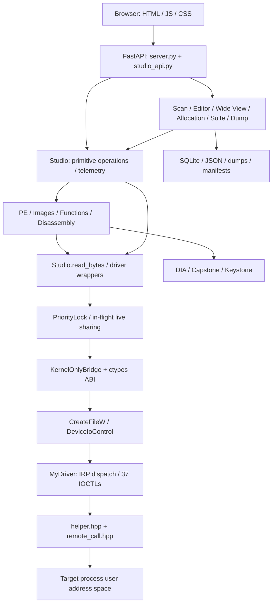
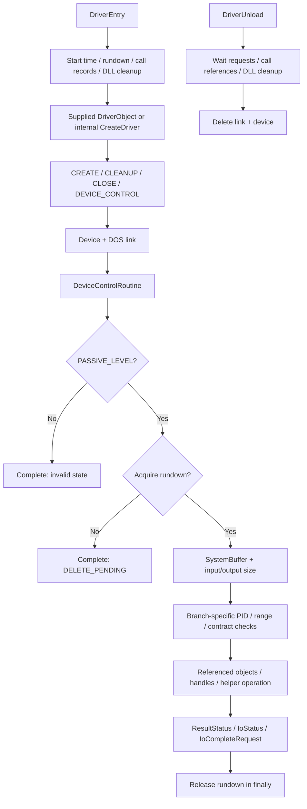
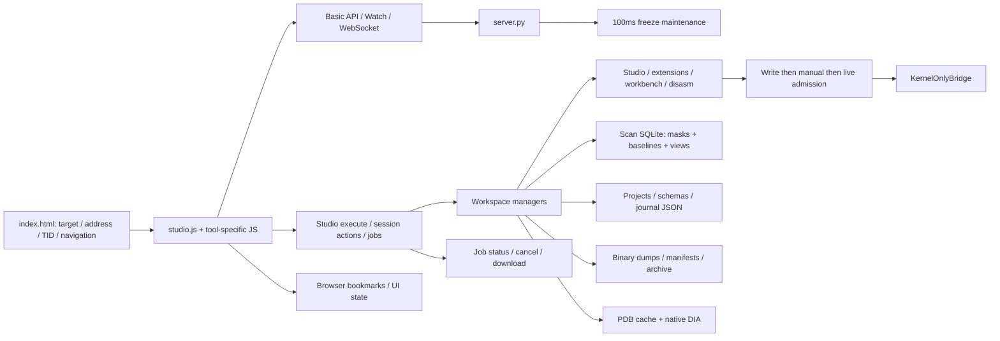
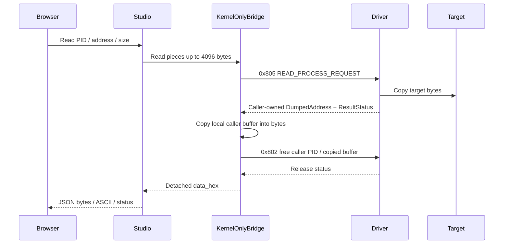
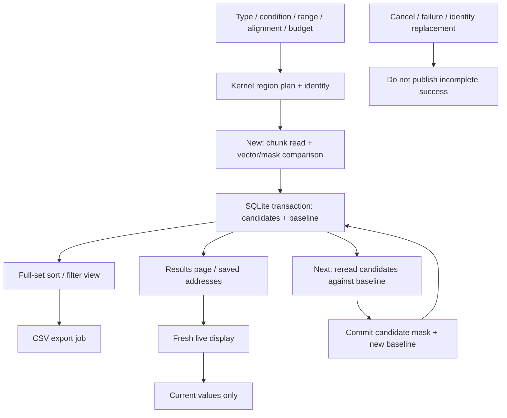
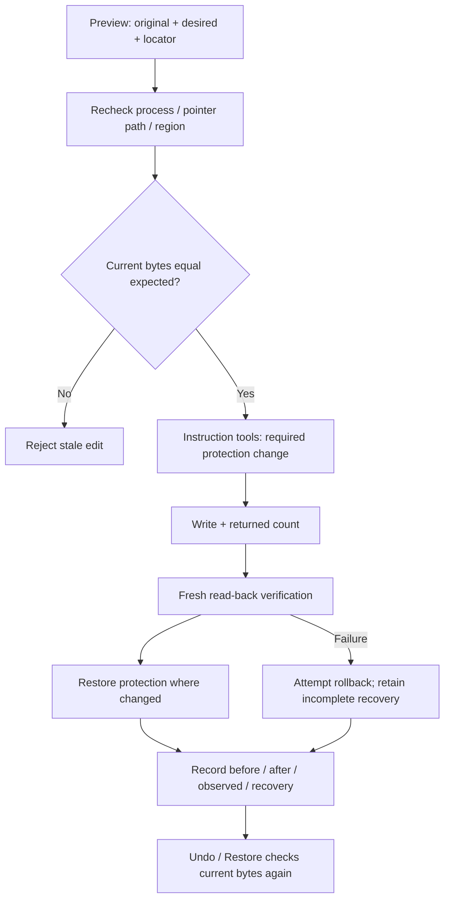
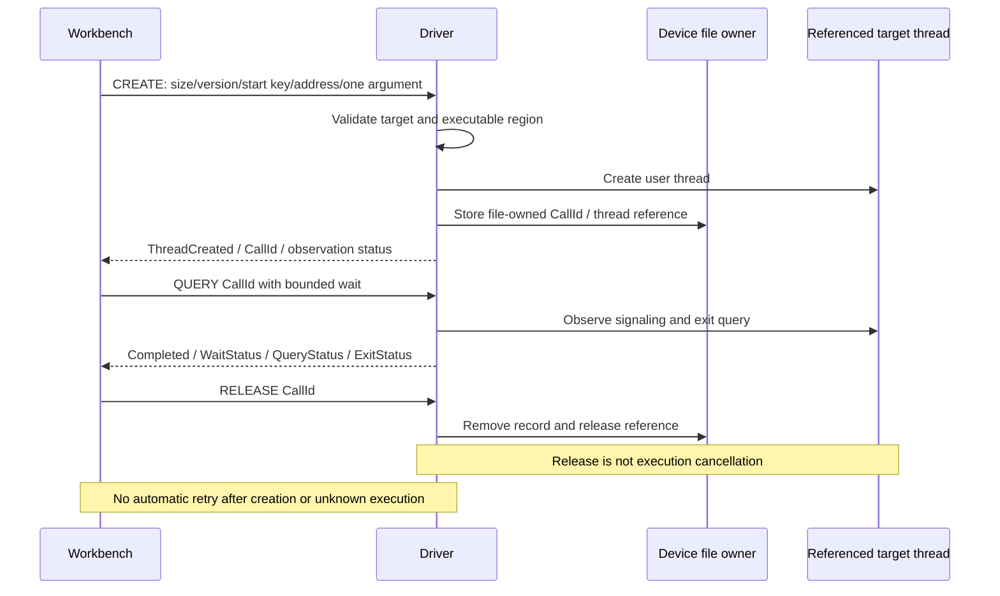

# Kernel Based Process Memory Editor

[한국어](README.md) · [English](README.en.md) · [简体中文](README.zh-CN.md) · [Español](README.es.md)

Windows 内核进程内存分析/编辑与 Kernel Studio 的完整技术 README。


## 目录

- [文档范围与项目组成](#overview)
- [本 README 实现图](#diagrams)
- [内核驱动构建与生命周期](#kernel)
- [内核内存、搜索与查询实现](#kernel-memory)
- [网页控制面板设计](#web)
- [内存扫描完整行为](#scan)
- [字节编辑、指针、Wide View 与分配](#edit)
- [转储、MEM_IMAGE 与文件验证](#dump)
- [PE、PDB、镜像函数、DLL 加载与调用跟踪](#images)
- [反汇编、CFG、伪代码与指令修改](#disasm)
- [线程、寄存器与硬件断点](#thread)
- [结构体、项目、日志、时间线与恢复](#productivity)
- [IOCTL 传输与缓冲所有权](#buffers)
- [完整 Studio operation 目录](#operations)
- [76 个基础界面工具与专用工作区](#ui)
- [完整会话 action 目录](#actions)
- [全部 37 IOCTL：代码、包、作用、实现](#ioctls)
- [完整 ABI 结构：大小、对齐、字段偏移](#layouts)
- [原生结果与内部辅助结构声明](#native)
- [全部 HTTP/WebSocket 路由](#http)
- [基础 HTTP 请求模型和字段](#models)
- [实现限制与状态寿命](#limits)
- [安装、构建、运行与界面用法](#guide)
- [全部导入文件与作用](#files)
- [验证、限制与仓库说明](#validation)

<a id="overview"></a>

## 文档范围与项目组成

本 README 将 **内核控制设备 → IOCTL ABI → Python 桥接 → FastAPI → 浏览器工具 → 持久化与恢复** 串联起来，包含功能目录、实际 operation/action 名称、全部 37 个 IOCTL、所有 Python ABI 结构的大小/对齐/字段偏移、HTTP 路由及完整导入源码地图，并说明实现位置与失败条件。

SampleKernel1 在内核中查询和编辑 Windows 进程的用户地址空间；Kernel Studio 将已有 ABI 组合为本地网页工作区。目标读写通过驱动完成，SQLite、NumPy、Capstone、Keystone、DIA 用于候选管理、展示和静态分析。

驱动源码为 **v2.3 / build 20261004**，FastAPI 为 **v3.0.0**。验证时实际加载的驱动为 **v2.2**，源码构建成功不等于完成全部 v2.3 真实运行验证。四语言支持指仓库文档，原界面仍为韩语。

原目录 324 个文件均只读检查和复制，并匹配初始 SHA-256。79 个导入且追踪的源码/设置/测试/UI 文件保留原字节。IDE 缓存、生成二进制、转储、数据库及运行报告保存在本地副本，不公开追踪。`samples/` 是为重现原测试外部 DLL/PDB 依赖而另加的辅助源码。

<a id="diagrams"></a>

## 本 README 实现图

### 总体分层设计



### 驱动加载、请求与卸载



### 网页组成与存储



### 读取响应所有权



### SQLite 扫描、Live 与 Next



### 编辑验证与恢复



### 函数调用令牌生命周期



<a id="kernel"></a>

## 内核驱动构建与生命周期

### 编译单元和入口

`SampleKernel1.vcxproj` 编译 `main.cpp`，后者包含 `helper.hpp`、`remote_call.hpp`、`ioctl_helper.hpp` 的内联实现。`routine.cpp` 是未加入构建的旧例子；`driver_client.hpp` 和 `test_client.cpp` 是独立用户态 C++ 客户端。`utils.hpp`、`vad.h`、`PEB.h`、`PE.h` 提供 NT、VAD、PEB/加载器及 PE 定义。虽然项目声明 KMDF，入口、设备和 IRP 分派实际直接采用 WDM 风格。

`DriverEntry` 记录启动时间，初始化请求 rundown、调用记录和 DLL 延迟清理。正常加载使用传入的 `DriverObject`；内部空对象路径调用 `helper::driver::CreateDriver`，不属于普通安装流程。

### 设备与 IRP

设备 `\Device\MyDriver`，DOS 链接 `\DosDevices\MyDriver`，用户路径 `\\.\MyDriver`。CREATE/CLEANUP/CLOSE 交给 `remote_call::FileRoutine`，DEVICE_CONTROL 交给 `ioctl_helper::DeviceControlRoutine`。文件对象拥有函数调用令牌；令牌不是可跨设备句柄自由使用的全局 ID。注册失败会清理创建状态。

### 请求验证和完成

高层 helper 要求 `PASSIVE_LEVEL`。包装器进入 critical region 并获取 rundown；卸载期间拒绝进入时返回 `STATUS_DELETE_PENDING`。分派前回收结束的 DLL 工作，`__finally` 释放 rundown 和 critical region。

`GetPacket<T>` 检查 IRP/栈/SystemBuffer，以及输入、输出长度均不小于 `sizeof(T)`。各分支按自身合同验证 PID、地址、大小、溢出、结果缓冲和保留字段，不能假定所有分支检查完全相同。实际请求进程来自 IRP，不信任调用者填写的 `RequestProcessId`。目标经 PID 查找、引用及内核句柄访问，结束后释放。

结果写入 `ResultStatus`、返回字段、`IoStatus.Status`、`IoStatus.Information`，再由 `IoCompleteRequest` 完成。传输状态、返回字节数和内部 NTSTATUS 需分别检查，HTTP 200 不代表内核操作成功。

### 卸载

卸载等待请求 rundown，释放调用记录的线程引用，等待 DLL 延迟清理，再删除链接和设备。释放调用记录不取消已创建的目标线程；文件 cleanup/close 释放该文件所拥有记录。这些生命周期处理不保证所有 OS 兼容或完整性。

<a id="kernel-memory"></a>

## 内核内存、搜索与查询实现

**分配/释放/保护：** 打开目标内核句柄，调用 `ZwAllocateVirtualMemory`、`ZwFreeVirtualMemory`、`ZwProtectVirtualMemory`，检查返回基址、实际大小与旧保护。MEM_RELEASE 有 allocation base/大小合同，不是随意释放内部地址。

**复制/读/写：** 主要用 `MmCopyVirtualMemory` 在地址空间间复制。读操作在请求进程分配快照缓冲并返回地址；写操作复制调用者准备的字节并返回实际数量。预期字节检查、写后验证和 Undo 由网页层组合，复制原语本身不自动提供这些功能。

**值搜索：** 先把比较模式固定到内核缓冲，再查询区域、按块扫描 committed/可读内存，检查 Guard/NoAccess 和溢出，以请求者拥有的链表返回匹配地址。该原语不同于新 SQLite 候选扫描。

**模式搜索：** 通过字节/掩码比较范围，跨块 overlap 防止边界遗漏，返回总匹配数和首地址，不返回所有候选数据库。新 AOB 扫描另行实现，支持 nibble 通配。

**字符串：** 返回 ANSI/UTF-16 候选的原地址、长度和副本地址。字符串记录额外拥有缓冲，需要专用释放路径。界面预览和结果数量有限。

**映射/镜像：** VAD 相关例程返回基址、大小、状态/类型/保护、访问标志和镜像/PE 元数据。`memory_images.py` 合并 MEM_IMAGE，必要时验证内存 PE 头。文件名相同不等于请求的 DLL 已加载。

**进程/令牌/句柄/线程：** 组合 PID 查找、`ZwQueryInformationProcess`、`ZwQuerySystemInformation`、令牌及线程查询。路径、命令行、PEB、时间、内存、计数、保护、完整性和权限取决于子查询成功。结构有字段不代表所有 OS 都可填充。没有全系统 PID 枚举 IOCTL，网页用有界 PID probe。

### 映射内部和辅助实现

BuildMemorySnapshot 用 ZwQueryVirtualMemory(MemoryBasicInformation) 遍历用户区域，并非直接遍历 vad.h 所有内部 VAD。BuildFallbackImageSpans 合并 MEM_IMAGE，BuildModuleSnapshot 通过 PEB→Ldr 最多 4096 模块，PE 头/UNICODE_STRING/basename 辅助补充信息。loader 失败不使基础映射无效；保留 fallback，发布后释放中间 snapshot。

用户链表分配/连接/验证/释放 caller 节点/数据，内核链表用 tagged pool，区分 paged/nonpaged 和失败。PIDtoHANDLE/CloseHandle/信息释放辅助所有权。动态 driver/default create-close 存在，但 main 文件 IRP 使用 remote_call。

DLL 延迟清理保留必要路径缓冲/句柄到线程允许释放。HWBP 分槽掩码/context/MDL/publication/rollback。diagnostics 记录启动和 interlocked IOCTL count，不是活跃事件监控。

<a id="web"></a>

## 网页控制面板设计

`server.py` 建立 FastAPI、Pydantic 请求、基础内存/进程/Watch/线程 API、WebSocket 管理及启动/关闭任务。`studio_api.install()` 安装工作区和 `/api/studio/*`。`static/index.html` 提供 shell，`studio.js` 与功能 JS/CSS 本地渲染，无外部 CDN。共用 Ctrl K 搜索、地址/TID、PID 选择、刷新、toast 和状态。

**传输：** `driver_bridge.py` 用 ctypes、`CreateFileW`、`DeviceIoControl` 打开设备。服务器使用 `KernelOnlyBridge`，目标读取不回退到 Win32 `ReadProcessMemory`。ctypes 仅读取驱动已复制到服务器自身地址空间的响应，再用 free IOCTL 释放。

**工具：** `Studio.operate()` 处理原语并委托 PE/地址、镜像/函数、指令编辑模块。独立端点管理扫描、编辑器、Wide View、分配、生产力和转储会话。组合多个 IOCTL 不表示新增内核 ABI。

**并发：** 可重入优先锁按手动写、手动读、live 读排序，16 次 admission 后补充公平性。只共享相同 `(pid,address,size,epoch)` 的正在进行的 live 读取；没有长期目标字节缓存。手动/验证读使用新快照，修改前后改变 epoch。

**任务：** Studio executor 有两个 worker；扫描和转储各自管理进度、取消、错误、完成。前端 poll job ID，发送取消不代表已停止。Uvicorn 用一个 worker，内存会话不跨 worker 共享。

**Watch/观测：** background 约每 100ms 保持冻结值，最多 256 个 Watch 并检查进程 identity。`/ws/events` 传送连接消息，Studio history 记录有限 IOCTL/状态/耗时，events 返回工具事件；均不是未启用的内核进程/镜像通知。

**持久化：** 地址/64 位值用字符串避免 JavaScript 舍入。浏览器 bookmark、磁盘 JSON/SQLite/二进制、内存会话寿命不同。保存项目不自动恢复所有 live 会话和内核引用。关闭会清理管理器、引用和桥接，本地 API 没有独立认证层。

### 选择目标、书签和结果共享

PID 按 4 步 probe，默认 65,536、最大 1,048,576 及显式额外 PID。约 3 秒元数据缓存，不把 CPU 值伪造为实测。通信失败不隐藏为空成功列表。支持手动 PID、名称/PID 筛选和扩范围。

dashboard 显示状态/工具/IOCTL 与最多 100 浏览器书签。version 1 书签 JSON 导入不自动写/冻结。地址/TID 可送全局和其他工具，目标变更 reset 旧工作区。二进制导入准备 write payload；Inspector 同时解释 16 字节，自动结构每 8 字节提议字段，不是确证 schema/PDB。

<a id="scan"></a>

## 内存扫描完整行为

新 `scan_workspace.py` 用 SQLite 保存候选掩码和比较快照，不受旧 Python 50,000 候选数组限制。大 Unknown 扫描仍将候选保存磁盘。NumPy 比较 stride 数值向量；字符串/AOB/结构体分别按掩码和字段比较。按内核映射处理 64KiB 块，目标读拆为 4KiB IOCTL。

类型包括有符号/无符号 8/16/32/64 位整数、float32/64、UTF-8、UTF-16LE、AOB、数字字段结构体。数值条件为 Exact/NotEqual/Greater/Less/含等号比较/Between/Unknown/Changed/Unchanged/Increased/Decreased/Rescan。字符串/AOB 允许 Exact/NotEqual/Changed/Unchanged/Rescan。AOB 支持 `??`、`A?`、`?F`，拒绝全通配模式。结构体最多 32 个数字字段、1024 字节，配置 offset/type/独立比较/ignore。

**New：** 验证配置、结束地址不含的范围、属性、对齐、预算，选择区域、读/比较，再提交数据库。默认 256MiB，允许 4KiB~4GiB，对齐自动/1/2/4/8/16。**Next：** 只重读候选，对比旧 baseline，再提交；不能更改类型/宽度/结构布局。Rescan 重观察候选，Reset 清空结果。取消、读失败、目标替换与完成分开，transaction 保护发布。

**Live/baseline：** live 显示不改变 Next 基线。默认约 800ms，分页 50/100/200/500。view 对全部候选排序/筛选，export 导出全体/view CSV，管理进度/取消/下载。save/read_saved/edit 管理最多 256 个保存地址、定长编辑和冻结，检查 identity 与当前字节。

**旧实现：** `/api/scan/*` 用 `KernelMemoryScannerSession` 但保留 50,000 候选限制。`memory_scanner.py` 的 Win32 代码为旧实现/类型工具，不是活动目标访问。原始 value/string/pattern/pointer 工具不同于 SQLite 会话。


<a id="edit"></a>

## 字节编辑、指针、Wide View 与分配

### 编辑器

会话管理 16~65,536 字节窗口、4/8 字节行、当前/旧字节、有效掩码/变化/选择与指针树。支持整数/浮点/指针解释、范围编辑、单次 ±65,536 滑动、命名、元数据、选择节点 live 更新、字符串 hint 和展开/折叠。最多 64 节点、合计 1MiB 缓冲、深度 64。

展开比较点击时 expected 与新读取指针，拒绝祖先循环和不可读区域。编辑检查父指针路径、进程 identity、expected_hex，写后检查数量及重新读取。部分写/验证失败保留原始和观察字节。恢复要求写后字节未变，再写原字节并验证；历史最多 256。

### Wide View (Beta)

只读展示周围 16~4096 字节和完整区域图。按页/区域边界和 readable/committed/Guard 检查，返回有效掩码/hole；失败填零不能当成目标实际零。用排序区域/二分查找边界。schema 标记重叠的确证字段位置，嵌套深度 12、展开字段 2048。服务端 action 仅 read/map。

### 数据分配

ANSI、UTF-16LE Wide 字符串或上传文件自动计算 payload 大小，字符串包含 NULL。最多 1MiB PAGE_READWRITE 分配、记录、初始化写、重读验证，显示基址/大小/状态/时间/reservation ID。

初始化失败尝试释放，释放失败保留 needs_free 与所有权。free 仅接受本窗口拥有的活跃基址和 reservation，避免地址重用混淆。最多 128 管理分配、每窗口 256 记录。清历史/关窗口不释放目标内存，与基础 alloc/free/protect/copy 工具不同。


<a id="dump"></a>

## 转储、MEM_IMAGE 与文件验证

转储任务支持选定范围、区域组和 MEM_IMAGE。总量最多 16GiB，块为 4KiB~1MiB 页倍数，内核读仍为 4KiB。最多 4 活跃任务、128 记录。保存 identity/计划，返回 queued/running/packaging/completed/cancelled/failed、字节/进度/错误。

按策略在读失败时停止或记 hole 并填零；manifest 区分真实零与失败填充，记录 SHA-256、范围、名称、大小、失败和镜像信息。提供打包下载。删除检查活跃任务/下载引用；中断或无效 Range 也释放引用。

MEM_IMAGE 保持映射 RVA 布局，不保证重建为可运行磁盘 PE。resume 要求原会话、identity、有效部分文件/计划。重启可恢复完成转储列表与下载，不自动恢复中断任务。

<a id="images"></a>

## PE、PDB、镜像函数、DLL 加载与调用跟踪

**镜像/PE：** 通过 MEM_IMAGE 和有效头显示 base/size/path/main/source。从目标内存解读头、section、导入 DLL/函数/IAT、导出名称/ordinal/RVA/forwarder。resolve 支持地址、module+RVA、module!symbol 及最多 8 层转发，address_info 关联区域/模块 RVA/section。只读 MEM_PRIVATE 的有效 PE 也可分析。

**函数：** 按 RVA 合并 export、x64 exception/unwind `.pdata`、可选 PDB。无名函数为 sub_...，数据 export 独立且不可当函数调用。最多 20,000，标识截断。detail 在已知 extent/镜像范围读真实字节，启发式参数 hint 与 PDB 签名分开。

**PDB：** CodeView GUID/Age 必须一致。DIA 原生辅助程序输出 private/public 函数、参数/返回和结构体 JSON。支持路径/上传/缓存/列表/删除/重启恢复，隔离损坏记录和保存失败回滚。PDB 最多 256MiB，DLL 上传 64MiB，分析绑定 target identity/镜像。

**DLL 加载：** 现有 helper 检查 PEB/loader/export 找加载例程，准备目标路径并请求用户线程执行。上传本身不等于加载。verified/check 检查 target/path/WOW64 和真实镜像；不同目录同名不算成功。线程已开始而观测/等待失败不自动重复，路径缓冲可延迟到线程结束后释放。

**函数调用：** 不是通用 C++ 调用器：向验证的 x64 函数传一个原始 64 位参数，观察 32 位线程 exit 值。不保证任意参数、多参数、float/SIMD 返回、类/C++ ABI。拒绝已知不兼容 PDB 签名，内核检查 System/WOW64/退出、start key、可执行区域、大小/版本/保留字段。

CREATE 记录文件拥有的 CallId 和 ThreadId/ThreadCreated；QUERY 观察原引用线程，RELEASE 仅释放跟踪。等待最多 1000ms、全局 128、文件 32、网页活跃 30/历史 128。完成由线程 signaling 判断，不仅依据 exit=259。ThreadCreated/执行未知/timeout 后不自动重试。

<a id="disasm"></a>

## 反汇编、CFG、伪代码与指令修改

Capstone 将 x86/x64 字节解码为地址/大小/mnemonic/operand/raw。function_views 区分 branch/call/return/terminal，建立 block/edge/未解决分支/范围和保守 C 风格伪代码。这是静态分析，不是执行追踪或精确原始 C 还原。限制 16,384 字节、2048 指令、128 block。

指令工作区提供分析、follow、validate/apply、Undo/Redo、recover、history/release。Keystone 按当前地址/位数汇编。拒绝超槽长度、重叠、错误边界、旧原字节和 identity 替换；短替换按槽策略处理。

Apply 验证计划、重读原字节、切换必要保护、写、验证、恢复保护。失败尝试恢复字节/保护，不完整恢复通过 disasm_recover 显示。Undo/Redo 也核对当前字节。最多 16 会话、每批 128 编辑、128 历史。实时代码修改不是原子停机。


<a id="thread"></a>

## 线程、寄存器与硬件断点

线程列表/详情显示所属、起始地址/时间、优先级、affinity、挂起及返回/总量。suspend/resume 返回原计数，priority/affinity 独立，batch 最多顺序处理 64。hide 存在于原 ABI；0x820 terminate 在内核/桥接中但网页排除。

寄存器编辑检查 PID identity、TID 创建/所属/存活，挂起、读取当前、合并请求字段、写/重读，再仅恢复同一原线程。EFLAGS 限 32 位，其余常规字段 64 位。恢复前检查 TID 重用。网页流程不同于原始 context ABI。

HWBP 管理 DR0~DR3/DR6/DR7 与 enable/type/length。验证执行/写/访问、1/2/4/8 字节/对齐，快照线程原 context，仅改选定槽，保留其他槽，记录多线程应用/恢复/部分失败。结果用专用所有权/MDL 处理。set/query/remove 和释放结果不同；配置不提供完整 debugger 事件循环或命中 trace。

<a id="productivity"></a>

## 结构体、项目、日志、时间线与恢复

**结构体/类：** 验证 name/size/offset/type/count/stride/嵌套 ref/范围/循环，支持数字、pointer、UTF-8/16、bytes、struct/数组，按目标位数处理指针。view 读字段，pdb_types 导入 DIA 并报告不支持/重复/缺 ref，schema 保存 JSON。原始结构读写与 schema 编辑计划不同。

**Preview/Apply/日志：** 记录原/新字节、module+RVA/地址 locator、identity、指针路径。Apply 重新 resolve/验证原始后写并重读，旧 preview 失败。日志保存字节/恢复状态，支持列表、单项恢复、逆序 batch、archive。batch 非原子，返回已完成/失败 ID。

**时间线：** sample schema/地址并比较两 sample 字段/字节，最多保存 512 sample 入项目。活动目标的顺序读不是全局原子 snapshot，create/sample/get/compare/close 分开。

**项目：** version 2 JSON 保存名称/UI/定义/locator/symbol/地址/timeline，提供 list/load/export/import/archive/recover。ASLR 后重新解释模块 locator，报告 unresolved。import 验证、生成新 ID、最多 4MiB。保存状态不替代目标 identity，也不自动内嵌完整扫描候选 DB。

**其他：** 字节 snapshot/list/compare/restore/delete、patch/list/undo/delete、map snapshot/list/compare/delete、范围 diff、expected 原始 preview、pointer chain/search、通配 signature、字符串 contains/prefix/exact/大小写、fill/batch。snapshot 16、map 8、普通 patch 64。删记录不等于恢复内存，完整 map 工具拒绝截断；字符串筛选仅覆盖有限返回。

### 日志包装写操作

Journal.install 包装 write/copy/free。写前 prepared 用 flush/fsync 和原子 rename 保存，观察后记录 verified/failed/uncertain。copy 保存目的地原字节与请求源字节。最多 2048 记录、hex 会计 128MiB。释放管理内存标记 released，阻止恢复到重用地址；相同值写可能不产生记录。

它是字节恢复依据，不是逆转退出/释放/线程执行/外部改变的万能 transaction。restore 是新的验证写，需原 identity/当前 observed 一致；archive 只接受 restored/released。

<a id="buffers"></a>

## IOCTL 传输与缓冲所有权

全部代码用 CTL_CODE：DeviceType=0x22、Method=0、Access=3，`code=(0x22<<16)|(3<<14)|(function<<2)`。function 0x800 的完整 code 是 0x22E000。SystemBuffer 只复制固定包，不自动验证/复制旧包整数地址所指的所有数据。

桥接将同一 ctypes 包作输入/输出。Windows ULONG/LONG/NTSTATUS 32 位、ULONGLONG 64 位、BOOLEAN 1 字节、WCHAR 2 字节，大小含 padding。下表是实际 Windows x64 ctypes sizeof/alignment/offset，不假定跨平台相同。

读响应先本地复制，再向 caller PID 发送 free IOCTL。value/region 链表检查 Node signature 0x4C4C535448454C50、逆链、循环/数量、DataSize，finally 用正确释放。字符串额外拥有 DumpedAddress；HWBP 有恢复所有权，需专用释放。Set 恢复信息保留到 Remove，释放 query 结果不删除断点。

调用 0x822~824 用 version 1、pack(8)、static_assert 88/96/24，区分大小/版本/保留/Flags/start key/令牌，以及 ThreadCreated/Completed/wait/exit/query。Parameter 是原始机器字，驱动不解引用为任意参数 buffer。

HWBP Type Execute=0/Write=1/ReadWrite=3，wire Length=1/2/4/8 字节。旧 Python bp_len 将 DR7 0/1/3/2 编码转字节长度。下表包括 context/image/token/handle 内嵌数组和字符串。

<a id="operations"></a>

## 完整 Studio operation 目录

下列 79 个名称对照 OP_GROUPS/OPERATIONS。POST /api/studio/execute，body 为 {"operation":"...","args":{...}}，应用共同 pid/address/size、payload 与各功能输入合同。链接指向实际分支。

### 进程

| Operation | 行为逻辑 | 分支实现 |
|---|---|---|
| `process` | 组合基础/扩展/令牌查询。 | [studio_api.py:356](kernel_control_panel/studio_api.py#L356) |
| `handles` | 返回最多 128 句柄与独立总数。 | [studio_api.py:359](kernel_control_panel/studio_api.py#L359) |
| `token` | 查询提升/完整性/会话/权限。 | [studio_api.py:367](kernel_control_panel/studio_api.py#L367) |
| `threads` | 区分 64 返回线程与总数。 | [studio_api.py:359](kernel_control_panel/studio_api.py#L359) |
| `thread_info` | 查所属/创建/状态/TEB。 | [studio_api.py:377](kernel_control_panel/studio_api.py#L377) |

### 内存

| Operation | 行为逻辑 | 分支实现 |
|---|---|---|
| `read` | 合并 4KiB 读取为 Hex/ASCII/base64。 | [studio_api.py:444](kernel_control_panel/studio_api.py#L444) |
| `write` | 编码 payload、写、重读比较。 | [studio_api.py:449](kernel_control_panel/studio_api.py#L449) |
| `alloc` | 分配并记录 owner identity。 | [studio_api.py:454](kernel_control_panel/studio_api.py#L454) |
| `free` | 释放 allocation base 与管理记录。 | [studio_api.py:463](kernel_control_panel/studio_api.py#L463) |
| `protect` | 改范围保护并返回旧值。 | [studio_api.py:472](kernel_control_panel/studio_api.py#L472) |
| `copy` | 在源/目标 PID/地址间复制。 | [studio_api.py:473](kernel_control_panel/studio_api.py#L473) |
| `fill` | 重复模式并经可恢复 patch 写。 | [studio_api.py:475](kernel_control_panel/studio_api.py#L475) |
| `dump` | 合并 4KiB 读取为 Hex/ASCII/base64。 | [studio_api.py:444](kernel_control_panel/studio_api.py#L444) |

### 搜索

| Operation | 行为逻辑 | 分支实现 |
|---|---|---|
| `kernel_value` | 消费/释放内核值匹配链表。 | [studio_api.py:486](kernel_control_panel/studio_api.py#L486) |
| `strings` | 读 ANSI/UTF-16 并专用释放。 | [studio_api.py:489](kernel_control_panel/studio_api.py#L489) |
| `pattern` | 返回范围匹配数与首地址。 | [studio_api.py:496](kernel_control_panel/studio_api.py#L496) |
| `pattern_regions` | 在完整 map 的选定区域逐一搜索。 | [studio_api.py:491](kernel_control_panel/studio_api.py#L491) |
| `pointer_search` | 搜索给定地址的 64 位指针字节。 | [studio_api.py:486](kernel_control_panel/studio_api.py#L486) |

### 区域/模块

| Operation | 行为逻辑 | 分支实现 |
|---|---|---|
| `regions` | 返回区域属性/镜像元数据。 | [studio_api.py:484](kernel_control_panel/studio_api.py#L484) |
| `modules` | 验证区域/PE 头建立镜像列表。 | [studio_api.py:480](kernel_control_panel/studio_api.py#L480) |
| `pe` | 读取解析目标 PE 头/section。 | [studio_api.py:589](kernel_control_panel/studio_api.py#L589) |

### 线程

| Operation | 行为逻辑 | 分支实现 |
|---|---|---|
| `context` | 读选定 TID 寄存器。 | [studio_api.py:379](kernel_control_panel/studio_api.py#L379) |
| `set_context` | 查 identity、挂起、合并、验证、恢复。 | [studio_api.py:385](kernel_control_panel/studio_api.py#L385) |
| `suspend` | 查所属/存活后挂起并返回原计数。 | [studio_api.py:380](kernel_control_panel/studio_api.py#L380) |
| `resume` | 查所属/存活后恢复并返回原计数。 | [studio_api.py:381](kernel_control_panel/studio_api.py#L381) |
| `priority` | 验证设置线程优先级。 | [studio_api.py:382](kernel_control_panel/studio_api.py#L382) |
| `affinity` | 设置线程 64 位 affinity。 | [studio_api.py:383](kernel_control_panel/studio_api.py#L383) |
| `hide` | 转发原 thread hide ABI。 | [studio_api.py:368](kernel_control_panel/studio_api.py#L368) |
| `thread_batch` | 对最多 64 TID 顺序运行四种动作。 | [studio_api.py:434](kernel_control_panel/studio_api.py#L434) |

### 断点

| Operation | 行为逻辑 | 分支实现 |
|---|---|---|
| `hwbp_set` | 保留槽并管理应用/恢复记录。 | [studio_api.py:596](kernel_control_panel/studio_api.py#L596) |
| `hwbp_query` | 复制当前 debug 寄存器并释放结果。 | [studio_api.py:590](kernel_control_panel/studio_api.py#L590) |
| `hwbp_remove` | 恢复原槽状态，成功后释放结果。 | [studio_api.py:611](kernel_control_panel/studio_api.py#L611) |
| `hwbp_list` | 列出 Studio 拥有的断点 ID。 | [studio_api.py:594](kernel_control_panel/studio_api.py#L594) |

### 基础分析

| Operation | 行为逻辑 | 分支实现 |
|---|---|---|
| `snapshot` | 保存当前字节与 identity。 | [studio_api.py:519](kernel_control_panel/studio_api.py#L519) |
| `snapshot_list` | 列出 snapshot 摘要与管理分配。 | [studio_api.py:514](kernel_control_panel/studio_api.py#L514) |
| `compare` | 比较已存 snapshot 与当前字节。 | [studio_api.py:512](kernel_control_panel/studio_api.py#L512) |
| `restore` | 用新 patch 写 snapshot 并保留当前值。 | [studio_api.py:542](kernel_control_panel/studio_api.py#L542) |
| `patch` | 查原始/expected，写并记录验证。 | [studio_api.py:526](kernel_control_panel/studio_api.py#L526) |
| `patch_list` | 列出前后字节/验证/恢复状态。 | [studio_api.py:518](kernel_control_panel/studio_api.py#L518) |
| `undo` | 仅在修改后字节匹配时恢复。 | [studio_api.py:527](kernel_control_panel/studio_api.py#L527) |
| `pointer_chain` | 逐级解引用加 offset 并返回路径。 | [studio_api.py:551](kernel_control_panel/studio_api.py#L551) |
| `structure` | 读自定义 offset/type 字段。 | [studio_api.py:562](kernel_control_panel/studio_api.py#L562) |
| `structure_write` | 仅 patch 有 value 字段。 | [studio_api.py:572](kernel_control_panel/studio_api.py#L572) |
| `disassemble` | Capstone 解码目标字节。 | [studio_api.py:581](kernel_control_panel/studio_api.py#L581) |

### 其他

| Operation | 行为逻辑 | 分支实现 |
|---|---|---|
| `dll` | 返回原 DLL loader IOCTL 结果。 | [studio_api.py:621](kernel_control_panel/studio_api.py#L621) |
| `status` | 查连接/版本/启动/IOCTL 计数。 | [studio_api.py:353](kernel_control_panel/studio_api.py#L353) |
| `batch` | 最多 32 步，用 $name.field 引用。 | [studio_api.py:625](kernel_control_panel/studio_api.py#L625) |

### 扩展分析

| Operation | 行为逻辑 | 分支实现 |
|---|---|---|
| `pe_imports` | 解析导入 DLL/名称/ordinal/IAT/当前指针。 | [studio_extensions.py:111](kernel_control_panel/studio_extensions.py#L111) |
| `pe_exports` | 解析/筛选 export 名称/ordinal/RVA/forwarder。 | [studio_extensions.py:109](kernel_control_panel/studio_extensions.py#L109) |
| `resolve` | 解析地址/模块+RVA/export/forwarder。 | [studio_extensions.py:118](kernel_control_panel/studio_extensions.py#L118) |
| `address_info` | 关联地址与区域/保护/镜像/section。 | [studio_extensions.py:152](kernel_control_panel/studio_extensions.py#L152) |
| `memory_diff` | 读两范围并返回不同字节。 | [studio_extensions.py:166](kernel_control_panel/studio_extensions.py#L166) |
| `patch_preview` | 比较 payload/当前字节，不写。 | [studio_extensions.py:179](kernel_control_panel/studio_extensions.py#L179) |
| `signature` | 从字节及 wildcard 范围生成 AOB。 | [studio_extensions.py:185](kernel_control_panel/studio_extensions.py#L185) |
| `strings_filter` | 按模式/大小写筛返回字符串。 | [studio_extensions.py:200](kernel_control_panel/studio_extensions.py#L200) |
| `map_snapshot` | 保存完整 map 与 identity。 | [studio_extensions.py:219](kernel_control_panel/studio_extensions.py#L219) |
| `map_list` | 列出 map ID/时间/区域数。 | [studio_extensions.py:217](kernel_control_panel/studio_extensions.py#L217) |
| `map_compare` | 比较新增/移除/分配/释放/变化区域。 | [studio_extensions.py:215](kernel_control_panel/studio_extensions.py#L215) |
| `map_delete` | 仅删比较记录，不释放目标。 | [studio_extensions.py:232](kernel_control_panel/studio_extensions.py#L232) |
| `snapshot_delete` | 仅删除保存 snapshot。 | [studio_extensions.py:247](kernel_control_panel/studio_extensions.py#L247) |
| `patch_delete` | 仅删除已恢复 patch。 | [studio_extensions.py:247](kernel_control_panel/studio_extensions.py#L247) |

### 镜像/函数

| Operation | 行为逻辑 | 分支实现 |
|---|---|---|
| `image_catalog` | 验证区域/PE 头建立镜像列表。 | [image_workbench.py:374](kernel_control_panel/image_workbench.py#L374) |
| `image_functions` | 按 RVA 合并并分函数/数据。 | [image_workbench.py:375](kernel_control_panel/image_workbench.py#L375) |
| `image_function_detail` | 验证函数范围内建代码/CFG/伪代码。 | [image_workbench.py:376](kernel_control_panel/image_workbench.py#L376) |
| `dll_load_verified` | 以 target/path/实际镜像确认加载。 | [image_workbench.py:377](kernel_control_panel/image_workbench.py#L377) |
| `dll_load_check` | 重查已有加载尝试的实际镜像。 | [image_workbench.py:378](kernel_control_panel/image_workbench.py#L378) |
| `function_call` | 验证 x64 函数/单参数并创建调用。 | [image_workbench.py:379](kernel_control_panel/image_workbench.py#L379) |
| `function_calls` | 列出网页活跃调用及有限历史。 | [image_workbench.py:380](kernel_control_panel/image_workbench.py#L380) |
| `function_call_query` | 查原令牌 signaling/exit 状态。 | [image_workbench.py:382](kernel_control_panel/image_workbench.py#L382) |
| `function_call_release` | 释放跟踪，不取消执行。 | [image_workbench.py:383](kernel_control_panel/image_workbench.py#L383) |

### 指令编辑

| Operation | 行为逻辑 | 分支实现 |
|---|---|---|
| `disasm_analyze` | 解码范围并存指令/引用/CFG/ID。 | [disassembly_workspace.py:356](kernel_control_panel/disassembly_workspace.py#L356) |
| `disasm_validate` | 验证适合单指令槽的汇编字节。 | [disassembly_workspace.py:362](kernel_control_panel/disassembly_workspace.py#L362) |
| `disasm_apply` | 验证/写/恢复保护/记录编辑计划。 | [disassembly_workspace.py:377](kernel_control_panel/disassembly_workspace.py#L377) |
| `disasm_undo` | 查当前字节后撤销上一组。 | [disassembly_workspace.py:398](kernel_control_panel/disassembly_workspace.py#L398) |
| `disasm_redo` | 查当前字节后重做撤销组。 | [disassembly_workspace.py:398](kernel_control_panel/disassembly_workspace.py#L398) |
| `disasm_recover` | 重试未完成字节/保护恢复。 | [disassembly_workspace.py:363](kernel_control_panel/disassembly_workspace.py#L363) |
| `disasm_history` | 返回历史/cursor/恢复状态。 | [disassembly_workspace.py:361](kernel_control_panel/disassembly_workspace.py#L361) |
| `disasm_follow` | 跟随已分析指令的验证引用。 | [disassembly_workspace.py:364](kernel_control_panel/disassembly_workspace.py#L364) |
| `disasm_release` | 释放分析会话，不自动撤销代码。 | [disassembly_workspace.py:350](kernel_control_panel/disassembly_workspace.py#L350) |

<a id="ui"></a>

## 76 个基础界面工具与专用工作区

下列是 static/studio.js 的 76 个实际基础 TOOLS，原韩文 label 对应真实界面，作用已翻译。部分旧扫描转新专用页，数量不等于菜单或 operation。专用 editor/新扫描/Wide View/分配/结构/项目/日志/时间线/DLL/函数/反汇编已在前章说明。

| Tool ID | 原界面标签 | 功能行为 |
|---|---|---|
| `dump_large` | 대용량 범위 덤프 | 范围转储 job 含进度/取消/续写。 |
| `dump_image` | 이미지 하나 덤프 | 按名称/main/base 选镜像并转储映射布局。 |
| `dump_images` | 모든 MEM_IMAGE 덤프 | 全部 MEM_IMAGE 保存为文件/manifest/ZIP。 |
| `dump_list` | 덤프 작업 목록 | 管理 dump ID/进度/失败/取消/下载。 |
| `pe_imports` | PE 가져오기 / IAT | 解析导入 DLL/名称/ordinal/IAT/当前指针。 |
| `pe_exports` | PE 내보내기 | 解析/筛选 export 名称/ordinal/RVA/forwarder。 |
| `resolve` | 모듈 / 함수 주소 계산 | 解析地址/模块+RVA/export/forwarder。 |
| `address_info` | 주소 소속 분석 | 关联地址与区域/保护/镜像/section。 |
| `memory_diff` | 두 메모리 범위 비교 | 读两范围并返回不同字节。 |
| `patch_preview` | 패치 미리보기 | 比较 payload/当前字节，不写。 |
| `signature` | AOB 시그니처 생성 | 从字节及 wildcard 范围生成 AOB。 |
| `strings_filter` | 문자열 조건 검색 | 按模式/大小写筛返回字符串。 |
| `map_snapshot` | 메모리 맵 저장 | 保存完整 map 与 identity。 |
| `map_list` | 저장된 메모리 맵 | 列出 map ID/时间/区域数。 |
| `map_compare` | 메모리 맵 변화 비교 | 比较新增/移除/分配/释放/变化区域。 |
| `map_delete` | 메모리 맵 기록 삭제 | 仅删比较记录，不释放目标。 |
| `snapshot_delete` | 스냅샷 기록 삭제 | 仅删除保存 snapshot。 |
| `patch_delete` | 복구된 패치 기록 삭제 | 仅删除已恢复 patch。 |
| `process` | 프로세스 상세 | 组合基础/扩展/令牌查询。 |
| `handles` | 핸들 목록 | 返回最多 128 句柄与独立总数。 |
| `token` | 권한 토큰 | 查询提升/完整性/会话/权限。 |
| `threads` | 스레드 목록 | 区分 64 返回线程与总数。 |
| `thread_info` | 스레드 상세 | 查所属/创建/状态/TEB。 |
| `read` | 메모리 읽기 | 合并 4KiB 读取为 Hex/ASCII/base64。 |
| `write` | 형식별 쓰기 | 编码 payload、写、重读比较。 |
| `inspect` | 데이터 해석 | 16 字节同时解释为整数/浮点/binary/文本/指针。 |
| `dump` | 메모리 덤프 | 合并 4KiB 读取为 Hex/ASCII/base64。 |
| `alloc` | 메모리 할당 | 分配并记录 owner identity。 |
| `free` | 메모리 해제 | 释放 allocation base 与管理记录。 |
| `protect` | 보호 속성 변경 | 改范围保护并返回旧值。 |
| `copy` | 프로세스 간 복사 | 在源/目标 PID/地址间复制。 |
| `fill` | 패턴 채우기 | 重复模式并经可恢复 patch 写。 |
| `kernel_value` | 커널 값 검색 | 消费/释放内核值匹配链表。 |
| `pattern` | 범위 AOB 검색 | 返回范围匹配数与首地址。 |
| `pattern_regions` | 영역 AOB 검색 | 在完整 map 的选定区域逐一搜索。 |
| `strings` | 문자열 검색 | 读 ANSI/UTF-16 并专用释放。 |
| `scan_first` | 첫 값 검색 | 旧内核首次扫描，不同于新会话扫描。 |
| `scan_next` | 다음 값 검색 | 旧候选与 baseline 再比较。 |
| `scan_results` | 검색 후보 | 分页查询旧扫描结果。 |
| `scan_reset` | 검색 초기화 | 重置旧扫描候选。 |
| `regions` | 커널 메모리 맵 | 返回区域属性/镜像元数据。 |
| `modules` | 모듈 / 메모리 PE 목록 | 验证区域/PE 头建立镜像列表。 |
| `pe` | PE 헤더와 섹션 | 读取解析目标 PE 头/section。 |
| `context` | 레지스터 조회 | 读选定 TID 寄存器。 |
| `set_context` | 레지스터 편집 | 查 identity、挂起、合并、验证、恢复。 |
| `suspend` | 스레드 일시 정지 | 查所属/存活后挂起并返回原计数。 |
| `resume` | 스레드 재개 | 查所属/存活后恢复并返回原计数。 |
| `priority` | 스레드 우선순위 | 验证设置线程优先级。 |
| `affinity` | CPU 지정 | 设置线程 64 位 affinity。 |
| `hide` | 디버거 숨김 설정 | 转发原 thread hide ABI。 |
| `thread_batch` | 스레드 일괄 제어 | 对最多 64 TID 顺序运行四种动作。 |
| `hwbp_set` | 중단점 설정 | 保留槽并管理应用/恢复记录。 |
| `hwbp_query` | 중단점 조회 | 复制当前 debug 寄存器并释放结果。 |
| `hwbp_list` | 관리 중인 중단점 | 列出 Studio 拥有的断点 ID。 |
| `hwbp_remove` | 중단점 제거 | 恢复原槽状态，成功后释放结果。 |
| `dll` | DLL 로드 | 返回原 DLL loader IOCTL 结果。 |
| `snapshot` | 스냅샷 저장 | 保存当前字节与 identity。 |
| `snapshot_list` | 스냅샷 / 할당 목록 | 列出 snapshot 摘要与管理分配。 |
| `compare` | 스냅샷 비교 | 比较已存 snapshot 与当前字节。 |
| `restore` | 스냅샷 복원 | 用新 patch 写 snapshot 并保留当前值。 |
| `patch` | 검증 패치 | 查原始/expected，写并记录验证。 |
| `patch_list` | 패치 이력 | 列出前后字节/验证/恢复状态。 |
| `undo` | 패치 복구 | 仅在修改后字节匹配时恢复。 |
| `pointer_chain` | 포인터 체인 | 逐级解引用加 offset 并返回路径。 |
| `pointer_search` | 포인터 참조 검색 | 搜索给定地址的 64 位指针字节。 |
| `structure` | 사용자 정의 구조체 | 读自定义 offset/type 字段。 |
| `structure_write` | 구조체 필드 쓰기 | 仅 patch 有 value 字段。 |
| `dissect` | 구조 자동 해석 | 按 8 字节间隔解释结构字段候选。 |
| `disassemble` | 명령어 분석 | Capstone 解码目标字节。 |
| `status` | 드라이버 상태 | 查连接/版本/启动/IOCTL 计数。 |
| `batch` | 작업 시나리오 | 最多 32 步，用 $name.field 引用。 |
| `watch_add` | 주소 등록 | 以 identity 注册地址/类型/说明。 |
| `watch_update` | 값 / 설명 편집 | 改 Watch 类型/说明/可选值并验证。 |
| `watch_freeze` | 값 고정 / 해제 | 开启/关闭重复写捕获值。 |
| `watch_remove` | Watch 삭제 | 删除 Watch，不自动恢复原值。 |
| `watch_list` | Watch 목록 | 查询注册地址当前值/错误。 |

<a id="actions"></a>

## 完整会话 action 目录

下列为实际 action 分支，与 Studio operation 不同。用创建返回 ID 调用后续 action，identity 变更则重建会话，非法/过期/范围错误不算成功。

| Action | Endpoint | 实现 |
|---|---|---|
| `edit` | `/api/studio/scans/{key}/{action}` | [scan_workspace.py](kernel_control_panel/scan_workspace.py) |
| `export` | `/api/studio/scans/{key}/{action}` | [scan_workspace.py](kernel_control_panel/scan_workspace.py) |
| `new` | `/api/studio/scans/{key}/{action}` | [scan_workspace.py](kernel_control_panel/scan_workspace.py) |
| `next` | `/api/studio/scans/{key}/{action}` | [scan_workspace.py](kernel_control_panel/scan_workspace.py) |
| `read_saved` | `/api/studio/scans/{key}/{action}` | [scan_workspace.py](kernel_control_panel/scan_workspace.py) |
| `rescan` | `/api/studio/scans/{key}/{action}` | [scan_workspace.py](kernel_control_panel/scan_workspace.py) |
| `reset` | `/api/studio/scans/{key}/{action}` | [scan_workspace.py](kernel_control_panel/scan_workspace.py) |
| `results` | `/api/studio/scans/{key}/{action}` | [scan_workspace.py](kernel_control_panel/scan_workspace.py) |
| `save` | `/api/studio/scans/{key}/{action}` | [scan_workspace.py](kernel_control_panel/scan_workspace.py) |
| `view` | `/api/studio/scans/{key}/{action}` | [scan_workspace.py](kernel_control_panel/scan_workspace.py) |
| `collapse` | `/api/studio/editors/{key}/{action}` | [memory_editor.py](kernel_control_panel/memory_editor.py) |
| `edit` | `/api/studio/editors/{key}/{action}` | [memory_editor.py](kernel_control_panel/memory_editor.py) |
| `edit_range` | `/api/studio/editors/{key}/{action}` | [memory_editor.py](kernel_control_panel/memory_editor.py) |
| `expand` | `/api/studio/editors/{key}/{action}` | [memory_editor.py](kernel_control_panel/memory_editor.py) |
| `group` | `/api/studio/editors/{key}/{action}` | [memory_editor.py](kernel_control_panel/memory_editor.py) |
| `metadata` | `/api/studio/editors/{key}/{action}` | [memory_editor.py](kernel_control_panel/memory_editor.py) |
| `name` | `/api/studio/editors/{key}/{action}` | [memory_editor.py](kernel_control_panel/memory_editor.py) |
| `refresh` | `/api/studio/editors/{key}/{action}` | [memory_editor.py](kernel_control_panel/memory_editor.py) |
| `restore` | `/api/studio/editors/{key}/{action}` | [memory_editor.py](kernel_control_panel/memory_editor.py) |
| `slide` | `/api/studio/editors/{key}/{action}` | [memory_editor.py](kernel_control_panel/memory_editor.py) |
| `map` | `/api/studio/wide-views/{key}/{action}` | [memory_wide_view.py](kernel_control_panel/memory_wide_view.py) |
| `read` | `/api/studio/wide-views/{key}/{action}` | [memory_wide_view.py](kernel_control_panel/memory_wide_view.py) |
| `allocate` | `/api/studio/allocation-histories/{key}/{action}` | [memory_allocation.py](kernel_control_panel/memory_allocation.py) |
| `free` | `/api/studio/allocation-histories/{key}/{action}` | [memory_allocation.py](kernel_control_panel/memory_allocation.py) |
| `list` | `/api/studio/allocation-histories/{key}/{action}` | [memory_allocation.py](kernel_control_panel/memory_allocation.py) |
| `apply` | `/api/studio/suite/{action}` | [productivity_suite.py](kernel_control_panel/productivity_suite.py) |
| `archive` | `/api/studio/suite/{action}` | [productivity_suite.py](kernel_control_panel/productivity_suite.py) |
| `journal` | `/api/studio/suite/{action}` | [productivity_suite.py](kernel_control_panel/productivity_suite.py) |
| `pdb_types` | `/api/studio/suite/{action}` | [productivity_suite.py](kernel_control_panel/productivity_suite.py) |
| `preview` | `/api/studio/suite/{action}` | [productivity_suite.py](kernel_control_panel/productivity_suite.py) |
| `project_archive` | `/api/studio/suite/{action}` | [productivity_suite.py](kernel_control_panel/productivity_suite.py) |
| `project_archives` | `/api/studio/suite/{action}` | [productivity_suite.py](kernel_control_panel/productivity_suite.py) |
| `project_export` | `/api/studio/suite/{action}` | [productivity_suite.py](kernel_control_panel/productivity_suite.py) |
| `project_import` | `/api/studio/suite/{action}` | [productivity_suite.py](kernel_control_panel/productivity_suite.py) |
| `project_load` | `/api/studio/suite/{action}` | [productivity_suite.py](kernel_control_panel/productivity_suite.py) |
| `project_recover` | `/api/studio/suite/{action}` | [productivity_suite.py](kernel_control_panel/productivity_suite.py) |
| `project_save` | `/api/studio/suite/{action}` | [productivity_suite.py](kernel_control_panel/productivity_suite.py) |
| `projects` | `/api/studio/suite/{action}` | [productivity_suite.py](kernel_control_panel/productivity_suite.py) |
| `resolve` | `/api/studio/suite/{action}` | [productivity_suite.py](kernel_control_panel/productivity_suite.py) |
| `restore` | `/api/studio/suite/{action}` | [productivity_suite.py](kernel_control_panel/productivity_suite.py) |
| `restore_batch` | `/api/studio/suite/{action}` | [productivity_suite.py](kernel_control_panel/productivity_suite.py) |
| `sample` | `/api/studio/suite/{action}` | [productivity_suite.py](kernel_control_panel/productivity_suite.py) |
| `schemas` | `/api/studio/suite/{action}` | [productivity_suite.py](kernel_control_panel/productivity_suite.py) |
| `schemas_save` | `/api/studio/suite/{action}` | [productivity_suite.py](kernel_control_panel/productivity_suite.py) |
| `timeline` | `/api/studio/suite/{action}` | [productivity_suite.py](kernel_control_panel/productivity_suite.py) |
| `timeline_close` | `/api/studio/suite/{action}` | [productivity_suite.py](kernel_control_panel/productivity_suite.py) |
| `timeline_compare` | `/api/studio/suite/{action}` | [productivity_suite.py](kernel_control_panel/productivity_suite.py) |
| `timeline_create` | `/api/studio/suite/{action}` | [productivity_suite.py](kernel_control_panel/productivity_suite.py) |
| `view` | `/api/studio/suite/{action}` | [productivity_suite.py](kernel_control_panel/productivity_suite.py) |

<a id="ioctls"></a>

## 全部 37 IOCTL：代码、包、作用、实现

名称含 IOCTL_HELPER_，全部字段见下一 ABI 章。网页连接 34 个，排除两个未启用事件和线程终止。释放结果一般是内部 cleanup，不是用户按钮。

| Function | CTL_CODE | Identifier | Packet | 行为/结果 |
|---|---|---|---|---|
| `0x800` | `0x22E000` | `IOCTL_HELPER_PROCESS_INFORMATION` | [PROCESS_INFORMATION_REQUEST](#abi-PROCESS_INFORMATION_REQUEST) | 进程基础/start identity |
| `0x801` | `0x22E004` | `IOCTL_HELPER_ALLOC_VIRTUAL_MEMORY` | [ALLOC_VIRTUAL_MEMORY_REQUEST](#abi-ALLOC_VIRTUAL_MEMORY_REQUEST) | 保留/提交虚拟内存 |
| `0x802` | `0x22E008` | `IOCTL_HELPER_FREE_VIRTUAL_MEMORY` | [FREE_VIRTUAL_MEMORY_REQUEST](#abi-FREE_VIRTUAL_MEMORY_REQUEST) | 释放分配 |
| `0x803` | `0x22E00C` | `IOCTL_HELPER_COPY_PROCESS_MEMORY` | [COPY_PROCESS_MEMORY_REQUEST](#abi-COPY_PROCESS_MEMORY_REQUEST) | 跨进程复制 |
| `0x804` | `0x22E010` | `IOCTL_HELPER_SCAN_VALUE_PROCESS` | [SCAN_VALUE_PROCESS_REQUEST](#abi-SCAN_VALUE_PROCESS_REQUEST) | 值扫描/地址列表 |
| `0x805` | `0x22E014` | `IOCTL_HELPER_READ_PROCESS` | [READ_PROCESS_REQUEST](#abi-READ_PROCESS_REQUEST) | 请求者中的读取副本 |
| `0x806` | `0x22E018` | `IOCTL_HELPER_READ_STRING_PROCESS` | [READ_STRING_PROCESS_REQUEST](#abi-READ_STRING_PROCESS_REQUEST) | ANSI/UTF-16 字符串 |
| `0x807` | `0x22E01C` | `IOCTL_HELPER_READ_PROCESS_INFORMATION` | [READ_PROCESS_INFORMATION_REQUEST](#abi-READ_PROCESS_INFORMATION_REQUEST) | 区域/VAD/镜像记录 |
| `0x808` | `0x22E020` | `IOCTL_HELPER_FREE_LINKED_LIST` | [FREE_LINKED_LIST_REQUEST](#abi-FREE_LINKED_LIST_REQUEST) | 释放普通链表 |
| `0x809` | `0x22E024` | `IOCTL_HELPER_FREE_STRING_LIST` | [FREE_STRING_LIST_REQUEST](#abi-FREE_STRING_LIST_REQUEST) | 释放字符串与链表 |
| `0x80A` | `0x22E028` | `IOCTL_HELPER_SET_HARDWARE_BREAKPOINT` | [IOCTL_HWBP_SET_REQUEST](#abi-IOCTL_HWBP_SET_REQUEST) | 设置 HWBP/恢复记录 |
| `0x80B` | `0x22E02C` | `IOCTL_HELPER_QUERY_HARDWARE_BREAKPOINT` | [IOCTL_HWBP_QUERY_REQUEST](#abi-IOCTL_HWBP_QUERY_REQUEST) | 查询 HWBP 列表 |
| `0x80C` | `0x22E030` | `IOCTL_HELPER_REMOVE_HARDWARE_BREAKPOINT` | [IOCTL_HWBP_REMOVE_REQUEST](#abi-IOCTL_HWBP_REMOVE_REQUEST) | 按原记录移除 HWBP |
| `0x80D` | `0x22E034` | `IOCTL_HELPER_FREE_HARDWARE_BREAKPOINT_RESULT` | [IOCTL_HWBP_FREE_RESULT_REQUEST](#abi-IOCTL_HWBP_FREE_RESULT_REQUEST) | 释放 HWBP 结果 |
| `0x80E` | `0x22E038` | `IOCTL_HELPER_REGISTER_DLL` | [REGISTER_DLL_REQUEST](#abi-REGISTER_DLL_REQUEST) | 请求目标 DLL 加载 |
| `0x80F` | `0x22E03C` | `IOCTL_HELPER_WRITE_PROCESS` | [WRITE_PROCESS_REQUEST](#abi-WRITE_PROCESS_REQUEST) | 写/实际字节数 |
| `0x810` | `0x22E040` | `IOCTL_HELPER_PROTECT_VIRTUAL_MEMORY` | [PROTECT_VIRTUAL_MEMORY_REQUEST](#abi-PROTECT_VIRTUAL_MEMORY_REQUEST) | 修改/原保护 |
| `0x811` | `0x22E044` | `IOCTL_HELPER_PATTERN_SCAN` | [PATTERN_SCAN_REQUEST](#abi-PATTERN_SCAN_REQUEST) | 模式数量/首地址 |
| `0x812` | `0x22E048` | `IOCTL_HELPER_ENUMERATE_THREADS` | [ENUMERATE_THREADS_REQUEST](#abi-ENUMERATE_THREADS_REQUEST) | 枚举线程数组 |
| `0x813` | `0x22E04C` | `IOCTL_HELPER_SUSPEND_THREAD` | [THREAD_CONTROL_REQUEST](#abi-THREAD_CONTROL_REQUEST) | 挂起/原计数 |
| `0x814` | `0x22E050` | `IOCTL_HELPER_RESUME_THREAD` | [THREAD_CONTROL_REQUEST](#abi-THREAD_CONTROL_REQUEST) | 恢复/原计数 |
| `0x815` | `0x22E054` | `IOCTL_HELPER_GET_THREAD_CONTEXT` | [THREAD_REGISTERS_REQUEST](#abi-THREAD_REGISTERS_REQUEST) | 读线程寄存器 |
| `0x816` | `0x22E058` | `IOCTL_HELPER_SET_THREAD_CONTEXT` | [THREAD_REGISTERS_REQUEST](#abi-THREAD_REGISTERS_REQUEST) | 写线程寄存器 |
| `0x817` | `0x22E05C` | `IOCTL_HELPER_EVENT_MONITOR_CONTROL` | [EVENT_MONITOR_CONTROL_REQUEST](#abi-EVENT_MONITOR_CONTROL_REQUEST) | 事件控制/未启用 |
| `0x818` | `0x22E060` | `IOCTL_HELPER_POLL_EVENTS` | [POLL_EVENTS_REQUEST](#abi-POLL_EVENTS_REQUEST) | 事件 poll/未启用 |
| `0x819` | `0x22E064` | `IOCTL_HELPER_GET_DRIVER_STATUS` | [DRIVER_STATUS_REQUEST](#abi-DRIVER_STATUS_REQUEST) | 版本/启动/IOCTL 统计 |
| `0x81A` | `0x22E068` | `IOCTL_HELPER_QUERY_PROCESS_EXTENDED` | [PROCESS_EXTENDED_INFO_REQUEST](#abi-PROCESS_EXTENDED_INFO_REQUEST) | 扩展进程信息 |
| `0x81B` | `0x22E06C` | `IOCTL_HELPER_QUERY_PROCESS_HANDLES` | [PROCESS_HANDLES_REQUEST](#abi-PROCESS_HANDLES_REQUEST) | 最多 128 句柄 |
| `0x81C` | `0x22E070` | `IOCTL_HELPER_QUERY_PROCESS_TOKEN` | [PROCESS_TOKEN_INFO_REQUEST](#abi-PROCESS_TOKEN_INFO_REQUEST) | 令牌/完整性/权限 |
| `0x81D` | `0x22E074` | `IOCTL_HELPER_QUERY_THREAD_INFO` | [THREAD_INFO_REQUEST](#abi-THREAD_INFO_REQUEST) | 扩展线程信息 |
| `0x81E` | `0x22E078` | `IOCTL_HELPER_SET_THREAD_PRIORITY` | [THREAD_PRIORITY_REQUEST](#abi-THREAD_PRIORITY_REQUEST) | 设置线程优先级 |
| `0x81F` | `0x22E07C` | `IOCTL_HELPER_SET_THREAD_AFFINITY` | [THREAD_AFFINITY_REQUEST](#abi-THREAD_AFFINITY_REQUEST) | 设置线程 affinity |
| `0x820` | `0x22E080` | `IOCTL_HELPER_TERMINATE_THREAD` | [THREAD_TERMINATE_REQUEST](#abi-THREAD_TERMINATE_REQUEST) | 终止：网页排除 |
| `0x821` | `0x22E084` | `IOCTL_HELPER_SET_THREAD_HIDE_FROM_DEBUGGER` | [THREAD_HIDE_REQUEST](#abi-THREAD_HIDE_REQUEST) | 原 thread hide 请求 |
| `0x822` | `0x22E088` | `IOCTL_HELPER_CREATE_FUNCTION_CALL` | [CREATE_FUNCTION_CALL_REQUEST](#abi-CREATE_FUNCTION_CALL_REQUEST) | 创建调用/返回令牌 |
| `0x823` | `0x22E08C` | `IOCTL_HELPER_QUERY_FUNCTION_CALL` | [QUERY_FUNCTION_CALL_REQUEST](#abi-QUERY_FUNCTION_CALL_REQUEST) | 观察原调用线程 |
| `0x824` | `0x22E090` | `IOCTL_HELPER_RELEASE_FUNCTION_CALL` | [RELEASE_FUNCTION_CALL_REQUEST](#abi-RELEASE_FUNCTION_CALL_REQUEST) | 释放调用记录引用 |

### 分派关联的原 helper/符号

| Function | Native references |
|---|---|
| `0x800` | `helper::process::ACTIVE_PROCESS_INFORMATION` · `helper::process::FreeActiveProcessInformation` · `helper::process::SearchActiveProcessInformation` |
| `0x801` | `helper::allocate::usermode::AllocVirtualMemory` |
| `0x802` | `helper::allocate::usermode::FreeVirtualMemory` |
| `0x803` | `helper::Copy::usermode::CopyProcessMemory` |
| `0x804` | `helper::scan::process::ScanValueProcess` |
| `0x805` | `helper::read::process::ReadProcess` |
| `0x806` | `helper::read::process::ReadStringProcess` |
| `0x807` | `helper::read::process::ReadProcessInformation` |
| `0x808` | `helper::linkedlist::usermode::FreeLinkedList` |
| `0x809` | `helper::ioctl_helper::FreeStringResultList` |
| `0x80A` | `helper::process::SetHardwareBreakpoint` · `helper::process::hwbp_internal::HARDWARE_BREAKPOINT_LENGTH` · `helper::process::hwbp_internal::HARDWARE_BREAKPOINT_TYPE` |
| `0x80B` | `helper::process::QueryHardwareBreakpoints` |
| `0x80C` | `helper::linkedlist::LINKED_LIST_NODE` · `helper::process::RemoveHardwareBreakpoint` |
| `0x80D` | `helper::linkedlist::LINKED_LIST_NODE` · `helper::process::FreeHardwareBreakpointResult` |
| `0x80E` | `helper::process::DLL_REGISTER_INFORMATION` · `helper::process::DllRegister` |
| `0x80F` | `helper::Copy::usermode::WriteProcessMemory` · `helper::allocate::kernelmode::AllocateKernelMemory` · `helper::allocate::kernelmode::FreeKernelMemory` |
| `0x810` | `helper::allocate::usermode::ProtectVirtualMemory` |
| `0x811` | `helper::scan::process::ScanPatternProcess` |
| `0x812` | `helper::process::EnumerateThreads` · `helper::process::THREAD_ENTRY_INFO` |
| `0x813` | `helper::process::SuspendThread` |
| `0x814` | `helper::process::ResumeThread` |
| `0x815` | `helper::process::GetThreadContext` |
| `0x816` | `helper::process::GetThreadContext` · `helper::process::SetThreadContext` |
| `0x817` | compatibility response / no active event registration |
| `0x818` | compatibility response / no active event registration |
| `0x819` | `helper::diagnostics::DriverStartTime` · `helper::diagnostics::TotalIoctlCount` |
| `0x81A` | `helper::process::QueryProcessExtended` |
| `0x81B` | `helper::process::QueryProcessHandles` |
| `0x81C` | `helper::process::QueryProcessToken` |
| `0x81D` | `helper::process::QueryThreadExtended` |
| `0x81E` | `helper::process::SetThreadPriority` |
| `0x81F` | `helper::process::SetThreadAffinity` |
| `0x820` | `helper::process::TerminateThread` |
| `0x821` | `helper::process::SetThreadHideFromDebugger` |
| `0x822` | `helper::remote_call::Create` |
| `0x823` | `helper::remote_call::Query` |
| `0x824` | `helper::remote_call::Release` |

<a id="layouts"></a>

## 完整 ABI 结构：大小、对齐、字段偏移

包括 driver_bridge.py 所有 ctypes 结构和 studio_api.py 返回链表结构。offset/size 单位为字节，数组大小为整体。上字段结束与下 offset 间距为 padding。输入/输出方向需结合 IOCTL 作用和原包合同。

<a id="abi-CREATE_FUNCTION_CALL_REQUEST"></a>

### `CREATE_FUNCTION_CALL_REQUEST`

`sizeof = 88` · `alignment = 8`

| 字段 | Offset | Size | ctypes |
|---|---|---|---|
| `StructSize` | 0 | 4 | `c_ulong` |
| `Version` | 4 | 4 | `c_ulong` |
| `ProcessId` | 8 | 4 | `c_ulong` |
| `Flags` | 12 | 4 | `c_ulong` |
| `ProcessStartKey` | 16 | 8 | `c_ulonglong` |
| `FunctionAddress` | 24 | 8 | `c_ulonglong` |
| `Parameter` | 32 | 8 | `c_ulonglong` |
| `WaitMilliseconds` | 40 | 4 | `c_ulong` |
| `ResultStatus` | 44 | 4 | `c_long` |
| `CallId` | 48 | 8 | `c_ulonglong` |
| `ThreadId` | 56 | 8 | `c_ulonglong` |
| `ThreadCreated` | 64 | 4 | `c_ulong` |
| `Completed` | 68 | 4 | `c_ulong` |
| `WaitStatus` | 72 | 4 | `c_long` |
| `ExitStatus` | 76 | 4 | `c_long` |
| `QueryStatus` | 80 | 4 | `c_long` |
| `Reserved` | 84 | 4 | `c_ulong` |

<a id="abi-QUERY_FUNCTION_CALL_REQUEST"></a>

### `QUERY_FUNCTION_CALL_REQUEST`

`sizeof = 96` · `alignment = 8`

| 字段 | Offset | Size | ctypes |
|---|---|---|---|
| `StructSize` | 0 | 4 | `c_ulong` |
| `Version` | 4 | 4 | `c_ulong` |
| `CallId` | 8 | 8 | `c_ulonglong` |
| `WaitMilliseconds` | 16 | 4 | `c_ulong` |
| `ResultStatus` | 20 | 4 | `c_long` |
| `ProcessId` | 24 | 8 | `c_ulonglong` |
| `ProcessStartKey` | 32 | 8 | `c_ulonglong` |
| `ThreadId` | 40 | 8 | `c_ulonglong` |
| `FunctionAddress` | 48 | 8 | `c_ulonglong` |
| `Parameter` | 56 | 8 | `c_ulonglong` |
| `CreatedAtTime` | 64 | 8 | `c_ulonglong` |
| `ThreadCreated` | 72 | 4 | `c_ulong` |
| `Completed` | 76 | 4 | `c_ulong` |
| `WaitStatus` | 80 | 4 | `c_long` |
| `ExitStatus` | 84 | 4 | `c_long` |
| `QueryStatus` | 88 | 4 | `c_long` |
| `Reserved` | 92 | 4 | `c_ulong` |

<a id="abi-RELEASE_FUNCTION_CALL_REQUEST"></a>

### `RELEASE_FUNCTION_CALL_REQUEST`

`sizeof = 24` · `alignment = 8`

| 字段 | Offset | Size | ctypes |
|---|---|---|---|
| `StructSize` | 0 | 4 | `c_ulong` |
| `Version` | 4 | 4 | `c_ulong` |
| `CallId` | 8 | 8 | `c_ulonglong` |
| `ResultStatus` | 16 | 4 | `c_long` |
| `Reserved` | 20 | 4 | `c_ulong` |

<a id="abi-PROCESS_INFORMATION_REQUEST"></a>

### `PROCESS_INFORMATION_REQUEST`

`sizeof = 1096` · `alignment = 8`

| 字段 | Offset | Size | ctypes |
|---|---|---|---|
| `ProcessId` | 0 | 4 | `c_ulong` |
| `ResultStatus` | 4 | 4 | `c_long` |
| `ProcessIdResult` | 8 | 8 | `c_ulonglong` |
| `ParentProcessId` | 16 | 8 | `c_ulonglong` |
| `PebBaseAddress` | 24 | 8 | `c_ulonglong` |
| `ExitStatus` | 32 | 4 | `c_long` |
| `AffinityMask` | 40 | 8 | `c_ulonglong` |
| `BasePriority` | 48 | 4 | `c_long` |
| `ProcessStartKey` | 56 | 8 | `c_ulonglong` |
| `IsProtectedProcess` | 64 | 1 | `c_ubyte` |
| `ImagePath` | 66 | 1024 | `c_wchar_Array_512` |

<a id="abi-ALLOC_VIRTUAL_MEMORY_REQUEST"></a>

### `ALLOC_VIRTUAL_MEMORY_REQUEST`

`sizeof = 32` · `alignment = 8`

| 字段 | Offset | Size | ctypes |
|---|---|---|---|
| `ProcessId` | 0 | 4 | `c_ulong` |
| `Size` | 8 | 8 | `c_ulonglong` |
| `Protect` | 16 | 4 | `c_ulong` |
| `ResultStatus` | 20 | 4 | `c_long` |
| `AllocatedAddress` | 24 | 8 | `c_ulonglong` |

<a id="abi-FREE_VIRTUAL_MEMORY_REQUEST"></a>

### `FREE_VIRTUAL_MEMORY_REQUEST`

`sizeof = 24` · `alignment = 8`

| 字段 | Offset | Size | ctypes |
|---|---|---|---|
| `ProcessId` | 0 | 4 | `c_ulong` |
| `Address` | 8 | 8 | `c_ulonglong` |
| `ResultStatus` | 16 | 4 | `c_long` |

<a id="abi-COPY_PROCESS_MEMORY_REQUEST"></a>

### `COPY_PROCESS_MEMORY_REQUEST`

`sizeof = 56` · `alignment = 8`

| 字段 | Offset | Size | ctypes |
|---|---|---|---|
| `SourceProcessId` | 0 | 4 | `c_ulong` |
| `SourceAddress` | 8 | 8 | `c_ulonglong` |
| `DestinationProcessId` | 16 | 4 | `c_ulong` |
| `DestinationAddress` | 24 | 8 | `c_ulonglong` |
| `Size` | 32 | 8 | `c_ulonglong` |
| `ResultStatus` | 40 | 4 | `c_long` |
| `CopiedSize` | 48 | 8 | `c_ulonglong` |

<a id="abi-SCAN_VALUE_PROCESS_REQUEST"></a>

### `SCAN_VALUE_PROCESS_REQUEST`

`sizeof = 40` · `alignment = 8`

| 字段 | Offset | Size | ctypes |
|---|---|---|---|
| `TargetProcessId` | 0 | 4 | `c_ulong` |
| `SourceValueAddress` | 8 | 8 | `c_ulonglong` |
| `SourceValueSize` | 16 | 8 | `c_ulonglong` |
| `PageProtect` | 24 | 4 | `c_ulong` |
| `ResultStatus` | 28 | 4 | `c_long` |
| `ResultListAddress` | 32 | 8 | `c_ulonglong` |

<a id="abi-READ_PROCESS_REQUEST"></a>

### `READ_PROCESS_REQUEST`

`sizeof = 40` · `alignment = 8`

| 字段 | Offset | Size | ctypes |
|---|---|---|---|
| `TargetProcessId` | 0 | 4 | `c_ulong` |
| `ReadAddress` | 8 | 8 | `c_ulonglong` |
| `Size` | 16 | 8 | `c_ulonglong` |
| `ResultStatus` | 24 | 4 | `c_long` |
| `DumpedAddress` | 32 | 8 | `c_ulonglong` |

<a id="abi-READ_STRING_PROCESS_REQUEST"></a>

### `READ_STRING_PROCESS_REQUEST`

`sizeof = 32` · `alignment = 8`

| 字段 | Offset | Size | ctypes |
|---|---|---|---|
| `TargetProcessId` | 0 | 4 | `c_ulong` |
| `MinimumCharacterCount` | 8 | 8 | `c_ulonglong` |
| `ResultStatus` | 16 | 4 | `c_long` |
| `ResultListAddress` | 24 | 8 | `c_ulonglong` |

<a id="abi-READ_PROCESS_INFORMATION_REQUEST"></a>

### `READ_PROCESS_INFORMATION_REQUEST`

`sizeof = 16` · `alignment = 8`

| 字段 | Offset | Size | ctypes |
|---|---|---|---|
| `TargetProcessId` | 0 | 4 | `c_ulong` |
| `ResultStatus` | 4 | 4 | `c_long` |
| `ResultListAddress` | 8 | 8 | `c_ulonglong` |

<a id="abi-FREE_LINKED_LIST_REQUEST"></a>

### `FREE_LINKED_LIST_REQUEST`

`sizeof = 16` · `alignment = 8`

| 字段 | Offset | Size | ctypes |
|---|---|---|---|
| `FirstNodeAddress` | 0 | 8 | `c_ulonglong` |
| `ResultStatus` | 8 | 4 | `c_long` |

<a id="abi-FREE_STRING_LIST_REQUEST"></a>

### `FREE_STRING_LIST_REQUEST`

`sizeof = 16` · `alignment = 8`

| 字段 | Offset | Size | ctypes |
|---|---|---|---|
| `FirstNodeAddress` | 0 | 8 | `c_ulonglong` |
| `ResultStatus` | 8 | 4 | `c_long` |

<a id="abi-IOCTL_HWBP_SET_REQUEST"></a>

### `IOCTL_HWBP_SET_REQUEST`

`sizeof = 48` · `alignment = 8`

| 字段 | Offset | Size | ctypes |
|---|---|---|---|
| `ProcessId` | 0 | 4 | `c_ulong` |
| `Reserved` | 4 | 4 | `c_ulong` |
| `Address` | 8 | 8 | `c_ulonglong` |
| `Type` | 16 | 4 | `c_ulong` |
| `Length` | 20 | 4 | `c_ulong` |
| `ResultStatus` | 24 | 4 | `c_long` |
| `Reserved2` | 28 | 4 | `c_ulong` |
| `FirstResultNode` | 32 | 8 | `c_ulonglong` |
| `AppliedThreadCount` | 40 | 4 | `c_ulong` |
| `FailedThreadCount` | 44 | 4 | `c_ulong` |

<a id="abi-IOCTL_HWBP_QUERY_REQUEST"></a>

### `IOCTL_HWBP_QUERY_REQUEST`

`sizeof = 32` · `alignment = 8`

| 字段 | Offset | Size | ctypes |
|---|---|---|---|
| `ProcessId` | 0 | 4 | `c_ulong` |
| `Reserved` | 4 | 4 | `c_ulong` |
| `ResultStatus` | 8 | 4 | `c_long` |
| `Reserved2` | 12 | 4 | `c_ulong` |
| `FirstResultNode` | 16 | 8 | `c_ulonglong` |
| `ThreadCount` | 24 | 4 | `c_ulong` |
| `BreakpointCount` | 28 | 4 | `c_ulong` |

<a id="abi-IOCTL_HWBP_REMOVE_REQUEST"></a>

### `IOCTL_HWBP_REMOVE_REQUEST`

`sizeof = 32` · `alignment = 8`

| 字段 | Offset | Size | ctypes |
|---|---|---|---|
| `ProcessId` | 0 | 4 | `c_ulong` |
| `Reserved` | 4 | 4 | `c_ulong` |
| `FirstResultNode` | 8 | 8 | `c_ulonglong` |
| `ResultStatus` | 16 | 4 | `c_long` |
| `RemovedThreadCount` | 20 | 4 | `c_ulong` |
| `FailedThreadCount` | 24 | 4 | `c_ulong` |
| `Reserved2` | 28 | 4 | `c_ulong` |

<a id="abi-IOCTL_HWBP_FREE_RESULT_REQUEST"></a>

### `IOCTL_HWBP_FREE_RESULT_REQUEST`

`sizeof = 16` · `alignment = 8`

| 字段 | Offset | Size | ctypes |
|---|---|---|---|
| `FirstResultNode` | 0 | 8 | `c_ulonglong` |
| `ResultStatus` | 8 | 4 | `c_long` |
| `Reserved` | 12 | 4 | `c_ulong` |

<a id="abi-REGISTER_DLL_REQUEST"></a>

### `REGISTER_DLL_REQUEST`

`sizeof = 560` · `alignment = 8`

| 字段 | Offset | Size | ctypes |
|---|---|---|---|
| `ProcessId` | 0 | 4 | `c_ulong` |
| `DllPath` | 4 | 520 | `c_char_Array_520` |
| `ResultStatus` | 524 | 4 | `c_long` |
| `TargetIsWow64` | 528 | 1 | `c_ubyte` |
| `Kernel32Found` | 529 | 1 | `c_ubyte` |
| `LoadLibraryFound` | 530 | 1 | `c_ubyte` |
| `Kernel32Base` | 536 | 8 | `c_ulonglong` |
| `Kernel32Size` | 544 | 8 | `c_ulonglong` |
| `LoadLibraryAddress` | 552 | 8 | `c_ulonglong` |

<a id="abi-WRITE_PROCESS_REQUEST"></a>

### `WRITE_PROCESS_REQUEST`

`sizeof = 4144` · `alignment = 8`

| 字段 | Offset | Size | ctypes |
|---|---|---|---|
| `ProcessId` | 0 | 4 | `c_ulong` |
| `TargetAddress` | 8 | 8 | `c_ulonglong` |
| `Size` | 16 | 8 | `c_ulonglong` |
| `Buffer` | 24 | 4096 | `c_ubyte_Array_4096` |
| `UserBufferAddress` | 4120 | 8 | `c_ulonglong` |
| `ResultStatus` | 4128 | 4 | `c_long` |
| `BytesWritten` | 4136 | 8 | `c_ulonglong` |

<a id="abi-PROTECT_VIRTUAL_MEMORY_REQUEST"></a>

### `PROTECT_VIRTUAL_MEMORY_REQUEST`

`sizeof = 56` · `alignment = 8`

| 字段 | Offset | Size | ctypes |
|---|---|---|---|
| `ProcessId` | 0 | 4 | `c_ulong` |
| `BaseAddress` | 8 | 8 | `c_ulonglong` |
| `RegionSize` | 16 | 8 | `c_ulonglong` |
| `NewProtect` | 24 | 4 | `c_ulong` |
| `ResultStatus` | 28 | 4 | `c_long` |
| `OldProtect` | 32 | 4 | `c_ulong` |
| `ResultBaseAddress` | 40 | 8 | `c_ulonglong` |
| `ResultRegionSize` | 48 | 8 | `c_ulonglong` |

<a id="abi-PATTERN_SCAN_REQUEST"></a>

### `PATTERN_SCAN_REQUEST`

`sizeof = 568` · `alignment = 8`

| 字段 | Offset | Size | ctypes |
|---|---|---|---|
| `ProcessId` | 0 | 4 | `c_ulong` |
| `StartAddress` | 8 | 8 | `c_ulonglong` |
| `ScanLength` | 16 | 8 | `c_ulonglong` |
| `PatternLength` | 24 | 4 | `c_ulong` |
| `Pattern` | 28 | 256 | `c_ubyte_Array_256` |
| `Mask` | 284 | 256 | `c_char_Array_256` |
| `PageProtect` | 540 | 4 | `c_ulong` |
| `ResultStatus` | 544 | 4 | `c_long` |
| `FoundAddress` | 552 | 8 | `c_ulonglong` |
| `MatchesCount` | 560 | 4 | `c_ulong` |

<a id="abi-THREAD_SNAPSHOT_INFO"></a>

### `THREAD_SNAPSHOT_INFO`

`sizeof = 40` · `alignment = 8`

| 字段 | Offset | Size | ctypes |
|---|---|---|---|
| `ThreadId` | 0 | 8 | `c_ulonglong` |
| `StartAddress` | 8 | 8 | `c_ulonglong` |
| `Priority` | 16 | 4 | `c_ulong` |
| `BasePriority` | 20 | 4 | `c_long` |
| `State` | 24 | 4 | `c_ulong` |
| `WaitReason` | 28 | 4 | `c_ulong` |
| `ContextSwitches` | 32 | 4 | `c_ulong` |

<a id="abi-ENUMERATE_THREADS_REQUEST"></a>

### `ENUMERATE_THREADS_REQUEST`

`sizeof = 2576` · `alignment = 8`

| 字段 | Offset | Size | ctypes |
|---|---|---|---|
| `ProcessId` | 0 | 4 | `c_ulong` |
| `MaxThreads` | 4 | 4 | `c_ulong` |
| `ResultStatus` | 8 | 4 | `c_long` |
| `ThreadCount` | 12 | 4 | `c_ulong` |
| `Threads` | 16 | 2560 | `THREAD_SNAPSHOT_INFO_Array_64` |

<a id="abi-THREAD_CONTROL_REQUEST"></a>

### `THREAD_CONTROL_REQUEST`

`sizeof = 12` · `alignment = 4`

| 字段 | Offset | Size | ctypes |
|---|---|---|---|
| `ThreadId` | 0 | 4 | `c_ulong` |
| `ResultStatus` | 4 | 4 | `c_long` |
| `PreviousSuspendCount` | 8 | 4 | `c_ulong` |

<a id="abi-THREAD_REGISTERS_REQUEST"></a>

### `THREAD_REGISTERS_REQUEST`

`sizeof = 152` · `alignment = 8`

| 字段 | Offset | Size | ctypes |
|---|---|---|---|
| `ThreadId` | 0 | 4 | `c_ulong` |
| `ResultStatus` | 4 | 4 | `c_long` |
| `Rip` | 8 | 8 | `c_ulonglong` |
| `Rsp` | 16 | 8 | `c_ulonglong` |
| `Rbp` | 24 | 8 | `c_ulonglong` |
| `Rax` | 32 | 8 | `c_ulonglong` |
| `Rbx` | 40 | 8 | `c_ulonglong` |
| `Rcx` | 48 | 8 | `c_ulonglong` |
| `Rdx` | 56 | 8 | `c_ulonglong` |
| `Rsi` | 64 | 8 | `c_ulonglong` |
| `Rdi` | 72 | 8 | `c_ulonglong` |
| `R8` | 80 | 8 | `c_ulonglong` |
| `R9` | 88 | 8 | `c_ulonglong` |
| `R10` | 96 | 8 | `c_ulonglong` |
| `R11` | 104 | 8 | `c_ulonglong` |
| `R12` | 112 | 8 | `c_ulonglong` |
| `R13` | 120 | 8 | `c_ulonglong` |
| `R14` | 128 | 8 | `c_ulonglong` |
| `R15` | 136 | 8 | `c_ulonglong` |
| `EFlags` | 144 | 4 | `c_ulong` |

<a id="abi-EVENT_MONITOR_CONTROL_REQUEST"></a>

### `EVENT_MONITOR_CONTROL_REQUEST`

`sizeof = 12` · `alignment = 4`

| 字段 | Offset | Size | ctypes |
|---|---|---|---|
| `EnableProcessMonitor` | 0 | 1 | `c_ubyte` |
| `EnableImageLoadMonitor` | 1 | 1 | `c_ubyte` |
| `ResultStatus` | 4 | 4 | `c_long` |
| `ProcessMonitorActive` | 8 | 1 | `c_ubyte` |
| `ImageMonitorActive` | 9 | 1 | `c_ubyte` |

<a id="abi-KERNEL_MONITOR_EVENT"></a>

### `KERNEL_MONITOR_EVENT`

`sizeof = 1088` · `alignment = 8`

| 字段 | Offset | Size | ctypes |
|---|---|---|---|
| `EventType` | 0 | 4 | `c_ulong` |
| `Timestamp` | 8 | 8 | `c_longlong` |
| `ProcessId` | 16 | 4 | `c_ulong` |
| `ParentProcessId` | 20 | 4 | `c_ulong` |
| `CreatingThreadId` | 24 | 4 | `c_ulong` |
| `ImageBase` | 32 | 8 | `c_ulonglong` |
| `ImageSize` | 40 | 8 | `c_ulonglong` |
| `ImageName` | 48 | 520 | `c_wchar_Array_260` |
| `CommandLine` | 568 | 520 | `c_wchar_Array_260` |

<a id="abi-POLL_EVENTS_REQUEST"></a>

### `POLL_EVENTS_REQUEST`

`sizeof = 17424` · `alignment = 8`

| 字段 | Offset | Size | ctypes |
|---|---|---|---|
| `MaxEventsToRead` | 0 | 4 | `c_ulong` |
| `ResultStatus` | 4 | 4 | `c_long` |
| `EventsReturned` | 8 | 4 | `c_ulong` |
| `EventsRemaining` | 12 | 4 | `c_ulong` |
| `Events` | 16 | 17408 | `KERNEL_MONITOR_EVENT_Array_16` |

<a id="abi-DRIVER_STATUS_REQUEST"></a>

### `DRIVER_STATUS_REQUEST`

`sizeof = 40` · `alignment = 8`

| 字段 | Offset | Size | ctypes |
|---|---|---|---|
| `ResultStatus` | 0 | 4 | `c_long` |
| `MajorVersion` | 4 | 4 | `c_ulong` |
| `MinorVersion` | 8 | 4 | `c_ulong` |
| `BuildNumber` | 12 | 4 | `c_ulong` |
| `DriverStartTime` | 16 | 8 | `c_longlong` |
| `TotalIoctlRequests` | 24 | 8 | `c_ulonglong` |
| `EventMonitorActive` | 32 | 1 | `c_ubyte` |
| `QueuedEventCount` | 36 | 4 | `c_ulong` |

<a id="abi-PROCESS_EXTENDED_INFO"></a>

### `PROCESS_EXTENDED_INFO`

`sizeof = 1720` · `alignment = 8`

| 字段 | Offset | Size | ctypes |
|---|---|---|---|
| `ProcessId` | 0 | 8 | `c_ulonglong` |
| `ParentProcessId` | 8 | 8 | `c_ulonglong` |
| `PebBaseAddress` | 16 | 8 | `c_ulonglong` |
| `AffinityMask` | 24 | 8 | `c_ulonglong` |
| `BasePriority` | 32 | 4 | `c_long` |
| `ExitStatus` | 36 | 4 | `c_long` |
| `SessionId` | 40 | 4 | `c_ulong` |
| `HandleCount` | 44 | 4 | `c_ulong` |
| `ThreadCount` | 48 | 4 | `c_ulong` |
| `IsWow64` | 52 | 4 | `c_ulong` |
| `IsProtectedProcess` | 56 | 4 | `c_ulong` |
| `CreateTime` | 64 | 8 | `c_longlong` |
| `ExitTime` | 72 | 8 | `c_longlong` |
| `KernelTime` | 80 | 8 | `c_longlong` |
| `UserTime` | 88 | 8 | `c_longlong` |
| `PeakVirtualSize` | 96 | 8 | `c_ulonglong` |
| `VirtualSize` | 104 | 8 | `c_ulonglong` |
| `PageFaultCount` | 112 | 4 | `c_ulong` |
| `PeakWorkingSetSize` | 120 | 8 | `c_ulonglong` |
| `WorkingSetSize` | 128 | 8 | `c_ulonglong` |
| `QuotaPagedPoolUsage` | 136 | 8 | `c_ulonglong` |
| `QuotaNonPagedPoolUsage` | 144 | 8 | `c_ulonglong` |
| `PagefileUsage` | 152 | 8 | `c_ulonglong` |
| `PeakPagefileUsage` | 160 | 8 | `c_ulonglong` |
| `PrivateUsage` | 168 | 8 | `c_ulonglong` |
| `ImageFileName` | 176 | 520 | `c_wchar_Array_260` |
| `CommandLine` | 696 | 1024 | `c_wchar_Array_512` |

<a id="abi-PROCESS_EXTENDED_INFO_REQUEST"></a>

### `PROCESS_EXTENDED_INFO_REQUEST`

`sizeof = 1736` · `alignment = 8`

| 字段 | Offset | Size | ctypes |
|---|---|---|---|
| `ProcessId` | 0 | 8 | `c_ulonglong` |
| `ResultStatus` | 8 | 4 | `c_long` |
| `Info` | 16 | 1720 | `PROCESS_EXTENDED_INFO` |

<a id="abi-PROCESS_HANDLE_ENTRY"></a>

### `PROCESS_HANDLE_ENTRY`

`sizeof = 24` · `alignment = 8`

| 字段 | Offset | Size | ctypes |
|---|---|---|---|
| `HandleValue` | 0 | 8 | `c_ulonglong` |
| `ObjectTypeIndex` | 8 | 4 | `c_ulong` |
| `GrantedAccess` | 12 | 4 | `c_ulong` |
| `ObjectPointer` | 16 | 8 | `c_ulonglong` |

<a id="abi-PROCESS_HANDLES_REQUEST"></a>

### `PROCESS_HANDLES_REQUEST`

`sizeof = 3096` · `alignment = 8`

| 字段 | Offset | Size | ctypes |
|---|---|---|---|
| `ProcessId` | 0 | 8 | `c_ulonglong` |
| `ResultStatus` | 8 | 4 | `c_long` |
| `MaxHandles` | 12 | 4 | `c_ulong` |
| `ReturnedHandleCount` | 16 | 4 | `c_ulong` |
| `Handles` | 24 | 3072 | `PROCESS_HANDLE_ENTRY_Array_128` |

<a id="abi-PROCESS_TOKEN_INFO"></a>

### `PROCESS_TOKEN_INFO`

`sizeof = 40` · `alignment = 8`

| 字段 | Offset | Size | ctypes |
|---|---|---|---|
| `ProcessId` | 0 | 8 | `c_ulonglong` |
| `TokenType` | 8 | 4 | `c_ulong` |
| `ElevationType` | 12 | 4 | `c_ulong` |
| `IsElevated` | 16 | 4 | `c_ulong` |
| `IntegrityLevel` | 20 | 4 | `c_ulong` |
| `SessionId` | 24 | 4 | `c_ulong` |
| `PrivilegeCount` | 28 | 4 | `c_ulong` |
| `EnabledPrivilegesMask` | 32 | 8 | `c_ulonglong` |

<a id="abi-PROCESS_TOKEN_INFO_REQUEST"></a>

### `PROCESS_TOKEN_INFO_REQUEST`

`sizeof = 56` · `alignment = 8`

| 字段 | Offset | Size | ctypes |
|---|---|---|---|
| `ProcessId` | 0 | 8 | `c_ulonglong` |
| `ResultStatus` | 8 | 4 | `c_long` |
| `TokenInfo` | 16 | 40 | `PROCESS_TOKEN_INFO` |

<a id="abi-THREAD_EXTENDED_INFO"></a>

### `THREAD_EXTENDED_INFO`

`sizeof = 112` · `alignment = 8`

| 字段 | Offset | Size | ctypes |
|---|---|---|---|
| `ProcessId` | 0 | 8 | `c_ulonglong` |
| `ThreadId` | 8 | 8 | `c_ulonglong` |
| `ExitStatus` | 16 | 4 | `c_long` |
| `TebBaseAddress` | 24 | 8 | `c_ulonglong` |
| `StartAddress` | 32 | 8 | `c_ulonglong` |
| `Win32StartAddress` | 40 | 8 | `c_ulonglong` |
| `Priority` | 48 | 4 | `c_long` |
| `BasePriority` | 52 | 4 | `c_long` |
| `AffinityMask` | 56 | 8 | `c_ulonglong` |
| `State` | 64 | 4 | `c_ulong` |
| `WaitReason` | 68 | 4 | `c_ulong` |
| `SuspendCount` | 72 | 4 | `c_ulong` |
| `ContextSwitches` | 76 | 4 | `c_ulong` |
| `CreateTime` | 80 | 8 | `c_longlong` |
| `ExitTime` | 88 | 8 | `c_longlong` |
| `KernelTime` | 96 | 8 | `c_longlong` |
| `UserTime` | 104 | 8 | `c_longlong` |

<a id="abi-THREAD_INFO_REQUEST"></a>

### `THREAD_INFO_REQUEST`

`sizeof = 128` · `alignment = 8`

| 字段 | Offset | Size | ctypes |
|---|---|---|---|
| `ThreadId` | 0 | 8 | `c_ulonglong` |
| `ResultStatus` | 8 | 4 | `c_long` |
| `ThreadInfo` | 16 | 112 | `THREAD_EXTENDED_INFO` |

<a id="abi-THREAD_PRIORITY_REQUEST"></a>

### `THREAD_PRIORITY_REQUEST`

`sizeof = 16` · `alignment = 8`

| 字段 | Offset | Size | ctypes |
|---|---|---|---|
| `ThreadId` | 0 | 8 | `c_ulonglong` |
| `Priority` | 8 | 4 | `c_long` |
| `ResultStatus` | 12 | 4 | `c_long` |

<a id="abi-THREAD_AFFINITY_REQUEST"></a>

### `THREAD_AFFINITY_REQUEST`

`sizeof = 24` · `alignment = 8`

| 字段 | Offset | Size | ctypes |
|---|---|---|---|
| `ThreadId` | 0 | 8 | `c_ulonglong` |
| `AffinityMask` | 8 | 8 | `c_ulonglong` |
| `ResultStatus` | 16 | 4 | `c_long` |

<a id="abi-THREAD_TERMINATE_REQUEST"></a>

### `THREAD_TERMINATE_REQUEST`

`sizeof = 16` · `alignment = 8`

| 字段 | Offset | Size | ctypes |
|---|---|---|---|
| `ThreadId` | 0 | 8 | `c_ulonglong` |
| `ExitStatus` | 8 | 4 | `c_long` |
| `ResultStatus` | 12 | 4 | `c_long` |

<a id="abi-THREAD_HIDE_REQUEST"></a>

### `THREAD_HIDE_REQUEST`

`sizeof = 16` · `alignment = 8`

| 字段 | Offset | Size | ctypes |
|---|---|---|---|
| `ThreadId` | 0 | 8 | `c_ulonglong` |
| `ResultStatus` | 8 | 4 | `c_long` |

<a id="abi-Node"></a>

### `Node`

`sizeof = 40` · `alignment = 8`

| 字段 | Offset | Size | ctypes |
|---|---|---|---|
| `Signature` | 0 | 8 | `c_ulonglong` |
| `Previous` | 8 | 8 | `c_ulonglong` |
| `Next` | 16 | 8 | `c_ulonglong` |
| `Data` | 24 | 8 | `c_ulonglong` |
| `DataSize` | 32 | 8 | `c_ulonglong` |

<a id="abi-StringInfo"></a>

### `StringInfo`

`sizeof = 32` · `alignment = 8`

| 字段 | Offset | Size | ctypes |
|---|---|---|---|
| `StringAddress` | 0 | 8 | `c_ulonglong` |
| `DumpedAddress` | 8 | 8 | `c_ulonglong` |
| `StringSize` | 16 | 8 | `c_ulonglong` |
| `Encoding` | 24 | 4 | `c_ulong` |

<a id="abi-RegionInfo"></a>

### `RegionInfo`

`sizeof = 1648` · `alignment = 8`

| 字段 | Offset | Size | ctypes |
|---|---|---|---|
| `BaseAddress` | 0 | 8 | `c_ulonglong` |
| `AllocationBase` | 8 | 8 | `c_ulonglong` |
| `RegionSize` | 16 | 8 | `c_ulonglong` |
| `AllocationProtect` | 24 | 4 | `c_ulong` |
| `Protect` | 28 | 4 | `c_ulong` |
| `State` | 32 | 4 | `c_ulong` |
| `Type` | 36 | 4 | `c_ulong` |
| `IsCommitted` | 40 | 1 | `c_ubyte` |
| `IsReadable` | 41 | 1 | `c_ubyte` |
| `IsWritable` | 42 | 1 | `c_ubyte` |
| `IsExecutable` | 43 | 1 | `c_ubyte` |
| `IsGuarded` | 44 | 1 | `c_ubyte` |
| `IsPrivate` | 45 | 1 | `c_ubyte` |
| `IsMapped` | 46 | 1 | `c_ubyte` |
| `IsImage` | 47 | 1 | `c_ubyte` |
| `HasImageInformation` | 48 | 1 | `c_ubyte` |
| `HasPeHeaderInformation` | 49 | 1 | `c_ubyte` |
| `IsImageBase` | 50 | 1 | `c_ubyte` |
| `IsMainImage` | 51 | 1 | `c_ubyte` |
| `ReservedFlags` | 52 | 4 | `c_ubyte_Array_4` |
| `ImageBaseAddress` | 56 | 8 | `c_ulonglong` |
| `ImageSize` | 64 | 8 | `c_ulonglong` |
| `ImageRegionOffset` | 72 | 8 | `c_ulonglong` |
| `ImageTimeDateStamp` | 80 | 4 | `c_ulong` |
| `ImageCheckSum` | 84 | 4 | `c_ulong` |
| `ImageName` | 88 | 520 | `c_wchar_Array_260` |
| `ImagePath` | 608 | 1040 | `c_wchar_Array_520` |

<a id="abi-BreakpointInfo"></a>

### `BreakpointInfo`

`sizeof = 72` · `alignment = 8`

| 字段 | Offset | Size | ctypes |
|---|---|---|---|
| `ProcessId` | 0 | 8 | `c_ulonglong` |
| `ThreadId` | 8 | 8 | `c_ulonglong` |
| `Dr0` | 16 | 8 | `c_ulonglong` |
| `Dr1` | 24 | 8 | `c_ulonglong` |
| `Dr2` | 32 | 8 | `c_ulonglong` |
| `Dr3` | 40 | 8 | `c_ulonglong` |
| `Dr6` | 48 | 8 | `c_ulonglong` |
| `Dr7` | 56 | 8 | `c_ulonglong` |
| `EnabledSlotMask` | 64 | 4 | `c_ulong` |
| `EnabledBreakpointCount` | 68 | 4 | `c_ulong` |

<a id="native"></a>

## 原生结果与内部辅助结构声明

包含 helper.hpp/remote_call.hpp 原结果和辅助结构，包括 Python 未直接声明的 HWBP Set 72 字节恢复 payload。区分返回 ABI 与内核内部状态；TRANSACTION/STATE/RECORD 内核指针不是用户 wire 地址。声明从原文去注释提取，需结合 namespace/所有权。

### [LINKED_LIST_NODE](helper.hpp#L167)

```cpp
typedef struct _LINKED_LIST_NODE
{
ULONGLONG Signature;
PVOID Previous;
PVOID Next;
PVOID Data;
ULONGLONG DataSize;
} LINKED_LIST_NODE, * PLINKED_LIST_NODE;
```

### [CREATE_DRIVER_CONTEXT](helper.hpp#L1003)

```cpp
typedef struct _CREATE_DRIVER_CONTEXT
{
PDRIVER_OBJECT DriverObject;
NTSTATUS InitializationStatus;
} CREATE_DRIVER_CONTEXT,
* PCREATE_DRIVER_CONTEXT;
```

### [HARDWARE_BREAKPOINT_INFORMATION](helper.hpp#L1199)

```cpp
typedef struct _HARDWARE_BREAKPOINT_INFORMATION
{
HANDLE ProcessId;
HANDLE ThreadId;
ULONG Slot;
PVOID Address;
HARDWARE_BREAKPOINT_TYPE Type;
HARDWARE_BREAKPOINT_LENGTH Length;
BOOLEAN Enabled;
ULONGLONG Dr0, Dr1, Dr2, Dr3, Dr6, Dr7;
} HARDWARE_BREAKPOINT_INFORMATION, * PHARDWARE_BREAKPOINT_INFORMATION;
```

### [HARDWARE_BREAKPOINT_REQUEST](helper.hpp#L1211)

```cpp
typedef struct _HARDWARE_BREAKPOINT_REQUEST
{
HANDLE ProcessId;
PVOID Address;
HARDWARE_BREAKPOINT_TYPE Type;
HARDWARE_BREAKPOINT_LENGTH Length;
ULONG Slot;
} HARDWARE_BREAKPOINT_REQUEST, * PHARDWARE_BREAKPOINT_REQUEST;
```

### [THREAD_SNAPSHOT_ITEM](helper.hpp#L1391)

```cpp
typedef struct _THREAD_SNAPSHOT_ITEM
{
HANDLE ThreadId;
PETHREAD ThreadObject;
CONTEXT OriginalContext;
CONTEXT NewContext;
BOOLEAN ContextCaptured;
BOOLEAN WriteAttempted;
BOOLEAN Selected;
} THREAD_SNAPSHOT_ITEM, * PTHREAD_SNAPSHOT_ITEM;
```

### [LOCKED_USER_BUFFER](helper.hpp#L1486)

```cpp
struct LOCKED_USER_BUFFER
{
PVOID Address;
PMDL Mdl;
PVOID Mapping;
BOOLEAN Locked;
};
```

### [TRANSACTION](helper.hpp#L1533)

```cpp
struct TRANSACTION
{
PEPROCESS Target;
PEPROCESS Request;
HANDLE TargetHandle;
HANDLE RequestHandle;
PTHREAD_SNAPSHOT_ITEM Items;
ULONG Count;
LOCKED_USER_BUFFER UserContext;
KAPC_STATE ApcState;
BOOLEAN Attached;
BOOLEAN Suspended;
BOOLEAN Committed;
NTSTATUS RollbackStatus;
NTSTATUS ResumeStatus;
};
```

### [HARDWARE_BREAKPOINT_THREAD_INFORMATION](helper.hpp#L1691)

```cpp
typedef struct _HARDWARE_BREAKPOINT_THREAD_INFORMATION
{
ULONGLONG Signature;
HANDLE ProcessId;
HANDLE ThreadId;
ULONG Slot;
ULONG Reserved;
PVOID Address;
hwbp_internal::HARDWARE_BREAKPOINT_TYPE Type;
hwbp_internal::HARDWARE_BREAKPOINT_LENGTH Length;
ULONGLONG OriginalDrValue;
ULONGLONG OriginalDr7SlotBits;
ULONGLONG InstalledDr7;
} HARDWARE_BREAKPOINT_THREAD_INFORMATION, * PHARDWARE_BREAKPOINT_THREAD_INFORMATION;
```

### [HARDWARE_BREAKPOINT_QUERY_INFORMATION](helper.hpp#L1706)

```cpp
typedef struct _HARDWARE_BREAKPOINT_QUERY_INFORMATION
{
HANDLE ProcessId;
HANDLE ThreadId;
ULONGLONG Dr0, Dr1, Dr2, Dr3, Dr6, Dr7;
ULONG EnabledSlotMask;
ULONG EnabledBreakpointCount;
} HARDWARE_BREAKPOINT_QUERY_INFORMATION, * PHARDWARE_BREAKPOINT_QUERY_INFORMATION;
```

### [RESULT_SLOT](helper.hpp#L1721)

```cpp
struct RESULT_SLOT
{
LOCKED_USER_BUFFER Node;
LOCKED_USER_BUFFER Data;
BOOLEAN Keep;
};
```

### [INPUT_ENTRY](helper.hpp#L1792)

```cpp
struct INPUT_ENTRY
{
PVOID NodeAddress;
helper::linkedlist::LINKED_LIST_NODE Node;
HARDWARE_BREAKPOINT_THREAD_INFORMATION Information;
ULONG ItemIndex;
BOOLEAN AlreadyRestored;
};
```

### [ACTIVE_PROCESS_INFORMATION](helper.hpp#L2211)

```cpp
typedef struct _ACTIVE_PROCESS_INFORMATION
{
HANDLE ProcessId;
HANDLE ParentProcessId;
PEPROCESS ProcessObject;
PPEB PebBaseAddress;
NTSTATUS ExitStatus;
ULONG_PTR AffinityMask;
KPRIORITY BasePriority;
ULONGLONG ProcessStartKey;
BOOLEAN IsProtectedProcess;
PUNICODE_STRING ImageFileName;
} ACTIVE_PROCESS_INFORMATION, * PACTIVE_PROCESS_INFORMATION;
```

### [DLL_REGISTER_INFORMATION](helper.hpp#L2412)

```cpp
typedef struct _DLL_REGISTER_INFORMATION
{
HANDLE ProcessId;
BOOLEAN TargetIsWow64;
BOOLEAN Kernel32Found;
BOOLEAN LoadLibraryFound;
PVOID Kernel32Base;
SIZE_T Kernel32Size;
PVOID LoadLibraryAddress;
WCHAR DllPath[520];
} DLL_REGISTER_INFORMATION,
*PDLL_REGISTER_INFORMATION;
```

### [DLL_CLEANUP_TASK](helper.hpp#L2431)

```cpp
struct DLL_CLEANUP_TASK
{
LIST_ENTRY Entry;
HANDLE WorkerHandle;
HANDLE ProcessHandle;
PETHREAD RemoteThread;
PVOID Path;
KEVENT Ready;
};
```

### [DLL_CLEANUP_STATE](helper.hpp#L2440)

```cpp
struct DLL_CLEANUP_STATE
{
KMUTEX Mutex;
LIST_ENTRY Tasks;
};
```

### [THREAD_ENTRY_INFO](helper.hpp#L2838)

```cpp
typedef struct _THREAD_ENTRY_INFO
{
HANDLE ThreadId;
PVOID StartAddress;
KPRIORITY Priority;
LONG BasePriority;
ULONG State;
ULONG WaitReason;
ULONG ContextSwitches;
} THREAD_ENTRY_INFO, *PTHREAD_ENTRY_INFO;
```

### [PROCESS_EXTENDED_INFO](helper.hpp#L3069)

```cpp
typedef struct _PROCESS_EXTENDED_INFO
{
ULONGLONG ProcessId;
ULONGLONG ParentProcessId;
ULONGLONG PebBaseAddress;
ULONGLONG AffinityMask;
LONG BasePriority;
NTSTATUS ExitStatus;
ULONG SessionId;
ULONG HandleCount;
ULONG ThreadCount;
ULONG IsWow64;
ULONG IsProtectedProcess;
LARGE_INTEGER CreateTime;
LARGE_INTEGER ExitTime;
LARGE_INTEGER KernelTime;
LARGE_INTEGER UserTime;
ULONGLONG PeakVirtualSize;
ULONGLONG VirtualSize;
ULONG PageFaultCount;
ULONGLONG PeakWorkingSetSize;
ULONGLONG WorkingSetSize;
ULONGLONG QuotaPagedPoolUsage;
ULONGLONG QuotaNonPagedPoolUsage;
ULONGLONG PagefileUsage;
ULONGLONG PeakPagefileUsage;
ULONGLONG PrivateUsage;
WCHAR ImageFileName[260];
WCHAR CommandLine[512];
} PROCESS_EXTENDED_INFO, *PPROCESS_EXTENDED_INFO;
```

### [PROCESS_HANDLE_ENTRY](helper.hpp#L3103)

```cpp
typedef struct _PROCESS_HANDLE_ENTRY
{
ULONGLONG HandleValue;
ULONG ObjectTypeIndex;
ULONG GrantedAccess;
ULONGLONG ObjectPointer;
} PROCESS_HANDLE_ENTRY, *PPROCESS_HANDLE_ENTRY;
```

### [PROCESS_TOKEN_INFO](helper.hpp#L3111)

```cpp
typedef struct _PROCESS_TOKEN_INFO
{
ULONGLONG ProcessId;
ULONG TokenType;
ULONG ElevationType;
ULONG IsElevated;
ULONG IntegrityLevel;
ULONG SessionId;
ULONG PrivilegeCount;
ULONGLONG EnabledPrivilegesMask;
} PROCESS_TOKEN_INFO, *PPROCESS_TOKEN_INFO;
```

### [THREAD_EXTENDED_INFO](helper.hpp#L3123)

```cpp
typedef struct _THREAD_EXTENDED_INFO
{
ULONGLONG ProcessId;
ULONGLONG ThreadId;
NTSTATUS ExitStatus;
ULONGLONG TebBaseAddress;
ULONGLONG StartAddress;
ULONGLONG Win32StartAddress;
LONG Priority;
LONG BasePriority;
ULONGLONG AffinityMask;
ULONG State;
ULONG WaitReason;
ULONG SuspendCount;
ULONG ContextSwitches;
LARGE_INTEGER CreateTime;
LARGE_INTEGER ExitTime;
LARGE_INTEGER KernelTime;
LARGE_INTEGER UserTime;
} THREAD_EXTENDED_INFO, *PTHREAD_EXTENDED_INFO;
```

### [READ_STRING_INFORMATION](helper.hpp#L5046)

```cpp
typedef struct _READ_STRING_INFORMATION
{
PVOID StringAddress;
PVOID DumpedAddress;
SIZE_T StringSize;
READ_STRING_ENCODING Encoding;
} READ_STRING_INFORMATION,
*PREAD_STRING_INFORMATION;
```

### [READ_PROCESS_MEMORY_AREA_INFORMATION](helper.hpp#L6469)

```cpp
typedef struct _READ_PROCESS_MEMORY_AREA_INFORMATION
{
PVOID BaseAddress;
PVOID AllocationBase;
SIZE_T RegionSize;
ULONG AllocationProtect;
ULONG Protect;
ULONG State;
ULONG Type;
BOOLEAN IsCommitted;
BOOLEAN IsReadable;
BOOLEAN IsWritable;
BOOLEAN IsExecutable;
BOOLEAN IsGuarded;
BOOLEAN IsPrivate;
BOOLEAN IsMapped;
BOOLEAN IsImage;
BOOLEAN HasImageInformation;
BOOLEAN HasPeHeaderInformation;
BOOLEAN IsImageBase;
BOOLEAN IsMainImage;
UCHAR ReservedFlags[4];
PVOID ImageBaseAddress;
SIZE_T ImageSize;
SIZE_T ImageRegionOffset;
ULONG ImageTimeDateStamp;
ULONG ImageCheckSum;
WCHAR ImageName[
MEMORY_IMAGE_NAME_LENGTH
];
WCHAR ImagePath[
MEMORY_IMAGE_PATH_LENGTH
];
} READ_PROCESS_MEMORY_AREA_INFORMATION,
* PREAD_PROCESS_MEMORY_AREA_INFORMATION;
```

### [PROCESS_MEMORY_SNAPSHOT_ENTRY](helper.hpp#L6573)

```cpp
typedef struct _PROCESS_MEMORY_SNAPSHOT_ENTRY
{
LIST_ENTRY ListEntry;
READ_PROCESS_MEMORY_AREA_INFORMATION Information;
} PROCESS_MEMORY_SNAPSHOT_ENTRY,
* PPROCESS_MEMORY_SNAPSHOT_ENTRY;
```

### [PROCESS_MODULE_SNAPSHOT_ENTRY](helper.hpp#L6587)

```cpp
typedef struct _PROCESS_MODULE_SNAPSHOT_ENTRY
{
LIST_ENTRY ListEntry;
PVOID DllBase;
SIZE_T SizeOfImage;
ULONG TimeDateStamp;
ULONG CheckSum;
BOOLEAN IsMainImage;
BOOLEAN HasPeHeaderInformation;
UCHAR Reserved[6];
WCHAR BaseDllName[
MEMORY_IMAGE_NAME_LENGTH
];
WCHAR FullDllName[
MEMORY_IMAGE_PATH_LENGTH
];
} PROCESS_MODULE_SNAPSHOT_ENTRY,
* PPROCESS_MODULE_SNAPSHOT_ENTRY;
```

### [HELPER_PEB_LDR_DATA_VIEW64](helper.hpp#L6627)

```cpp
typedef struct _HELPER_PEB_LDR_DATA_VIEW64
{
UCHAR Reserved1[8];
PVOID Reserved2[3];
LIST_ENTRY InMemoryOrderModuleList;
} HELPER_PEB_LDR_DATA_VIEW64,
* PHELPER_PEB_LDR_DATA_VIEW64;
```

### [HELPER_PEB_VIEW64](helper.hpp#L6676)

```cpp
typedef struct _HELPER_PEB_VIEW64
{
UCHAR Reserved[0x18];
PHELPER_PEB_LDR_DATA_VIEW64 Ldr;
} HELPER_PEB_VIEW64,
* PHELPER_PEB_VIEW64;
```

### [RECORD](remote_call.hpp#L13)

```cpp
struct RECORD
{
PFILE_OBJECT Owner;
PETHREAD Thread;
ULONGLONG CallId;
ULONGLONG ProcessId;
ULONGLONG ProcessStartKey;
ULONGLONG ThreadId;
ULONGLONG FunctionAddress;
ULONGLONG Parameter;
ULONGLONG CreatedAtTime;
};
```

### [STATE](remote_call.hpp#L25)

```cpp
struct STATE
{
KMUTEX Mutex;
CREATE_USER_THREAD CreateThread;
ULONGLONG NextId;
RECORD Records[FUNCTION_CALL_MAX_RECORDS];
};
```

<a id="http"></a>

## 全部 HTTP/WebSocket 路由

**74 个**显式 HTTP/WebSocket 装饰器，动态 action 已独立列出。包含 PUT assets。FastAPI 自动 /docs、/redoc、/openapi.json 和 /static mount 是额外路径，不计入此数量。

| Method | Path | 实现 |
|---|---|---|
| GET | `/` | [server.py::read_root](kernel_control_panel/server.py#L705) |
| POST | `/api/dll/register` | [server.py::register_dll](kernel_control_panel/server.py#L670) |
| GET | `/api/hwbp/query/{pid}` | [server.py::query_hwbp](kernel_control_panel/server.py#L651) |
| POST | `/api/hwbp/remove` | [server.py::remove_hwbp](kernel_control_panel/server.py#L656) |
| POST | `/api/hwbp/set` | [server.py::set_hwbp](kernel_control_panel/server.py#L644) |
| POST | `/api/memory/alloc` | [server.py::alloc_virtual_memory](kernel_control_panel/server.py#L354) |
| POST | `/api/memory/copy` | [server.py::copy_virtual_memory](kernel_control_panel/server.py#L450) |
| POST | `/api/memory/free` | [server.py::free_virtual_memory](kernel_control_panel/server.py#L358) |
| POST | `/api/memory/inspect` | [server.py::inspect_memory_data](kernel_control_panel/server.py#L401) |
| GET | `/api/memory/map/{pid}` | [server.py::get_memory_map](kernel_control_panel/server.py#L455) |
| POST | `/api/memory/pattern_scan` | [server.py::pattern_scan](kernel_control_panel/server.py#L469) |
| POST | `/api/memory/protect` | [server.py::protect_virtual_memory](kernel_control_panel/server.py#L363) |
| POST | `/api/memory/read` | [server.py::read_virtual_memory](kernel_control_panel/server.py#L368) |
| POST | `/api/memory/write` | [server.py::write_virtual_memory](kernel_control_panel/server.py#L381) |
| POST | `/api/monitor/control` | [server.py::monitor_control](kernel_control_panel/server.py#L674) |
| GET | `/api/monitor/poll` | [server.py::monitor_poll](kernel_control_panel/server.py#L678) |
| GET | `/api/process/{pid}` | [server.py::get_process_details](kernel_control_panel/server.py#L296) |
| GET | `/api/process/{pid}/handles` | [server.py::get_process_handles](kernel_control_panel/server.py#L312) |
| GET | `/api/process/{pid}/threads` | [server.py::get_process_threads](kernel_control_panel/server.py#L320) |
| GET | `/api/processes` | [server.py::get_process_list](kernel_control_panel/server.py#L286) |
| POST | `/api/scan/first` | [server.py::scan_first](kernel_control_panel/server.py#L489) |
| POST | `/api/scan/next` | [server.py::scan_next](kernel_control_panel/server.py#L502) |
| POST | `/api/scan/reset` | [server.py::scan_reset](kernel_control_panel/server.py#L510) |
| GET | `/api/scan/results` | [server.py::scan_results](kernel_control_panel/server.py#L515) |
| GET | `/api/status` | [server.py::get_driver_status](kernel_control_panel/server.py#L278) |
| POST | `/api/struct/dissect` | [server.py::dissect_memory_structure](kernel_control_panel/server.py#L634) |
| POST | `/api/studio/allocation-histories` | [studio_api.py::create_allocation_history](kernel_control_panel/studio_api.py#L763) |
| DELETE | `/api/studio/allocation-histories/{key}` | [studio_api.py::remove_allocation_history](kernel_control_panel/studio_api.py#L768) |
| POST | `/api/studio/allocation-histories/{key}/{action}` | [studio_api.py::allocation_history_action](kernel_control_panel/studio_api.py#L771) |
| PUT | `/api/studio/assets/{kind}` | [studio_api.py::upload_asset](kernel_control_panel/studio_api.py#L858) |
| GET | `/api/studio/capabilities` | [studio_api.py::capabilities](kernel_control_panel/studio_api.py#L834) |
| GET | `/api/studio/dump` | [studio_api.py::dump](kernel_control_panel/studio_api.py#L887) |
| GET | `/api/studio/dumps` | [studio_api.py::list_dumps](kernel_control_panel/studio_api.py#L905) |
| POST | `/api/studio/dumps` | [studio_api.py::start_dump](kernel_control_panel/studio_api.py#L898) |
| DELETE | `/api/studio/dumps/{key}` | [studio_api.py::delete_dump](kernel_control_panel/studio_api.py#L930) |
| GET | `/api/studio/dumps/{key}` | [studio_api.py::get_dump](kernel_control_panel/studio_api.py#L909) |
| POST | `/api/studio/dumps/{key}/cancel` | [studio_api.py::cancel_dump](kernel_control_panel/studio_api.py#L916) |
| GET | `/api/studio/dumps/{key}/files/{name}` | [studio_api.py::download_dump](kernel_control_panel/studio_api.py#L937) |
| POST | `/api/studio/dumps/{key}/resume` | [studio_api.py::resume_dump](kernel_control_panel/studio_api.py#L923) |
| POST | `/api/studio/editors` | [studio_api.py::create_editor](kernel_control_panel/studio_api.py#L758) |
| DELETE | `/api/studio/editors/{key}` | [studio_api.py::remove_editor](kernel_control_panel/studio_api.py#L789) |
| POST | `/api/studio/editors/{key}/{action}` | [studio_api.py::editor_action](kernel_control_panel/studio_api.py#L792) |
| GET | `/api/studio/events` | [studio_api.py::events](kernel_control_panel/studio_api.py#L978) |
| POST | `/api/studio/execute` | [studio_api.py::execute](kernel_control_panel/studio_api.py#L843) |
| GET | `/api/studio/history` | [studio_api.py::history](kernel_control_panel/studio_api.py#L983) |
| GET | `/api/studio/jobs` | [studio_api.py::jobs](kernel_control_panel/studio_api.py#L961) |
| POST | `/api/studio/jobs` | [studio_api.py::submit](kernel_control_panel/studio_api.py#L956) |
| GET | `/api/studio/jobs/{key}` | [studio_api.py::job](kernel_control_panel/studio_api.py#L965) |
| POST | `/api/studio/jobs/{key}/cancel` | [studio_api.py::cancel](kernel_control_panel/studio_api.py#L971) |
| GET | `/api/studio/scan-jobs/{key}` | [studio_api.py::scan_job](kernel_control_panel/studio_api.py#L813) |
| POST | `/api/studio/scan-jobs/{key}/cancel` | [studio_api.py::cancel_scan_job](kernel_control_panel/studio_api.py#L829) |
| POST | `/api/studio/scans` | [studio_api.py::create_scan](kernel_control_panel/studio_api.py#L797) |
| DELETE | `/api/studio/scans/{key}` | [studio_api.py::remove_scan](kernel_control_panel/studio_api.py#L802) |
| GET | `/api/studio/scans/{key}/exports/{export_id}` | [studio_api.py::download_scan_export](kernel_control_panel/studio_api.py#L818) |
| POST | `/api/studio/scans/{key}/{action}` | [studio_api.py::scan_action](kernel_control_panel/studio_api.py#L806) |
| GET | `/api/studio/scheduler` | [studio_api.py::scheduler_stats](kernel_control_panel/studio_api.py#L754) |
| POST | `/api/studio/suite/{action}` | [studio_api.py::suite_action](kernel_control_panel/studio_api.py#L749) |
| GET | `/api/studio/symbols` | [studio_api.py::list_symbols](kernel_control_panel/studio_api.py#L847) |
| POST | `/api/studio/symbols` | [studio_api.py::add_symbol_path](kernel_control_panel/studio_api.py#L850) |
| DELETE | `/api/studio/symbols/{key}` | [studio_api.py::delete_symbols](kernel_control_panel/studio_api.py#L855) |
| POST | `/api/studio/wide-views` | [studio_api.py::create_wide_view](kernel_control_panel/studio_api.py#L776) |
| DELETE | `/api/studio/wide-views/{key}` | [studio_api.py::remove_wide_view](kernel_control_panel/studio_api.py#L781) |
| POST | `/api/studio/wide-views/{key}/{action}` | [studio_api.py::wide_view_action](kernel_control_panel/studio_api.py#L784) |
| GET | `/api/thread/{tid}/context` | [server.py::get_thread_context](kernel_control_panel/server.py#L328) |
| POST | `/api/thread/{tid}/context` | [server.py::set_thread_context](kernel_control_panel/server.py#L332) |
| POST | `/api/thread/{tid}/hide` | [server.py::set_thread_hide](kernel_control_panel/server.py#L346) |
| POST | `/api/thread/{tid}/resume` | [server.py::resume_thread](kernel_control_panel/server.py#L342) |
| POST | `/api/thread/{tid}/suspend` | [server.py::suspend_thread](kernel_control_panel/server.py#L338) |
| POST | `/api/watch/add` | [server.py::add_watch_item](kernel_control_panel/server.py#L554) |
| POST | `/api/watch/freeze` | [server.py::freeze_watch_item](kernel_control_panel/server.py#L613) |
| GET | `/api/watch/list` | [server.py::get_watch_list](kernel_control_panel/server.py#L524) |
| POST | `/api/watch/remove` | [server.py::remove_watch_item](kernel_control_panel/server.py#L573) |
| POST | `/api/watch/update` | [server.py::update_watch_item](kernel_control_panel/server.py#L581) |
| WEBSOCKET | `/ws/events` | [server.py::websocket_events_endpoint](kernel_control_panel/server.py#L682) |

<a id="models"></a>

## 基础 HTTP 请求模型和字段

基础端点用下列 Pydantic 输入，Studio dict 端点参照 operation/action 与功能合同。required 无默认值，可在运行 OpenAPI 查限制/响应。

### [MemoryAllocRequest](kernel_control_panel/server.py#L175)

| Field | Annotation | Default |
|---|---|---|
| `pid` | `int` | `required` |
| `size` | `int` | `required` |
| `protect` | `int` | `PAGE_EXECUTE_READWRITE` |

### [MemoryFreeRequest](kernel_control_panel/server.py#L180)

| Field | Annotation | Default |
|---|---|---|
| `pid` | `int` | `required` |
| `address` | `str` | `required` |

### [MemoryProtectRequest](kernel_control_panel/server.py#L184)

| Field | Annotation | Default |
|---|---|---|
| `pid` | `int` | `required` |
| `address` | `str` | `required` |
| `size` | `int` | `required` |
| `new_protect` | `int` | `required` |

### [MemoryReadRequest](kernel_control_panel/server.py#L190)

| Field | Annotation | Default |
|---|---|---|
| `pid` | `int` | `required` |
| `address` | `str` | `required` |
| `size` | `int` | `required` |

### [MemoryWriteRequest](kernel_control_panel/server.py#L195)

| Field | Annotation | Default |
|---|---|---|
| `pid` | `int` | `required` |
| `address` | `str` | `required` |
| `data_type` | `Optional[str]` | `"hex"` |
| `value` | `str` | `required` |

### [MemoryCopyRequest](kernel_control_panel/server.py#L201)

| Field | Annotation | Default |
|---|---|---|
| `src_pid` | `int` | `required` |
| `src_addr` | `str` | `required` |
| `dst_pid` | `int` | `required` |
| `dst_addr` | `str` | `required` |
| `size` | `int` | `required` |

### [PatternScanRequest](kernel_control_panel/server.py#L208)

| Field | Annotation | Default |
|---|---|---|
| `pid` | `int` | `required` |
| `start_address` | `str` | `required` |
| `scan_length` | `int` | `required` |
| `pattern_hex` | `str` | `required` |

### [FirstScanRequest](kernel_control_panel/server.py#L214)

| Field | Annotation | Default |
|---|---|---|
| `pid` | `int` | `required` |
| `data_type` | `str` | `required` |
| `scan_type` | `str` | `required` |
| `val1` | `Optional[str]` | `""` |
| `val2` | `Optional[str]` | `""` |
| `writable_only` | `bool` | `True` |
| `alignment` | `int` | `0` |
| `start_address` | `Optional[str]` | `None` |
| `end_address` | `Optional[str]` | `None` |
| `max_results` | `int` | `50000` |

### [NextScanRequest](kernel_control_panel/server.py#L226)

| Field | Annotation | Default |
|---|---|---|
| `scan_type` | `str` | `required` |
| `val1` | `Optional[str]` | `""` |
| `val2` | `Optional[str]` | `""` |

### [WatchAddRequest](kernel_control_panel/server.py#L231)

| Field | Annotation | Default |
|---|---|---|
| `pid` | `int` | `required` |
| `address` | `str` | `required` |
| `data_type` | `str` | `"int32"` |
| `description` | `str` | `""` |

### [WatchUpdateRequest](kernel_control_panel/server.py#L237)

| Field | Annotation | Default |
|---|---|---|
| `id` | `str` | `required` |
| `description` | `Optional[str]` | `None` |
| `value` | `Optional[str]` | `None` |
| `data_type` | `Optional[str]` | `None` |

### [WatchFreezeRequest](kernel_control_panel/server.py#L243)

| Field | Annotation | Default |
|---|---|---|
| `id` | `str` | `required` |
| `frozen` | `bool` | `required` |

### [StructDissectRequest](kernel_control_panel/server.py#L247)

| Field | Annotation | Default |
|---|---|---|
| `pid` | `int` | `required` |
| `base_address` | `str` | `required` |
| `size` | `int` | `256` |

### [ThreadContextRequest](kernel_control_panel/server.py#L252)

| Field | Annotation | Default |
|---|---|---|
| `registers` | `Dict[str, str]` | `required` |

### [HwbpSetRequest](kernel_control_panel/server.py#L255)

| Field | Annotation | Default |
|---|---|---|
| `pid` | `int` | `required` |
| `address` | `str` | `required` |
| `bp_type` | `int` | `0` |
| `bp_len` | `int` | `0` |

### [HwbpRemoveRequest](kernel_control_panel/server.py#L261)

| Field | Annotation | Default |
|---|---|---|
| `pid` | `int` | `required` |
| `first_node` | `str` | `required` |

### [DllRegisterRequest](kernel_control_panel/server.py#L265)

| Field | Annotation | Default |
|---|---|---|
| `pid` | `int` | `required` |
| `dll_path` | `str` | `required` |

### [MonitorControlRequest](kernel_control_panel/server.py#L269)

| Field | Annotation | Default |
|---|---|---|
| `enable_process` | `bool` | `required` |
| `enable_image` | `bool` | `required` |

<a id="limits"></a>

## 实现限制与状态寿命

| 项目 | 限制/策略 | 定义 |
|---|---|---|
| Studio transfer | 1MiB; read pieces 4KiB | studio_api.py |
| Studio ordinary results | 5,000; internal region maps up to 50,000 | studio_api.py |
| Kernel linked result nodes | 65,536 | helper.hpp |
| Studio list parser traversal | 100,000 cycle/count guard | studio_api.py |
| PID probes | default 65,536; selectable maximum 1,048,576; stride 4; metadata cache 3s | process_catalog.py |
| Handle / thread entries | 128 / 64 | driver_bridge.py |
| Legacy scan candidates | 50,000 | kernel_scanner.py |
| New scan budget | default 256MiB; allowed 4KiB–4GiB | scan_workspace.py |
| New scan chunks / saved addresses | 64KiB / 256 | scan_workspace.py |
| AOB / structure scan | 256 bytes AOB; 32 fields / 1024 bytes structure | scan_workspace.py |
| Watch | 256; background maintenance ~100ms | server.py |
| Snapshots / map snapshots / primitive patches | 16 / 8 / 64 | studio_api.py, studio_extensions.py |
| Editor | 16–65,536 bytes; 64 nodes / 1MiB buffers / depth 64; history 256 | memory_editor.py |
| Wide View | 16–4096 bytes; layout depth 12 / 2048 expanded fields | memory_wide_view.py |
| Allocations | 128 managed; payload <=1MiB; 256 records/window | memory_allocation.py |
| Dump | 16GiB total; 4KiB–1MiB chunks; 4 active / 128 records | memory_dump.py |
| PDB / uploaded DLL | 256MiB / 64MiB; uploaded DLL storage 32 | image_workbench.py, studio_api.py |
| Image functions | 20,000 | image_workbench.py |
| Static function views | 16,384 bytes / 2048 instructions / 128 blocks | function_views.py |
| Disasm workspace | 16 sessions / 128 edits per apply / 128 history | disassembly_workspace.py |
| Function call ABI | 1000ms wait; 128 global / 32 device file | remote_call_protocol.h |
| Function call web tracking | 30 active / 128 history | image_workbench.py |
| HWBP management | 64 web records; kernel transaction snapshot cap 16,384 | studio_api.py, helper.hpp |
| Timeline | 32 timelines; 32 locations; interval >=50ms; 512 samples / bounded 16MiB data accounting | productivity_suite.py |
| Project import / batch restore | 4MiB / 256 journal IDs | productivity_suite.py |
| Studio batch | 1–32 steps; no nested batch; non-atomic | studio_api.py |
| Telemetry | 1000 IOCTL logs / 2048 Studio events | studio_api.py |

内存 snapshot/map/patch/editor/跟踪 ID 属于服务器会话；磁盘 PDB/项目/schema/日志/完成转储和浏览器 bookmark 寿命另算，检查 truncated/total/returned 和错误。

<a id="guide"></a>

## 安装、构建、运行与界面用法

### 架构与要求

当前访问路径是浏览器 → FastAPI → `KernelOnlyBridge` → `DeviceIoControl` → `SampleKernel1.sys`，设备为 `\\.\MyDriver`。Python 通过 `CreateFileW`、`DeviceIoControl`、`CloseHandle` 连接设备。目标读取、扫描及映射使用内核路径；NumPy 比较、PE 和指令分析在用户态处理返回的字节。`memory_scanner.py` 仍保留旧版 Win32 扫描器，但当前服务器不使用它访问目标。

- Windows x64、64 位 Python、C++ 工具及匹配的 Windows SDK/WDK。
- 已验证环境：Python 3.14.5、Visual Studio 2022 Professional、SDK 10.0.26100.0、WDK 10.0.26100.6584。
- 依赖为 FastAPI、Uvicorn、psutil、Capstone 5、Keystone 0.9.2、NumPy。保留原有版本范围，没有固定依赖锁文件。
- 解决方案虽声明 ARM64 配置，上下文及远程调用仍有 x64 依赖，未验证 ARM64 支持。
- 原界面为韩语；下文保留韩语菜单名，便于查找操作。

### 构建与驱动加载

按 [Microsoft WDK 文档](https://learn.microsoft.com/en-us/windows-hardware/drivers/download-the-wdk)准备兼容的 Visual Studio/SDK/WDK。在仓库根目录的 Developer PowerShell 中执行。上述工具组合已验证，其他组合尚未测试。

```powershell
msbuild SampleKernel1.sln /m /p:Configuration=Release /p:Platform=x64
msbuild SampleKernel1.sln /m /p:Configuration=Debug /p:Platform=x64
```

```powershell
sc.exe create SampleKernel1 type= kernel start= demand binPath= "C:\Kernel_Based_ProcessMemory_Editor\x64\Release\SampleKernel1.sys"
sc.exe start SampleKernel1
sc.exe query SampleKernel1
```


`sc.exe` 示例用于为**已正确签名且获准在测试系统加载的驱动**注册手动服务。在管理员终端执行并替换实际路径。若服务已存在，先用 `sc.exe qc SampleKernel1` 检查配置，不重复创建。遵循 [Microsoft 签名说明](https://learn.microsoft.com/en-us/windows-hardware/drivers/install/driver-signing)。仓库不提供证书或修改安全设置的脚本。

原 INF 的制造商、硬件 ID、DriverVer 等仍是模板项。公开发布需在自己的工作副本中配置、验证并签名，不能将原 INF 当作完整安装包。替换驱动前关闭服务器和客户端，按需恢复补丁、冻结值及断点，再执行 `sc.exe stop SampleKernel1`，准备新构建并启动。仅在需要移除服务时执行 `sc.exe delete SampleKernel1`。释放跟踪或卸载驱动不会终止已经创建的目标函数线程。

可选 PDB 工具：在 `kernel_control_panel/native` 执行 `build_pdb_symbols.cmd`。脚本和 `image_workbench.py` 中的 `Symbols.dia` 固定使用 VS 2022 Professional 路径。其他安装位置需在工作副本中同时调整两处。PDB 的 CodeView GUID 与 Age 必须和映像一致。

### 运行服务器

执行 [README 的虚拟环境命令](README.zh-CN.md#快速开始)，打开 [8005 界面](http://127.0.0.1:8005/)。原 `python server.py` 和批处理默认使用 8000；本指南使用 Uvicorn `--port 8005`。请使用单 worker，各 worker 的设备连接和管理状态互相独立。服务器终端 Ctrl+C 可结束服务。

### 1. 连接与选择目标


在仪表盘确认连接与版本，打开 **대상 프로세스 선택**（选择目标），按名称/PID 搜索或直接输入 PID。选择前重新核对存活状态与创建标识。驱动没有完整 PID 枚举 IOCTL，因此按 4 的步长查询。默认范围为 4–65,536，可扩展至 262,144 或 1,048,576，范围外 PID 可手动输入。列表不保证完整。

切换或重新选择目标可能清空输入与会话，但不会自动恢复已写入的内存。需要恢复的修改应在切换前处理。

### 2. 扫描与缩小候选


打开 **메모리 스캔**，选择类型、条件、值并执行 **New**。例如在自己的测试程序搜索 32 位整数 100，将程序值改为 101，再用 **Next** 搜索 101 或 Increased。数值/结构体 Unknown 不需要初始值。**Rescan** 保留可读候选并刷新基准，不用于缩小候选；Live 更新不会改变 Next 的比较基准。

支持有符号/无符号数值、UTF-8/UTF-16LE、`DE AD ?? A? ?F` 等 AOB、含数值字段的结构体。地址及 64 位整数保持字符串形式。对齐 1 可搜索非对齐值；范围起点包含、终点不包含。保存候选或发送至 Hex、反汇编、结构体视图。

新工作区将候选存入 SQLite，没有旧版 50,000 个候选中止限制。默认预算 256MiB，最大 4GiB，显示部分扫描和读取失败。每页 50/100/200/500 行，每会话最多保存 256 个地址。注意区分当前页与全部候选过滤/排序；完整 CSV 通过导出任务生成。旧兼容 API 仍有单独的 50,000 上限。

### 3. 编辑、冻结、结构体与分配


在 **메모리 편집** 打开十六进制地址，双击字节/数值或使用类型编辑。Ctrl+→ 展开指针，Ctrl+← 折叠，滚轮浏览相邻地址。恢复最近编辑前核对当前字节。**Watch / 값 고정** 和保存地址的 Freeze 会重复写入；失败、退出或 PID 重用时停止。

**구조체 / 클래스** 定义字段、数组、嵌套结构体和指针。修改集合按预览 → 原字节验证 → 应用 → 回读验证处理。**프로젝트 작업 공간** 保存视图及地址定位信息以重新连接；**변경 기록 / 묶음** 管理恢复记录；**변화 타임라인** 比较采样值，不记录采样间所有修改。

**메모리 할당** 接收带结尾 NULL 的 ANSI/UTF-16LE 字符串或原始文件字节，自动计算大小并分配读写内存，通过内核写入和回读验证，含 NULL 最大 1MiB。通过记录的 BaseAddress 释放。清空历史不会释放目标内存。**메모리 관리** 提供保护修改、复制与填充。Wide View 为 Beta。写入、释放、冻结及恢复会实际改变目标内存。

### 4. 转储、模块与函数

**메모리 / 이미지 덤프** 支持 range/image/images。范围最大 16GiB，输出位于 `dumps/` 或 `KERNEL_STUDIO_DUMP_DIR`。取消等待当前请求结束并保留 `.part`；同一服务器会话内继续时校验进程标识、长度及哈希。重启可恢复完成文件下载记录，不能恢复活动任务。Zero 策略在 manifest 中记录不可读的补零范围，补零不代表原数据。

映像转储采用 RVA 布局，文件偏移=VA−映像基址，不能当作重建的可执行磁盘 PE。**모듈 / PE / 주소** 查看模块、头、节、导入/IAT、导出及地址归属。除 MEM_IMAGE 外，检查已提交区域起始处的有效 PE 头，并非搜索区域内每个字节。

在 **DLL / 이미지 함수** 选择映像并分析函数。DLL 加载请求成功后仍需在模块列表确认实际加载。PDB 可选；无符号时可能遗漏函数或推测类型。函数调用要求驱动 2.2+、x64 目标，支持一个 64 位整数/指针参数及 32 位退出值。超时后查询已有 CallId，不自动重复创建。释放跟踪不会终止线程或卸载 DLL。

### 5. 代码、线程与断点


在 **디스어셈블리** 指定地址、大小和 x86/x64。双击 ASM/Graph 指令，验证单行 Intel 语法并暂存。新编码过长会被拒绝，较短则补 NOP。只有 **편집 적용** 才实际写入。地址 Undo/Redo 是导航，补丁 Undo/Redo 是写入。恢复要求当前字节符合预期。C 伪代码不保证原源码或可编译 C。

补丁对执行中的线程不是原子操作，也不提供指令缓存同步。应在受控测试中、该代码不执行时应用。**스레드 / 레지스터** 核对 PID/TID/创建时间，临时暂停，修改指定字段，回读，再恢复暂停计数。ABI 支持 18 个通用寄存器字段，不含 XMM/YMM。硬件断点支持执行/写入/读写与 1/2/4/8 字节，移除失败时保留恢复资料。

### API 与限制

`/docs` 为 Swagger，`/redoc` 为 ReDoc，`/openapi.json` 为模式。示例 PID/地址需替换为获准测试目标的实际值。

```powershell
Invoke-RestMethod http://127.0.0.1:8005/api/status
Invoke-RestMethod http://127.0.0.1:8005/api/studio/capabilities
$requestBody = '{"operation":"read","args":{"pid":1234,"address":"0x140000000","size":64}}'
Invoke-RestMethod http://127.0.0.1:8005/api/studio/execute -Method Post -ContentType application/json -Body $requestBody
```

不要只凭 HTTP 200 判断成功，应检查 `success`、`result_status`、`driver_response`。完整列表见 [API/ABI](docs/reference/API_ABI.md)。大转储/扫描通过 job ID 查询，并确认取消完成。

普通传输 1MiB、内核分块读取 4KiB、普通表 5,000、内部映射 50,000、内核结果节点 65,536、线程 64、句柄 128。需要完整映射的操作拒绝被截断的映射。快照 16、映射 8、补丁记录 64 保存在服务器会话；项目、日志、PDB、上传 DLL、转储在磁盘；书签在浏览器。运行中进程的顺序读取不是原子快照。

### 排查与测试

| 问题 | 检查 |
|---|---|
| 设备连接失败 | 管理员权限、服务状态、签名/加载错误、`\\.\MyDriver` |
| 地址错误 | 进程标识、用户地址范围、Guard/NoAccess、退出/PID 重用 |
| 进程不在列表 | 扩展范围或手动输入 PID；不是完整枚举 |
| 无法连接 8005 | Uvicorn 端口/错误；原启动方式使用 8000 |
| 旧界面 | 刷新、缓存与运行服务器实际目录 |
| PDB 错误 | DIA SDK、工具构建/路径、GUID/Age 匹配 |
| 部分扫描/Quota | 缩小范围重做 New，检查预算、上限、读取失败 |

完整回归需要 DIA 工具、`samples/PanelHello.dll` 及匹配 PDB。按下列命令构建[样例源码](samples/README.md)，避免原测试依赖外部路径。CI 将实际 VS 2022 安装映射至原 Professional 路径并构建工具与样例，不修改原源码。

```powershell
cd kernel_control_panel
powershell -NoProfile -ExecutionPolicy Bypass -File ../samples/build_fixture.ps1
python -m unittest discover -p 'test*.py' -v
python test_driver_readonly.py
```

`unittest` 命令运行原有模拟回归测试，`test_driver_readonly.py`通过已加载驱动对诊断进程自身执行 7 项只读查询。`test_driver_all_ioctl.py` 也是同一诊断入口，不是完整真实写入测试。参见[验证范围](docs/VALIDATION.md)。公开问题请提供合成测试数据，不上传私人转储、PDB 或真实内存内容。

<a id="files"></a>

## 全部导入文件与作用

79 个原文件 SHA-256 见[清单](docs/reference/SOURCE_SHA256.tsv)，新增文档/CI/samples 另计，作用表四语并列。

| 파일 / File / 文件 / Archivo | 역할 / Role / 职责 / Función |
|---|---|
| [driver_client.hpp](driver_client.hpp) | C++ 클라이언트 / C++ client / C++ 客户端 / Cliente C++ |
| [helper.hpp](helper.hpp) | 커널 구현·수명 관리 / Kernel implementation and lifetime / 内核实现与生命周期 / Implementación y ciclo de vida del kernel |
| [ioctl_helper.hpp](ioctl_helper.hpp) | 요청 검증·디스패치 / Packet validation and dispatch / 请求验证与分派 / Validación y despacho |
| [kernel_control_panel/change_journal.py](kernel_control_panel/change_journal.py) | 변경 원본·복구 / Change originals and recovery / 修改原件与恢复 / Originales de cambios y recuperación |
| [kernel_control_panel/DISASSEMBLY_WORKSPACE.md](kernel_control_panel/DISASSEMBLY_WORKSPACE.md) | 기존 한국어 상세 안내 / Original Korean detailed guide / 原韩语详细指南 / Guía detallada coreana original |
| [kernel_control_panel/disassembly_workspace.py](kernel_control_panel/disassembly_workspace.py) | 명령 검증·패치·복구 / Instruction validation, patch and recovery / 指令验证、补丁与恢复 / Validación, parche y recuperación |
| [kernel_control_panel/DLL_WORKBENCH.md](kernel_control_panel/DLL_WORKBENCH.md) | 기존 한국어 상세 안내 / Original Korean detailed guide / 原韩语详细指南 / Guía detallada coreana original |
| [kernel_control_panel/driver_bridge.py](kernel_control_panel/driver_bridge.py) | ctypes·장치 ABI / ctypes and device ABI / ctypes 与设备 ABI / ctypes y ABI del dispositivo |
| [kernel_control_panel/function_views.py](kernel_control_panel/function_views.py) | 정적 CFG·의사코드 / Static CFG and pseudocode / 静态 CFG 与伪代码 / CFG estático y pseudocódigo |
| [kernel_control_panel/image_workbench.py](kernel_control_panel/image_workbench.py) | DLL·함수·PDB·호출 / DLL, functions, PDB and calls / DLL、函数、PDB 与调用 / DLL, funciones, PDB y llamadas |
| [kernel_control_panel/kernel_only_bridge.py](kernel_control_panel/kernel_only_bridge.py) | 커널 읽기 경로 / Kernel read path / 内核读取路径 / Ruta de lectura del kernel |
| [kernel_control_panel/kernel_scanner.py](kernel_control_panel/kernel_scanner.py) | 호환 다단계 검색 / Compatibility multi-pass scanner / 兼容多阶段扫描 / Escáner compatible de varias pasadas |
| [kernel_control_panel/memory_allocation.py](kernel_control_panel/memory_allocation.py) | 데이터 할당·검증·해제 / Payload allocation, verification and release / 数据分配、验证与释放 / Asignación, validación y liberación |
| [kernel_control_panel/memory_dump.py](kernel_control_panel/memory_dump.py) | 파일 덤프 작업 / File dump jobs / 文件转储任务 / Trabajos de volcado |
| [kernel_control_panel/memory_editor.py](kernel_control_panel/memory_editor.py) | 바이트·포인터 편집 / Byte and pointer editing / 字节与指针编辑 / Edición de bytes y punteros |
| [kernel_control_panel/memory_images.py](kernel_control_panel/memory_images.py) | 매핑 이미지·PE 발견 / Mapped images and PE discovery / 映射映像与 PE 发现 / Imágenes mapeadas y descubrimiento PE |
| [kernel_control_panel/MEMORY_SCAN_WORKSPACE.md](kernel_control_panel/MEMORY_SCAN_WORKSPACE.md) | 기존 한국어 상세 안내 / Original Korean detailed guide / 原韩语详细指南 / Guía detallada coreana original |
| [kernel_control_panel/memory_scanner.py](kernel_control_panel/memory_scanner.py) | 이전 Win32 검색·형식 / Legacy Win32 scanner and formats / 旧 Win32 扫描与类型 / Escáner Win32 antiguo y formatos |
| [kernel_control_panel/memory_wide_view.py](kernel_control_panel/memory_wide_view.py) | 넓은 메모리 뷰 Beta / Wide memory view Beta / 宽内存视图 Beta / Vista amplia Beta |
| [kernel_control_panel/native/build_pdb_symbols.cmd](kernel_control_panel/native/build_pdb_symbols.cmd) | DIA 도구 빌드 / DIA helper build / DIA 工具构建 / Compilación del auxiliar DIA |
| [kernel_control_panel/native/pdb_symbols.cpp](kernel_control_panel/native/pdb_symbols.cpp) | DIA PDB 파일 분석 / DIA PDB file analysis / DIA PDB 文件分析 / Análisis de archivos PDB con DIA |
| [kernel_control_panel/process_catalog.py](kernel_control_panel/process_catalog.py) | PID 탐색·조회 통합 / PID discovery and query sharing / PID 搜索与查询合并 / Descubrimiento PID y consultas compartidas |
| [kernel_control_panel/productivity_suite.py](kernel_control_panel/productivity_suite.py) | 구조체·프로젝트·변화 / Structures, projects and timelines / 结构体、项目与时间线 / Estructuras, proyectos y líneas temporales |
| [kernel_control_panel/README_ko.md](kernel_control_panel/README_ko.md) | 기존 한국어 상세 안내 / Original Korean detailed guide / 原韩语详细指南 / Guía detallada coreana original |
| [kernel_control_panel/request_scheduler.py](kernel_control_panel/request_scheduler.py) | 우선순위·동시 읽기 통합 / Priority and in-flight read sharing / 优先级与并发读取合并 / Prioridad y lectura compartida |
| [kernel_control_panel/requirements.txt](kernel_control_panel/requirements.txt) | Python 의존성 / Python dependencies / Python 依赖 / Dependencias Python |
| [kernel_control_panel/scan_workspace.py](kernel_control_panel/scan_workspace.py) | SQLite 검색·후보·내보내기 / SQLite scans, candidates and export / SQLite 扫描、候选与导出 / Búsquedas SQLite, candidatos y exportación |
| [kernel_control_panel/server.py](kernel_control_panel/server.py) | FastAPI·호환 경로·Watch / FastAPI, legacy routes and Watch / FastAPI、兼容路由、Watch / FastAPI, rutas heredadas y Watch |
| [kernel_control_panel/simulate_stability.py](kernel_control_panel/simulate_stability.py) | DOM 모의 시험 도구 / DOM simulation utility / DOM 模拟工具 / Utilidad de simulación DOM |
| [kernel_control_panel/start_panel.bat](kernel_control_panel/start_panel.bat) | 8000 서버 시작 / Server launcher on 8000 / 8000 服务器启动 / Lanzador en 8000 |
| [kernel_control_panel/static/disassembly_workspace.css](kernel_control_panel/static/disassembly_workspace.css) | 명령 검증·패치·복구 / Instruction validation, patch and recovery / 指令验证、补丁与恢复 / Validación, parche y recuperación |
| [kernel_control_panel/static/disassembly_workspace.js](kernel_control_panel/static/disassembly_workspace.js) | 명령 검증·패치·복구 / Instruction validation, patch and recovery / 指令验证、补丁与恢复 / Validación, parche y recuperación |
| [kernel_control_panel/static/dll_workspace.js](kernel_control_panel/static/dll_workspace.js) | DLL·이미지 함수 UI / DLL and image function UI / DLL 与映像函数界面 / Interfaz DLL y funciones |
| [kernel_control_panel/static/function_views.css](kernel_control_panel/static/function_views.css) | 정적 CFG·의사코드 / Static CFG and pseudocode / 静态 CFG 与伪代码 / CFG estático y pseudocódigo |
| [kernel_control_panel/static/function_views.js](kernel_control_panel/static/function_views.js) | 정적 CFG·의사코드 / Static CFG and pseudocode / 静态 CFG 与伪代码 / CFG estático y pseudocódigo |
| [kernel_control_panel/static/index.html](kernel_control_panel/static/index.html) | 정적 UI 진입 / Static UI entry / 静态界面入口 / Entrada de interfaz |
| [kernel_control_panel/static/memory_allocation.css](kernel_control_panel/static/memory_allocation.css) | 데이터 할당·검증·해제 / Payload allocation, verification and release / 数据分配、验证与释放 / Asignación, validación y liberación |
| [kernel_control_panel/static/memory_allocation.js](kernel_control_panel/static/memory_allocation.js) | 데이터 할당·검증·해제 / Payload allocation, verification and release / 数据分配、验证与释放 / Asignación, validación y liberación |
| [kernel_control_panel/static/memory_editor.css](kernel_control_panel/static/memory_editor.css) | 바이트·포인터 편집 / Byte and pointer editing / 字节与指针编辑 / Edición de bytes y punteros |
| [kernel_control_panel/static/memory_editor.js](kernel_control_panel/static/memory_editor.js) | 바이트·포인터 편집 / Byte and pointer editing / 字节与指针编辑 / Edición de bytes y punteros |
| [kernel_control_panel/static/memory_wide_view.css](kernel_control_panel/static/memory_wide_view.css) | 넓은 메모리 뷰 Beta / Wide memory view Beta / 宽内存视图 Beta / Vista amplia Beta |
| [kernel_control_panel/static/memory_wide_view.js](kernel_control_panel/static/memory_wide_view.js) | 넓은 메모리 뷰 Beta / Wide memory view Beta / 宽内存视图 Beta / Vista amplia Beta |
| [kernel_control_panel/static/productivity_suite.css](kernel_control_panel/static/productivity_suite.css) | 구조체·프로젝트·변화 / Structures, projects and timelines / 结构体、项目与时间线 / Estructuras, proyectos y líneas temporales |
| [kernel_control_panel/static/productivity_suite.js](kernel_control_panel/static/productivity_suite.js) | 구조체·프로젝트·변화 / Structures, projects and timelines / 结构体、项目与时间线 / Estructuras, proyectos y líneas temporales |
| [kernel_control_panel/static/scan_workspace.css](kernel_control_panel/static/scan_workspace.css) | SQLite 검색·후보·내보내기 / SQLite scans, candidates and export / SQLite 扫描、候选与导出 / Búsquedas SQLite, candidatos y exportación |
| [kernel_control_panel/static/scan_workspace.js](kernel_control_panel/static/scan_workspace.js) | SQLite 검색·후보·내보내기 / SQLite scans, candidates and export / SQLite 扫描、候选与导出 / Búsquedas SQLite, candidatos y exportación |
| [kernel_control_panel/static/studio.css](kernel_control_panel/static/studio.css) | 공용 UI·메뉴·도구 연결 / Shared UI, navigation and tools / 公共界面、导航与工具 / Interfaz, navegación y herramientas |
| [kernel_control_panel/static/studio.js](kernel_control_panel/static/studio.js) | 공용 UI·메뉴·도구 연결 / Shared UI, navigation and tools / 公共界面、导航与工具 / Interfaz, navegación y herramientas |
| [kernel_control_panel/studio_api.py](kernel_control_panel/studio_api.py) | 작업 조합·세션·API / Operation coordination, sessions and API / 操作编排、会话与 API / Coordinación, sesiones y API |
| [kernel_control_panel/studio_extensions.py](kernel_control_panel/studio_extensions.py) | PE·주소·맵·비교 / PE, address, map and comparison / PE、地址、映射与比较 / PE, dirección, mapa y comparación |
| [kernel_control_panel/test_asgi_client.py](kernel_control_panel/test_asgi_client.py) | 회귀·진단·시험 보조 / Regression, diagnostic or harness / 回归、诊断或测试辅助 / Regresión, diagnóstico o auxiliar |
| [kernel_control_panel/test_commercial_regressions.py](kernel_control_panel/test_commercial_regressions.py) | 회귀·진단·시험 보조 / Regression, diagnostic or harness / 回归、诊断或测试辅助 / Regresión, diagnóstico o auxiliar |
| [kernel_control_panel/test_disassembly_workspace.py](kernel_control_panel/test_disassembly_workspace.py) | 회귀·진단·시험 보조 / Regression, diagnostic or harness / 回归、诊断或测试辅助 / Regresión, diagnóstico o auxiliar |
| [kernel_control_panel/test_driver_all_ioctl.py](kernel_control_panel/test_driver_all_ioctl.py) | 회귀·진단·시험 보조 / Regression, diagnostic or harness / 回归、诊断或测试辅助 / Regresión, diagnóstico o auxiliar |
| [kernel_control_panel/test_driver_readonly.py](kernel_control_panel/test_driver_readonly.py) | 회귀·진단·시험 보조 / Regression, diagnostic or harness / 回归、诊断或测试辅助 / Regresión, diagnóstico o auxiliar |
| [kernel_control_panel/test_extensions_regressions.py](kernel_control_panel/test_extensions_regressions.py) | 회귀·진단·시험 보조 / Regression, diagnostic or harness / 回归、诊断或测试辅助 / Regresión, diagnóstico o auxiliar |
| [kernel_control_panel/test_function_views.py](kernel_control_panel/test_function_views.py) | 회귀·진단·시험 보조 / Regression, diagnostic or harness / 回归、诊断或测试辅助 / Regresión, diagnóstico o auxiliar |
| [kernel_control_panel/test_image_workbench.py](kernel_control_panel/test_image_workbench.py) | 회귀·진단·시험 보조 / Regression, diagnostic or harness / 回归、诊断或测试辅助 / Regresión, diagnóstico o auxiliar |
| [kernel_control_panel/test_kernel_scanner.py](kernel_control_panel/test_kernel_scanner.py) | 회귀·진단·시험 보조 / Regression, diagnostic or harness / 回归、诊断或测试辅助 / Regresión, diagnóstico o auxiliar |
| [kernel_control_panel/test_memory_allocation.py](kernel_control_panel/test_memory_allocation.py) | 회귀·진단·시험 보조 / Regression, diagnostic or harness / 回归、诊断或测试辅助 / Regresión, diagnóstico o auxiliar |
| [kernel_control_panel/test_memory_dump.py](kernel_control_panel/test_memory_dump.py) | 회귀·진단·시험 보조 / Regression, diagnostic or harness / 回归、诊断或测试辅助 / Regresión, diagnóstico o auxiliar |
| [kernel_control_panel/test_memory_editor.py](kernel_control_panel/test_memory_editor.py) | 회귀·진단·시험 보조 / Regression, diagnostic or harness / 回归、诊断或测试辅助 / Regresión, diagnóstico o auxiliar |
| [kernel_control_panel/test_memory_images.py](kernel_control_panel/test_memory_images.py) | 회귀·진단·시험 보조 / Regression, diagnostic or harness / 回归、诊断或测试辅助 / Regresión, diagnóstico o auxiliar |
| [kernel_control_panel/test_memory_wide_view.py](kernel_control_panel/test_memory_wide_view.py) | 회귀·진단·시험 보조 / Regression, diagnostic or harness / 回归、诊断或测试辅助 / Regresión, diagnóstico o auxiliar |
| [kernel_control_panel/test_process_catalog.py](kernel_control_panel/test_process_catalog.py) | 회귀·진단·시험 보조 / Regression, diagnostic or harness / 回归、诊断或测试辅助 / Regresión, diagnóstico o auxiliar |
| [kernel_control_panel/test_productivity_suite.py](kernel_control_panel/test_productivity_suite.py) | 회귀·진단·시험 보조 / Regression, diagnostic or harness / 回归、诊断或测试辅助 / Regresión, diagnóstico o auxiliar |
| [kernel_control_panel/test_scan_workspace.py](kernel_control_panel/test_scan_workspace.py) | 회귀·진단·시험 보조 / Regression, diagnostic or harness / 回归、诊断或测试辅助 / Regresión, diagnóstico o auxiliar |
| [kernel_control_panel/test_stability_regressions.py](kernel_control_panel/test_stability_regressions.py) | 회귀·진단·시험 보조 / Regression, diagnostic or harness / 回归、诊断或测试辅助 / Regresión, diagnóstico o auxiliar |
| [kernel_control_panel/test_thread_editor.py](kernel_control_panel/test_thread_editor.py) | 회귀·진단·시험 보조 / Regression, diagnostic or harness / 回归、诊断或测试辅助 / Regresión, diagnóstico o auxiliar |
| [main.cpp](main.cpp) | 진입·해제 / Entry and unload / 入口与卸载 / Entrada y descarga |
| [remote_call.hpp](remote_call.hpp) | 파일 소유 호출 추적 / File-owned call tracking / 设备文件所属调用跟踪 / Seguimiento de llamadas por archivo |
| [remote_call_protocol.h](remote_call_protocol.h) | 호출 ABI / Call ABI / 调用 ABI / ABI de llamadas |
| [routine.cpp](routine.cpp) | 미빌드 이전 예제 / Unbuilt legacy example / 未构建旧示例 / Ejemplo antiguo fuera de compilación |
| [SampleKernel1.inf](SampleKernel1.inf) | 드라이버 패키지 템플릿 / Driver package template / 驱动包模板 / Plantilla de paquete |
| [SampleKernel1.sln](SampleKernel1.sln) | 솔루션 / Solution / 解决方案 / Solución |
| [SampleKernel1.vcxproj](SampleKernel1.vcxproj) | 드라이버 빌드 / Driver build / 驱动构建 / Compilación del controlador |
| [SampleKernel1.vcxproj.filters](SampleKernel1.vcxproj.filters) | IDE 분류 / IDE groups / IDE 分组 / Grupos del IDE |
| [test_client.cpp](test_client.cpp) | C++ 진단 예제 / C++ diagnostic sample / C++ 诊断示例 / Ejemplo de diagnóstico C++ |
| [utils.hpp](utils.hpp) | NT 형식·PE 구조 / NT types and PE structures / NT 类型与 PE 结构 / Tipos NT y estructuras PE |

<a id="validation"></a>

## 验证、限制与仓库说明

314 回归、x64 Debug/Release、DIA 构建、加载 v2.2 的 7 只读诊断通过，公开样例重建外部 DLL/PDB，GitHub CI 314 通过。诊断未改目标/重载驱动；ARM64/所有 Windows/完整 mutation 未验证。

0x817 事件控制未启用/不支持，0x818 是未启用 poll 兼容响应，不宣称实际注册进程/镜像通知。0x820 ABI 存在但 UI 不提供。用授权目标/loopback，无公开签名安装包及另指定开源许可。

[Validation](docs/VALIDATION.md) · [CI](https://github.com/lastime1650/Kernel_Based_ProcessMemory_Editor/actions/workflows/regression.yml) · [Contributing](CONTRIBUTING.md) · [Security](SECURITY.md) · [Support](SUPPORT.md) · [License status](LICENSE_STATUS.md) · [Changelog](CHANGELOG.md) · [Screenshots](docs/images/README.md)
