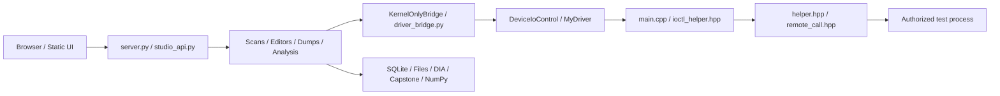

# 소스 지도 / Source map / 源码地图 / Mapa del código

[문서 / Docs / 文档 / Documentación](README.md)

## 데이터 흐름 / Data flow / 数据流 / Flujo de datos

## 구현 구분 / Implementation distinctions / 实现区别 / Distinciones

- 한국어: 빌드 프로젝트는 `main.cpp`만 컴파일하고 헤더 구현을 포함합니다. `routine.cpp`는 포함되지 않은 이전 예제이며 `test_client.cpp`는 별도 C++ 클라이언트입니다. 빌드 설정은 KMDF를 선언하지만 진입·IRP·장치 생성은 직접 WDM 스타일로 구현합니다. 장치와 심볼릭 링크, 요청 rundown, DLL 지연 정리, 파일별 함수 참조를 종료 시 정리합니다.
- English: The driver project compiles only `main.cpp`, including header implementations. `routine.cpp` is an excluded legacy sample; `test_client.cpp` is a separate C++ client. The project declares KMDF but implements entry, IRPs and device creation directly in WDM style. Unload handles the device/link, request rundown, deferred DLL cleanup and per-file function references.
- 简体中文：驱动项目仅编译 `main.cpp` 并包含头文件实现。`routine.cpp` 是未加入构建的旧示例，`test_client.cpp` 为独立 C++ 客户端。项目声明 KMDF，但入口、IRP、设备创建直接采用 WDM 风格。卸载清理设备/链接、请求 rundown、DLL 延迟清理及设备文件调用引用。
- Español: El proyecto compila solo `main.cpp` e incluye implementaciones de encabezados. `routine.cpp` es un ejemplo antiguo excluido; `test_client.cpp` es un cliente C++ separado. Declara KMDF pero implementa entrada, IRP y creación de dispositivo al estilo WDM. La descarga gestiona dispositivo/enlace, rundown, limpieza DLL diferida y referencias por archivo.

- 한국어: 현재 서버는 커널 검색 경로를 사용합니다. `memory_scanner.py`의 이전 Win32 검색은 활성 서버 경로가 아닙니다. `0x820` 스레드 종료는 커널·브리지에 존재하지만 웹 UI에서 제외됩니다. `0x817/0x818` 이벤트 요청은 비활성 호환 응답입니다. 공식 API가 아닌 NT 구조·루틴 의존성이 있어 OS/아키텍처 전체 호환을 보장하지 않습니다.
- English: The active server uses kernel scanning; the old Win32 scanner is not its target-access path. Thread termination `0x820` exists in kernel/bridge but is excluded from the UI. `0x817/0x818` are inactive event compatibility responses. Dependencies on internal NT structures/routines prevent claiming universal OS/architecture compatibility.
- 简体中文：当前服务器使用内核扫描，旧 Win32 扫描器不是目标访问路径。线程终止 `0x820` 仍在内核/桥接中，但界面不提供。`0x817/0x818` 是未启用事件的兼容响应。依赖内部 NT 结构/例程，不能保证所有 OS/架构兼容。
- Español: El servidor usa búsqueda del kernel; el escáner Win32 antiguo no es su ruta de acceso. `0x820` existe en kernel/puente pero no en la interfaz. `0x817/0x818` son respuestas compatibles de eventos inactivos. Las dependencias NT internas impiden afirmar compatibilidad universal.

## 파일 목록 / File inventory / 文件列表 / Inventario de archivos

원본 스냅샷 / Original snapshot / 原始快照 / Instantánea original: **324 files, 217,354,385 bytes**.

Git 가져오기 소스 / Imported source files / 导入源码文件 / Código importado: **79**. 모든 아래 파일은 최초 스냅샷과 SHA-256이 일치합니다. / Every file below matches its initial SHA-256. / 下列文件均匹配初始 SHA-256。 / Todos coinciden con SHA-256 inicial.

| 파일 / File / 文件 / Archivo | 역할 / Role / 职责 / Función |
|---|---|
| [driver_client.hpp](../driver_client.hpp) | C++ 클라이언트 / C++ client / C++ 客户端 / Cliente C++ |
| [helper.hpp](../helper.hpp) | 커널 구현·수명 관리 / Kernel implementation and lifetime / 内核实现与生命周期 / Implementación y ciclo de vida del kernel |
| [ioctl_helper.hpp](../ioctl_helper.hpp) | 요청 검증·디스패치 / Packet validation and dispatch / 请求验证与分派 / Validación y despacho |
| [kernel_control_panel/change_journal.py](../kernel_control_panel/change_journal.py) | 변경 원본·복구 / Change originals and recovery / 修改原件与恢复 / Originales de cambios y recuperación |
| [kernel_control_panel/DISASSEMBLY_WORKSPACE.md](../kernel_control_panel/DISASSEMBLY_WORKSPACE.md) | 기존 한국어 상세 안내 / Original Korean detailed guide / 原韩语详细指南 / Guía detallada coreana original |
| [kernel_control_panel/disassembly_workspace.py](../kernel_control_panel/disassembly_workspace.py) | 명령 검증·패치·복구 / Instruction validation, patch and recovery / 指令验证、补丁与恢复 / Validación, parche y recuperación |
| [kernel_control_panel/DLL_WORKBENCH.md](../kernel_control_panel/DLL_WORKBENCH.md) | 기존 한국어 상세 안내 / Original Korean detailed guide / 原韩语详细指南 / Guía detallada coreana original |
| [kernel_control_panel/driver_bridge.py](../kernel_control_panel/driver_bridge.py) | ctypes·장치 ABI / ctypes and device ABI / ctypes 与设备 ABI / ctypes y ABI del dispositivo |
| [kernel_control_panel/function_views.py](../kernel_control_panel/function_views.py) | 정적 CFG·의사코드 / Static CFG and pseudocode / 静态 CFG 与伪代码 / CFG estático y pseudocódigo |
| [kernel_control_panel/image_workbench.py](../kernel_control_panel/image_workbench.py) | DLL·함수·PDB·호출 / DLL, functions, PDB and calls / DLL、函数、PDB 与调用 / DLL, funciones, PDB y llamadas |
| [kernel_control_panel/kernel_only_bridge.py](../kernel_control_panel/kernel_only_bridge.py) | 커널 읽기 경로 / Kernel read path / 内核读取路径 / Ruta de lectura del kernel |
| [kernel_control_panel/kernel_scanner.py](../kernel_control_panel/kernel_scanner.py) | 호환 다단계 검색 / Compatibility multi-pass scanner / 兼容多阶段扫描 / Escáner compatible de varias pasadas |
| [kernel_control_panel/memory_allocation.py](../kernel_control_panel/memory_allocation.py) | 데이터 할당·검증·해제 / Payload allocation, verification and release / 数据分配、验证与释放 / Asignación, validación y liberación |
| [kernel_control_panel/memory_dump.py](../kernel_control_panel/memory_dump.py) | 파일 덤프 작업 / File dump jobs / 文件转储任务 / Trabajos de volcado |
| [kernel_control_panel/memory_editor.py](../kernel_control_panel/memory_editor.py) | 바이트·포인터 편집 / Byte and pointer editing / 字节与指针编辑 / Edición de bytes y punteros |
| [kernel_control_panel/memory_images.py](../kernel_control_panel/memory_images.py) | 매핑 이미지·PE 발견 / Mapped images and PE discovery / 映射映像与 PE 发现 / Imágenes mapeadas y descubrimiento PE |
| [kernel_control_panel/MEMORY_SCAN_WORKSPACE.md](../kernel_control_panel/MEMORY_SCAN_WORKSPACE.md) | 기존 한국어 상세 안내 / Original Korean detailed guide / 原韩语详细指南 / Guía detallada coreana original |
| [kernel_control_panel/memory_scanner.py](../kernel_control_panel/memory_scanner.py) | 이전 Win32 검색·형식 / Legacy Win32 scanner and formats / 旧 Win32 扫描与类型 / Escáner Win32 antiguo y formatos |
| [kernel_control_panel/memory_wide_view.py](../kernel_control_panel/memory_wide_view.py) | 넓은 메모리 뷰 Beta / Wide memory view Beta / 宽内存视图 Beta / Vista amplia Beta |
| [kernel_control_panel/native/build_pdb_symbols.cmd](../kernel_control_panel/native/build_pdb_symbols.cmd) | DIA 도구 빌드 / DIA helper build / DIA 工具构建 / Compilación del auxiliar DIA |
| [kernel_control_panel/native/pdb_symbols.cpp](../kernel_control_panel/native/pdb_symbols.cpp) | DIA PDB 파일 분석 / DIA PDB file analysis / DIA PDB 文件分析 / Análisis de archivos PDB con DIA |
| [kernel_control_panel/process_catalog.py](../kernel_control_panel/process_catalog.py) | PID 탐색·조회 통합 / PID discovery and query sharing / PID 搜索与查询合并 / Descubrimiento PID y consultas compartidas |
| [kernel_control_panel/productivity_suite.py](../kernel_control_panel/productivity_suite.py) | 구조체·프로젝트·변화 / Structures, projects and timelines / 结构体、项目与时间线 / Estructuras, proyectos y líneas temporales |
| [kernel_control_panel/README_ko.md](../kernel_control_panel/README_ko.md) | 기존 한국어 상세 안내 / Original Korean detailed guide / 原韩语详细指南 / Guía detallada coreana original |
| [kernel_control_panel/request_scheduler.py](../kernel_control_panel/request_scheduler.py) | 우선순위·동시 읽기 통합 / Priority and in-flight read sharing / 优先级与并发读取合并 / Prioridad y lectura compartida |
| [kernel_control_panel/requirements.txt](../kernel_control_panel/requirements.txt) | Python 의존성 / Python dependencies / Python 依赖 / Dependencias Python |
| [kernel_control_panel/scan_workspace.py](../kernel_control_panel/scan_workspace.py) | SQLite 검색·후보·내보내기 / SQLite scans, candidates and export / SQLite 扫描、候选与导出 / Búsquedas SQLite, candidatos y exportación |
| [kernel_control_panel/server.py](../kernel_control_panel/server.py) | FastAPI·호환 경로·Watch / FastAPI, legacy routes and Watch / FastAPI、兼容路由、Watch / FastAPI, rutas heredadas y Watch |
| [kernel_control_panel/simulate_stability.py](../kernel_control_panel/simulate_stability.py) | DOM 모의 시험 도구 / DOM simulation utility / DOM 模拟工具 / Utilidad de simulación DOM |
| [kernel_control_panel/start_panel.bat](../kernel_control_panel/start_panel.bat) | 8000 서버 시작 / Server launcher on 8000 / 8000 服务器启动 / Lanzador en 8000 |
| [kernel_control_panel/static/disassembly_workspace.css](../kernel_control_panel/static/disassembly_workspace.css) | 명령 검증·패치·복구 / Instruction validation, patch and recovery / 指令验证、补丁与恢复 / Validación, parche y recuperación |
| [kernel_control_panel/static/disassembly_workspace.js](../kernel_control_panel/static/disassembly_workspace.js) | 명령 검증·패치·복구 / Instruction validation, patch and recovery / 指令验证、补丁与恢复 / Validación, parche y recuperación |
| [kernel_control_panel/static/dll_workspace.js](../kernel_control_panel/static/dll_workspace.js) | DLL·이미지 함수 UI / DLL and image function UI / DLL 与映像函数界面 / Interfaz DLL y funciones |
| [kernel_control_panel/static/function_views.css](../kernel_control_panel/static/function_views.css) | 정적 CFG·의사코드 / Static CFG and pseudocode / 静态 CFG 与伪代码 / CFG estático y pseudocódigo |
| [kernel_control_panel/static/function_views.js](../kernel_control_panel/static/function_views.js) | 정적 CFG·의사코드 / Static CFG and pseudocode / 静态 CFG 与伪代码 / CFG estático y pseudocódigo |
| [kernel_control_panel/static/index.html](../kernel_control_panel/static/index.html) | 정적 UI 진입 / Static UI entry / 静态界面入口 / Entrada de interfaz |
| [kernel_control_panel/static/memory_allocation.css](../kernel_control_panel/static/memory_allocation.css) | 데이터 할당·검증·해제 / Payload allocation, verification and release / 数据分配、验证与释放 / Asignación, validación y liberación |
| [kernel_control_panel/static/memory_allocation.js](../kernel_control_panel/static/memory_allocation.js) | 데이터 할당·검증·해제 / Payload allocation, verification and release / 数据分配、验证与释放 / Asignación, validación y liberación |
| [kernel_control_panel/static/memory_editor.css](../kernel_control_panel/static/memory_editor.css) | 바이트·포인터 편집 / Byte and pointer editing / 字节与指针编辑 / Edición de bytes y punteros |
| [kernel_control_panel/static/memory_editor.js](../kernel_control_panel/static/memory_editor.js) | 바이트·포인터 편집 / Byte and pointer editing / 字节与指针编辑 / Edición de bytes y punteros |
| [kernel_control_panel/static/memory_wide_view.css](../kernel_control_panel/static/memory_wide_view.css) | 넓은 메모리 뷰 Beta / Wide memory view Beta / 宽内存视图 Beta / Vista amplia Beta |
| [kernel_control_panel/static/memory_wide_view.js](../kernel_control_panel/static/memory_wide_view.js) | 넓은 메모리 뷰 Beta / Wide memory view Beta / 宽内存视图 Beta / Vista amplia Beta |
| [kernel_control_panel/static/productivity_suite.css](../kernel_control_panel/static/productivity_suite.css) | 구조체·프로젝트·변화 / Structures, projects and timelines / 结构体、项目与时间线 / Estructuras, proyectos y líneas temporales |
| [kernel_control_panel/static/productivity_suite.js](../kernel_control_panel/static/productivity_suite.js) | 구조체·프로젝트·변화 / Structures, projects and timelines / 结构体、项目与时间线 / Estructuras, proyectos y líneas temporales |
| [kernel_control_panel/static/scan_workspace.css](../kernel_control_panel/static/scan_workspace.css) | SQLite 검색·후보·내보내기 / SQLite scans, candidates and export / SQLite 扫描、候选与导出 / Búsquedas SQLite, candidatos y exportación |
| [kernel_control_panel/static/scan_workspace.js](../kernel_control_panel/static/scan_workspace.js) | SQLite 검색·후보·내보내기 / SQLite scans, candidates and export / SQLite 扫描、候选与导出 / Búsquedas SQLite, candidatos y exportación |
| [kernel_control_panel/static/studio.css](../kernel_control_panel/static/studio.css) | 공용 UI·메뉴·도구 연결 / Shared UI, navigation and tools / 公共界面、导航与工具 / Interfaz, navegación y herramientas |
| [kernel_control_panel/static/studio.js](../kernel_control_panel/static/studio.js) | 공용 UI·메뉴·도구 연결 / Shared UI, navigation and tools / 公共界面、导航与工具 / Interfaz, navegación y herramientas |
| [kernel_control_panel/studio_api.py](../kernel_control_panel/studio_api.py) | 작업 조합·세션·API / Operation coordination, sessions and API / 操作编排、会话与 API / Coordinación, sesiones y API |
| [kernel_control_panel/studio_extensions.py](../kernel_control_panel/studio_extensions.py) | PE·주소·맵·비교 / PE, address, map and comparison / PE、地址、映射与比较 / PE, dirección, mapa y comparación |
| [kernel_control_panel/test_asgi_client.py](../kernel_control_panel/test_asgi_client.py) | 회귀·진단·시험 보조 / Regression, diagnostic or harness / 回归、诊断或测试辅助 / Regresión, diagnóstico o auxiliar |
| [kernel_control_panel/test_commercial_regressions.py](../kernel_control_panel/test_commercial_regressions.py) | 회귀·진단·시험 보조 / Regression, diagnostic or harness / 回归、诊断或测试辅助 / Regresión, diagnóstico o auxiliar |
| [kernel_control_panel/test_disassembly_workspace.py](../kernel_control_panel/test_disassembly_workspace.py) | 회귀·진단·시험 보조 / Regression, diagnostic or harness / 回归、诊断或测试辅助 / Regresión, diagnóstico o auxiliar |
| [kernel_control_panel/test_driver_all_ioctl.py](../kernel_control_panel/test_driver_all_ioctl.py) | 회귀·진단·시험 보조 / Regression, diagnostic or harness / 回归、诊断或测试辅助 / Regresión, diagnóstico o auxiliar |
| [kernel_control_panel/test_driver_readonly.py](../kernel_control_panel/test_driver_readonly.py) | 회귀·진단·시험 보조 / Regression, diagnostic or harness / 回归、诊断或测试辅助 / Regresión, diagnóstico o auxiliar |
| [kernel_control_panel/test_extensions_regressions.py](../kernel_control_panel/test_extensions_regressions.py) | 회귀·진단·시험 보조 / Regression, diagnostic or harness / 回归、诊断或测试辅助 / Regresión, diagnóstico o auxiliar |
| [kernel_control_panel/test_function_views.py](../kernel_control_panel/test_function_views.py) | 회귀·진단·시험 보조 / Regression, diagnostic or harness / 回归、诊断或测试辅助 / Regresión, diagnóstico o auxiliar |
| [kernel_control_panel/test_image_workbench.py](../kernel_control_panel/test_image_workbench.py) | 회귀·진단·시험 보조 / Regression, diagnostic or harness / 回归、诊断或测试辅助 / Regresión, diagnóstico o auxiliar |
| [kernel_control_panel/test_kernel_scanner.py](../kernel_control_panel/test_kernel_scanner.py) | 회귀·진단·시험 보조 / Regression, diagnostic or harness / 回归、诊断或测试辅助 / Regresión, diagnóstico o auxiliar |
| [kernel_control_panel/test_memory_allocation.py](../kernel_control_panel/test_memory_allocation.py) | 회귀·진단·시험 보조 / Regression, diagnostic or harness / 回归、诊断或测试辅助 / Regresión, diagnóstico o auxiliar |
| [kernel_control_panel/test_memory_dump.py](../kernel_control_panel/test_memory_dump.py) | 회귀·진단·시험 보조 / Regression, diagnostic or harness / 回归、诊断或测试辅助 / Regresión, diagnóstico o auxiliar |
| [kernel_control_panel/test_memory_editor.py](../kernel_control_panel/test_memory_editor.py) | 회귀·진단·시험 보조 / Regression, diagnostic or harness / 回归、诊断或测试辅助 / Regresión, diagnóstico o auxiliar |
| [kernel_control_panel/test_memory_images.py](../kernel_control_panel/test_memory_images.py) | 회귀·진단·시험 보조 / Regression, diagnostic or harness / 回归、诊断或测试辅助 / Regresión, diagnóstico o auxiliar |
| [kernel_control_panel/test_memory_wide_view.py](../kernel_control_panel/test_memory_wide_view.py) | 회귀·진단·시험 보조 / Regression, diagnostic or harness / 回归、诊断或测试辅助 / Regresión, diagnóstico o auxiliar |
| [kernel_control_panel/test_process_catalog.py](../kernel_control_panel/test_process_catalog.py) | 회귀·진단·시험 보조 / Regression, diagnostic or harness / 回归、诊断或测试辅助 / Regresión, diagnóstico o auxiliar |
| [kernel_control_panel/test_productivity_suite.py](../kernel_control_panel/test_productivity_suite.py) | 회귀·진단·시험 보조 / Regression, diagnostic or harness / 回归、诊断或测试辅助 / Regresión, diagnóstico o auxiliar |
| [kernel_control_panel/test_scan_workspace.py](../kernel_control_panel/test_scan_workspace.py) | 회귀·진단·시험 보조 / Regression, diagnostic or harness / 回归、诊断或测试辅助 / Regresión, diagnóstico o auxiliar |
| [kernel_control_panel/test_stability_regressions.py](../kernel_control_panel/test_stability_regressions.py) | 회귀·진단·시험 보조 / Regression, diagnostic or harness / 回归、诊断或测试辅助 / Regresión, diagnóstico o auxiliar |
| [kernel_control_panel/test_thread_editor.py](../kernel_control_panel/test_thread_editor.py) | 회귀·진단·시험 보조 / Regression, diagnostic or harness / 回归、诊断或测试辅助 / Regresión, diagnóstico o auxiliar |
| [main.cpp](../main.cpp) | 진입·해제 / Entry and unload / 入口与卸载 / Entrada y descarga |
| [remote_call.hpp](../remote_call.hpp) | 파일 소유 호출 추적 / File-owned call tracking / 设备文件所属调用跟踪 / Seguimiento de llamadas por archivo |
| [remote_call_protocol.h](../remote_call_protocol.h) | 호출 ABI / Call ABI / 调用 ABI / ABI de llamadas |
| [routine.cpp](../routine.cpp) | 미빌드 이전 예제 / Unbuilt legacy example / 未构建旧示例 / Ejemplo antiguo fuera de compilación |
| [SampleKernel1.inf](../SampleKernel1.inf) | 드라이버 패키지 템플릿 / Driver package template / 驱动包模板 / Plantilla de paquete |
| [SampleKernel1.sln](../SampleKernel1.sln) | 솔루션 / Solution / 解决方案 / Solución |
| [SampleKernel1.vcxproj](../SampleKernel1.vcxproj) | 드라이버 빌드 / Driver build / 驱动构建 / Compilación del controlador |
| [SampleKernel1.vcxproj.filters](../SampleKernel1.vcxproj.filters) | IDE 분류 / IDE groups / IDE 分组 / Grupos del IDE |
| [test_client.cpp](../test_client.cpp) | C++ 진단 예제 / C++ diagnostic sample / C++ 诊断示例 / Ejemplo de diagnóstico C++ |
| [utils.hpp](../utils.hpp) | NT 형식·PE 구조 / NT types and PE structures / NT 类型与 PE 结构 / Tipos NT y estructuras PE |

## 제외·보존 / Excluded and preserved / 排除与保留 / Excluido y conservado

| 그룹 / Group / 类别 / Grupo | 사유 / Reason / 原因 / Motivo |
|---|---|
| `.vs/`, IDE databases | 재생성 캐시 / Regenerable caches / 可重建缓存 / Cachés regenerables |
| `x64/`, binaries, symbols from builds | 빌드 산출물 / Build artifacts / 构建产物 / Resultados de compilación |
| `__pycache__/` | Python 캐시 / Python caches / Python 缓存 / Cachés Python |
| `assets/`, `symbols/` | 사용자 DLL/PDB / User DLL/PDB / 用户 DLL/PDB / DLL/PDB del usuario |
| `workspaces/`, `dumps/`, SQLite | 메모리·작업 기록 / Memory and runtime state / 内存及运行数据 / Memoria y estado de ejecución |
| `static/reports/` (4 HTML files in snapshot) | 생성된 실전 보고서 / Generated live reports / 生成实测报告 / Informes reales generados |

한국어: 전체 폴더는 별도 로컬 복사본에 복사했으며 위 생성·사용자 데이터는 공개 Git 추적에서 제외했습니다. 추가 문서·설정만 작성했고 원본 소스는 수정하지 않았습니다. 해시 목록은 [SOURCE_SHA256.tsv](reference/SOURCE_SHA256.tsv)에 있습니다.

English: The full folder was copied locally; generated and user data above are excluded from public tracking. Only new documentation/settings were authored; imported sources were not edited. Hashes: [SOURCE_SHA256.tsv](reference/SOURCE_SHA256.tsv).

简体中文：完整目录已复制到本地，以上生成/用户数据不公开追踪。只添加文档和设置，未编辑导入源码。哈希：[SOURCE_SHA256.tsv](reference/SOURCE_SHA256.tsv)。

Español: Se copió toda la carpeta localmente y se excluyen datos generados/de usuario del seguimiento público. Solo se añadieron documentación/configuración; el código importado no se editó. Hashes: [SOURCE_SHA256.tsv](reference/SOURCE_SHA256.tsv).
