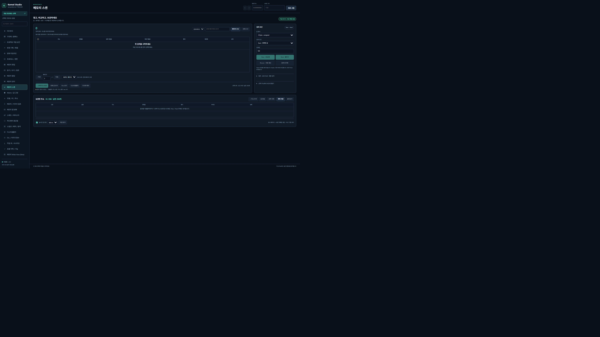
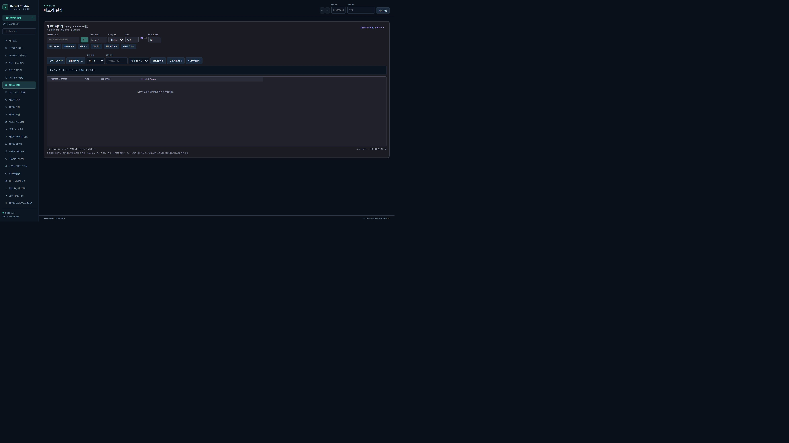
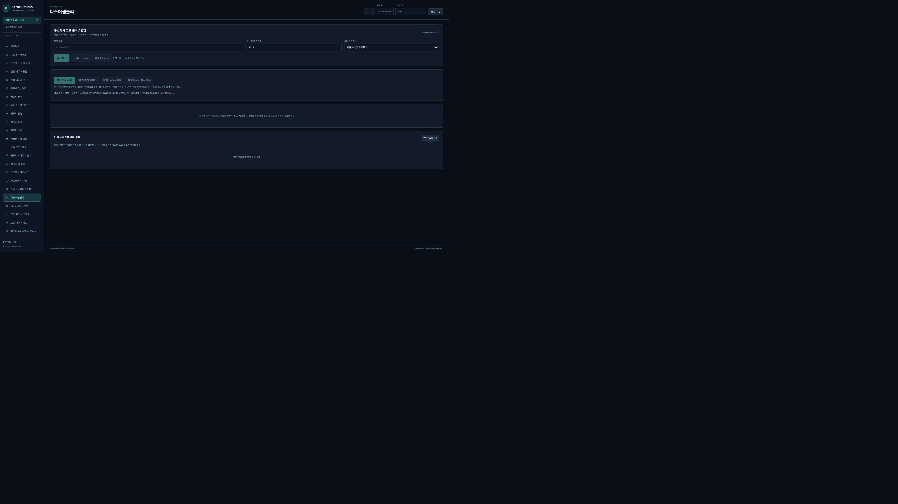

# 安装与使用指南

[中文概览](../../README.zh-CN.md) · [한국어](../ko/GUIDE.md) · [English](../en/GUIDE.md) · [Español](../es/GUIDE.md)

## 架构与要求

当前访问路径是浏览器 → FastAPI → `KernelOnlyBridge` → `DeviceIoControl` → `SampleKernel1.sys`，设备为 `\\.\MyDriver`。Python 通过 `CreateFileW`、`DeviceIoControl`、`CloseHandle` 连接设备。目标读取、扫描及映射使用内核路径；NumPy 比较、PE 和指令分析在用户态处理返回的字节。`memory_scanner.py` 仍保留旧版 Win32 扫描器，但当前服务器不使用它访问目标。

- Windows x64、64 位 Python、C++ 工具及匹配的 Windows SDK/WDK。
- 已验证环境：Python 3.14.5、Visual Studio 2022 Professional、SDK 10.0.26100.0、WDK 10.0.26100.6584。
- 依赖为 FastAPI、Uvicorn、psutil、Capstone 5、Keystone 0.9.2、NumPy。保留原有版本范围，没有固定依赖锁文件。
- 解决方案虽声明 ARM64 配置，上下文及远程调用仍有 x64 依赖，未验证 ARM64 支持。
- 原界面为韩语；下文保留韩语菜单名，便于查找操作。

## 构建与驱动加载

按 [Microsoft WDK 文档](https://learn.microsoft.com/en-us/windows-hardware/drivers/download-the-wdk)准备兼容的 Visual Studio/SDK/WDK。在仓库根目录的 Developer PowerShell 中执行。上述工具组合已验证，其他组合尚未测试。

```powershell
msbuild SampleKernel1.sln /m /p:Configuration=Release /p:Platform=x64
msbuild SampleKernel1.sln /m /p:Configuration=Debug /p:Platform=x64
```

```powershell
sc.exe create SampleKernel1 type= kernel start= demand binPath= "C:\Kernel_Based_ProcessMemory_Editor\x64\Release\SampleKernel1.sys"
sc.exe start SampleKernel1
sc.exe query SampleKernel1
```


`sc.exe` 示例用于为**已正确签名且获准在测试系统加载的驱动**注册手动服务。在管理员终端执行并替换实际路径。若服务已存在，先用 `sc.exe qc SampleKernel1` 检查配置，不重复创建。遵循 [Microsoft 签名说明](https://learn.microsoft.com/en-us/windows-hardware/drivers/install/driver-signing)。仓库不提供证书或修改安全设置的脚本。

原 INF 的制造商、硬件 ID、DriverVer 等仍是模板项。公开发布需在自己的工作副本中配置、验证并签名，不能将原 INF 当作完整安装包。替换驱动前关闭服务器和客户端，按需恢复补丁、冻结值及断点，再执行 `sc.exe stop SampleKernel1`，准备新构建并启动。仅在需要移除服务时执行 `sc.exe delete SampleKernel1`。释放跟踪或卸载驱动不会终止已经创建的目标函数线程。

可选 PDB 工具：在 `kernel_control_panel/native` 执行 `build_pdb_symbols.cmd`。脚本和 `image_workbench.py` 中的 `Symbols.dia` 固定使用 VS 2022 Professional 路径。其他安装位置需在工作副本中同时调整两处。PDB 的 CodeView GUID 与 Age 必须和映像一致。

## 运行服务器

执行 [README 的虚拟环境命令](../../README.zh-CN.md#快速开始)，打开 [8005 界面](http://127.0.0.1:8005/)。原 `python server.py` 和批处理默认使用 8000；本指南使用 Uvicorn `--port 8005`。请使用单 worker，各 worker 的设备连接和管理状态互相独立。服务器终端 Ctrl+C 可结束服务。

## 1. 连接与选择目标


在仪表盘确认连接与版本，打开 **대상 프로세스 선택**（选择目标），按名称/PID 搜索或直接输入 PID。选择前重新核对存活状态与创建标识。驱动没有完整 PID 枚举 IOCTL，因此按 4 的步长查询。默认范围为 4–65,536，可扩展至 262,144 或 1,048,576，范围外 PID 可手动输入。列表不保证完整。

切换或重新选择目标可能清空输入与会话，但不会自动恢复已写入的内存。需要恢复的修改应在切换前处理。

## 2. 扫描与缩小候选



打开 **메모리 스캔**，选择类型、条件、值并执行 **New**。例如在自己的测试程序搜索 32 位整数 100，将程序值改为 101，再用 **Next** 搜索 101 或 Increased。数值/结构体 Unknown 不需要初始值。**Rescan** 保留可读候选并刷新基准，不用于缩小候选；Live 更新不会改变 Next 的比较基准。

支持有符号/无符号数值、UTF-8/UTF-16LE、`DE AD ?? A? ?F` 等 AOB、含数值字段的结构体。地址及 64 位整数保持字符串形式。对齐 1 可搜索非对齐值；范围起点包含、终点不包含。保存候选或发送至 Hex、反汇编、结构体视图。

新工作区将候选存入 SQLite，没有旧版 50,000 个候选中止限制。默认预算 256MiB，最大 4GiB，显示部分扫描和读取失败。每页 50/100/200/500 行，每会话最多保存 256 个地址。注意区分当前页与全部候选过滤/排序；完整 CSV 通过导出任务生成。旧兼容 API 仍有单独的 50,000 上限。

## 3. 编辑、冻结、结构体与分配



在 **메모리 편집** 打开十六进制地址，双击字节/数值或使用类型编辑。Ctrl+→ 展开指针，Ctrl+← 折叠，滚轮浏览相邻地址。恢复最近编辑前核对当前字节。**Watch / 값 고정** 和保存地址的 Freeze 会重复写入；失败、退出或 PID 重用时停止。

**구조체 / 클래스** 定义字段、数组、嵌套结构体和指针。修改集合按预览 → 原字节验证 → 应用 → 回读验证处理。**프로젝트 작업 공간** 保存视图及地址定位信息以重新连接；**변경 기록 / 묶음** 管理恢复记录；**변화 타임라인** 比较采样值，不记录采样间所有修改。

**메모리 할당** 接收带结尾 NULL 的 ANSI/UTF-16LE 字符串或原始文件字节，自动计算大小并分配读写内存，通过内核写入和回读验证，含 NULL 最大 1MiB。通过记录的 BaseAddress 释放。清空历史不会释放目标内存。**메모리 관리** 提供保护修改、复制与填充。Wide View 为 Beta。写入、释放、冻结及恢复会实际改变目标内存。

## 4. 转储、模块与函数

**메모리 / 이미지 덤프** 支持 range/image/images。范围最大 16GiB，输出位于 `dumps/` 或 `KERNEL_STUDIO_DUMP_DIR`。取消等待当前请求结束并保留 `.part`；同一服务器会话内继续时校验进程标识、长度及哈希。重启可恢复完成文件下载记录，不能恢复活动任务。Zero 策略在 manifest 中记录不可读的补零范围，补零不代表原数据。

映像转储采用 RVA 布局，文件偏移=VA−映像基址，不能当作重建的可执行磁盘 PE。**모듈 / PE / 주소** 查看模块、头、节、导入/IAT、导出及地址归属。除 MEM_IMAGE 外，检查已提交区域起始处的有效 PE 头，并非搜索区域内每个字节。

在 **DLL / 이미지 함수** 选择映像并分析函数。DLL 加载请求成功后仍需在模块列表确认实际加载。PDB 可选；无符号时可能遗漏函数或推测类型。函数调用要求驱动 2.2+、x64 目标，支持一个 64 位整数/指针参数及 32 位退出值。超时后查询已有 CallId，不自动重复创建。释放跟踪不会终止线程或卸载 DLL。

## 5. 代码、线程与断点



在 **디스어셈블리** 指定地址、大小和 x86/x64。双击 ASM/Graph 指令，验证单行 Intel 语法并暂存。新编码过长会被拒绝，较短则补 NOP。只有 **편집 적용** 才实际写入。地址 Undo/Redo 是导航，补丁 Undo/Redo 是写入。恢复要求当前字节符合预期。C 伪代码不保证原源码或可编译 C。

补丁对执行中的线程不是原子操作，也不提供指令缓存同步。应在受控测试中、该代码不执行时应用。**스레드 / 레지스터** 核对 PID/TID/创建时间，临时暂停，修改指定字段，回读，再恢复暂停计数。ABI 支持 18 个通用寄存器字段，不含 XMM/YMM。硬件断点支持执行/写入/读写与 1/2/4/8 字节，移除失败时保留恢复资料。

## API 与限制

`/docs` 为 Swagger，`/redoc` 为 ReDoc，`/openapi.json` 为模式。示例 PID/地址需替换为获准测试目标的实际值。

```powershell
Invoke-RestMethod http://127.0.0.1:8005/api/status
Invoke-RestMethod http://127.0.0.1:8005/api/studio/capabilities
$requestBody = '{"operation":"read","args":{"pid":1234,"address":"0x140000000","size":64}}'
Invoke-RestMethod http://127.0.0.1:8005/api/studio/execute -Method Post -ContentType application/json -Body $requestBody
```

不要只凭 HTTP 200 判断成功，应检查 `success`、`result_status`、`driver_response`。完整列表见 [API/ABI](../reference/API_ABI.md)。大转储/扫描通过 job ID 查询，并确认取消完成。

普通传输 1MiB、内核分块读取 4KiB、普通表 5,000、内部映射 50,000、内核结果节点 65,536、线程 64、句柄 128。需要完整映射的操作拒绝被截断的映射。快照 16、映射 8、补丁记录 64 保存在服务器会话；项目、日志、PDB、上传 DLL、转储在磁盘；书签在浏览器。运行中进程的顺序读取不是原子快照。

## 排查与测试

| 问题 | 检查 |
|---|---|
| 设备连接失败 | 管理员权限、服务状态、签名/加载错误、`\\.\MyDriver` |
| 地址错误 | 进程标识、用户地址范围、Guard/NoAccess、退出/PID 重用 |
| 进程不在列表 | 扩展范围或手动输入 PID；不是完整枚举 |
| 无法连接 8005 | Uvicorn 端口/错误；原启动方式使用 8000 |
| 旧界面 | 刷新、缓存与运行服务器实际目录 |
| PDB 错误 | DIA SDK、工具构建/路径、GUID/Age 匹配 |
| 部分扫描/Quota | 缩小范围重做 New，检查预算、上限、读取失败 |

其中 3 项回归检查 DIA 工具文件是否存在，完整测试前需运行 `native/build_pdb_symbols.cmd`。CI 将 Windows 2022 中实际 VS 2022 安装映射至原代码要求的 Professional 路径，再构建工具。只配置临时运行环境，不修改源码。

```powershell
cd kernel_control_panel
python -m unittest discover -p 'test*.py' -v
python test_driver_readonly.py
```

第一条运行原有模拟回归测试，第二条通过已加载驱动对诊断进程自身执行 7 项只读查询。`test_driver_all_ioctl.py` 也是同一诊断入口，不是完整真实写入测试。参见[验证范围](../VALIDATION.md)。公开问题请提供合成测试数据，不上传私人转储、PDB 或真实内存内容。
